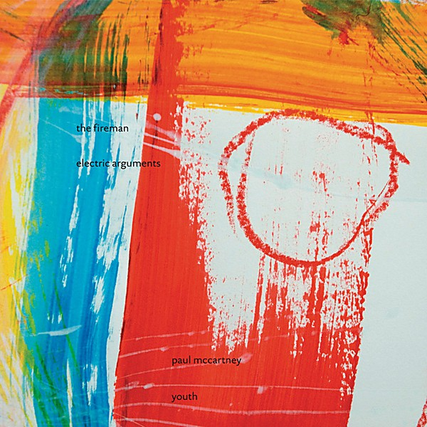

# Electric Arguments

By **The Fireman**

## Album Data

- **Catalog:** Beets
- **Format:** Digital, Album
- **Album:** Electric Arguments
- **Artist:** The Fireman
- **Albumartist:** The Fireman
- **Genre:** Neo-Psychedelia
- **MusicBrainz Album Artist ID:** [23466b9d-f57a-4e73-906f-c11dca8b3723](https://musicbrainz.org/artist/23466b9d-f57a-4e73-906f-c11dca8b3723)
- **MusicBrainz Album ID:** [3b31aa7d-885d-476c-b7bc-e963f22139f5](https://musicbrainz.org/release/3b31aa7d-885d-476c-b7bc-e963f22139f5)
- **MusicBrainz Release Group ID:** [1e116d60-b12d-3776-abc5-b822bf82917f](https://musicbrainz.org/release-group/1e116d60-b12d-3776-abc5-b822bf82917f)
- **Year:** 2008
- **Catalog #:** mpl1031
- **Label:** MPL
- **Total Tracks:** 13

## Album Tracks

### Track 01 - Nothing Too Much Just Out of Sight

- **Artist:** The Fireman
- **Format:** ALAC
- **Genre:** Alternative Rock
- **Length:** 4:55
- **MusicBrainz Track ID:** [3d387ebe-50fb-43e4-a21e-62c47e606592](https://musicbrainz.org/recording/3d387ebe-50fb-43e4-a21e-62c47e606592)
- **Title:** Nothing Too Much Just Out of Sight
- **Track:** 01
- **Year:** 2008

### Track 02 - Two Magpies

- **Artist:** The Fireman
- **Format:** ALAC
- **Genre:** Indie Pop
- **Length:** 2:12
- **MusicBrainz Track ID:** [746a95cc-4690-414b-8ea3-403f6e405f41](https://musicbrainz.org/recording/746a95cc-4690-414b-8ea3-403f6e405f41)
- **Title:** Two Magpies
- **Track:** 02
- **Year:** 2008

### Track 03 - Sing the Changes

- **Artist:** The Fireman
- **Format:** ALAC
- **Genre:** Alternative Rock
- **Length:** 3:43
- **MusicBrainz Track ID:** [9efbf594-6175-4398-8e4c-f95db747294d](https://musicbrainz.org/recording/9efbf594-6175-4398-8e4c-f95db747294d)
- **Title:** Sing the Changes
- **Track:** 03
- **Year:** 2008

### Track 04 - Travelling Light

- **Artist:** The Fireman
- **Format:** ALAC
- **Genre:** Progressive Rock
- **Length:** 5:05
- **MusicBrainz Track ID:** [10bb2912-35f8-4b34-890e-b2b71f1fd9b1](https://musicbrainz.org/recording/10bb2912-35f8-4b34-890e-b2b71f1fd9b1)
- **Title:** Travelling Light
- **Track:** 04
- **Year:** 2008

### Track 05 - Highway

- **Artist:** The Fireman
- **Format:** ALAC
- **Genre:** Electronica
- **Length:** 4:16
- **MusicBrainz Track ID:** [91e02d0d-299a-4ebd-9c75-4639b4679668](https://musicbrainz.org/recording/91e02d0d-299a-4ebd-9c75-4639b4679668)
- **Title:** Highway
- **Track:** 05
- **Year:** 2008

### Track 06 - Light From Your Lighthouse

- **Artist:** The Fireman
- **Format:** ALAC
- **Genre:** Ambient
- **Length:** 2:31
- **MusicBrainz Track ID:** [b313ba98-9624-457a-829f-ccd4d25b8cbe](https://musicbrainz.org/recording/b313ba98-9624-457a-829f-ccd4d25b8cbe)
- **Title:** Light From Your Lighthouse
- **Track:** 06
- **Year:** 2008

### Track 07 - Sun Is Shining

- **Artist:** The Fireman
- **Format:** ALAC
- **Genre:** Art Rock
- **Length:** 5:11
- **MusicBrainz Track ID:** [a69d54f3-169e-4d83-9e3f-ec5ce055b610](https://musicbrainz.org/recording/a69d54f3-169e-4d83-9e3f-ec5ce055b610)
- **Title:** Sun Is Shining
- **Track:** 07
- **Year:** 2008

### Track 08 - Dance ’til We’re High

- **Artist:** The Fireman
- **Format:** ALAC
- **Genre:** Neo-Psychedelia
- **Length:** 3:37
- **MusicBrainz Track ID:** [7f3f9065-c7a5-4d38-8ba3-fca96abdef45](https://musicbrainz.org/recording/7f3f9065-c7a5-4d38-8ba3-fca96abdef45)
- **Title:** Dance ’til We’re High
- **Track:** 08
- **Year:** 2008

### Track 09 - Lifelong Passion

- **Artist:** The Fireman
- **Format:** ALAC
- **Genre:** Art Rock
- **Length:** 4:48
- **MusicBrainz Track ID:** [6998146f-33e6-4be4-8147-08fe537f6507](https://musicbrainz.org/recording/6998146f-33e6-4be4-8147-08fe537f6507)
- **Title:** Lifelong Passion
- **Track:** 09
- **Year:** 2008

### Track 10 - Is This Love?

- **Artist:** The Fireman
- **Format:** ALAC
- **Genre:** Electro
- **Length:** 5:51
- **MusicBrainz Track ID:** [0f34dd6b-9772-49cf-b752-2da226edc2c8](https://musicbrainz.org/recording/0f34dd6b-9772-49cf-b752-2da226edc2c8)
- **Title:** Is This Love?
- **Track:** 10
- **Year:** 2008

### Track 11 - Lovers in a Dream

- **Artist:** The Fireman
- **Format:** ALAC
- **Genre:** Electronica
- **Length:** 5:21
- **MusicBrainz Track ID:** [4fed4c2c-a38a-4d61-b5e7-4bad14df1291](https://musicbrainz.org/recording/4fed4c2c-a38a-4d61-b5e7-4bad14df1291)
- **Title:** Lovers in a Dream
- **Track:** 11
- **Year:** 2008

### Track 12 - Universal Here, Everlasting Now

- **Artist:** The Fireman
- **Format:** ALAC
- **Genre:** Ambient
- **Length:** 5:05
- **MusicBrainz Track ID:** [a160e38d-25cd-4f1e-8fc6-1f48718a1b77](https://musicbrainz.org/recording/a160e38d-25cd-4f1e-8fc6-1f48718a1b77)
- **Title:** Universal Here, Everlasting Now
- **Track:** 12
- **Year:** 2008

### Track 13 - Don’t Stop Running / Road Trip

- **Artist:** The Fireman
- **Format:** ALAC
- **Genre:** Neo-Psychedelia
- **Length:** 10:30
- **MusicBrainz Track ID:** [7e35c35a-b0f2-4356-9d74-372b3c16befd](https://musicbrainz.org/recording/7e35c35a-b0f2-4356-9d74-372b3c16befd)
- **Title:** Don’t Stop Running / Road Trip
- **Track:** 13
- **Year:** 2008

