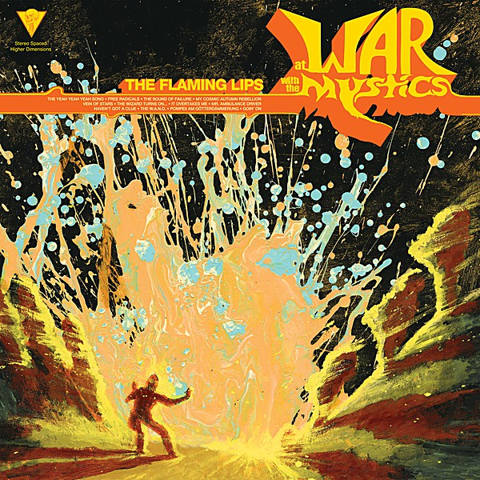

# At War With the Mystics

By **The Flaming Lips**

## Album Data

- **Catalog:** Beets
- **Format:** Digital, Album
- **Album:** At War With the Mystics
- **Artist:** The Flaming Lips
- **Albumartist:** The Flaming Lips
- **Genre:** Indie Pop
- **MusicBrainz Album Artist ID:** [1f43d76f-8edf-44f6-aaf1-b65f05ad9402](https://musicbrainz.org/artist/1f43d76f-8edf-44f6-aaf1-b65f05ad9402)
- **MusicBrainz Album ID:** [fea58334-46ad-43e4-a1a5-67907614d1a5](https://musicbrainz.org/release/fea58334-46ad-43e4-a1a5-67907614d1a5)
- **MusicBrainz Release Group ID:** [40413103-e161-3130-8a4d-a06ead0d417b](https://musicbrainz.org/release-group/40413103-e161-3130-8a4d-a06ead0d417b)
- **Year:** 2006
- **Catalog #:** 520857-2
- **Label:** Warner Bros. Records
- **Total Tracks:** 18

## Album Tracks

### Track 01 - Convinced of the Hex

- **Artist:** The Flaming Lips
- **Format:** ALAC
- **Genre:** Neo-Psychedelia
- **Length:** 3:56
- **MusicBrainz Track ID:** [453484f0-776b-4ba1-8814-274fccd55944](https://musicbrainz.org/recording/453484f0-776b-4ba1-8814-274fccd55944)
- **Title:** Convinced of the Hex
- **Track:** 01
- **Year:** 2009

### Track 02 - The Sparrow Looks Up at the Machine

- **Artist:** The Flaming Lips
- **Format:** ALAC
- **Genre:** Neo-Psychedelia
- **Length:** 4:13
- **MusicBrainz Track ID:** [99c79102-debc-4df2-8c70-782b9014585e](https://musicbrainz.org/recording/99c79102-debc-4df2-8c70-782b9014585e)
- **Title:** The Sparrow Looks Up at the Machine
- **Track:** 02
- **Year:** 2009

### Track 03 - Evil

- **Artist:** The Flaming Lips
- **Format:** ALAC
- **Genre:** Neo-Psychedelia
- **Length:** 5:38
- **MusicBrainz Track ID:** [4a2a1e36-e355-4f22-ad4b-57be924b48d9](https://musicbrainz.org/recording/4a2a1e36-e355-4f22-ad4b-57be924b48d9)
- **Title:** Evil
- **Track:** 03
- **Year:** 2009

### Track 04 - Aquarius Sabotage

- **Artist:** The Flaming Lips
- **Format:** ALAC
- **Genre:** Noise Rock
- **Length:** 2:10
- **MusicBrainz Track ID:** [5f0aeaa1-f229-4922-b80e-b03b15ceed07](https://musicbrainz.org/recording/5f0aeaa1-f229-4922-b80e-b03b15ceed07)
- **Title:** Aquarius Sabotage
- **Track:** 04
- **Year:** 2009

### Track 05 - See the Leaves

- **Artist:** The Flaming Lips
- **Format:** ALAC
- **Genre:** Noise Rock
- **Length:** 4:24
- **MusicBrainz Track ID:** [685f728b-c037-4f09-816f-38deb86cc6c6](https://musicbrainz.org/recording/685f728b-c037-4f09-816f-38deb86cc6c6)
- **Title:** See the Leaves
- **Track:** 05
- **Year:** 2009

### Track 06 - If

- **Artist:** The Flaming Lips
- **Format:** ALAC
- **Genre:** Indie Rock
- **Length:** 2:04
- **MusicBrainz Track ID:** [4df7515e-415b-4d68-aea5-85223e12f205](https://musicbrainz.org/recording/4df7515e-415b-4d68-aea5-85223e12f205)
- **Title:** If
- **Track:** 06
- **Year:** 2009

### Track 07 - Gemini Syringes

- **Artist:** The Flaming Lips
- **Format:** ALAC
- **Genre:** Neo-Psychedelia
- **Length:** 3:41
- **MusicBrainz Track ID:** [02acd6c0-1c55-4582-a95e-08c87773dd17](https://musicbrainz.org/recording/02acd6c0-1c55-4582-a95e-08c87773dd17)
- **Title:** Gemini Syringes
- **Track:** 07
- **Year:** 2009

### Track 08 - Your Bats

- **Artist:** The Flaming Lips
- **Format:** ALAC
- **Genre:** Neo-Psychedelia
- **Length:** 2:34
- **MusicBrainz Track ID:** [afca5ecf-1f7a-40ab-915f-8946a01db46b](https://musicbrainz.org/recording/afca5ecf-1f7a-40ab-915f-8946a01db46b)
- **Title:** Your Bats
- **Track:** 08
- **Year:** 2009

### Track 09 - Powerless

- **Artist:** The Flaming Lips
- **Format:** ALAC
- **Genre:** Neo-Psychedelia
- **Length:** 6:57
- **MusicBrainz Track ID:** [4116f321-03a4-4bfa-9b30-75d8e2c2392f](https://musicbrainz.org/recording/4116f321-03a4-4bfa-9b30-75d8e2c2392f)
- **Title:** Powerless
- **Track:** 09
- **Year:** 2009

### Track 10 - The Ego's Last Stand

- **Artist:** The Flaming Lips
- **Format:** ALAC
- **Genre:** Neo-Psychedelia
- **Length:** 5:40
- **MusicBrainz Track ID:** [2eb4e0da-6dc9-4de4-bcba-7e4c852b2116](https://musicbrainz.org/recording/2eb4e0da-6dc9-4de4-bcba-7e4c852b2116)
- **Title:** The Ego's Last Stand
- **Track:** 10
- **Year:** 2009

### Track 11 - I Can Be a Frog

- **Artist:** The Flaming Lips
- **Format:** ALAC
- **Genre:** Speed Metal
- **Length:** 2:14
- **MusicBrainz Track ID:** [43dd916d-dfc9-4eeb-b412-48dcacb63a74](https://musicbrainz.org/recording/43dd916d-dfc9-4eeb-b412-48dcacb63a74)
- **Title:** I Can Be a Frog
- **Track:** 11
- **Year:** 2009

### Track 12 - Sagittarius Silver Announcement

- **Artist:** The Flaming Lips
- **Format:** ALAC
- **Genre:** Neo-Psychedelia
- **Length:** 2:58
- **MusicBrainz Track ID:** [6a6f4283-6350-4eea-a9e7-437a94e211a9](https://musicbrainz.org/recording/6a6f4283-6350-4eea-a9e7-437a94e211a9)
- **Title:** Sagittarius Silver Announcement
- **Track:** 12
- **Year:** 2009

### Track 13 - Worm Mountain

- **Artist:** The Flaming Lips
- **Format:** ALAC
- **Genre:** Neo-Psychedelia
- **Length:** 5:21
- **MusicBrainz Track ID:** [6e568550-1a53-447a-bb1c-4c141d41230d](https://musicbrainz.org/recording/6e568550-1a53-447a-bb1c-4c141d41230d)
- **Title:** Worm Mountain
- **Track:** 13
- **Year:** 2009

### Track 14 - Scorpio Sword

- **Artist:** The Flaming Lips
- **Format:** ALAC
- **Genre:** Progressive Rock
- **Length:** 2:01
- **MusicBrainz Track ID:** [0109c1f4-6e2c-4aa0-913c-177d178355d2](https://musicbrainz.org/recording/0109c1f4-6e2c-4aa0-913c-177d178355d2)
- **Title:** Scorpio Sword
- **Track:** 14
- **Year:** 2009

### Track 15 - The Impulse

- **Artist:** The Flaming Lips
- **Format:** ALAC
- **Genre:** Indietronica
- **Length:** 3:29
- **MusicBrainz Track ID:** [fc23fcdc-87a8-4955-b172-4cde4be49980](https://musicbrainz.org/recording/fc23fcdc-87a8-4955-b172-4cde4be49980)
- **Title:** The Impulse
- **Track:** 15
- **Year:** 2009

### Track 16 - Silver Trembling Hands

- **Artist:** The Flaming Lips
- **Format:** ALAC
- **Genre:** Neo-Psychedelia
- **Length:** 3:58
- **MusicBrainz Track ID:** [f6968472-c49e-4fcb-8fb7-d19b2672c66c](https://musicbrainz.org/recording/f6968472-c49e-4fcb-8fb7-d19b2672c66c)
- **Title:** Silver Trembling Hands
- **Track:** 16
- **Year:** 2009

### Track 17 - Virgo Self-Esteem Broadcast

- **Artist:** The Flaming Lips
- **Format:** ALAC
- **Genre:** Electronic
- **Length:** 3:44
- **MusicBrainz Track ID:** [bd5120b0-9c56-4502-b63a-a5c87029e64c](https://musicbrainz.org/recording/bd5120b0-9c56-4502-b63a-a5c87029e64c)
- **Title:** Virgo Self-Esteem Broadcast
- **Track:** 17
- **Year:** 2009

### Track 18 - Watching the Planets

- **Artist:** The Flaming Lips
- **Format:** ALAC
- **Genre:** Psychedelic Rock
- **Length:** 5:16
- **MusicBrainz Track ID:** [e3add1ff-cb5c-43dc-99fc-ca9389c3be20](https://musicbrainz.org/recording/e3add1ff-cb5c-43dc-99fc-ca9389c3be20)
- **Title:** Watching the Planets
- **Track:** 18
- **Year:** 2009

## See also

- [Embryonic](Embryonic.md)
- [The Dark Side Of The Moon](The_Dark_Side_Of_The_Moon.md)
- [With a Little Help From My Fwends](With_a_Little_Help_From_My_Fwends.md)
- [Yoshimi Battles the Pink Robots](Yoshimi_Battles_the_Pink_Robots.md)
- [Roon: The Dark Side of the Moon](../../Roon/The_Flaming_Lips/The_Dark_Side_of_the_Moon.md)
