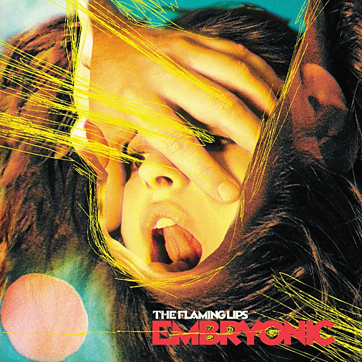

# Embryonic

By **The Flaming Lips**

## Album Data

- **Catalog:** Beets
- **Format:** Digital, Album
- **Album:** Embryonic
- **Artist:** The Flaming Lips
- **Albumartist:** The Flaming Lips
- **Genre:** Space Rock
- **MusicBrainz Album Artist ID:** [1f43d76f-8edf-44f6-aaf1-b65f05ad9402](https://musicbrainz.org/artist/1f43d76f-8edf-44f6-aaf1-b65f05ad9402)
- **MusicBrainz Album ID:** [430d0a69-273b-342d-b0dd-e5c7324d7aa5](https://musicbrainz.org/release/430d0a69-273b-342d-b0dd-e5c7324d7aa5)
- **MusicBrainz Release Group ID:** [6654ee18-9421-4204-ae48-f0fdc3d6ab9e](https://musicbrainz.org/release-group/6654ee18-9421-4204-ae48-f0fdc3d6ab9e)
- **Year:** 2009
- **Catalog #:** 
- **Label:** Warner Bros. Records
- **Total Tracks:** 13

## Album Tracks

### Track 05 - Fixing a Hole

- **Artist:** Electric Würms
- **Format:** ALAC
- **Genre:** Neo-Psychedelia
- **Length:** 3:48
- **MusicBrainz Track ID:** [0ff01b24-46f8-4cc9-bcf4-bbf06d53d343](https://musicbrainz.org/recording/0ff01b24-46f8-4cc9-bcf4-bbf06d53d343)
- **Title:** Fixing a Hole
- **Track:** 05
- **Year:** 2014

### Track 08 - Within You Without You

- **Artist:** The Flaming Lips feat. Birdflower & Morgan Delt
- **Format:** ALAC
- **Genre:** Neo-Psychedelia
- **Length:** 4:39
- **MusicBrainz Track ID:** [c11e226c-1d23-4c4c-830c-2011df2310e1](https://musicbrainz.org/recording/c11e226c-1d23-4c4c-830c-2011df2310e1)
- **Title:** Within You Without You
- **Track:** 08
- **Year:** 2014

### Track 02 - With a Little Help From My Friends

- **Artist:** The Flaming Lips feat. Black Pus & The Autumn Defense
- **Format:** ALAC
- **Genre:** Neo-Psychedelia
- **Length:** 3:33
- **MusicBrainz Track ID:** [a27f8777-439d-43f5-a6e4-01d4abc79db0](https://musicbrainz.org/recording/a27f8777-439d-43f5-a6e4-01d4abc79db0)
- **Title:** With a Little Help From My Friends
- **Track:** 02
- **Year:** 2014

### Track 03 - Lucy in the Sky With Diamonds

- **Artist:** The Flaming Lips feat. Miley Cyrus & Moby
- **Format:** ALAC
- **Genre:** Neo-Psychedelia
- **Length:** 5:41
- **MusicBrainz Track ID:** [b412a99e-7de4-4f17-be83-f48903a2c553](https://musicbrainz.org/recording/b412a99e-7de4-4f17-be83-f48903a2c553)
- **Title:** Lucy in the Sky With Diamonds
- **Track:** 03
- **Year:** 2014

### Track 13 - A Day in the Life

- **Artist:** The Flaming Lips feat. Miley Cyrus & New Fumes
- **Format:** ALAC
- **Genre:** Neo-Psychedelia
- **Length:** 4:54
- **MusicBrainz Track ID:** [5602f680-1904-4fd1-99bf-53b10d80c269](https://musicbrainz.org/recording/5602f680-1904-4fd1-99bf-53b10d80c269)
- **Title:** A Day in the Life
- **Track:** 13
- **Year:** 2014

### Track 09 - When I’m Sixty-Four

- **Artist:** The Flaming Lips feat. Def Rain & Pitchwafuzz
- **Format:** ALAC
- **Genre:** Neo-Psychedelia
- **Length:** 3:19
- **MusicBrainz Track ID:** [2ff8835f-e71f-4250-82c3-050d0500a0e9](https://musicbrainz.org/recording/2ff8835f-e71f-4250-82c3-050d0500a0e9)
- **Title:** When I’m Sixty-Four
- **Track:** 09
- **Year:** 2014

### Track 04 - Getting Better

- **Artist:** The Flaming Lips feat. Dr. Dog, Morgan Delt & Chuck Inglish
- **Format:** ALAC
- **Genre:** Neo-Psychedelia
- **Length:** 4:07
- **MusicBrainz Track ID:** [c55a0cd2-fb57-4fe6-b52a-656a3796627e](https://musicbrainz.org/recording/c55a0cd2-fb57-4fe6-b52a-656a3796627e)
- **Title:** Getting Better
- **Track:** 04
- **Year:** 2014

### Track 12 - Sgt. Pepper’s Lonely Hearts Club Band (reprise)

- **Artist:** The Flaming Lips feat. Foxygen & Ben Goldwasser
- **Format:** ALAC
- **Genre:** Neo-Psychedelia
- **Length:** 5:14
- **MusicBrainz Track ID:** [155ce420-d12b-4007-85d7-6c7f3f62b930](https://musicbrainz.org/recording/155ce420-d12b-4007-85d7-6c7f3f62b930)
- **Title:** Sgt. Pepper’s Lonely Hearts Club Band (reprise)
- **Track:** 12
- **Year:** 2014

### Track 07 - Being for the Benefit of Mr. Kite!

- **Artist:** The Flaming Lips feat. Maynard James Keenan, Puscifer & SUNBEARS!
- **Format:** ALAC
- **Genre:** Neo-Psychedelia
- **Length:** 2:34
- **MusicBrainz Track ID:** [eac502cc-7209-4ddc-8726-922c8eeb7c27](https://musicbrainz.org/recording/eac502cc-7209-4ddc-8726-922c8eeb7c27)
- **Title:** Being for the Benefit of Mr. Kite!
- **Track:** 07
- **Year:** 2014

### Track 01 - Sgt. Pepper’s Lonely Hearts Club Band

- **Artist:** The Flaming Lips feat. My Morning Jacket, Fever the Ghost & J Mascis
- **Format:** ALAC
- **Genre:** Neo-Psychedelia
- **Length:** 2:45
- **MusicBrainz Track ID:** [f25e0519-af80-4365-9abc-44a2a13b717e](https://musicbrainz.org/recording/f25e0519-af80-4365-9abc-44a2a13b717e)
- **Title:** Sgt. Pepper’s Lonely Hearts Club Band
- **Track:** 01
- **Year:** 2014

### Track 06 - She’s Leaving Home

- **Artist:** The Flaming Lips feat. Phantogram, Julianna Barwick & Spaceface
- **Format:** ALAC
- **Genre:** Neo-Psychedelia
- **Length:** 3:12
- **MusicBrainz Track ID:** [5e5097d9-60a0-4967-b6f4-9c871cc7fbb0](https://musicbrainz.org/recording/5e5097d9-60a0-4967-b6f4-9c871cc7fbb0)
- **Title:** She’s Leaving Home
- **Track:** 06
- **Year:** 2014

### Track 10 - Lovely Rita

- **Artist:** The Flaming Lips feat. Tegan and Sara & Stardeath and White Dwarfs
- **Format:** ALAC
- **Genre:** Neo-Psychedelia
- **Length:** 4:18
- **MusicBrainz Track ID:** [828ca178-afe4-4a9c-9e3c-2daa3461539c](https://musicbrainz.org/recording/828ca178-afe4-4a9c-9e3c-2daa3461539c)
- **Title:** Lovely Rita
- **Track:** 10
- **Year:** 2014

### Track 11 - Good Morning Good Morning

- **Artist:** The Flaming Lips feat. Zorch, Grace Potter & Treasure MammaL
- **Format:** ALAC
- **Genre:** Neo-Psychedelia
- **Length:** 3:14
- **MusicBrainz Track ID:** [f097b07b-5221-469d-949e-5885621f3204](https://musicbrainz.org/recording/f097b07b-5221-469d-949e-5885621f3204)
- **Title:** Good Morning Good Morning
- **Track:** 11
- **Year:** 2014

## See also

- [At War With the Mystics](At_War_With_the_Mystics.md)
- [The Dark Side Of The Moon](The_Dark_Side_Of_The_Moon.md)
- [With a Little Help From My Fwends](With_a_Little_Help_From_My_Fwends.md)
- [Yoshimi Battles the Pink Robots](Yoshimi_Battles_the_Pink_Robots.md)
- [Roon: The Dark Side of the Moon](../../Roon/The_Flaming_Lips/The_Dark_Side_of_the_Moon.md)
