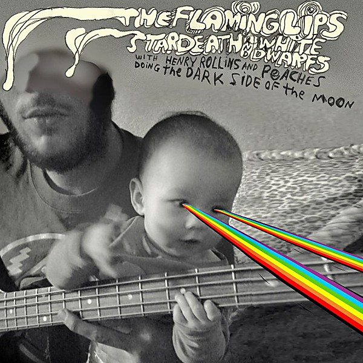

# The Dark Side Of The Moon

By **The Flaming Lips**

## Album Data

- **Catalog:** Beets
- **Format:** Digital, Album
- **Album:** The Dark Side Of The Moon
- **Artist:** The Flaming Lips
- **Albumartist:** The Flaming Lips
- **Genre:** Progressive Rock
- **MusicBrainz Album Artist ID:** 
- **MusicBrainz Album ID:** 
- **MusicBrainz Release Group ID:** 
- **Year:** 2009
- **Catalog #:** 
- **Label:** 
- **Total Tracks:** 09

## Album Tracks

### Track 01 - Speak To Me / Breathe

- **Artist:** The Flaming Lips
- **Format:** ALAC
- **Genre:** Indie Rock
- **Length:** 5:19
- **MusicBrainz Track ID:** 
- **Title:** Speak To Me / Breathe
- **Track:** 01
- **Year:** 2009

### Track 02 - On The Run

- **Artist:** The Flaming Lips
- **Format:** ALAC
- **Genre:** Pop
- **Length:** 3:55
- **MusicBrainz Track ID:** 
- **Title:** On The Run
- **Track:** 02
- **Year:** 2009

### Track 03 - Time / Breathe (Reprise)

- **Artist:** The Flaming Lips
- **Format:** ALAC
- **Genre:** Progressive Rock
- **Length:** 4:56
- **MusicBrainz Track ID:** 
- **Title:** Time / Breathe (Reprise)
- **Track:** 03
- **Year:** 2009

### Track 04 - The Great Gig In The Sky

- **Artist:** The Flaming Lips
- **Format:** ALAC
- **Genre:** Progressive Rock
- **Length:** 3:57
- **MusicBrainz Track ID:** 
- **Title:** The Great Gig In The Sky
- **Track:** 04
- **Year:** 2009

### Track 05 - Money

- **Artist:** The Flaming Lips
- **Format:** ALAC
- **Genre:** Progressive Rock
- **Length:** 5:31
- **MusicBrainz Track ID:** 
- **Title:** Money
- **Track:** 05
- **Year:** 2009

### Track 06 - Us And Them

- **Artist:** The Flaming Lips
- **Format:** ALAC
- **Genre:** Britpop
- **Length:** 7:45
- **MusicBrainz Track ID:** 
- **Title:** Us And Them
- **Track:** 06
- **Year:** 2009

### Track 07 - Any Colour You Like

- **Artist:** The Flaming Lips
- **Format:** ALAC
- **Genre:** Progressive Rock
- **Length:** 2:42
- **MusicBrainz Track ID:** 
- **Title:** Any Colour You Like
- **Track:** 07
- **Year:** 2009

### Track 08 - Brain Damage

- **Artist:** The Flaming Lips
- **Format:** ALAC
- **Genre:** Britpop
- **Length:** 4:42
- **MusicBrainz Track ID:** 
- **Title:** Brain Damage
- **Track:** 08
- **Year:** 2009

### Track 09 - Eclipse

- **Artist:** The Flaming Lips
- **Format:** ALAC
- **Genre:** Progressive Rock
- **Length:** 2:12
- **MusicBrainz Track ID:** 
- **Title:** Eclipse
- **Track:** 09
- **Year:** 2009

## See also

- [At War With the Mystics](At_War_With_the_Mystics.md)
- [Embryonic](Embryonic.md)
- [With a Little Help From My Fwends](With_a_Little_Help_From_My_Fwends.md)
- [Yoshimi Battles the Pink Robots](Yoshimi_Battles_the_Pink_Robots.md)
- [Roon: The Dark Side of the Moon](../../Roon/The_Flaming_Lips/The_Dark_Side_of_the_Moon.md)
