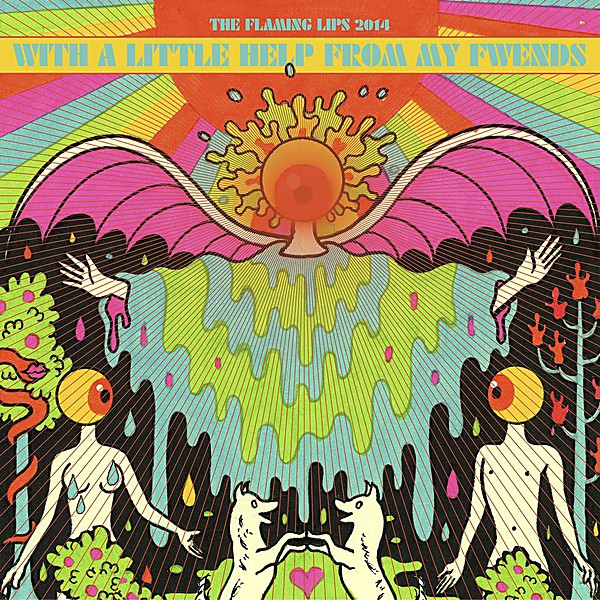

# With a Little Help From My Fwends

By **The Flaming Lips**

## Album Data

- **Catalog:** Beets
- **Format:** Digital, Album
- **Album:** With a Little Help From My Fwends
- **Artist:** The Flaming Lips
- **Albumartist:** The Flaming Lips
- **Genre:** Neo-Psychedelia
- **MusicBrainz Album Artist ID:** [1f43d76f-8edf-44f6-aaf1-b65f05ad9402](https://musicbrainz.org/artist/1f43d76f-8edf-44f6-aaf1-b65f05ad9402)
- **MusicBrainz Album ID:** [1852a991-f6c9-44e7-a8da-a7092eae77f8](https://musicbrainz.org/release/1852a991-f6c9-44e7-a8da-a7092eae77f8)
- **MusicBrainz Release Group ID:** [7e60f308-4f5c-412f-b753-f5966cf03840](https://musicbrainz.org/release-group/7e60f308-4f5c-412f-b753-f5966cf03840)
- **Year:** 2014
- **Catalog #:** 9 48141-2
- **Label:** Warner Bros. Records
- **Total Tracks:** 11

## Album Tracks

### Track 01 - Fight Test

- **Artist:** The Flaming Lips
- **Format:** ALAC
- **Genre:** Neo-Psychedelia
- **Length:** 4:14
- **MusicBrainz Track ID:** [1b8e706a-454e-4466-9a8b-75214b5965f7](https://musicbrainz.org/recording/1b8e706a-454e-4466-9a8b-75214b5965f7)
- **Title:** Fight Test
- **Track:** 01
- **Year:** 2002

### Track 02 - One More Robot / Sympathy 3000-21

- **Artist:** The Flaming Lips
- **Format:** ALAC
- **Genre:** Neo-Psychedelia
- **Length:** 4:59
- **MusicBrainz Track ID:** [c70ac86a-6266-4c44-851e-2861722fe11f](https://musicbrainz.org/recording/c70ac86a-6266-4c44-851e-2861722fe11f)
- **Title:** One More Robot / Sympathy 3000-21
- **Track:** 02
- **Year:** 2002

### Track 03 - Yoshimi Battles the Pink Robots, Part 1

- **Artist:** The Flaming Lips
- **Format:** ALAC
- **Genre:** Neo-Psychedelia
- **Length:** 4:45
- **MusicBrainz Track ID:** [22678bd8-40f5-4e9d-9f9b-781952bc6633](https://musicbrainz.org/recording/22678bd8-40f5-4e9d-9f9b-781952bc6633)
- **Title:** Yoshimi Battles the Pink Robots, Part 1
- **Track:** 03
- **Year:** 2002

### Track 04 - Yoshimi Battles the Pink Robots, Part 2

- **Artist:** The Flaming Lips
- **Format:** ALAC
- **Genre:** Space Rock
- **Length:** 2:57
- **MusicBrainz Track ID:** [2434b248-a0ed-4a7f-b34d-2f919419d5b1](https://musicbrainz.org/recording/2434b248-a0ed-4a7f-b34d-2f919419d5b1)
- **Title:** Yoshimi Battles the Pink Robots, Part 2
- **Track:** 04
- **Year:** 2002

### Track 05 - In the Morning of the Magicians

- **Artist:** The Flaming Lips
- **Format:** ALAC
- **Genre:** Space Rock
- **Length:** 6:18
- **MusicBrainz Track ID:** [0a7a6dff-40f0-4eda-ac91-171012974606](https://musicbrainz.org/recording/0a7a6dff-40f0-4eda-ac91-171012974606)
- **Title:** In the Morning of the Magicians
- **Track:** 05
- **Year:** 2002

### Track 06 - Ego Tripping at the Gates of Hell

- **Artist:** The Flaming Lips
- **Format:** ALAC
- **Genre:** Noise Pop
- **Length:** 4:34
- **MusicBrainz Track ID:** [591821c9-f231-4988-b1f5-2ffe2cd23350](https://musicbrainz.org/recording/591821c9-f231-4988-b1f5-2ffe2cd23350)
- **Title:** Ego Tripping at the Gates of Hell
- **Track:** 06
- **Year:** 2002

### Track 07 - Are You a Hypnotist??

- **Artist:** The Flaming Lips
- **Format:** ALAC
- **Genre:** Neo-Psychedelia
- **Length:** 4:44
- **MusicBrainz Track ID:** [8f61c330-79e0-4340-833b-4edb7703ed84](https://musicbrainz.org/recording/8f61c330-79e0-4340-833b-4edb7703ed84)
- **Title:** Are You a Hypnotist??
- **Track:** 07
- **Year:** 2002

### Track 08 - It’s Summertime

- **Artist:** The Flaming Lips
- **Format:** ALAC
- **Genre:** Space Rock
- **Length:** 4:20
- **MusicBrainz Track ID:** [1e071206-f21b-4917-a926-52091a8d1a02](https://musicbrainz.org/recording/1e071206-f21b-4917-a926-52091a8d1a02)
- **Title:** It’s Summertime
- **Track:** 08
- **Year:** 2002

### Track 09 - Do You Realize??

- **Artist:** The Flaming Lips
- **Format:** ALAC
- **Genre:** Indie Rock
- **Length:** 3:32
- **MusicBrainz Track ID:** [238a3a15-b98f-4149-9e15-c954d43e20cb](https://musicbrainz.org/recording/238a3a15-b98f-4149-9e15-c954d43e20cb)
- **Title:** Do You Realize??
- **Track:** 09
- **Year:** 2002

### Track 10 - All We Have Is Now

- **Artist:** The Flaming Lips
- **Format:** ALAC
- **Genre:** Neo-Psychedelia
- **Length:** 3:53
- **MusicBrainz Track ID:** [bea626e0-b9b8-444b-abe4-f996ce5990ea](https://musicbrainz.org/recording/bea626e0-b9b8-444b-abe4-f996ce5990ea)
- **Title:** All We Have Is Now
- **Track:** 10
- **Year:** 2002

### Track 11 - Approaching Pavonis Mons by Balloon (Utopia Planitia)

- **Artist:** The Flaming Lips
- **Format:** ALAC
- **Genre:** Shoegaze
- **Length:** 3:09
- **MusicBrainz Track ID:** [f48070b5-5ee6-4ded-8ea2-bcb643ee8889](https://musicbrainz.org/recording/f48070b5-5ee6-4ded-8ea2-bcb643ee8889)
- **Title:** Approaching Pavonis Mons by Balloon (Utopia Planitia)
- **Track:** 11
- **Year:** 2002

## See also

- [At War With the Mystics](At_War_With_the_Mystics.md)
- [Embryonic](Embryonic.md)
- [The Dark Side Of The Moon](The_Dark_Side_Of_The_Moon.md)
- [Yoshimi Battles the Pink Robots](Yoshimi_Battles_the_Pink_Robots.md)
- [Roon: The Dark Side of the Moon](../../Roon/The_Flaming_Lips/The_Dark_Side_of_the_Moon.md)
