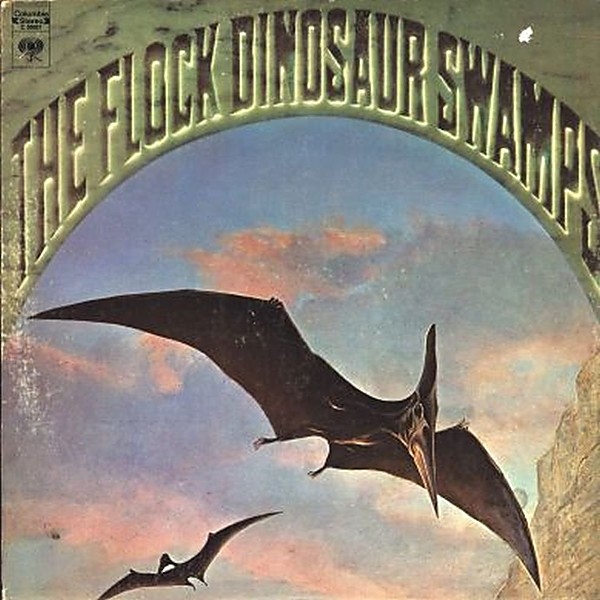

# Dinosaur Swamps

By **The Flock**

## Album Data

- **Catalog:** Beets
- **Format:** Digital, Album
- **Album:** Dinosaur Swamps
- **Artist:** The Flock
- **Albumartist:** The Flock
- **Genre:** Progressive Rock
- **MusicBrainz Album Artist ID:** [a3e17167-2519-4156-9a7d-1fba5d366eab](https://musicbrainz.org/artist/a3e17167-2519-4156-9a7d-1fba5d366eab)
- **MusicBrainz Album ID:** [a3da9b47-2c48-4592-8669-90db74189824](https://musicbrainz.org/release/a3da9b47-2c48-4592-8669-90db74189824)
- **MusicBrainz Release Group ID:** [c4305392-42a0-38c0-95a9-99130aef4215](https://musicbrainz.org/release-group/c4305392-42a0-38c0-95a9-99130aef4215)
- **Year:** 1996
- **Catalog #:** A 26658
- **Label:** One Way Records
- **Total Tracks:** 07

## Album Tracks

### Track 01 - Green Slice

- **Artist:** The Flock
- **Format:** AAC
- **Genre:** Ambient
- **Length:** 2:02
- **MusicBrainz Track ID:** [b6ccb32f-a756-4e79-a3d9-cb7d4e688582](https://musicbrainz.org/recording/b6ccb32f-a756-4e79-a3d9-cb7d4e688582)
- **Title:** Green Slice
- **Track:** 01
- **Year:** 1996

### Track 02 - Big Bird

- **Artist:** The Flock
- **Format:** AAC
- **Genre:** Rock
- **Length:** 5:57
- **MusicBrainz Track ID:** [fcad8b9a-bb59-4e1a-aea1-3610fa909af4](https://musicbrainz.org/recording/fcad8b9a-bb59-4e1a-aea1-3610fa909af4)
- **Title:** Big Bird
- **Track:** 02
- **Year:** 1996

### Track 03 - Hornschmeyer's Island

- **Artist:** The Flock
- **Format:** AAC
- **Genre:** Rock
- **Length:** 7:36
- **MusicBrainz Track ID:** [8b704ec5-6dd7-4033-a1fc-6a25a15aa5b4](https://musicbrainz.org/recording/8b704ec5-6dd7-4033-a1fc-6a25a15aa5b4)
- **Title:** Hornschmeyer's Island
- **Track:** 03
- **Year:** 1996

### Track 04 - Lighthouse

- **Artist:** The Flock
- **Format:** AAC
- **Genre:** Jazz
- **Length:** 5:26
- **MusicBrainz Track ID:** [1e74f1d5-57fb-4ab5-a647-d637db784780](https://musicbrainz.org/recording/1e74f1d5-57fb-4ab5-a647-d637db784780)
- **Title:** Lighthouse
- **Track:** 04
- **Year:** 1996

### Track 05 - Crabfoot

- **Artist:** The Flock
- **Format:** AAC
- **Genre:** Rock
- **Length:** 9:02
- **MusicBrainz Track ID:** [a15d9103-4ae7-4247-92f3-426287afb2c1](https://musicbrainz.org/recording/a15d9103-4ae7-4247-92f3-426287afb2c1)
- **Title:** Crabfoot
- **Track:** 05
- **Year:** 1996

### Track 06 - Mermaid

- **Artist:** The Flock
- **Format:** AAC
- **Genre:** Psychedelic Rock
- **Length:** 4:31
- **MusicBrainz Track ID:** [f95f382f-7dd2-473a-8746-5f99677469e5](https://musicbrainz.org/recording/f95f382f-7dd2-473a-8746-5f99677469e5)
- **Title:** Mermaid
- **Track:** 06
- **Year:** 1996

### Track 07 - Uranian Sircus

- **Artist:** The Flock
- **Format:** AAC
- **Genre:** Progressive Rock
- **Length:** 7:13
- **MusicBrainz Track ID:** [7cd04f02-fdb5-4834-a737-4082c80172e9](https://musicbrainz.org/recording/7cd04f02-fdb5-4834-a737-4082c80172e9)
- **Title:** Uranian Sircus
- **Track:** 07
- **Year:** 1996

## See also

- [Roon: Dinosaur Swamps (Expanded Edition)](../../Roon/The_Flock/Dinosaur_Swamps_Expanded_Edition.md)
- [Roon: The Flock (Expanded Edition)](../../Roon/The_Flock/The_Flock_Expanded_Edition.md)
- [Vinyl: Dinosaur Swamps](../../Vinyl/The_Flock/Dinosaur_Swamps.md)
- [Vinyl: ](../../Vinyl/The_Flock/The_Flock.md)
