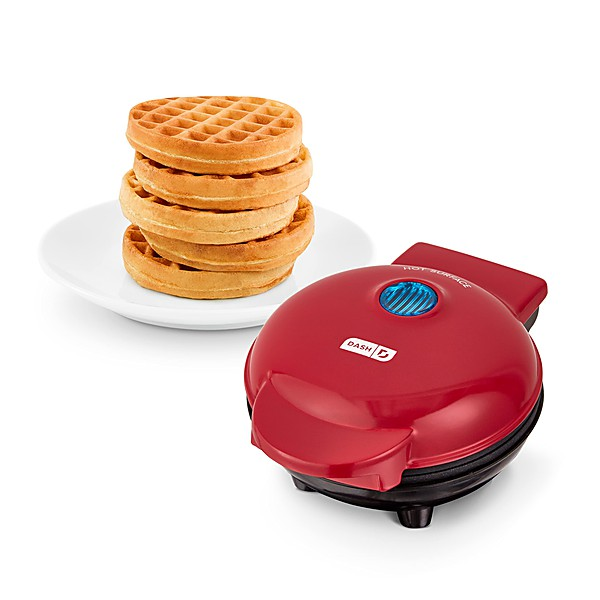

# Hot Burritos! Anthology

By **The Flying Burrito Brothers**

## Album Data

- **Catalog:** Beets
- **Format:** Digital, Album
- **Album:** Hot Burritos! Anthology
- **Artist:** The Flying Burrito Brothers
- **Albumartist:** The Flying Burrito Brothers
- **Genre:** Country Rock
- **MusicBrainz Album Artist ID:** [b4375768-3c8b-46e7-b578-c920ccfe725f](https://musicbrainz.org/artist/b4375768-3c8b-46e7-b578-c920ccfe725f)
- **MusicBrainz Album ID:** [234fcc00-8912-456a-8fa6-e74d9afd0449](https://musicbrainz.org/release/234fcc00-8912-456a-8fa6-e74d9afd0449)
- **MusicBrainz Release Group ID:** [a3848340-8b6d-320e-9a09-0653679b8cd7](https://musicbrainz.org/release-group/a3848340-8b6d-320e-9a09-0653679b8cd7)
- **Year:** 2000
- **Catalog #:** 069 490 610-2
- **Label:** A&M Records
- **Total Tracks:** 43

## Album Tracks

### Track 01 - Christine's Tune (aka Devil In Disguise)

- **Artist:** The Flying Burrito Brothers
- **Format:** ALAC
- **Genre:** Rock
- **Length:** 3:02
- **MusicBrainz Track ID:** [b7d2f40a-b737-438d-8fed-4f6457705f21](https://musicbrainz.org/recording/b7d2f40a-b737-438d-8fed-4f6457705f21)
- **Title:** Christine's Tune (aka Devil In Disguise)
- **Track:** 01
- **Year:** 2000

### Track 02 - Sin City

- **Artist:** The Flying Burrito Brothers
- **Format:** ALAC
- **Genre:** Country Rock
- **Length:** 4:09
- **MusicBrainz Track ID:** [8354c198-4ec4-41f1-aa6c-7bf1936f18b6](https://musicbrainz.org/recording/8354c198-4ec4-41f1-aa6c-7bf1936f18b6)
- **Title:** Sin City
- **Track:** 02
- **Year:** 2000

### Track 03 - Do Right Woman

- **Artist:** The Flying Burrito Brothers
- **Format:** ALAC
- **Genre:** Folk Rock
- **Length:** 3:57
- **MusicBrainz Track ID:** [2a269519-d41d-4986-a715-9d6c636e903e](https://musicbrainz.org/recording/2a269519-d41d-4986-a715-9d6c636e903e)
- **Title:** Do Right Woman
- **Track:** 03
- **Year:** 2000

### Track 04 - Dark End of the Street

- **Artist:** The Flying Burrito Brothers
- **Format:** ALAC
- **Genre:** Country Rock
- **Length:** 3:50
- **MusicBrainz Track ID:** [5aece830-300f-4f1c-b0ff-57859ab5d065](https://musicbrainz.org/recording/5aece830-300f-4f1c-b0ff-57859ab5d065)
- **Title:** Dark End of the Street
- **Track:** 04
- **Year:** 2000

### Track 05 - My Uncle

- **Artist:** The Flying Burrito Brothers
- **Format:** ALAC
- **Genre:** Progressive Country
- **Length:** 2:37
- **MusicBrainz Track ID:** [8bf22ffb-2222-4eb8-93d7-789645ed1897](https://musicbrainz.org/recording/8bf22ffb-2222-4eb8-93d7-789645ed1897)
- **Title:** My Uncle
- **Track:** 05
- **Year:** 2000

### Track 06 - Wheels

- **Artist:** The Flying Burrito Brothers
- **Format:** ALAC
- **Genre:** Country Rock
- **Length:** 3:02
- **MusicBrainz Track ID:** [a24f0d8a-c73e-40a0-a6a3-51c697db363f](https://musicbrainz.org/recording/a24f0d8a-c73e-40a0-a6a3-51c697db363f)
- **Title:** Wheels
- **Track:** 06
- **Year:** 2000

### Track 07 - Juanita

- **Artist:** The Flying Burrito Brothers
- **Format:** ALAC
- **Genre:** Country Rock
- **Length:** 2:30
- **MusicBrainz Track ID:** [cc57fe75-d79f-4606-9c09-10b8af0b24b5](https://musicbrainz.org/recording/cc57fe75-d79f-4606-9c09-10b8af0b24b5)
- **Title:** Juanita
- **Track:** 07
- **Year:** 2000

### Track 08 - Hot Burrito #1

- **Artist:** The Flying Burrito Brothers
- **Format:** ALAC
- **Genre:** Soul
- **Length:** 3:37
- **MusicBrainz Track ID:** [ea09ceff-d52a-4cdb-b9b6-111465da54ed](https://musicbrainz.org/recording/ea09ceff-d52a-4cdb-b9b6-111465da54ed)
- **Title:** Hot Burrito #1
- **Track:** 08
- **Year:** 2000

### Track 09 - Hot Burrito #2

- **Artist:** The Flying Burrito Brothers
- **Format:** ALAC
- **Genre:** Folk Rock
- **Length:** 3:17
- **MusicBrainz Track ID:** [8f963f3b-76a9-498d-a663-e0e0645d3e09](https://musicbrainz.org/recording/8f963f3b-76a9-498d-a663-e0e0645d3e09)
- **Title:** Hot Burrito #2
- **Track:** 09
- **Year:** 2000

### Track 10 - Do You Know How it Feels

- **Artist:** The Flying Burrito Brothers
- **Format:** ALAC
- **Genre:** Country Rock
- **Length:** 2:08
- **MusicBrainz Track ID:** [f0c5db3c-fd50-43a9-b37f-bf09d83c1ebf](https://musicbrainz.org/recording/f0c5db3c-fd50-43a9-b37f-bf09d83c1ebf)
- **Title:** Do You Know How it Feels
- **Track:** 10
- **Year:** 2000

### Track 11 - Hippie Boy

- **Artist:** The Flying Burrito Brothers
- **Format:** ALAC
- **Genre:** Psychedelic Rock
- **Length:** 4:55
- **MusicBrainz Track ID:** [eebbe844-4ac8-499a-b26c-67b287fe2afe](https://musicbrainz.org/recording/eebbe844-4ac8-499a-b26c-67b287fe2afe)
- **Title:** Hippie Boy
- **Track:** 11
- **Year:** 2000

### Track 12 - The Train Song

- **Artist:** The Flying Burrito Brothers
- **Format:** ALAC
- **Genre:** Folk Rock
- **Length:** 3:04
- **MusicBrainz Track ID:** [3a44e96b-1790-49a3-86d5-6982c3e618df](https://musicbrainz.org/recording/3a44e96b-1790-49a3-86d5-6982c3e618df)
- **Title:** The Train Song
- **Track:** 12
- **Year:** 2000

### Track 13 - Lazy Days

- **Artist:** The Flying Burrito Brothers
- **Format:** ALAC
- **Genre:** Post-Rock
- **Length:** 2:58
- **MusicBrainz Track ID:** [7d180e76-789f-4ac9-aa0b-aa915db609db](https://musicbrainz.org/recording/7d180e76-789f-4ac9-aa0b-aa915db609db)
- **Title:** Lazy Days
- **Track:** 13
- **Year:** 2000

### Track 14 - Image of Me

- **Artist:** The Flying Burrito Brothers
- **Format:** ALAC
- **Genre:** Country Rock
- **Length:** 3:19
- **MusicBrainz Track ID:** [078ef4c0-d502-483a-9800-70e096778c2c](https://musicbrainz.org/recording/078ef4c0-d502-483a-9800-70e096778c2c)
- **Title:** Image of Me
- **Track:** 14
- **Year:** 2000

### Track 15 - High Fashion Queen

- **Artist:** The Flying Burrito Brothers
- **Format:** ALAC
- **Genre:** Folk Rock
- **Length:** 2:07
- **MusicBrainz Track ID:** [f1571542-63a0-40e7-80ac-b8c7c951531d](https://musicbrainz.org/recording/f1571542-63a0-40e7-80ac-b8c7c951531d)
- **Title:** High Fashion Queen
- **Track:** 15
- **Year:** 2000

### Track 16 - If You Gotta Go

- **Artist:** The Flying Burrito Brothers
- **Format:** ALAC
- **Genre:** Folk Rock
- **Length:** 1:49
- **MusicBrainz Track ID:** [51c6c011-7771-464b-850e-0aff39c1d309](https://musicbrainz.org/recording/51c6c011-7771-464b-850e-0aff39c1d309)
- **Title:** If You Gotta Go
- **Track:** 16
- **Year:** 2000

### Track 17 - Man in the Fog

- **Artist:** The Flying Burrito Brothers
- **Format:** ALAC
- **Genre:** Folk Rock
- **Length:** 2:31
- **MusicBrainz Track ID:** [2c4a62c9-d808-4ee1-9a1d-9c2c9395543d](https://musicbrainz.org/recording/2c4a62c9-d808-4ee1-9a1d-9c2c9395543d)
- **Title:** Man in the Fog
- **Track:** 17
- **Year:** 2000

### Track 18 - Farther Along

- **Artist:** The Flying Burrito Brothers
- **Format:** ALAC
- **Genre:** Folk Rock
- **Length:** 4:00
- **MusicBrainz Track ID:** [f357a1b1-72ed-4fbb-9817-60e8e2028d30](https://musicbrainz.org/recording/f357a1b1-72ed-4fbb-9817-60e8e2028d30)
- **Title:** Farther Along
- **Track:** 18
- **Year:** 2000

### Track 19 - Older Guys

- **Artist:** The Flying Burrito Brothers
- **Format:** ALAC
- **Genre:** Folk Rock
- **Length:** 2:29
- **MusicBrainz Track ID:** [9ef8c5ea-3805-458f-b551-24cacddfa205](https://musicbrainz.org/recording/9ef8c5ea-3805-458f-b551-24cacddfa205)
- **Title:** Older Guys
- **Track:** 19
- **Year:** 2000

### Track 20 - Cody, Cody

- **Artist:** The Flying Burrito Brothers
- **Format:** ALAC
- **Genre:** Country Rock
- **Length:** 2:45
- **MusicBrainz Track ID:** [758df7f6-a24d-41a0-8650-c5512255bf32](https://musicbrainz.org/recording/758df7f6-a24d-41a0-8650-c5512255bf32)
- **Title:** Cody, Cody
- **Track:** 20
- **Year:** 2000

### Track 21 - God's Own Singer

- **Artist:** The Flying Burrito Brothers
- **Format:** ALAC
- **Genre:** Country Rock
- **Length:** 2:05
- **MusicBrainz Track ID:** [be83daf5-19f3-4626-8582-f9aa39c54eec](https://musicbrainz.org/recording/be83daf5-19f3-4626-8582-f9aa39c54eec)
- **Title:** God's Own Singer
- **Track:** 21
- **Year:** 2000

### Track 22 - Down in the Churchyard

- **Artist:** The Flying Burrito Brothers
- **Format:** ALAC
- **Genre:** Country Rock
- **Length:** 2:20
- **MusicBrainz Track ID:** [04de5293-5a81-4962-823b-a0662dde87e2](https://musicbrainz.org/recording/04de5293-5a81-4962-823b-a0662dde87e2)
- **Title:** Down in the Churchyard
- **Track:** 22
- **Year:** 2000

### Track 23 - Wild Horses

- **Artist:** The Flying Burrito Brothers
- **Format:** ALAC
- **Genre:** Folk Rock
- **Length:** 6:20
- **MusicBrainz Track ID:** [0a7e7aa8-a30d-43ac-8780-5ac015d5f574](https://musicbrainz.org/recording/0a7e7aa8-a30d-43ac-8780-5ac015d5f574)
- **Title:** Wild Horses
- **Track:** 23
- **Year:** 2000

### Track 24 - Six Days on the Road

- **Artist:** The Flying Burrito Brothers
- **Format:** ALAC
- **Genre:** Folk Rock
- **Length:** 2:56
- **MusicBrainz Track ID:** [bbfd5478-0bbe-42f9-97d1-ce1af69be0b8](https://musicbrainz.org/recording/bbfd5478-0bbe-42f9-97d1-ce1af69be0b8)
- **Title:** Six Days on the Road
- **Track:** 24
- **Year:** 2000

### Track 25 - Close Up the Honky Tonks

- **Artist:** The Flying Burrito Brothers
- **Format:** ALAC
- **Genre:** Southern Rock
- **Length:** 2:18
- **MusicBrainz Track ID:** [0cf90663-94a2-435a-9109-9d3970747812](https://musicbrainz.org/recording/0cf90663-94a2-435a-9109-9d3970747812)
- **Title:** Close Up the Honky Tonks
- **Track:** 25
- **Year:** 2000

### Track 26 - Break My Mind

- **Artist:** The Flying Burrito Brothers
- **Format:** ALAC
- **Genre:** Soft Rock
- **Length:** 2:22
- **MusicBrainz Track ID:** [f838eff6-afee-4101-a7ad-b84f8576677b](https://musicbrainz.org/recording/f838eff6-afee-4101-a7ad-b84f8576677b)
- **Title:** Break My Mind
- **Track:** 26
- **Year:** 2000

### Track 27 - Dim Lights

- **Artist:** The Flying Burrito Brothers
- **Format:** ALAC
- **Genre:** Rock
- **Length:** 2:55
- **MusicBrainz Track ID:** [abd897f5-c293-4767-9411-ad491d0369d1](https://musicbrainz.org/recording/abd897f5-c293-4767-9411-ad491d0369d1)
- **Title:** Dim Lights
- **Track:** 27
- **Year:** 2000

### Track 28 - Sing Me Back Home

- **Artist:** The Flying Burrito Brothers
- **Format:** ALAC
- **Genre:** Close Harmony
- **Length:** 3:50
- **MusicBrainz Track ID:** [1db2c52c-0299-4031-88a2-c4f19414cda7](https://musicbrainz.org/recording/1db2c52c-0299-4031-88a2-c4f19414cda7)
- **Title:** Sing Me Back Home
- **Track:** 28
- **Year:** 2000

### Track 29 - Tonight the Bottle Let Me Down

- **Artist:** The Flying Burrito Brothers
- **Format:** ALAC
- **Genre:** Folk Rock
- **Length:** 2:53
- **MusicBrainz Track ID:** [0e5f408c-d0ad-4f53-bc56-648eee218329](https://musicbrainz.org/recording/0e5f408c-d0ad-4f53-bc56-648eee218329)
- **Title:** Tonight the Bottle Let Me Down
- **Track:** 29
- **Year:** 2000

### Track 30 - To Love Somebody

- **Artist:** The Flying Burrito Brothers
- **Format:** ALAC
- **Genre:** Americana
- **Length:** 3:19
- **MusicBrainz Track ID:** [bdd2f94c-3f5b-468b-863c-0eb3324e1b20](https://musicbrainz.org/recording/bdd2f94c-3f5b-468b-863c-0eb3324e1b20)
- **Title:** To Love Somebody
- **Track:** 30
- **Year:** 2000

### Track 31 - White Line Fever

- **Artist:** The Flying Burrito Brothers
- **Format:** ALAC
- **Genre:** Country Rock
- **Length:** 3:16
- **MusicBrainz Track ID:** [566d4b1c-0793-461f-ad88-6b1531ea0de2](https://musicbrainz.org/recording/566d4b1c-0793-461f-ad88-6b1531ea0de2)
- **Title:** White Line Fever
- **Track:** 31
- **Year:** 2000

### Track 32 - Colorado

- **Artist:** The Flying Burrito Brothers
- **Format:** ALAC
- **Genre:** Folk Rock
- **Length:** 4:52
- **MusicBrainz Track ID:** [307026c2-7e7b-4dfd-8701-c2eeb7416beb](https://musicbrainz.org/recording/307026c2-7e7b-4dfd-8701-c2eeb7416beb)
- **Title:** Colorado
- **Track:** 32
- **Year:** 2000

### Track 33 - Hand to Mouth

- **Artist:** The Flying Burrito Brothers
- **Format:** ALAC
- **Genre:** Folk Rock
- **Length:** 3:44
- **MusicBrainz Track ID:** [2630419c-70c6-4bad-aa03-4f5d29a7fdae](https://musicbrainz.org/recording/2630419c-70c6-4bad-aa03-4f5d29a7fdae)
- **Title:** Hand to Mouth
- **Track:** 33
- **Year:** 2000

### Track 34 - Tried So Hard

- **Artist:** The Flying Burrito Brothers
- **Format:** ALAC
- **Genre:** Country Rock
- **Length:** 3:08
- **MusicBrainz Track ID:** [6fbc4e68-11fc-42b6-840a-579fe220699f](https://musicbrainz.org/recording/6fbc4e68-11fc-42b6-840a-579fe220699f)
- **Title:** Tried So Hard
- **Track:** 34
- **Year:** 2000

### Track 35 - Just Can't Be

- **Artist:** The Flying Burrito Brothers
- **Format:** ALAC
- **Genre:** Country Rock
- **Length:** 4:58
- **MusicBrainz Track ID:** [a87d2b8d-44c9-4a49-a061-bd06aa864fcf](https://musicbrainz.org/recording/a87d2b8d-44c9-4a49-a061-bd06aa864fcf)
- **Title:** Just Can't Be
- **Track:** 35
- **Year:** 2000

### Track 36 - To Ramona

- **Artist:** The Flying Burrito Brothers
- **Format:** ALAC
- **Genre:** Country Rock
- **Length:** 3:40
- **MusicBrainz Track ID:** [9fc875aa-d209-4642-8069-e6cf11fb99ab](https://musicbrainz.org/recording/9fc875aa-d209-4642-8069-e6cf11fb99ab)
- **Title:** To Ramona
- **Track:** 36
- **Year:** 2000

### Track 37 - Four Days of Rain

- **Artist:** The Flying Burrito Brothers
- **Format:** ALAC
- **Genre:** Country Rock
- **Length:** 3:39
- **MusicBrainz Track ID:** [bbdef32c-7fa5-4d9c-8452-dade22432783](https://musicbrainz.org/recording/bbdef32c-7fa5-4d9c-8452-dade22432783)
- **Title:** Four Days of Rain
- **Track:** 37
- **Year:** 2000

### Track 38 - Can't You Hear Me Calling

- **Artist:** The Flying Burrito Brothers
- **Format:** ALAC
- **Genre:** Country Rock
- **Length:** 2:23
- **MusicBrainz Track ID:** [99e374e0-9681-4ff5-b629-1f1a6ce48ce6](https://musicbrainz.org/recording/99e374e0-9681-4ff5-b629-1f1a6ce48ce6)
- **Title:** Can't You Hear Me Calling
- **Track:** 38
- **Year:** 2000

### Track 39 - All Alone

- **Artist:** The Flying Burrito Brothers
- **Format:** ALAC
- **Genre:** Folk Rock
- **Length:** 3:33
- **MusicBrainz Track ID:** [df3e79c4-d8c9-4a73-82c5-8af2607c60ad](https://musicbrainz.org/recording/df3e79c4-d8c9-4a73-82c5-8af2607c60ad)
- **Title:** All Alone
- **Track:** 39
- **Year:** 2000

### Track 40 - Why Are You Crying

- **Artist:** The Flying Burrito Brothers
- **Format:** ALAC
- **Genre:** Country
- **Length:** 3:02
- **MusicBrainz Track ID:** [d2510328-be50-4efc-8a96-9b63d653ec7d](https://musicbrainz.org/recording/d2510328-be50-4efc-8a96-9b63d653ec7d)
- **Title:** Why Are You Crying
- **Track:** 40
- **Year:** 2000

### Track 41 - Here Tonight

- **Artist:** The Flying Burrito Brothers
- **Format:** ALAC
- **Genre:** Easy Listening
- **Length:** 3:29
- **MusicBrainz Track ID:** [bbdf567b-8cc6-4419-88ee-243bf5928b09](https://musicbrainz.org/recording/bbdf567b-8cc6-4419-88ee-243bf5928b09)
- **Title:** Here Tonight
- **Track:** 41
- **Year:** 2000

### Track 42 - Ain't That a Lot of Love

- **Artist:** The Flying Burrito Brothers
- **Format:** ALAC
- **Genre:** Country Rock
- **Length:** 3:20
- **MusicBrainz Track ID:** [221f7f8b-6411-41ee-b557-b3b0a41b80ef](https://musicbrainz.org/recording/221f7f8b-6411-41ee-b557-b3b0a41b80ef)
- **Title:** Ain't That a Lot of Love
- **Track:** 42
- **Year:** 2000

### Track 43 - Losing Game

- **Artist:** The Flying Burrito Brothers
- **Format:** ALAC
- **Genre:** Country Rock
- **Length:** 2:57
- **MusicBrainz Track ID:** [9b0b0c58-124c-4055-922b-a1b083ff411a](https://musicbrainz.org/recording/9b0b0c58-124c-4055-922b-a1b083ff411a)
- **Title:** Losing Game
- **Track:** 43
- **Year:** 2000

