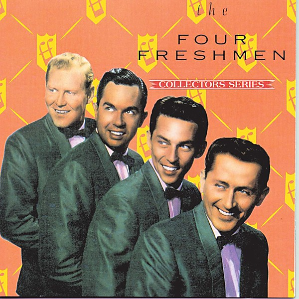

# Capitol Collectors Series

By **The Four Freshmen**

## Album Data

- **Catalog:** Beets
- **Format:** Digital, Album
- **Album:** Capitol Collectors Series
- **Artist:** The Four Freshmen
- **Albumartist:** The Four Freshmen
- **Genre:** Vocal Jazz
- **MusicBrainz Album Artist ID:** [53a61b1f-dd88-45e7-b5d8-3e84038aa81a](https://musicbrainz.org/artist/53a61b1f-dd88-45e7-b5d8-3e84038aa81a)
- **MusicBrainz Album ID:** [9786450e-f512-4b38-903f-fc26f5bdd875](https://musicbrainz.org/release/9786450e-f512-4b38-903f-fc26f5bdd875)
- **MusicBrainz Release Group ID:** [f223615a-9549-3bd1-853f-e4c8df828e9e](https://musicbrainz.org/release-group/f223615a-9549-3bd1-853f-e4c8df828e9e)
- **Year:** 1991
- **Catalog #:** CDP 7 93197 2
- **Label:** Capitol Records
- **Total Tracks:** 21

## Album Tracks

### Track 01 - It's a Blue World

- **Artist:** The Four Freshmen
- **Format:** ALAC
- **Genre:** Vocal Jazz
- **Length:** 2:56
- **MusicBrainz Track ID:** [68f85f50-129d-4fa5-a712-e5637deda358](https://musicbrainz.org/recording/68f85f50-129d-4fa5-a712-e5637deda358)
- **Title:** It's a Blue World
- **Track:** 01
- **Year:** 1991

### Track 02 - The Day Isn't Long Enough

- **Artist:** The Four Freshmen
- **Format:** ALAC
- **Genre:** Vocal Jazz
- **Length:** 2:55
- **MusicBrainz Track ID:** [da04d9a4-ecfe-426f-8d25-cca95911efab](https://musicbrainz.org/recording/da04d9a4-ecfe-426f-8d25-cca95911efab)
- **Title:** The Day Isn't Long Enough
- **Track:** 02
- **Year:** 1991

### Track 03 - Poinciana (Song of the Tree)

- **Artist:** The Four Freshmen
- **Format:** ALAC
- **Genre:** Vocal Jazz
- **Length:** 3:11
- **MusicBrainz Track ID:** [f5701fa0-1d6a-4123-b33d-d01c4d4d003e](https://musicbrainz.org/recording/f5701fa0-1d6a-4123-b33d-d01c4d4d003e)
- **Title:** Poinciana (Song of the Tree)
- **Track:** 03
- **Year:** 1991

### Track 04 - It Happened Once Before

- **Artist:** The Four Freshmen
- **Format:** ALAC
- **Genre:** Vocal Jazz
- **Length:** 2:30
- **MusicBrainz Track ID:** [d91b41a5-33bf-4947-b1b7-56c8734ec146](https://musicbrainz.org/recording/d91b41a5-33bf-4947-b1b7-56c8734ec146)
- **Title:** It Happened Once Before
- **Track:** 04
- **Year:** 1991

### Track 05 - Please Remember

- **Artist:** The Four Freshmen
- **Format:** ALAC
- **Genre:** Vocal Jazz
- **Length:** 2:51
- **MusicBrainz Track ID:** [5ab9b8a6-6b6b-4c4e-83d3-cf6e2fd17c43](https://musicbrainz.org/recording/5ab9b8a6-6b6b-4c4e-83d3-cf6e2fd17c43)
- **Title:** Please Remember
- **Track:** 05
- **Year:** 1991

### Track 06 - We'll Be Together Again

- **Artist:** The Four Freshmen
- **Format:** ALAC
- **Genre:** Vocal Jazz
- **Length:** 3:09
- **MusicBrainz Track ID:** [7bdd3bb2-3af8-4a57-a298-f3899c4e3944](https://musicbrainz.org/recording/7bdd3bb2-3af8-4a57-a298-f3899c4e3944)
- **Title:** We'll Be Together Again
- **Track:** 06
- **Year:** 1991

### Track 07 - Mood Indigo

- **Artist:** The Four Freshmen
- **Format:** ALAC
- **Genre:** Vocal Jazz
- **Length:** 2:43
- **MusicBrainz Track ID:** [730e7acd-10e5-4a46-8f7d-035471d7c720](https://musicbrainz.org/recording/730e7acd-10e5-4a46-8f7d-035471d7c720)
- **Title:** Mood Indigo
- **Track:** 07
- **Year:** 1991

### Track 08 - It Never Occurred to Me

- **Artist:** The Four Freshmen
- **Format:** ALAC
- **Genre:** Vocal Jazz
- **Length:** 3:06
- **MusicBrainz Track ID:** [47b4c0a5-6418-441d-8bf1-1e68ffd2fe4d](https://musicbrainz.org/recording/47b4c0a5-6418-441d-8bf1-1e68ffd2fe4d)
- **Title:** It Never Occurred to Me
- **Track:** 08
- **Year:** 1991

### Track 09 - Day by Day

- **Artist:** The Four Freshmen
- **Format:** ALAC
- **Genre:** Vocal Jazz
- **Length:** 1:58
- **MusicBrainz Track ID:** [e1a94f28-4fa4-4ce8-8f8c-35585b198751](https://musicbrainz.org/recording/e1a94f28-4fa4-4ce8-8f8c-35585b198751)
- **Title:** Day by Day
- **Track:** 09
- **Year:** 1991

### Track 10 - How Can I Tell Her

- **Artist:** The Four Freshmen
- **Format:** ALAC
- **Genre:** Vocal Jazz
- **Length:** 2:38
- **MusicBrainz Track ID:** [b1135a5c-c2bb-4088-a664-179dbe2d7fe7](https://musicbrainz.org/recording/b1135a5c-c2bb-4088-a664-179dbe2d7fe7)
- **Title:** How Can I Tell Her
- **Track:** 10
- **Year:** 1991

### Track 11 - Charmaine

- **Artist:** The Four Freshmen
- **Format:** ALAC
- **Genre:** Close Harmony
- **Length:** 2:18
- **MusicBrainz Track ID:** [d23582b9-1ec9-4ec4-9865-039e2b04130d](https://musicbrainz.org/recording/d23582b9-1ec9-4ec4-9865-039e2b04130d)
- **Title:** Charmaine
- **Track:** 11
- **Year:** 1991

### Track 12 - In This Whole Wide World

- **Artist:** The Four Freshmen
- **Format:** ALAC
- **Genre:** Vocal Jazz
- **Length:** 2:46
- **MusicBrainz Track ID:** [134eaa3f-7e33-4cbf-af37-cca5ca2d54f7](https://musicbrainz.org/recording/134eaa3f-7e33-4cbf-af37-cca5ca2d54f7)
- **Title:** In This Whole Wide World
- **Track:** 12
- **Year:** 1991

### Track 13 - Angel Eyes

- **Artist:** The Four Freshmen
- **Format:** ALAC
- **Genre:** Vocal Jazz
- **Length:** 3:33
- **MusicBrainz Track ID:** [7a324418-bd66-47b2-923e-c29900f66e3f](https://musicbrainz.org/recording/7a324418-bd66-47b2-923e-c29900f66e3f)
- **Title:** Angel Eyes
- **Track:** 13
- **Year:** 1991

### Track 14 - Love Is Just Around the Corner

- **Artist:** The Four Freshmen
- **Format:** ALAC
- **Genre:** Vocal Jazz
- **Length:** 2:02
- **MusicBrainz Track ID:** [06b8f613-c6d9-4f6a-a638-d70a66a9d2fc](https://musicbrainz.org/recording/06b8f613-c6d9-4f6a-a638-d70a66a9d2fc)
- **Title:** Love Is Just Around the Corner
- **Track:** 14
- **Year:** 1991

### Track 15 - Graduation Day

- **Artist:** The Four Freshmen
- **Format:** ALAC
- **Genre:** Pop
- **Length:** 3:06
- **MusicBrainz Track ID:** [63be60e4-5fee-4f8d-8178-c02adea0fe7e](https://musicbrainz.org/recording/63be60e4-5fee-4f8d-8178-c02adea0fe7e)
- **Title:** Graduation Day
- **Track:** 15
- **Year:** 1991

### Track 16 - Whistle Me Some Blues

- **Artist:** The Four Freshmen
- **Format:** ALAC
- **Genre:** Vocal Jazz
- **Length:** 2:35
- **MusicBrainz Track ID:** [3d77f4f0-ebc9-45e5-b6d1-a1d0689ae5c5](https://musicbrainz.org/recording/3d77f4f0-ebc9-45e5-b6d1-a1d0689ae5c5)
- **Title:** Whistle Me Some Blues
- **Track:** 16
- **Year:** 1991

### Track 17 - It Could Happen to You

- **Artist:** The Four Freshmen
- **Format:** ALAC
- **Genre:** Vocal Jazz
- **Length:** 3:26
- **MusicBrainz Track ID:** [465ae63e-b638-4d17-a93c-a4a3a2344a22](https://musicbrainz.org/recording/465ae63e-b638-4d17-a93c-a4a3a2344a22)
- **Title:** It Could Happen to You
- **Track:** 17
- **Year:** 1991

### Track 18 - Candy

- **Artist:** The Four Freshmen
- **Format:** ALAC
- **Genre:** Vocal Jazz
- **Length:** 2:16
- **MusicBrainz Track ID:** [9cf59393-b24f-44f2-96bf-ab1cc47dbcb2](https://musicbrainz.org/recording/9cf59393-b24f-44f2-96bf-ab1cc47dbcb2)
- **Title:** Candy
- **Track:** 18
- **Year:** 1991

### Track 19 - (Get Your Kicks on) Route 66

- **Artist:** The Four Freshmen
- **Format:** ALAC
- **Genre:** Vocal Jazz
- **Length:** 2:47
- **MusicBrainz Track ID:** [5b53242c-c373-4af2-97bd-dfd4f0cfe683](https://musicbrainz.org/recording/5b53242c-c373-4af2-97bd-dfd4f0cfe683)
- **Title:** (Get Your Kicks on) Route 66
- **Track:** 19
- **Year:** 1991

### Track 20 - Their Hearts Were Full of Spring

- **Artist:** The Four Freshmen
- **Format:** ALAC
- **Genre:** Vocal Jazz
- **Length:** 3:14
- **MusicBrainz Track ID:** [bd76edc0-ca0a-4a95-b9f4-64bf42220fdc](https://musicbrainz.org/recording/bd76edc0-ca0a-4a95-b9f4-64bf42220fdc)
- **Title:** Their Hearts Were Full of Spring
- **Track:** 20
- **Year:** 1991

### Track 21 - And So It's Over

- **Artist:** The Four Freshmen
- **Format:** ALAC
- **Genre:** Vocal Jazz
- **Length:** 2:53
- **MusicBrainz Track ID:** [5725ccf7-86d3-4663-8b3b-247ac4ab5d10](https://musicbrainz.org/recording/5725ccf7-86d3-4663-8b3b-247ac4ab5d10)
- **Title:** And So It's Over
- **Track:** 21
- **Year:** 1991

