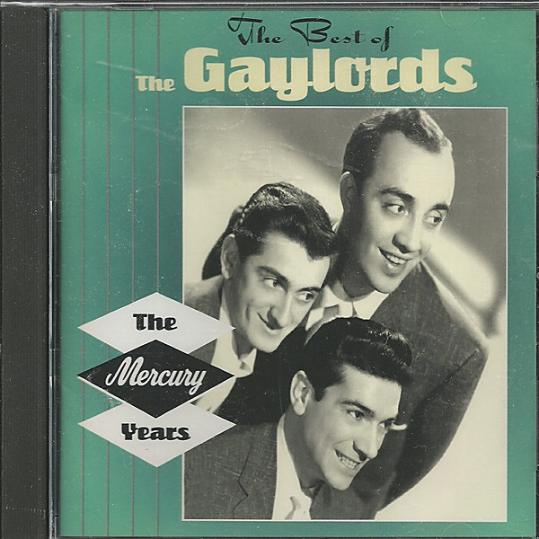

# The Best of the Gaylords

By **The Gaylords**

## Album Data

- **Catalog:** Beets
- **Format:** Digital, Album
- **Album:** The Best of the Gaylords
- **Artist:** The Gaylords
- **Albumartist:** The Gaylords
- **Genre:** Close Harmony
- **MusicBrainz Album Artist ID:** 
- **MusicBrainz Album ID:** 
- **MusicBrainz Release Group ID:** 
- **Year:** 1996
- **Catalog #:** 
- **Label:** Mercury
- **Total Tracks:** 00

## Album Tracks

### Track 11 - The Little Shoemaker

- **Artist:** The Gaylords
- **Format:** MP3
- **Genre:** Close Harmony
- **Length:** 2:18
- **MusicBrainz Track ID:** 
- **Title:** The Little Shoemaker
- **Track:** 11
- **Year:** 1996

