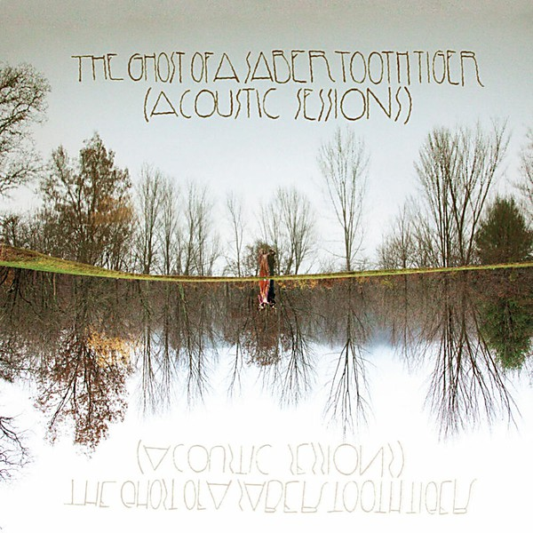

# Acoustic Sessions

By **The Ghost of a Saber Tooth Tiger**

## Album Data

- **Catalog:** Beets
- **Format:** Digital, Album
- **Album:** Acoustic Sessions
- **Artist:** The Ghost Of A Saber Tooth Tiger
- **Albumartist:** The Ghost of a Saber Tooth Tiger
- **Genre:** Indie Pop
- **MusicBrainz Album Artist ID:** [ecedc002-b517-4547-9362-b9e9b3ed4fbd](https://musicbrainz.org/artist/ecedc002-b517-4547-9362-b9e9b3ed4fbd)
- **MusicBrainz Album ID:** [bd139865-a2c0-408d-8482-c72ade5e94e4](https://musicbrainz.org/release/bd139865-a2c0-408d-8482-c72ade5e94e4)
- **MusicBrainz Release Group ID:** [181cc957-90e8-4300-943e-c9852115b493](https://musicbrainz.org/release-group/181cc957-90e8-4300-943e-c9852115b493)
- **Year:** 2010
- **Catalog #:** CHIM06
- **Label:** Chimera Music
- **Total Tracks:** 08

## Album Tracks

### Track 01 - Jardin du Luxembourg

- **Artist:** The Ghost of a Saber Tooth Tiger
- **Format:** MP3
- **Genre:** Indie Pop
- **Length:** 2:20
- **MusicBrainz Track ID:** [57782a54-f240-45cc-8df4-d98bef464a28](https://musicbrainz.org/recording/57782a54-f240-45cc-8df4-d98bef464a28)
- **Title:** Jardin du Luxembourg
- **Track:** 01
- **Year:** 2011

### Track 02 - Rainbows in Gasoline

- **Artist:** The Ghost of a Saber Tooth Tiger
- **Format:** MP3
- **Genre:** Indie Pop
- **Length:** 3:46
- **MusicBrainz Track ID:** [264108d7-ed10-403e-b95e-c315d80d7d6d](https://musicbrainz.org/recording/264108d7-ed10-403e-b95e-c315d80d7d6d)
- **Title:** Rainbows in Gasoline
- **Track:** 02
- **Year:** 2011

### Track 03 - Robot Boy

- **Artist:** The Ghost of a Saber Tooth Tiger
- **Format:** MP3
- **Genre:** Indie Pop
- **Length:** 4:19
- **MusicBrainz Track ID:** [41225d33-1042-45ec-b8bf-743c094c2abc](https://musicbrainz.org/recording/41225d33-1042-45ec-b8bf-743c094c2abc)
- **Title:** Robot Boy
- **Track:** 03
- **Year:** 2011

### Track 04 - Comic Strip

- **Artist:** The Ghost of a Saber Tooth Tiger
- **Format:** MP3
- **Genre:** Indie Pop
- **Length:** 3:18
- **MusicBrainz Track ID:** [03fd9d75-3b75-412b-8f69-e7c3eee1efd2](https://musicbrainz.org/recording/03fd9d75-3b75-412b-8f69-e7c3eee1efd2)
- **Title:** Comic Strip
- **Track:** 04
- **Year:** 2011

### Track 05 - Walt Disney Sitting in a Chaise and Drinking Cordials

- **Artist:** The Ghost of a Saber Tooth Tiger
- **Format:** MP3
- **Genre:** Indie Pop
- **Length:** 3:26
- **MusicBrainz Track ID:** [3bcb435a-46d5-4207-bd34-03d6da538f21](https://musicbrainz.org/recording/3bcb435a-46d5-4207-bd34-03d6da538f21)
- **Title:** Walt Disney Sitting in a Chaise and Drinking Cordials
- **Track:** 05
- **Year:** 2011

### Track 06 - Britney Jean

- **Artist:** The Ghost of a Saber Tooth Tiger
- **Format:** MP3
- **Genre:** Indie Pop
- **Length:** 4:12
- **MusicBrainz Track ID:** [7bb66687-dbc8-4f5e-bde4-7cef214f6328](https://musicbrainz.org/recording/7bb66687-dbc8-4f5e-bde4-7cef214f6328)
- **Title:** Britney Jean
- **Track:** 06
- **Year:** 2011

### Track 07 - 2012

- **Artist:** The Ghost of a Saber Tooth Tiger
- **Format:** MP3
- **Genre:** Indie Pop
- **Length:** 3:24
- **MusicBrainz Track ID:** [4536a74b-4138-44b4-ba38-d1b372e71f35](https://musicbrainz.org/recording/4536a74b-4138-44b4-ba38-d1b372e71f35)
- **Title:** 2012
- **Track:** 07
- **Year:** 2011

### Track 08 - Carrot Blue

- **Artist:** The Ghost of a Saber Tooth Tiger
- **Format:** MP3
- **Genre:** Indie Pop
- **Length:** 4:30
- **MusicBrainz Track ID:** [fd10c92c-47bf-4ce8-9d02-4b42b4eb55a1](https://musicbrainz.org/recording/fd10c92c-47bf-4ce8-9d02-4b42b4eb55a1)
- **Title:** Carrot Blue
- **Track:** 08
- **Year:** 2011

## See also

- [GOASTT Stories](GOASTT_Stories.md)
- [La Carotte Bleue](La_Carotte_Bleue.md)
- [Long Gone](Long_Gone.md)
- [Midnight Sun](Midnight_Sun.md)
- [CD: Acoustic Sessions](../../CD/The_Ghost_Of_A_Saber_Tooth_Tiger/Acoustic_Sessions.md)
- [CD: ](../../CD/The_Ghost_Of_A_Saber_Tooth_Tiger/The_Ghost_Of_A_Saber_Tooth_Tiger.md)
- [Vinyl: GOASTT Stories](../../Vinyl/The_Ghost_Of_A_Saber_Tooth_Tiger/GOASTT_Stories.md)
- [Vinyl: Midnight Sun](../../Vinyl/The_Ghost_Of_A_Saber_Tooth_Tiger/Midnight_Sun.md)
- [Vinyl: ](../../Vinyl/The_Ghost_Of_A_Saber_Tooth_Tiger/The_Ghost_Of_A_Saber_Tooth_Tiger.md)
