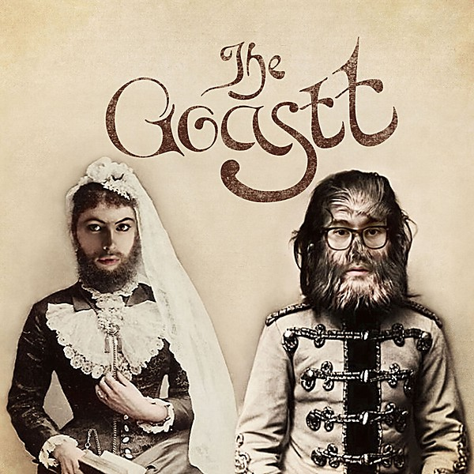

# Long Gone

By **The Ghost of a Saber Tooth Tiger**

## Album Data

- **Catalog:** Beets
- **Format:** Digital, Album
- **Album:** Long Gone
- **Artist:** The Ghost Of A Saber Tooth Tiger
- **Albumartist:** The Ghost of a Saber Tooth Tiger
- **Genre:** Indie Pop
- **MusicBrainz Album Artist ID:** [ecedc002-b517-4547-9362-b9e9b3ed4fbd](https://musicbrainz.org/artist/ecedc002-b517-4547-9362-b9e9b3ed4fbd)
- **MusicBrainz Album ID:** [3c556a7f-8330-401f-95ff-074e878e275d](https://musicbrainz.org/release/3c556a7f-8330-401f-95ff-074e878e275d)
- **MusicBrainz Release Group ID:** [aacdf6fa-c040-4c72-8d2d-aad24305d6fd](https://musicbrainz.org/release-group/aacdf6fa-c040-4c72-8d2d-aad24305d6fd)
- **Year:** 2015
- **Catalog #:** CHIM018CD
- **Label:** Chimera Music
- **Total Tracks:** 12

## Album Tracks

### Track 01 - Too Deep

- **Artist:** The Ghost of a Saber Tooth Tiger
- **Format:** ALAC
- **Genre:** Psychedelic Rock
- **Length:** 2:29
- **MusicBrainz Track ID:** [ebed1dbc-9729-49da-8471-03a6e77a8902](https://musicbrainz.org/recording/ebed1dbc-9729-49da-8471-03a6e77a8902)
- **Title:** Too Deep
- **Track:** 01
- **Year:** 2014

### Track 02 - Xanadu

- **Artist:** The Ghost of a Saber Tooth Tiger
- **Format:** ALAC
- **Genre:** Psychedelic Rock
- **Length:** 3:13
- **MusicBrainz Track ID:** [0430d1ec-1c69-474f-9e8c-d60aa6e3ad8f](https://musicbrainz.org/recording/0430d1ec-1c69-474f-9e8c-d60aa6e3ad8f)
- **Title:** Xanadu
- **Track:** 02
- **Year:** 2014

### Track 03 - Animals

- **Artist:** The Ghost of a Saber Tooth Tiger
- **Format:** ALAC
- **Genre:** Psychedelic Rock
- **Length:** 4:18
- **MusicBrainz Track ID:** [4662b9b8-7b8b-47a5-b994-14ec8ee7a7b1](https://musicbrainz.org/recording/4662b9b8-7b8b-47a5-b994-14ec8ee7a7b1)
- **Title:** Animals
- **Track:** 03
- **Year:** 2014

### Track 04 - Johannesburg

- **Artist:** The Ghost of a Saber Tooth Tiger
- **Format:** ALAC
- **Genre:** Psychedelic Rock
- **Length:** 3:48
- **MusicBrainz Track ID:** [7c9927d4-22c7-4601-a654-e668f0a069cf](https://musicbrainz.org/recording/7c9927d4-22c7-4601-a654-e668f0a069cf)
- **Title:** Johannesburg
- **Track:** 04
- **Year:** 2014

### Track 05 - Midnight Sun

- **Artist:** The Ghost of a Saber Tooth Tiger
- **Format:** ALAC
- **Genre:** Psychedelic Rock
- **Length:** 3:42
- **MusicBrainz Track ID:** [f87a2492-d630-49ca-8995-5542f513a8e6](https://musicbrainz.org/recording/f87a2492-d630-49ca-8995-5542f513a8e6)
- **Title:** Midnight Sun
- **Track:** 05
- **Year:** 2014

### Track 06 - Last Call

- **Artist:** The Ghost of a Saber Tooth Tiger
- **Format:** ALAC
- **Genre:** Psychedelic Rock
- **Length:** 6:01
- **MusicBrainz Track ID:** [5ac1cd41-b9f8-4b44-8abf-87164f3cc371](https://musicbrainz.org/recording/5ac1cd41-b9f8-4b44-8abf-87164f3cc371)
- **Title:** Last Call
- **Track:** 06
- **Year:** 2014

### Track 07 - The Devil You Know

- **Artist:** The Ghost of a Saber Tooth Tiger
- **Format:** ALAC
- **Genre:** Psychedelic Rock
- **Length:** 3:30
- **MusicBrainz Track ID:** [477550b6-62fc-48e4-8e56-f5075b94e42b](https://musicbrainz.org/recording/477550b6-62fc-48e4-8e56-f5075b94e42b)
- **Title:** The Devil You Know
- **Track:** 07
- **Year:** 2014

### Track 08 - Golden Earrings

- **Artist:** The Ghost of a Saber Tooth Tiger
- **Format:** ALAC
- **Genre:** Psychedelic Rock
- **Length:** 4:24
- **MusicBrainz Track ID:** [b8ad1f8d-dbee-4ace-8226-addbdaea6a43](https://musicbrainz.org/recording/b8ad1f8d-dbee-4ace-8226-addbdaea6a43)
- **Title:** Golden Earrings
- **Track:** 08
- **Year:** 2014

### Track 09 - Great Expectations

- **Artist:** The Ghost of a Saber Tooth Tiger
- **Format:** ALAC
- **Genre:** Psychedelic Rock
- **Length:** 4:39
- **MusicBrainz Track ID:** [903506ae-a4b9-4d37-87a0-434e16634e6a](https://musicbrainz.org/recording/903506ae-a4b9-4d37-87a0-434e16634e6a)
- **Title:** Great Expectations
- **Track:** 09
- **Year:** 2014

### Track 10 - Poor Paul Getty

- **Artist:** The Ghost of a Saber Tooth Tiger
- **Format:** ALAC
- **Genre:** Psychedelic Rock
- **Length:** 2:56
- **MusicBrainz Track ID:** [b5d8c4f4-a7c6-46ee-95f4-cdcbbfd6dadd](https://musicbrainz.org/recording/b5d8c4f4-a7c6-46ee-95f4-cdcbbfd6dadd)
- **Title:** Poor Paul Getty
- **Track:** 10
- **Year:** 2014

### Track 11 - Don't Look Back Orpheus

- **Artist:** The Ghost of a Saber Tooth Tiger
- **Format:** ALAC
- **Genre:** Psychedelic Rock
- **Length:** 3:52
- **MusicBrainz Track ID:** [49fcb1f2-e4d6-4529-8645-aa7e5275fb86](https://musicbrainz.org/recording/49fcb1f2-e4d6-4529-8645-aa7e5275fb86)
- **Title:** Don't Look Back Orpheus
- **Track:** 11
- **Year:** 2014

### Track 12 - Moth to a Flame

- **Artist:** The Ghost of a Saber Tooth Tiger
- **Format:** ALAC
- **Genre:** Psychedelic Rock
- **Length:** 6:44
- **MusicBrainz Track ID:** [931f1fe2-1796-4cb1-857b-264ebe9f1f4c](https://musicbrainz.org/recording/931f1fe2-1796-4cb1-857b-264ebe9f1f4c)
- **Title:** Moth to a Flame
- **Track:** 12
- **Year:** 2014

## See also

- [Acoustic Sessions](Acoustic_Sessions.md)
- [GOASTT Stories](GOASTT_Stories.md)
- [La Carotte Bleue](La_Carotte_Bleue.md)
- [Midnight Sun](Midnight_Sun.md)
- [CD: Acoustic Sessions](../../CD/The_Ghost_Of_A_Saber_Tooth_Tiger/Acoustic_Sessions.md)
- [CD: ](../../CD/The_Ghost_Of_A_Saber_Tooth_Tiger/The_Ghost_Of_A_Saber_Tooth_Tiger.md)
- [Vinyl: GOASTT Stories](../../Vinyl/The_Ghost_Of_A_Saber_Tooth_Tiger/GOASTT_Stories.md)
- [Vinyl: Midnight Sun](../../Vinyl/The_Ghost_Of_A_Saber_Tooth_Tiger/Midnight_Sun.md)
- [Vinyl: ](../../Vinyl/The_Ghost_Of_A_Saber_Tooth_Tiger/The_Ghost_Of_A_Saber_Tooth_Tiger.md)
