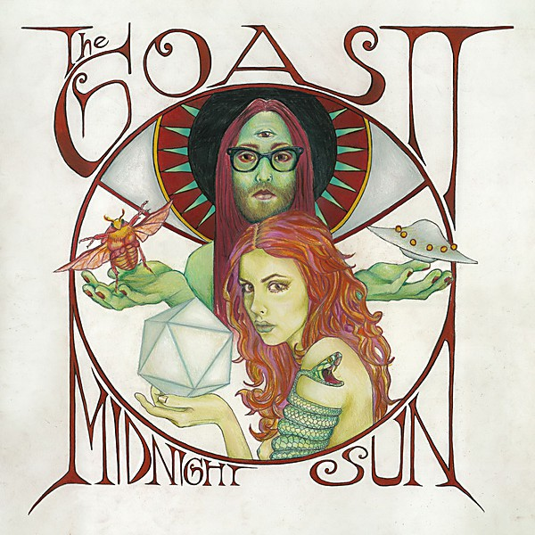

# Midnight Sun

By **The Ghost of a Saber Tooth Tiger**

## Album Data

- **Catalog:** Beets
- **Format:** Digital, Album
- **Album:** Midnight Sun
- **Artist:** The Ghost Of A Saber Tooth Tiger
- **Albumartist:** The Ghost of a Saber Tooth Tiger
- **Genre:** Psychedelic Rock
- **MusicBrainz Album Artist ID:** [ecedc002-b517-4547-9362-b9e9b3ed4fbd](https://musicbrainz.org/artist/ecedc002-b517-4547-9362-b9e9b3ed4fbd)
- **MusicBrainz Album ID:** [ca176b97-d9c5-451d-b46f-c4c8c12739f0](https://musicbrainz.org/release/ca176b97-d9c5-451d-b46f-c4c8c12739f0)
- **MusicBrainz Release Group ID:** [2fd9194f-0108-4956-a751-9b4aef9da590](https://musicbrainz.org/release-group/2fd9194f-0108-4956-a751-9b4aef9da590)
- **Year:** 2014
- **Catalog #:** 
- **Label:** 
- **Total Tracks:** 04

## Album Tracks

### Track 01 - 01 - 01 Cassanova__revised 12-10

- **Artist:** The Ghost Of A Saber Tooth Tiger
- **Format:** MP3
- **Genre:** Indie Pop
- **Length:** 4:54
- **MusicBrainz Track ID:** 
- **Title:** 01 - 01 Cassanova__revised 12-10
- **Track:** 01
- **Year:** 2015

### Track 02 - 02 - 02 India__ref of 12-04

- **Artist:** The Ghost Of A Saber Tooth Tiger
- **Format:** MP3
- **Genre:** Indie Pop
- **Length:** 5:02
- **MusicBrainz Track ID:** 
- **Title:** 02 - 02 India__ref of 12-04
- **Track:** 02
- **Year:** 2015

### Track 03 - 03 - 03 Pierrot__ref of 12-04

- **Artist:** The Ghost Of A Saber Tooth Tiger
- **Format:** MP3
- **Genre:** Indie Pop
- **Length:** 3:56
- **MusicBrainz Track ID:** 
- **Title:** 03 - 03 Pierrot__ref of 12-04
- **Track:** 03
- **Year:** 2015

### Track 04 - 04 - 04 Richard Brown__revised 12-10

- **Artist:** The Ghost Of A Saber Tooth Tiger
- **Format:** MP3
- **Genre:** Indie Pop
- **Length:** 4:30
- **MusicBrainz Track ID:** 
- **Title:** 04 - 04 Richard Brown__revised 12-10
- **Track:** 04
- **Year:** 2015

## See also

- [Acoustic Sessions](Acoustic_Sessions.md)
- [GOASTT Stories](GOASTT_Stories.md)
- [La Carotte Bleue](La_Carotte_Bleue.md)
- [Long Gone](Long_Gone.md)
- [CD: Acoustic Sessions](../../CD/The_Ghost_Of_A_Saber_Tooth_Tiger/Acoustic_Sessions.md)
- [CD: ](../../CD/The_Ghost_Of_A_Saber_Tooth_Tiger/The_Ghost_Of_A_Saber_Tooth_Tiger.md)
- [Vinyl: GOASTT Stories](../../Vinyl/The_Ghost_Of_A_Saber_Tooth_Tiger/GOASTT_Stories.md)
- [Vinyl: Midnight Sun](../../Vinyl/The_Ghost_Of_A_Saber_Tooth_Tiger/Midnight_Sun.md)
- [Vinyl: ](../../Vinyl/The_Ghost_Of_A_Saber_Tooth_Tiger/The_Ghost_Of_A_Saber_Tooth_Tiger.md)
