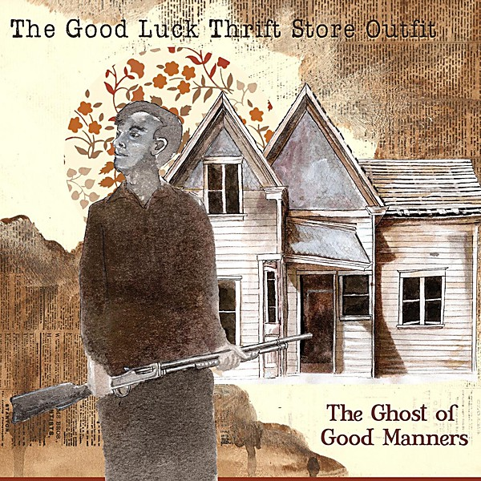

# The Ghost of Good Manners

By **The Good Luck Thrift Store Outfit**

## Album Data

- **Catalog:** Beets
- **Format:** Digital, Album
- **Album:** The Ghost of Good Manners
- **Artist:** The Good Luck Thrift Store Outfit
- **Albumartist:** The Good Luck Thrift Store Outfit
- **Genre:** Folk Rock
- **MusicBrainz Album Artist ID:** [4f12b80f-a765-43d8-8a12-9e93b97d20ba](https://musicbrainz.org/artist/4f12b80f-a765-43d8-8a12-9e93b97d20ba)
- **MusicBrainz Album ID:** [e2fc5deb-3dd5-4fb3-b575-b1af278055f6](https://musicbrainz.org/release/e2fc5deb-3dd5-4fb3-b575-b1af278055f6)
- **MusicBrainz Release Group ID:** [fbab8bdc-4d78-3f8c-ae3d-726ed60291c9](https://musicbrainz.org/release-group/fbab8bdc-4d78-3f8c-ae3d-726ed60291c9)
- **Year:** 2009
- **Catalog #:** 
- **Label:** 
- **Total Tracks:** 08

## Album Tracks

### Track 01 - Lazy Train

- **Artist:** The Good Luck Thrift Store Outfit
- **Format:** AAC
- **Genre:** Folk Rock
- **Length:** 4:24
- **MusicBrainz Track ID:** 
- **Title:** Lazy Train
- **Track:** 01
- **Year:** 2005

### Track 02 - Shovel

- **Artist:** The Good Luck Thrift Store Outfit
- **Format:** AAC
- **Genre:** Folk Rock
- **Length:** 3:30
- **MusicBrainz Track ID:** 
- **Title:** Shovel
- **Track:** 02
- **Year:** 2005

### Track 03 - Lullaby

- **Artist:** The Good Luck Thrift Store Outfit
- **Format:** AAC
- **Genre:** Folk Rock
- **Length:** 3:52
- **MusicBrainz Track ID:** 
- **Title:** Lullaby
- **Track:** 03
- **Year:** 2005

### Track 04 - Suit

- **Artist:** The Good Luck Thrift Store Outfit
- **Format:** AAC
- **Genre:** Folk Rock
- **Length:** 4:02
- **MusicBrainz Track ID:** 
- **Title:** Suit
- **Track:** 04
- **Year:** 2005

### Track 05 - No No No Yeah

- **Artist:** The Good Luck Thrift Store Outfit
- **Format:** AAC
- **Genre:** Folk Rock
- **Length:** 3:20
- **MusicBrainz Track ID:** 
- **Title:** No No No Yeah
- **Track:** 05
- **Year:** 2005

### Track 06 - Johnny Law

- **Artist:** The Good Luck Thrift Store Outfit
- **Format:** AAC
- **Genre:** Folk Rock
- **Length:** 3:43
- **MusicBrainz Track ID:** 
- **Title:** Johnny Law
- **Track:** 06
- **Year:** 2005

### Track 07 - Off The Cuff

- **Artist:** The Good Luck Thrift Store Outfit
- **Format:** AAC
- **Genre:** Folk Rock
- **Length:** 3:29
- **MusicBrainz Track ID:** 
- **Title:** Off The Cuff
- **Track:** 07
- **Year:** 2005

### Track 08 - Gypsy

- **Artist:** The Good Luck Thrift Store Outfit
- **Format:** AAC
- **Genre:** Folk Rock
- **Length:** 3:22
- **MusicBrainz Track ID:** 
- **Title:** Gypsy
- **Track:** 08
- **Year:** 2005

## See also

- [The Good Luck Thrift Store Outfit](The_Good_Luck_Thrift_Store_Outfit.md)
- [Roon: The Good Luck Thrift Store Outfit](../../Roon/The_Good_Luck_Thrift_Store_Outfit/The_Good_Luck_Thrift_Store_Outfit.md)
