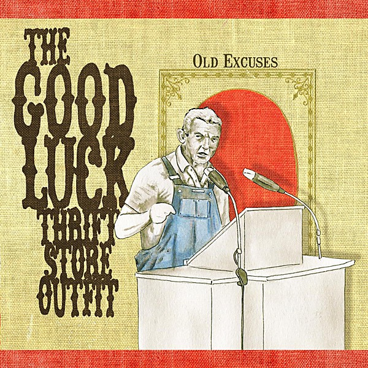

# The Good Luck Thrift Store Outfit

By **The Good Luck Thrift Store Outfit**

## Album Data

- **Catalog:** Beets
- **Format:** Digital, Album
- **Album:** The Good Luck Thrift Store Outfit
- **Artist:** The Good Luck Thrift Store Outfit
- **Albumartist:** The Good Luck Thrift Store Outfit
- **Genre:** Folk Rock
- **MusicBrainz Album Artist ID:** 
- **MusicBrainz Album ID:** 
- **MusicBrainz Release Group ID:** 
- **Year:** 2005
- **Catalog #:** 
- **Label:** 
- **Total Tracks:** 08

## Album Tracks

### Track 01 - Lazy Train

- **Artist:** The Good Luck Thrift Store Outfit
- **Format:** AAC
- **Genre:** Folk Rock
- **Length:** 4:24
- **MusicBrainz Track ID:** 
- **Title:** Lazy Train
- **Track:** 01
- **Year:** 2005

### Track 02 - Shovel

- **Artist:** The Good Luck Thrift Store Outfit
- **Format:** AAC
- **Genre:** Folk Rock
- **Length:** 3:30
- **MusicBrainz Track ID:** 
- **Title:** Shovel
- **Track:** 02
- **Year:** 2005

### Track 03 - Lullaby

- **Artist:** The Good Luck Thrift Store Outfit
- **Format:** AAC
- **Genre:** Folk Rock
- **Length:** 3:52
- **MusicBrainz Track ID:** 
- **Title:** Lullaby
- **Track:** 03
- **Year:** 2005

### Track 04 - Suit

- **Artist:** The Good Luck Thrift Store Outfit
- **Format:** AAC
- **Genre:** Folk Rock
- **Length:** 4:02
- **MusicBrainz Track ID:** 
- **Title:** Suit
- **Track:** 04
- **Year:** 2005

### Track 05 - No No No Yeah

- **Artist:** The Good Luck Thrift Store Outfit
- **Format:** AAC
- **Genre:** Folk Rock
- **Length:** 3:20
- **MusicBrainz Track ID:** 
- **Title:** No No No Yeah
- **Track:** 05
- **Year:** 2005

### Track 06 - Johnny Law

- **Artist:** The Good Luck Thrift Store Outfit
- **Format:** AAC
- **Genre:** Folk Rock
- **Length:** 3:43
- **MusicBrainz Track ID:** 
- **Title:** Johnny Law
- **Track:** 06
- **Year:** 2005

### Track 07 - Off The Cuff

- **Artist:** The Good Luck Thrift Store Outfit
- **Format:** AAC
- **Genre:** Folk Rock
- **Length:** 3:29
- **MusicBrainz Track ID:** 
- **Title:** Off The Cuff
- **Track:** 07
- **Year:** 2005

### Track 08 - Gypsy

- **Artist:** The Good Luck Thrift Store Outfit
- **Format:** AAC
- **Genre:** Folk Rock
- **Length:** 3:22
- **MusicBrainz Track ID:** 
- **Title:** Gypsy
- **Track:** 08
- **Year:** 2005

## See also

- [The Ghost of Good Manners](The_Ghost_of_Good_Manners.md)
- [Roon: The Good Luck Thrift Store Outfit](../../Roon/The_Good_Luck_Thrift_Store_Outfit/The_Good_Luck_Thrift_Store_Outfit.md)
