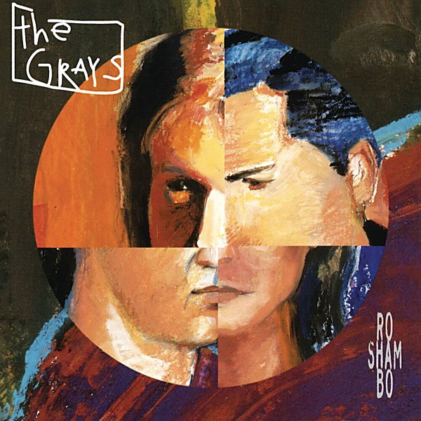

# Ro Sham Bo

By **The Grays**

## Album Data

- **Catalog:** Beets
- **Format:** Digital, Album
- **Album:** Ro Sham Bo
- **Artist:** The Grays
- **Albumartist:** The Grays
- **Genre:** Indie Rock
- **MusicBrainz Album Artist ID:** [ade17a27-9d5b-43cb-b1b3-8ea1f4abde60](https://musicbrainz.org/artist/ade17a27-9d5b-43cb-b1b3-8ea1f4abde60)
- **MusicBrainz Album ID:** [c0f50925-6628-4390-8373-c47b15e50335](https://musicbrainz.org/release/c0f50925-6628-4390-8373-c47b15e50335)
- **MusicBrainz Release Group ID:** [a2b12f06-acdf-30d7-948e-42ab55d35842](https://musicbrainz.org/release-group/a2b12f06-acdf-30d7-948e-42ab55d35842)
- **Year:** 1994
- **Catalog #:** EK 53773
- **Label:** Epic
- **Total Tracks:** 13

## Album Tracks

### Track 01 - Very Best Years

- **Artist:** The Grays
- **Format:** ALAC
- **Genre:** Indie Rock
- **Length:** 3:25
- **MusicBrainz Track ID:** [9e671d7e-3ef7-4214-9e2f-ed898af3f7be](https://musicbrainz.org/recording/9e671d7e-3ef7-4214-9e2f-ed898af3f7be)
- **Title:** Very Best Years
- **Track:** 01
- **Year:** 1994

### Track 02 - Everybody's World

- **Artist:** The Grays
- **Format:** ALAC
- **Genre:** Indie Rock
- **Length:** 5:42
- **MusicBrainz Track ID:** [d2951992-1288-4adb-94dc-087bb4deb716](https://musicbrainz.org/recording/d2951992-1288-4adb-94dc-087bb4deb716)
- **Title:** Everybody's World
- **Track:** 02
- **Year:** 1994

### Track 03 - Same Thing

- **Artist:** The Grays
- **Format:** ALAC
- **Genre:** Indie Rock
- **Length:** 4:01
- **MusicBrainz Track ID:** [4aac9b7c-9dd5-48cf-8aea-747ac69ebba1](https://musicbrainz.org/recording/4aac9b7c-9dd5-48cf-8aea-747ac69ebba1)
- **Title:** Same Thing
- **Track:** 03
- **Year:** 1994

### Track 04 - Friend of Mine

- **Artist:** The Grays
- **Format:** ALAC
- **Genre:** Indie Rock
- **Length:** 5:16
- **MusicBrainz Track ID:** [a3330c10-a7f1-446e-ada7-2dddbd86d3e8](https://musicbrainz.org/recording/a3330c10-a7f1-446e-ada7-2dddbd86d3e8)
- **Title:** Friend of Mine
- **Track:** 04
- **Year:** 1994

### Track 05 - Is It Now Yet

- **Artist:** The Grays
- **Format:** ALAC
- **Genre:** Indie Rock
- **Length:** 4:03
- **MusicBrainz Track ID:** [5f78f911-4ec3-421e-a8bf-8f263ddb00cd](https://musicbrainz.org/recording/5f78f911-4ec3-421e-a8bf-8f263ddb00cd)
- **Title:** Is It Now Yet
- **Track:** 05
- **Year:** 1994

### Track 06 - Oh Well Maybe

- **Artist:** The Grays
- **Format:** ALAC
- **Genre:** Indie Rock
- **Length:** 3:42
- **MusicBrainz Track ID:** [16427268-22fd-4b2a-9243-e747e4e9d9bc](https://musicbrainz.org/recording/16427268-22fd-4b2a-9243-e747e4e9d9bc)
- **Title:** Oh Well Maybe
- **Track:** 06
- **Year:** 1994

### Track 07 - Nothing Between Us

- **Artist:** The Grays
- **Format:** ALAC
- **Genre:** Indie Pop
- **Length:** 3:55
- **MusicBrainz Track ID:** [d8376eb0-a0f5-4b45-bae4-1e9562f9c02d](https://musicbrainz.org/recording/d8376eb0-a0f5-4b45-bae4-1e9562f9c02d)
- **Title:** Nothing Between Us
- **Track:** 07
- **Year:** 1994

### Track 08 - Both Belong

- **Artist:** The Grays
- **Format:** ALAC
- **Genre:** Indie Rock
- **Length:** 4:25
- **MusicBrainz Track ID:** [a26aba2e-7389-463d-a6a7-88a7c3973ada](https://musicbrainz.org/recording/a26aba2e-7389-463d-a6a7-88a7c3973ada)
- **Title:** Both Belong
- **Track:** 08
- **Year:** 1994

### Track 09 - Nothing

- **Artist:** The Grays
- **Format:** ALAC
- **Genre:** Indie Rock
- **Length:** 3:30
- **MusicBrainz Track ID:** [6500b359-052b-48e5-a6e3-f47bf60eb04c](https://musicbrainz.org/recording/6500b359-052b-48e5-a6e3-f47bf60eb04c)
- **Title:** Nothing
- **Track:** 09
- **Year:** 1994

### Track 10 - Not Long for This World

- **Artist:** The Grays
- **Format:** ALAC
- **Genre:** Rock
- **Length:** 4:52
- **MusicBrainz Track ID:** [327b19b6-ccf8-4a91-9c65-ca53b4bb3394](https://musicbrainz.org/recording/327b19b6-ccf8-4a91-9c65-ca53b4bb3394)
- **Title:** Not Long for This World
- **Track:** 10
- **Year:** 1994

### Track 11 - Spooky

- **Artist:** The Grays
- **Format:** ALAC
- **Genre:** Indie Rock
- **Length:** 5:07
- **MusicBrainz Track ID:** [139b7b8a-e534-4f93-84ad-a4db13a5a583](https://musicbrainz.org/recording/139b7b8a-e534-4f93-84ad-a4db13a5a583)
- **Title:** Spooky
- **Track:** 11
- **Year:** 1994

### Track 12 - All You Wanted

- **Artist:** The Grays
- **Format:** ALAC
- **Genre:** Indie Rock
- **Length:** 4:30
- **MusicBrainz Track ID:** [4b39e527-15ef-44db-a70c-467359287ae7](https://musicbrainz.org/recording/4b39e527-15ef-44db-a70c-467359287ae7)
- **Title:** All You Wanted
- **Track:** 12
- **Year:** 1994

### Track 13 - No One Can Hurt Me

- **Artist:** The Grays
- **Format:** ALAC
- **Genre:** Indie Rock
- **Length:** 6:29
- **MusicBrainz Track ID:** [6d8b727f-f6a9-42bf-9d46-6fc9aa434a53](https://musicbrainz.org/recording/6d8b727f-f6a9-42bf-9d46-6fc9aa434a53)
- **Title:** No One Can Hurt Me
- **Track:** 13
- **Year:** 1994

