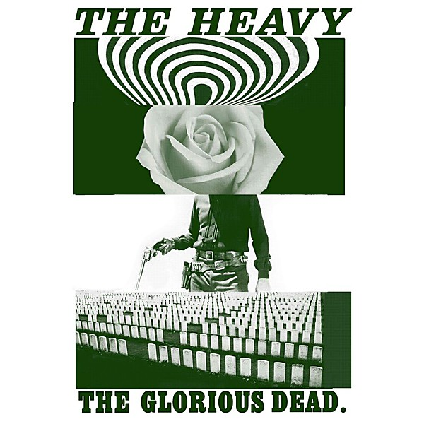

# The Glorious Dead

By **The Heavy**

## Album Data

- **Catalog:** Beets
- **Format:** Digital, Album
- **Album:** The Glorious Dead
- **Artist:** The Heavy
- **Albumartist:** The Heavy
- **Genre:** Indie Rock
- **MusicBrainz Album Artist ID:** [ea99eec5-bd72-4b4f-86e4-54c5a34f7e10](https://musicbrainz.org/artist/ea99eec5-bd72-4b4f-86e4-54c5a34f7e10)
- **MusicBrainz Album ID:** [84e568e9-646e-47bc-a730-992b30cf3e64](https://musicbrainz.org/release/84e568e9-646e-47bc-a730-992b30cf3e64)
- **MusicBrainz Release Group ID:** [6d92af85-7a77-4c13-a05f-8c6ecfba61cc](https://musicbrainz.org/release-group/6d92af85-7a77-4c13-a05f-8c6ecfba61cc)
- **Year:** 2014
- **Catalog #:** 
- **Label:** 
- **Total Tracks:** 10

## Album Tracks

### Track 04 - The Big Bad Wolf

- **Artist:** The Heavy
- **Format:** AAC
- **Genre:** Rockabilly
- **Length:** 3:22
- **MusicBrainz Track ID:** [d117887d-bb23-4b45-92a6-a31bf3b9f348](https://musicbrainz.org/recording/d117887d-bb23-4b45-92a6-a31bf3b9f348)
- **Title:** The Big Bad Wolf
- **Track:** 04
- **Year:** 2012

### Track 09 - Don’t Say Nothing

- **Artist:** The Heavy
- **Format:** AAC
- **Genre:** Indie Rock
- **Length:** 3:38
- **MusicBrainz Track ID:** [da88cf7e-2ab8-4bdd-9f4b-3745738a76e3](https://musicbrainz.org/recording/da88cf7e-2ab8-4bdd-9f4b-3745738a76e3)
- **Title:** Don’t Say Nothing
- **Track:** 09
- **Year:** 2012

## See also

- [The Glorious Dead.](The_Glorious_Dead_2.md)
- [Roon: The Glorious Dead](../../Roon/The_Heavy/The_Glorious_Dead.md)
