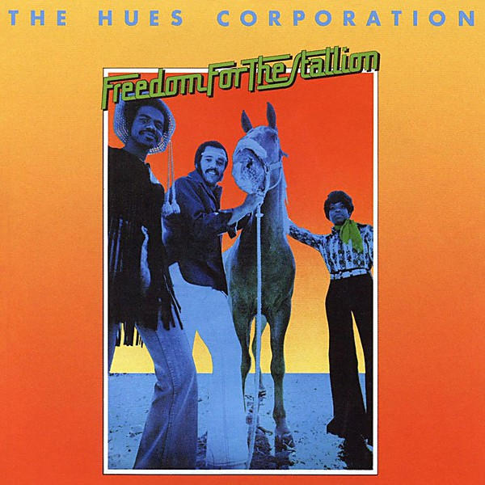

# Freedom for the Stallion

By **The Hues Corporation**

## Album Data

- **Catalog:** Beets
- **Format:** Digital, Album
- **Album:** Freedom for the Stallion
- **Artist:** The Hues Corporation
- **Albumartist:** The Hues Corporation
- **Genre:** Soul
- **MusicBrainz Album Artist ID:** [25bb0299-9c72-4d7e-877d-94ba70822f45](https://musicbrainz.org/artist/25bb0299-9c72-4d7e-877d-94ba70822f45)
- **MusicBrainz Album ID:** [a3926736-e646-40da-98cf-2905433c9153](https://musicbrainz.org/release/a3926736-e646-40da-98cf-2905433c9153)
- **MusicBrainz Release Group ID:** [53cea838-6d39-4093-a006-36f7fabcab6a](https://musicbrainz.org/release-group/53cea838-6d39-4093-a006-36f7fabcab6a)
- **Year:** 1973
- **Catalog #:** APL1-0323
- **Label:** RCA Victor
- **Total Tracks:** 10

## Album Tracks

### Track 01 - Bound on a Reason

- **Artist:** The Hues Corporation
- **Format:** MP3
- **Genre:** Soul
- **Length:** 3:17
- **MusicBrainz Track ID:** [1f78df9e-9fe9-4c88-b348-dd24a875c5dc](https://musicbrainz.org/recording/1f78df9e-9fe9-4c88-b348-dd24a875c5dc)
- **Title:** Bound on a Reason
- **Track:** 01
- **Year:** 1973

### Track 02 - Off My Cloud

- **Artist:** The Hues Corporation
- **Format:** MP3
- **Genre:** Soul
- **Length:** 4:19
- **MusicBrainz Track ID:** [abe4ebdb-faaf-4df3-904d-16997bda33a6](https://musicbrainz.org/recording/abe4ebdb-faaf-4df3-904d-16997bda33a6)
- **Title:** Off My Cloud
- **Track:** 02
- **Year:** 1973

### Track 03 - All Goin' Down Together

- **Artist:** The Hues Corporation
- **Format:** MP3
- **Genre:** Soul
- **Length:** 2:49
- **MusicBrainz Track ID:** [1ea99f6f-23d6-4285-aecb-588657af0e15](https://musicbrainz.org/recording/1ea99f6f-23d6-4285-aecb-588657af0e15)
- **Title:** All Goin' Down Together
- **Track:** 03
- **Year:** 1973

### Track 04 - Rock the Boat

- **Artist:** The Hues Corporation
- **Format:** MP3
- **Genre:** Soul
- **Length:** 3:26
- **MusicBrainz Track ID:** [46905f0e-ce66-4a68-8e66-d5aa0e7940a1](https://musicbrainz.org/recording/46905f0e-ce66-4a68-8e66-d5aa0e7940a1)
- **Title:** Rock the Boat
- **Track:** 04
- **Year:** 1973

### Track 05 - Freedom for the Stallion

- **Artist:** The Hues Corporation
- **Format:** MP3
- **Genre:** Soul
- **Length:** 4:02
- **MusicBrainz Track ID:** [f67a65ee-ed48-44d2-a1fc-fbec32deb428](https://musicbrainz.org/recording/f67a65ee-ed48-44d2-a1fc-fbec32deb428)
- **Title:** Freedom for the Stallion
- **Track:** 05
- **Year:** 1973

### Track 06 - The Family

- **Artist:** The Hues Corporation
- **Format:** MP3
- **Genre:** Soul
- **Length:** 3:12
- **MusicBrainz Track ID:** [9c802392-4c1a-4e28-a15a-dbf34aa19fda](https://musicbrainz.org/recording/9c802392-4c1a-4e28-a15a-dbf34aa19fda)
- **Title:** The Family
- **Track:** 06
- **Year:** 1973

### Track 07 - Go to the Poet

- **Artist:** The Hues Corporation
- **Format:** MP3
- **Genre:** Soul
- **Length:** 2:51
- **MusicBrainz Track ID:** [006362b9-590f-4d9f-9c31-0cc3bc1c63a5](https://musicbrainz.org/recording/006362b9-590f-4d9f-9c31-0cc3bc1c63a5)
- **Title:** Go to the Poet
- **Track:** 07
- **Year:** 1973

### Track 08 - Salvation Lady

- **Artist:** The Hues Corporation
- **Format:** MP3
- **Genre:** Soul
- **Length:** 3:22
- **MusicBrainz Track ID:** [b4a5214a-f928-44f6-8c47-7febf0470da4](https://musicbrainz.org/recording/b4a5214a-f928-44f6-8c47-7febf0470da4)
- **Title:** Salvation Lady
- **Track:** 08
- **Year:** 1973

### Track 09 - Live a Lie

- **Artist:** The Hues Corporation
- **Format:** MP3
- **Genre:** Soul
- **Length:** 2:13
- **MusicBrainz Track ID:** [026acc54-7c34-401a-ae5c-25615a9d370c](https://musicbrainz.org/recording/026acc54-7c34-401a-ae5c-25615a9d370c)
- **Title:** Live a Lie
- **Track:** 09
- **Year:** 1973

### Track 10 - Miracle Maker (Sweet Soul Shaker)

- **Artist:** The Hues Corporation
- **Format:** MP3
- **Genre:** Soul
- **Length:** 3:19
- **MusicBrainz Track ID:** [82bb947f-d247-4243-85e0-9df983d15904](https://musicbrainz.org/recording/82bb947f-d247-4243-85e0-9df983d15904)
- **Title:** Miracle Maker (Sweet Soul Shaker)
- **Track:** 10
- **Year:** 1973

## See also

- [Vinyl: Freedom For The Stallion](../../Vinyl/The_Hues_Corporation/Freedom_For_The_Stallion.md)
- [Vinyl: ](../../Vinyl/The_Hues_Corporation/The_Hues_Corporation.md)
