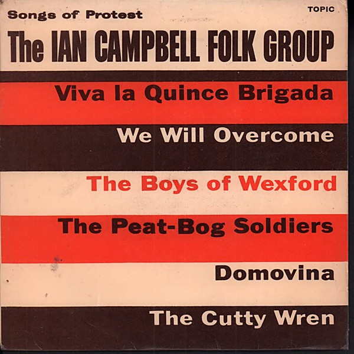

# Songs of Protest

By **The Ian Campbell Folk Group**

## Album Data

- **Catalog:** Beets
- **Format:** Digital, Album
- **Album:** Songs of Protest
- **Artist:** The Ian Campbell Folk Group
- **Albumartist:** The Ian Campbell Folk Group
- **Genre:** Classical
- **MusicBrainz Album Artist ID:** 
- **MusicBrainz Album ID:** 
- **MusicBrainz Release Group ID:** 
- **Year:** 0000
- **Catalog #:** 
- **Label:** 
- **Total Tracks:** 00

## Album Tracks

### Track 01 - Viva la Quince Brigada

- **Artist:** The Ian Campbell Folk Group
- **Format:** AAC
- **Genre:** Classical
- **Length:** 1:57
- **MusicBrainz Track ID:** 
- **Title:** Viva la Quince Brigada
- **Track:** 01
- **Year:** 0000

### Track 02 - We Will Overcome

- **Artist:** The Ian Campbell Folk Group
- **Format:** AAC
- **Genre:** Classical
- **Length:** 2:13
- **MusicBrainz Track ID:** 
- **Title:** We Will Overcome
- **Track:** 02
- **Year:** 0000

### Track 03 - The Boys of Wexford

- **Artist:** The Ian Campbell Folk Group
- **Format:** AAC
- **Genre:** Classical
- **Length:** 2:37
- **MusicBrainz Track ID:** 
- **Title:** The Boys of Wexford
- **Track:** 03
- **Year:** 0000

### Track 04 - The Peat-Bog Soldiers

- **Artist:** The Ian Campbell Folk Group
- **Format:** AAC
- **Genre:** Classical
- **Length:** 1:44
- **MusicBrainz Track ID:** 
- **Title:** The Peat-Bog Soldiers
- **Track:** 04
- **Year:** 0000

### Track 05 - Domovina

- **Artist:** The Ian Campbell Folk Group
- **Format:** AAC
- **Genre:** Classical
- **Length:** 2:16
- **MusicBrainz Track ID:** 
- **Title:** Domovina
- **Track:** 05
- **Year:** 0000

### Track 06 - The Cutty Wren

- **Artist:** The Ian Campbell Folk Group
- **Format:** AAC
- **Genre:** Classical
- **Length:** 2:39
- **MusicBrainz Track ID:** 
- **Title:** The Cutty Wren
- **Track:** 06
- **Year:** 0000

