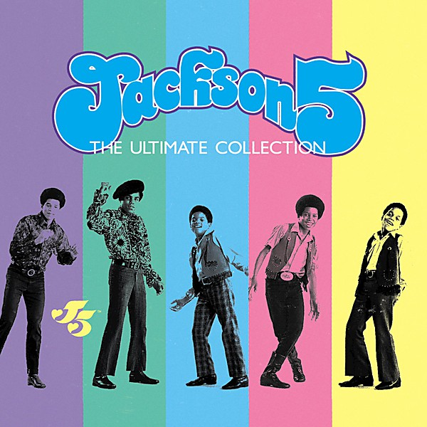

# The Ultimate Collection

By **The Jackson 5**

## Album Data

- **Catalog:** Beets
- **Format:** Digital, Album
- **Album:** The Ultimate Collection
- **Artist:** The Jackson 5
- **Albumartist:** The Jackson 5
- **Genre:** Soul
- **MusicBrainz Album Artist ID:** 
- **MusicBrainz Album ID:** 
- **MusicBrainz Release Group ID:** 
- **Year:** 1995
- **Catalog #:** 
- **Label:** Island
- **Total Tracks:** 00

## Album Tracks

### Track 02 - ABC

- **Artist:** The Jackson 5
- **Format:** MP3
- **Genre:** Soul
- **Length:** 2:52
- **MusicBrainz Track ID:** 
- **Title:** ABC
- **Track:** 02
- **Year:** 1995

### Track 04 - I'll Be There

- **Artist:** The Jackson 5
- **Format:** AAC
- **Genre:** Soul
- **Length:** 3:59
- **MusicBrainz Track ID:** 
- **Title:** I'll Be There
- **Track:** 04
- **Year:** 1995

