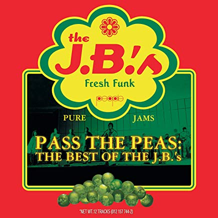

# Pass the Peas

By **The J.B.’s**

## Album Data

- **Catalog:** Beets
- **Format:** Digital, Album
- **Album:** Pass the Peas
- **Artist:** The J.b.’s
- **Albumartist:** The J.B.’s
- **Genre:** Unknown
- **MusicBrainz Album Artist ID:** [cb6a2948-7b9b-4a15-8c71-2b79cc76408e](https://musicbrainz.org/artist/cb6a2948-7b9b-4a15-8c71-2b79cc76408e)
- **MusicBrainz Album ID:** [00d69515-3bbd-4b31-9adb-87e9dd15320e](https://musicbrainz.org/release/00d69515-3bbd-4b31-9adb-87e9dd15320e)
- **MusicBrainz Release Group ID:** [626da37b-55d5-33cb-b7b9-87ed2fee2e7a](https://musicbrainz.org/release-group/626da37b-55d5-33cb-b7b9-87ed2fee2e7a)
- **Year:** 2000
- **Catalog #:** 012 157 744-2
- **Label:** Polydor
- **Total Tracks:** 12

## Album Tracks

### Track 01 - Doing It to Death, Part 1

- **Artist:** The J.B.’s
- **Format:** ALAC
- **Genre:** Unknown
- **Length:** 5:06
- **MusicBrainz Track ID:** [f5ed2c6f-8ac1-4ccf-badb-73d2f88d0722](https://musicbrainz.org/recording/f5ed2c6f-8ac1-4ccf-badb-73d2f88d0722)
- **Title:** Doing It to Death, Part 1
- **Track:** 01
- **Year:** 2000

### Track 02 - Hot Pants Road

- **Artist:** The J.B.’s
- **Format:** ALAC
- **Genre:** Unknown
- **Length:** 2:44
- **MusicBrainz Track ID:** [c154de54-d905-4c3c-a936-73949949b689](https://musicbrainz.org/recording/c154de54-d905-4c3c-a936-73949949b689)
- **Title:** Hot Pants Road
- **Track:** 02
- **Year:** 2000

### Track 03 - Pass the Peas

- **Artist:** The J.B.’s
- **Format:** ALAC
- **Genre:** Unknown
- **Length:** 3:30
- **MusicBrainz Track ID:** [09195603-8527-434b-9790-ce7eb123cde9](https://musicbrainz.org/recording/09195603-8527-434b-9790-ce7eb123cde9)
- **Title:** Pass the Peas
- **Track:** 03
- **Year:** 2000

### Track 04 - Gimme Some More

- **Artist:** The J.B.’s
- **Format:** ALAC
- **Genre:** Unknown
- **Length:** 3:05
- **MusicBrainz Track ID:** [95299519-b5ea-4714-95c8-fbfe697e3a02](https://musicbrainz.org/recording/95299519-b5ea-4714-95c8-fbfe697e3a02)
- **Title:** Gimme Some More
- **Track:** 04
- **Year:** 2000

### Track 05 - Blow Your Head

- **Artist:** The J.B.’s
- **Format:** ALAC
- **Genre:** Unknown
- **Length:** 4:43
- **MusicBrainz Track ID:** [b721cf22-3352-4d6c-a364-34b943b861b7](https://musicbrainz.org/recording/b721cf22-3352-4d6c-a364-34b943b861b7)
- **Title:** Blow Your Head
- **Track:** 05
- **Year:** 2000

### Track 06 - The Grunt, Part 1

- **Artist:** The J.B.’s
- **Format:** ALAC
- **Genre:** Unknown
- **Length:** 2:49
- **MusicBrainz Track ID:** [f495d2ff-67f3-4321-b46f-0d08cda8b598](https://musicbrainz.org/recording/f495d2ff-67f3-4321-b46f-0d08cda8b598)
- **Title:** The Grunt, Part 1
- **Track:** 06
- **Year:** 2000

### Track 07 - Givin' Up Food for Funk, Part 1

- **Artist:** The J.B.’s
- **Format:** ALAC
- **Genre:** Unknown
- **Length:** 3:08
- **MusicBrainz Track ID:** [facb616a-19b1-4c86-b74f-55454ba35a0a](https://musicbrainz.org/recording/facb616a-19b1-4c86-b74f-55454ba35a0a)
- **Title:** Givin' Up Food for Funk, Part 1
- **Track:** 07
- **Year:** 2000

### Track 08 - Same Beat, Part 1

- **Artist:** The J.B.’s
- **Format:** ALAC
- **Genre:** Unknown
- **Length:** 3:21
- **MusicBrainz Track ID:** [fd673146-a123-4d92-b9e8-313c8638d242](https://musicbrainz.org/recording/fd673146-a123-4d92-b9e8-313c8638d242)
- **Title:** Same Beat, Part 1
- **Track:** 08
- **Year:** 2000

### Track 09 - Damn Right, I Am Somebody, Part 1 (7" single mix)

- **Artist:** The J.B.’s
- **Format:** ALAC
- **Genre:** Unknown
- **Length:** 3:32
- **MusicBrainz Track ID:** [28bed998-dc70-416e-ae6c-a04fb9fbd10a](https://musicbrainz.org/recording/28bed998-dc70-416e-ae6c-a04fb9fbd10a)
- **Title:** Damn Right, I Am Somebody, Part 1 (7" single mix)
- **Track:** 09
- **Year:** 2000

### Track 10 - Breakin' Bread

- **Artist:** The J.B.’s
- **Format:** ALAC
- **Genre:** Unknown
- **Length:** 4:21
- **MusicBrainz Track ID:** [022ba890-8b7a-434c-87dd-1b10c979c644](https://musicbrainz.org/recording/022ba890-8b7a-434c-87dd-1b10c979c644)
- **Title:** Breakin' Bread
- **Track:** 10
- **Year:** 2000

### Track 11 - (It's Not the Express) It's the J.B.'s Monaurail, Parts 1 & 2

- **Artist:** The J.B.’s
- **Format:** ALAC
- **Genre:** Unknown
- **Length:** 8:16
- **MusicBrainz Track ID:** [8d1ef1a7-fb65-4091-a456-5cc3fa6b31d0](https://musicbrainz.org/recording/8d1ef1a7-fb65-4091-a456-5cc3fa6b31d0)
- **Title:** (It's Not the Express) It's the J.B.'s Monaurail, Parts 1 & 2
- **Track:** 11
- **Year:** 2000

### Track 12 - If You Don't Get It the First Time, Back Up and Try It Again, Party

- **Artist:** The J.B.’s
- **Format:** ALAC
- **Genre:** Unknown
- **Length:** 3:33
- **MusicBrainz Track ID:** [dcc7bfc7-11c9-4075-9a66-5e3598258eec](https://musicbrainz.org/recording/dcc7bfc7-11c9-4075-9a66-5e3598258eec)
- **Title:** If You Don't Get It the First Time, Back Up and Try It Again, Party
- **Track:** 12
- **Year:** 2000

