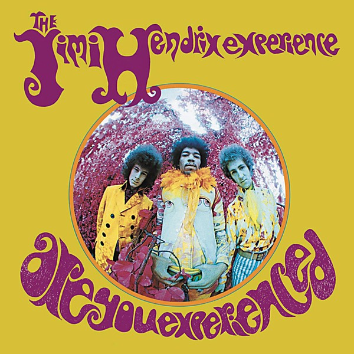

# Are You Experienced

By **The Jimi Hendrix Experience**

## Album Data

- **Catalog:** Beets
- **Format:** Digital, Album
- **Album:** Are You Experienced
- **Artist:** The Jimi Hendrix Experience
- **Albumartist:** The Jimi Hendrix Experience
- **Genre:** Acid Rock
- **MusicBrainz Album Artist ID:** [33b3c323-77c2-417c-a5b4-af7e6a111cc9](https://musicbrainz.org/artist/33b3c323-77c2-417c-a5b4-af7e6a111cc9)
- **MusicBrainz Album ID:** [60a8a8eb-127b-4ae2-abeb-c850994f1dd6](https://musicbrainz.org/release/60a8a8eb-127b-4ae2-abeb-c850994f1dd6)
- **MusicBrainz Release Group ID:** [da40e720-2097-3730-8a7f-0c2ddbff4a96](https://musicbrainz.org/release-group/da40e720-2097-3730-8a7f-0c2ddbff4a96)
- **Year:** 2010
- **Catalog #:** 
- **Label:** Legacy
- **Total Tracks:** 13

## Album Tracks

### Track 01 - EXP

- **Artist:** The Jimi Hendrix Experience
- **Format:** AAC
- **Genre:** Acid Rock
- **Length:** 1:55
- **MusicBrainz Track ID:** [45efc6c9-3272-49ac-b53e-5c2adf63ee85](https://musicbrainz.org/recording/45efc6c9-3272-49ac-b53e-5c2adf63ee85)
- **Title:** EXP
- **Track:** 01
- **Year:** 2010

### Track 01 - EXP

- **Artist:** The Jimi Hendrix Experience
- **Format:** ALAC
- **Genre:** Acid Rock
- **Length:** 1:54
- **MusicBrainz Track ID:** [45efc6c9-3272-49ac-b53e-5c2adf63ee85](https://musicbrainz.org/recording/45efc6c9-3272-49ac-b53e-5c2adf63ee85)
- **Title:** EXP
- **Track:** 01
- **Year:** 2010

### Track 02 - Up From the Skies

- **Artist:** The Jimi Hendrix Experience
- **Format:** AAC
- **Genre:** Acid Rock
- **Length:** 2:57
- **MusicBrainz Track ID:** [405f1c92-4431-45f0-9cee-c6a186b5e62d](https://musicbrainz.org/recording/405f1c92-4431-45f0-9cee-c6a186b5e62d)
- **Title:** Up From the Skies
- **Track:** 02
- **Year:** 2010

### Track 02 - Up From the Skies

- **Artist:** The Jimi Hendrix Experience
- **Format:** ALAC
- **Genre:** Acid Rock
- **Length:** 2:57
- **MusicBrainz Track ID:** [405f1c92-4431-45f0-9cee-c6a186b5e62d](https://musicbrainz.org/recording/405f1c92-4431-45f0-9cee-c6a186b5e62d)
- **Title:** Up From the Skies
- **Track:** 02
- **Year:** 2010

### Track 03 - Spanish Castle Magic

- **Artist:** The Jimi Hendrix Experience
- **Format:** AAC
- **Genre:** Acid Rock
- **Length:** 3:03
- **MusicBrainz Track ID:** [a4d7cb45-2f1e-48d9-b57a-f287ab083bb2](https://musicbrainz.org/recording/a4d7cb45-2f1e-48d9-b57a-f287ab083bb2)
- **Title:** Spanish Castle Magic
- **Track:** 03
- **Year:** 2010

### Track 03 - Spanish Castle Magic

- **Artist:** The Jimi Hendrix Experience
- **Format:** ALAC
- **Genre:** Acid Rock
- **Length:** 3:05
- **MusicBrainz Track ID:** [a4d7cb45-2f1e-48d9-b57a-f287ab083bb2](https://musicbrainz.org/recording/a4d7cb45-2f1e-48d9-b57a-f287ab083bb2)
- **Title:** Spanish Castle Magic
- **Track:** 03
- **Year:** 2010

### Track 04 - Wait Until Tomorrow

- **Artist:** The Jimi Hendrix Experience
- **Format:** AAC
- **Genre:** Acid Rock
- **Length:** 3:02
- **MusicBrainz Track ID:** [a7a8ef26-3ee4-4d66-a8f8-1648aad8d46a](https://musicbrainz.org/recording/a7a8ef26-3ee4-4d66-a8f8-1648aad8d46a)
- **Title:** Wait Until Tomorrow
- **Track:** 04
- **Year:** 2010

### Track 04 - Wait Until Tomorrow

- **Artist:** The Jimi Hendrix Experience
- **Format:** ALAC
- **Genre:** Acid Rock
- **Length:** 3:01
- **MusicBrainz Track ID:** [a7a8ef26-3ee4-4d66-a8f8-1648aad8d46a](https://musicbrainz.org/recording/a7a8ef26-3ee4-4d66-a8f8-1648aad8d46a)
- **Title:** Wait Until Tomorrow
- **Track:** 04
- **Year:** 2010

### Track 05 - Ain’t No Telling

- **Artist:** The Jimi Hendrix Experience
- **Format:** AAC
- **Genre:** Acid Rock
- **Length:** 1:48
- **MusicBrainz Track ID:** [6bcb6dc3-3b7c-4135-9a35-1178eee09580](https://musicbrainz.org/recording/6bcb6dc3-3b7c-4135-9a35-1178eee09580)
- **Title:** Ain’t No Telling
- **Track:** 05
- **Year:** 2010

### Track 05 - Ain’t No Telling

- **Artist:** The Jimi Hendrix Experience
- **Format:** ALAC
- **Genre:** Acid Rock
- **Length:** 1:49
- **MusicBrainz Track ID:** [6bcb6dc3-3b7c-4135-9a35-1178eee09580](https://musicbrainz.org/recording/6bcb6dc3-3b7c-4135-9a35-1178eee09580)
- **Title:** Ain’t No Telling
- **Track:** 05
- **Year:** 2010

### Track 06 - Little Wing

- **Artist:** The Jimi Hendrix Experience
- **Format:** AAC
- **Genre:** Psychedelic Rock
- **Length:** 2:25
- **MusicBrainz Track ID:** [81ac2072-1331-4241-bac3-8e71afeff32e](https://musicbrainz.org/recording/81ac2072-1331-4241-bac3-8e71afeff32e)
- **Title:** Little Wing
- **Track:** 06
- **Year:** 2010

### Track 06 - Little Wing

- **Artist:** The Jimi Hendrix Experience
- **Format:** ALAC
- **Genre:** Psychedelic Rock
- **Length:** 2:27
- **MusicBrainz Track ID:** [81ac2072-1331-4241-bac3-8e71afeff32e](https://musicbrainz.org/recording/81ac2072-1331-4241-bac3-8e71afeff32e)
- **Title:** Little Wing
- **Track:** 06
- **Year:** 2010

### Track 07 - If 6 Was 9

- **Artist:** The Jimi Hendrix Experience
- **Format:** AAC
- **Genre:** Acid Rock
- **Length:** 5:34
- **MusicBrainz Track ID:** [2f3136df-db80-4474-86d4-c92886420ffd](https://musicbrainz.org/recording/2f3136df-db80-4474-86d4-c92886420ffd)
- **Title:** If 6 Was 9
- **Track:** 07
- **Year:** 2010

### Track 07 - If 6 Was 9

- **Artist:** The Jimi Hendrix Experience
- **Format:** ALAC
- **Genre:** Acid Rock
- **Length:** 5:33
- **MusicBrainz Track ID:** [2f3136df-db80-4474-86d4-c92886420ffd](https://musicbrainz.org/recording/2f3136df-db80-4474-86d4-c92886420ffd)
- **Title:** If 6 Was 9
- **Track:** 07
- **Year:** 2010

### Track 08 - You Got Me Floatin’

- **Artist:** The Jimi Hendrix Experience
- **Format:** AAC
- **Genre:** Acid Rock
- **Length:** 2:48
- **MusicBrainz Track ID:** [522e0f19-ac58-43ea-9d0f-d0a145927f61](https://musicbrainz.org/recording/522e0f19-ac58-43ea-9d0f-d0a145927f61)
- **Title:** You Got Me Floatin’
- **Track:** 08
- **Year:** 2010

### Track 08 - You Got Me Floatin’

- **Artist:** The Jimi Hendrix Experience
- **Format:** ALAC
- **Genre:** Acid Rock
- **Length:** 2:47
- **MusicBrainz Track ID:** [522e0f19-ac58-43ea-9d0f-d0a145927f61](https://musicbrainz.org/recording/522e0f19-ac58-43ea-9d0f-d0a145927f61)
- **Title:** You Got Me Floatin’
- **Track:** 08
- **Year:** 2010

### Track 09 - Castles Made of Sand

- **Artist:** The Jimi Hendrix Experience
- **Format:** AAC
- **Genre:** Acid Rock
- **Length:** 2:46
- **MusicBrainz Track ID:** [a2e6fc78-f605-4e94-b22c-37c191a347c0](https://musicbrainz.org/recording/a2e6fc78-f605-4e94-b22c-37c191a347c0)
- **Title:** Castles Made of Sand
- **Track:** 09
- **Year:** 2010

### Track 09 - Castles Made of Sand

- **Artist:** The Jimi Hendrix Experience
- **Format:** ALAC
- **Genre:** Acid Rock
- **Length:** 2:46
- **MusicBrainz Track ID:** [a2e6fc78-f605-4e94-b22c-37c191a347c0](https://musicbrainz.org/recording/a2e6fc78-f605-4e94-b22c-37c191a347c0)
- **Title:** Castles Made of Sand
- **Track:** 09
- **Year:** 2010

### Track 10 - She’s So Fine

- **Artist:** The Jimi Hendrix Experience
- **Format:** AAC
- **Genre:** Acid Rock
- **Length:** 2:38
- **MusicBrainz Track ID:** [469ac100-4e16-4a43-ba8a-19dcb24b479e](https://musicbrainz.org/recording/469ac100-4e16-4a43-ba8a-19dcb24b479e)
- **Title:** She’s So Fine
- **Track:** 10
- **Year:** 2010

### Track 10 - She’s So Fine

- **Artist:** The Jimi Hendrix Experience
- **Format:** ALAC
- **Genre:** Acid Rock
- **Length:** 2:39
- **MusicBrainz Track ID:** [469ac100-4e16-4a43-ba8a-19dcb24b479e](https://musicbrainz.org/recording/469ac100-4e16-4a43-ba8a-19dcb24b479e)
- **Title:** She’s So Fine
- **Track:** 10
- **Year:** 2010

### Track 11 - One Rainy Wish

- **Artist:** The Jimi Hendrix Experience
- **Format:** AAC
- **Genre:** Acid Rock
- **Length:** 3:41
- **MusicBrainz Track ID:** [6f8c0252-259a-419c-bf58-226969d690f3](https://musicbrainz.org/recording/6f8c0252-259a-419c-bf58-226969d690f3)
- **Title:** One Rainy Wish
- **Track:** 11
- **Year:** 2010

### Track 11 - One Rainy Wish

- **Artist:** The Jimi Hendrix Experience
- **Format:** ALAC
- **Genre:** Acid Rock
- **Length:** 3:42
- **MusicBrainz Track ID:** [6f8c0252-259a-419c-bf58-226969d690f3](https://musicbrainz.org/recording/6f8c0252-259a-419c-bf58-226969d690f3)
- **Title:** One Rainy Wish
- **Track:** 11
- **Year:** 2010

### Track 12 - Little Miss Lover

- **Artist:** The Jimi Hendrix Experience
- **Format:** AAC
- **Genre:** Acid Rock
- **Length:** 2:21
- **MusicBrainz Track ID:** [359415a8-e758-4a2b-9907-4e5995613dda](https://musicbrainz.org/recording/359415a8-e758-4a2b-9907-4e5995613dda)
- **Title:** Little Miss Lover
- **Track:** 12
- **Year:** 2010

### Track 12 - Little Miss Lover

- **Artist:** The Jimi Hendrix Experience
- **Format:** ALAC
- **Genre:** Acid Rock
- **Length:** 2:23
- **MusicBrainz Track ID:** [359415a8-e758-4a2b-9907-4e5995613dda](https://musicbrainz.org/recording/359415a8-e758-4a2b-9907-4e5995613dda)
- **Title:** Little Miss Lover
- **Track:** 12
- **Year:** 2010

### Track 13 - Bold as Love

- **Artist:** The Jimi Hendrix Experience
- **Format:** AAC
- **Genre:** Acid Rock
- **Length:** 4:11
- **MusicBrainz Track ID:** [f9803b28-cfd3-4130-b18e-8ae0b3b503aa](https://musicbrainz.org/recording/f9803b28-cfd3-4130-b18e-8ae0b3b503aa)
- **Title:** Bold as Love
- **Track:** 13
- **Year:** 2010

### Track 13 - Bold as Love

- **Artist:** The Jimi Hendrix Experience
- **Format:** ALAC
- **Genre:** Acid Rock
- **Length:** 4:12
- **MusicBrainz Track ID:** [f9803b28-cfd3-4130-b18e-8ae0b3b503aa](https://musicbrainz.org/recording/f9803b28-cfd3-4130-b18e-8ae0b3b503aa)
- **Title:** Bold as Love
- **Track:** 13
- **Year:** 2010

## See also

- [Are You Experienced?](Are_You_Experienced_2.md)
- [Axis](Axis.md)
- [Electric Ladyland](Electric_Ladyland.md)
- [CD: Electric Ladyland](../../CD/The_Jimi_Hendrix_Experience/Electric_Ladyland.md)
- [CD: ](../../CD/The_Jimi_Hendrix_Experience/The_Jimi_Hendrix_Experience.md)
- [Roon: Are You Experienced](../../Roon/The_Jimi_Hendrix_Experience/Are_You_Experienced.md)
- [Roon: Axis](../../Roon/The_Jimi_Hendrix_Experience/Axis-_Bold_As_Love.md)
- [Vinyl: Are You Experienced](../../Vinyl/The_Jimi_Hendrix_Experience/Are_You_Experienced.md)
- [Vinyl: ](../../Vinyl/The_Jimi_Hendrix_Experience/The_Jimi_Hendrix_Experience.md)
