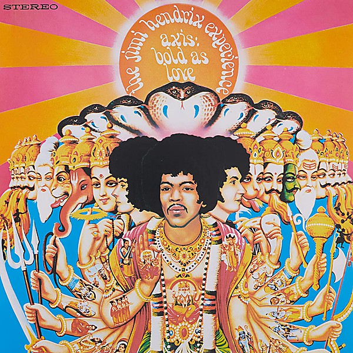

# Axis

By **The Jimi Hendrix Experience**

## Album Data

- **Catalog:** Beets
- **Format:** Digital, Album
- **Album:** Axis
- **Artist:** The Jimi Hendrix Experience
- **Albumartist:** The Jimi Hendrix Experience
- **Genre:** Acid Rock
- **MusicBrainz Album Artist ID:** [33b3c323-77c2-417c-a5b4-af7e6a111cc9](https://musicbrainz.org/artist/33b3c323-77c2-417c-a5b4-af7e6a111cc9)
- **MusicBrainz Album ID:** [499fad7c-e18d-4c1a-afc2-bf7f04c41166](https://musicbrainz.org/release/499fad7c-e18d-4c1a-afc2-bf7f04c41166)
- **MusicBrainz Release Group ID:** [d0b1e21e-cef6-4575-8d92-1afea1894ca3](https://musicbrainz.org/release-group/d0b1e21e-cef6-4575-8d92-1afea1894ca3)
- **Year:** 2010
- **Catalog #:** 6307-2
- **Label:** Reprise Records
- **Total Tracks:** 16

## Album Tracks

### Track 01 - …And the Gods Made Love

- **Artist:** The Jimi Hendrix Experience
- **Format:** AAC
- **Genre:** Acid Rock
- **Length:** 1:22
- **MusicBrainz Track ID:** [88b57468-8d58-4310-b135-c94620fcfbc1](https://musicbrainz.org/recording/88b57468-8d58-4310-b135-c94620fcfbc1)
- **Title:** …And the Gods Made Love
- **Track:** 01
- **Year:** 1987

### Track 02 - Have You Ever Been (to Electric Ladyland)

- **Artist:** The Jimi Hendrix Experience
- **Format:** AAC
- **Genre:** Acid Rock
- **Length:** 2:08
- **MusicBrainz Track ID:** [dcaa3820-d54d-4a56-84b3-dc1a522b39b2](https://musicbrainz.org/recording/dcaa3820-d54d-4a56-84b3-dc1a522b39b2)
- **Title:** Have You Ever Been (to Electric Ladyland)
- **Track:** 02
- **Year:** 1987

### Track 03 - Crosstown Traffic

- **Artist:** The Jimi Hendrix Experience
- **Format:** AAC
- **Genre:** Acid Rock
- **Length:** 2:24
- **MusicBrainz Track ID:** [c55b2151-ef21-4b45-8881-3be916abd106](https://musicbrainz.org/recording/c55b2151-ef21-4b45-8881-3be916abd106)
- **Title:** Crosstown Traffic
- **Track:** 03
- **Year:** 1987

### Track 04 - Voodoo Chile

- **Artist:** The Jimi Hendrix Experience
- **Format:** AAC
- **Genre:** Acid Rock
- **Length:** 15:00
- **MusicBrainz Track ID:** [e5b65ee1-cb21-4092-a939-7013b933c9dd](https://musicbrainz.org/recording/e5b65ee1-cb21-4092-a939-7013b933c9dd)
- **Title:** Voodoo Chile
- **Track:** 04
- **Year:** 1987

### Track 05 - Little Miss Strange

- **Artist:** The Jimi Hendrix Experience
- **Format:** AAC
- **Genre:** Acid Rock
- **Length:** 2:52
- **MusicBrainz Track ID:** [61a1f813-acf9-489d-8480-ff8f021c64a7](https://musicbrainz.org/recording/61a1f813-acf9-489d-8480-ff8f021c64a7)
- **Title:** Little Miss Strange
- **Track:** 05
- **Year:** 1987

### Track 06 - Long Hot Summer Night

- **Artist:** The Jimi Hendrix Experience
- **Format:** AAC
- **Genre:** Acid Rock
- **Length:** 3:27
- **MusicBrainz Track ID:** [716a5442-1d2b-4118-ac80-2f8a90506e65](https://musicbrainz.org/recording/716a5442-1d2b-4118-ac80-2f8a90506e65)
- **Title:** Long Hot Summer Night
- **Track:** 06
- **Year:** 1987

### Track 07 - Come On (Let the Good Times Roll)

- **Artist:** The Jimi Hendrix Experience
- **Format:** AAC
- **Genre:** Acid Rock
- **Length:** 4:09
- **MusicBrainz Track ID:** [2ec8706d-6315-49c0-b23d-f463f2fcc809](https://musicbrainz.org/recording/2ec8706d-6315-49c0-b23d-f463f2fcc809)
- **Title:** Come On (Let the Good Times Roll)
- **Track:** 07
- **Year:** 1987

### Track 08 - Gypsy Eyes

- **Artist:** The Jimi Hendrix Experience
- **Format:** AAC
- **Genre:** Acid Rock
- **Length:** 3:45
- **MusicBrainz Track ID:** [073ccb86-8594-463a-af18-7517a7c239dc](https://musicbrainz.org/recording/073ccb86-8594-463a-af18-7517a7c239dc)
- **Title:** Gypsy Eyes
- **Track:** 08
- **Year:** 1987

### Track 09 - Burning of the Midnight Lamp

- **Artist:** The Jimi Hendrix Experience
- **Format:** AAC
- **Genre:** Acid Rock
- **Length:** 3:39
- **MusicBrainz Track ID:** [0ff2553f-1936-43ad-ab75-8de4a50bbfcf](https://musicbrainz.org/recording/0ff2553f-1936-43ad-ab75-8de4a50bbfcf)
- **Title:** Burning of the Midnight Lamp
- **Track:** 09
- **Year:** 1987

### Track 10 - Rainy Day, Dream Away

- **Artist:** The Jimi Hendrix Experience
- **Format:** AAC
- **Genre:** Acid Rock
- **Length:** 3:40
- **MusicBrainz Track ID:** [e81e735d-81f8-4df7-a84f-ad31722b5a95](https://musicbrainz.org/recording/e81e735d-81f8-4df7-a84f-ad31722b5a95)
- **Title:** Rainy Day, Dream Away
- **Track:** 10
- **Year:** 1987

### Track 11 - 1983…(A Merman I Should Turn to Be)

- **Artist:** The Jimi Hendrix Experience
- **Format:** AAC
- **Genre:** Acid Rock
- **Length:** 5:48
- **MusicBrainz Track ID:** [15575d47-6958-4af8-9ecc-6ae5b8249475](https://musicbrainz.org/recording/15575d47-6958-4af8-9ecc-6ae5b8249475)
- **Title:** 1983…(A Merman I Should Turn to Be)
- **Track:** 11
- **Year:** 1987

### Track 12 - Moon, Turn the Tides…gently gently away

- **Artist:** The Jimi Hendrix Experience
- **Format:** AAC
- **Genre:** Acid Rock
- **Length:** 8:53
- **MusicBrainz Track ID:** [4c71c66b-de9b-4265-9494-f2c44c032596](https://musicbrainz.org/recording/4c71c66b-de9b-4265-9494-f2c44c032596)
- **Title:** Moon, Turn the Tides…gently gently away
- **Track:** 12
- **Year:** 1987

### Track 13 - Still Raining, Still Dreaming

- **Artist:** The Jimi Hendrix Experience
- **Format:** AAC
- **Genre:** Acid Rock
- **Length:** 4:26
- **MusicBrainz Track ID:** [c242121f-ec71-465e-916e-156e5e6b6ed9](https://musicbrainz.org/recording/c242121f-ec71-465e-916e-156e5e6b6ed9)
- **Title:** Still Raining, Still Dreaming
- **Track:** 13
- **Year:** 1987

### Track 14 - House Burning Down

- **Artist:** The Jimi Hendrix Experience
- **Format:** AAC
- **Genre:** Acid Rock
- **Length:** 4:32
- **MusicBrainz Track ID:** [a1da41dc-7884-4183-a71a-020a0b08218b](https://musicbrainz.org/recording/a1da41dc-7884-4183-a71a-020a0b08218b)
- **Title:** House Burning Down
- **Track:** 14
- **Year:** 1987

### Track 15 - All Along the Watchtower

- **Artist:** The Jimi Hendrix Experience
- **Format:** AAC
- **Genre:** Acid Rock
- **Length:** 4:01
- **MusicBrainz Track ID:** [44f896ea-fba6-4471-b85b-1f3206893c7d](https://musicbrainz.org/recording/44f896ea-fba6-4471-b85b-1f3206893c7d)
- **Title:** All Along the Watchtower
- **Track:** 15
- **Year:** 1987

### Track 16 - Voodoo Child (slight return)

- **Artist:** The Jimi Hendrix Experience
- **Format:** AAC
- **Genre:** Acid Rock
- **Length:** 5:11
- **MusicBrainz Track ID:** [78b533ab-79f0-4ba9-9b9f-ba1654332b88](https://musicbrainz.org/recording/78b533ab-79f0-4ba9-9b9f-ba1654332b88)
- **Title:** Voodoo Child (slight return)
- **Track:** 16
- **Year:** 1987

## See also

- [Are You Experienced?](Are_You_Experienced_2.md)
- [Are You Experienced](Are_You_Experienced.md)
- [Electric Ladyland](Electric_Ladyland.md)
- [CD: Electric Ladyland](../../CD/The_Jimi_Hendrix_Experience/Electric_Ladyland.md)
- [CD: ](../../CD/The_Jimi_Hendrix_Experience/The_Jimi_Hendrix_Experience.md)
- [Roon: Are You Experienced](../../Roon/The_Jimi_Hendrix_Experience/Are_You_Experienced.md)
- [Roon: Axis](../../Roon/The_Jimi_Hendrix_Experience/Axis-_Bold_As_Love.md)
- [Vinyl: Are You Experienced](../../Vinyl/The_Jimi_Hendrix_Experience/Are_You_Experienced.md)
- [Vinyl: ](../../Vinyl/The_Jimi_Hendrix_Experience/The_Jimi_Hendrix_Experience.md)
