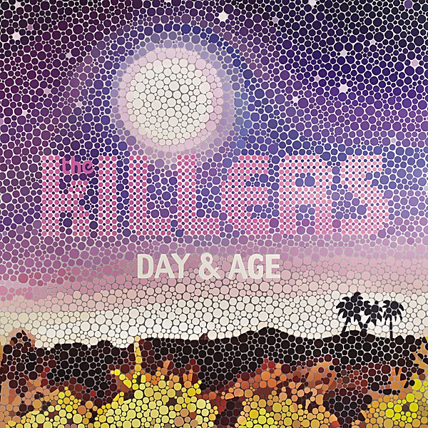

# Day & Age

By **The Killers**

## Album Data

- **Catalog:** Beets
- **Format:** Digital, Album
- **Album:** Day & Age
- **Artist:** The Killers
- **Albumartist:** The Killers
- **Genre:** Indie Rock
- **MusicBrainz Album Artist ID:** [95e1ead9-4d31-4808-a7ac-32c3614c116b](https://musicbrainz.org/artist/95e1ead9-4d31-4808-a7ac-32c3614c116b)
- **MusicBrainz Album ID:** [1d144fb7-d1d3-4123-8484-49c1213e6fcf](https://musicbrainz.org/release/1d144fb7-d1d3-4123-8484-49c1213e6fcf)
- **MusicBrainz Release Group ID:** [485b458c-7b4f-38c4-a113-aa4ea29c3d6d](https://musicbrainz.org/release-group/485b458c-7b4f-38c4-a113-aa4ea29c3d6d)
- **Year:** 2008
- **Catalog #:** B0002468-02 IN02
- **Label:** Island
- **Total Tracks:** 11

## Album Tracks

### Track 01 - Jenny Was a Friend of Mine

- **Artist:** The Killers
- **Format:** ALAC
- **Genre:** Indie Rock
- **Length:** 4:04
- **MusicBrainz Track ID:** [46909ba9-46c7-461e-a2ef-280eacd550e4](https://musicbrainz.org/recording/46909ba9-46c7-461e-a2ef-280eacd550e4)
- **Title:** Jenny Was a Friend of Mine
- **Track:** 01
- **Year:** 2004

### Track 02 - Mr. Brightside

- **Artist:** The Killers
- **Format:** ALAC
- **Genre:** Indie Rock
- **Length:** 3:42
- **MusicBrainz Track ID:** [560062d0-e122-46be-9d89-0f3b44077fdf](https://musicbrainz.org/recording/560062d0-e122-46be-9d89-0f3b44077fdf)
- **Title:** Mr. Brightside
- **Track:** 02
- **Year:** 2004

### Track 03 - Smile Like You Mean It

- **Artist:** The Killers
- **Format:** ALAC
- **Genre:** Indie Rock
- **Length:** 3:54
- **MusicBrainz Track ID:** [4381732e-4db2-4ed3-8151-e889f5118b34](https://musicbrainz.org/recording/4381732e-4db2-4ed3-8151-e889f5118b34)
- **Title:** Smile Like You Mean It
- **Track:** 03
- **Year:** 2004

### Track 04 - Somebody Told Me

- **Artist:** The Killers
- **Format:** ALAC
- **Genre:** Indie Rock
- **Length:** 3:17
- **MusicBrainz Track ID:** [45024040-a343-4141-9bc9-27ef0cc9163d](https://musicbrainz.org/recording/45024040-a343-4141-9bc9-27ef0cc9163d)
- **Title:** Somebody Told Me
- **Track:** 04
- **Year:** 2004

### Track 05 - All These Things That I’ve Done

- **Artist:** The Killers
- **Format:** ALAC
- **Genre:** Indie Rock
- **Length:** 5:01
- **MusicBrainz Track ID:** [2b4c50b4-4aa9-4387-9b18-f17d04410ef7](https://musicbrainz.org/recording/2b4c50b4-4aa9-4387-9b18-f17d04410ef7)
- **Title:** All These Things That I’ve Done
- **Track:** 05
- **Year:** 2004

### Track 06 - Andy, You’re a Star

- **Artist:** The Killers
- **Format:** ALAC
- **Genre:** Indie Rock
- **Length:** 3:14
- **MusicBrainz Track ID:** [86cc4d92-96cd-4aae-aec8-a7e6b130a233](https://musicbrainz.org/recording/86cc4d92-96cd-4aae-aec8-a7e6b130a233)
- **Title:** Andy, You’re a Star
- **Track:** 06
- **Year:** 2004

### Track 07 - On Top

- **Artist:** The Killers
- **Format:** ALAC
- **Genre:** Indie Rock
- **Length:** 4:18
- **MusicBrainz Track ID:** [5cb83907-1657-432a-bacd-7a07b09e9ce5](https://musicbrainz.org/recording/5cb83907-1657-432a-bacd-7a07b09e9ce5)
- **Title:** On Top
- **Track:** 07
- **Year:** 2004

### Track 08 - Change Your Mind

- **Artist:** The Killers
- **Format:** ALAC
- **Genre:** Indie Rock
- **Length:** 3:10
- **MusicBrainz Track ID:** [f5fd1fb1-1ce4-41fa-bc4c-b482cfc58262](https://musicbrainz.org/recording/f5fd1fb1-1ce4-41fa-bc4c-b482cfc58262)
- **Title:** Change Your Mind
- **Track:** 08
- **Year:** 2004

### Track 09 - Believe Me Natalie

- **Artist:** The Killers
- **Format:** ALAC
- **Genre:** Indie Rock
- **Length:** 5:06
- **MusicBrainz Track ID:** [2bb6ce74-92f2-4750-8891-0627f6ee48ff](https://musicbrainz.org/recording/2bb6ce74-92f2-4750-8891-0627f6ee48ff)
- **Title:** Believe Me Natalie
- **Track:** 09
- **Year:** 2004

### Track 10 - Midnight Show

- **Artist:** The Killers
- **Format:** ALAC
- **Genre:** Indie Rock
- **Length:** 4:02
- **MusicBrainz Track ID:** [78b3b6bb-1f11-432b-8763-b8109874b8e0](https://musicbrainz.org/recording/78b3b6bb-1f11-432b-8763-b8109874b8e0)
- **Title:** Midnight Show
- **Track:** 10
- **Year:** 2004

### Track 11 - Everything Will Be Alright

- **Artist:** The Killers
- **Format:** ALAC
- **Genre:** Indie Rock
- **Length:** 5:45
- **MusicBrainz Track ID:** [10129849-607d-4650-8edc-74839252ab23](https://musicbrainz.org/recording/10129849-607d-4650-8edc-74839252ab23)
- **Title:** Everything Will Be Alright
- **Track:** 11
- **Year:** 2004

## See also

- [Hot Fuss](Hot_Fuss.md)
- [Live From the Royal Albert Hall](Live_From_the_Royal_Albert_Hall.md)
- [Sam’s Town](Sam’s_Town.md)
- [Sawdust](Sawdust.md)
- [Roon: Day & Age (Bonus Tracks)](../../Roon/The_Killers/Day_and_Age_Bonus_Tracks.md)
- [Roon: Hot Fuss](../../Roon/The_Killers/Hot_Fuss.md)
- [Roon: Imploding The Mirage (Deluxe)](../../Roon/The_Killers/Imploding_The_Mirage_Deluxe.md)
- [Roon: Sam's Town](../../Roon/The_Killers/Sams_Town.md)
