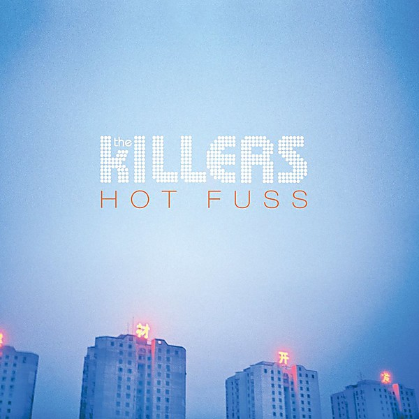

# Hot Fuss

By **The Killers**

## Album Data

- **Catalog:** Beets
- **Format:** Digital, Album
- **Album:** Hot Fuss
- **Artist:** The Killers
- **Albumartist:** The Killers
- **Genre:** Indie Rock
- **MusicBrainz Album Artist ID:** [95e1ead9-4d31-4808-a7ac-32c3614c116b](https://musicbrainz.org/artist/95e1ead9-4d31-4808-a7ac-32c3614c116b)
- **MusicBrainz Album ID:** [91ffb31b-783a-404c-9256-ef59d5b310c5](https://musicbrainz.org/release/91ffb31b-783a-404c-9256-ef59d5b310c5)
- **MusicBrainz Release Group ID:** [e8c09b4e-33ae-368b-8f70-24b4e14fb9ad](https://musicbrainz.org/release-group/e8c09b4e-33ae-368b-8f70-24b4e14fb9ad)
- **Year:** 2004
- **Catalog #:** B0013632-50
- **Label:** Island
- **Total Tracks:** 17

## Album Tracks

### Track 01 - Human

- **Artist:** The Killers
- **Format:** ALAC
- **Genre:** Indie Rock
- **Length:** 5:28
- **MusicBrainz Track ID:** [8f43e998-7e49-40ba-92fa-419b6252111c](https://musicbrainz.org/recording/8f43e998-7e49-40ba-92fa-419b6252111c)
- **Title:** Human
- **Track:** 01
- **Year:** 2009

### Track 02 - This Is Your Life

- **Artist:** The Killers
- **Format:** ALAC
- **Genre:** Indie Rock
- **Length:** 3:38
- **MusicBrainz Track ID:** [bface150-f318-420c-bfde-237d137431e3](https://musicbrainz.org/recording/bface150-f318-420c-bfde-237d137431e3)
- **Title:** This Is Your Life
- **Track:** 02
- **Year:** 2009

### Track 03 - Somebody Told Me

- **Artist:** The Killers
- **Format:** ALAC
- **Genre:** Indie Rock
- **Length:** 3:20
- **MusicBrainz Track ID:** [0f3b57fc-e16c-4520-a966-1e5aa1d12425](https://musicbrainz.org/recording/0f3b57fc-e16c-4520-a966-1e5aa1d12425)
- **Title:** Somebody Told Me
- **Track:** 03
- **Year:** 2009

### Track 04 - The World We Live In

- **Artist:** The Killers
- **Format:** ALAC
- **Genre:** Synthpop
- **Length:** 4:23
- **MusicBrainz Track ID:** [213df47f-59a1-4bab-b8e0-d9e3d463dc09](https://musicbrainz.org/recording/213df47f-59a1-4bab-b8e0-d9e3d463dc09)
- **Title:** The World We Live In
- **Track:** 04
- **Year:** 2009

### Track 05 - I Can’t Stay

- **Artist:** The Killers
- **Format:** ALAC
- **Genre:** Indie Rock
- **Length:** 4:50
- **MusicBrainz Track ID:** [8271ad7e-4e84-4908-9a36-7212265f0c12](https://musicbrainz.org/recording/8271ad7e-4e84-4908-9a36-7212265f0c12)
- **Title:** I Can’t Stay
- **Track:** 05
- **Year:** 2009

### Track 06 - Bling (Confession of a King)

- **Artist:** The Killers
- **Format:** ALAC
- **Genre:** Indie Rock
- **Length:** 6:27
- **MusicBrainz Track ID:** [c1cd9254-cf74-4f38-9dc9-d56a41bf6758](https://musicbrainz.org/recording/c1cd9254-cf74-4f38-9dc9-d56a41bf6758)
- **Title:** Bling (Confession of a King)
- **Track:** 06
- **Year:** 2009

### Track 07 - Shadowplay

- **Artist:** The Killers
- **Format:** ALAC
- **Genre:** Indie Rock
- **Length:** 4:04
- **MusicBrainz Track ID:** [d6aee3a1-9989-4f6a-96cc-0ac0d5f017c6](https://musicbrainz.org/recording/d6aee3a1-9989-4f6a-96cc-0ac0d5f017c6)
- **Title:** Shadowplay
- **Track:** 07
- **Year:** 2009

### Track 08 - Smile Like You Mean It

- **Artist:** The Killers
- **Format:** ALAC
- **Genre:** Indie Rock
- **Length:** 4:17
- **MusicBrainz Track ID:** [0c8a14ea-2cee-4798-9034-699f4e6a92ae](https://musicbrainz.org/recording/0c8a14ea-2cee-4798-9034-699f4e6a92ae)
- **Title:** Smile Like You Mean It
- **Track:** 08
- **Year:** 2009

### Track 09 - Losing Touch

- **Artist:** The Killers
- **Format:** ALAC
- **Genre:** Indie Rock
- **Length:** 4:10
- **MusicBrainz Track ID:** [6c760d7c-2873-4013-9374-9b6ba904355c](https://musicbrainz.org/recording/6c760d7c-2873-4013-9374-9b6ba904355c)
- **Title:** Losing Touch
- **Track:** 09
- **Year:** 2009

### Track 10 - Spaceman

- **Artist:** The Killers
- **Format:** ALAC
- **Genre:** Indie Rock
- **Length:** 5:23
- **MusicBrainz Track ID:** [178a77da-03d5-42ac-8f6e-83183a850dda](https://musicbrainz.org/recording/178a77da-03d5-42ac-8f6e-83183a850dda)
- **Title:** Spaceman
- **Track:** 10
- **Year:** 2009

### Track 11 - A Dustland Fairytale

- **Artist:** The Killers
- **Format:** ALAC
- **Genre:** Indie Rock
- **Length:** 4:57
- **MusicBrainz Track ID:** [f348d0be-fed0-415a-aefb-8c0a15a5b3ed](https://musicbrainz.org/recording/f348d0be-fed0-415a-aefb-8c0a15a5b3ed)
- **Title:** A Dustland Fairytale
- **Track:** 11
- **Year:** 2009

### Track 12 - Sam’s Town (acoustic)

- **Artist:** The Killers
- **Format:** ALAC
- **Genre:** Indie Rock
- **Length:** 4:02
- **MusicBrainz Track ID:** [51ac7174-9351-424d-b884-2b13664ace17](https://musicbrainz.org/recording/51ac7174-9351-424d-b884-2b13664ace17)
- **Title:** Sam’s Town (acoustic)
- **Track:** 12
- **Year:** 2009

### Track 13 - Read My Mind

- **Artist:** The Killers
- **Format:** ALAC
- **Genre:** Indie Rock
- **Length:** 4:22
- **MusicBrainz Track ID:** [ef1149c9-9713-4007-998c-1b79e6f7405d](https://musicbrainz.org/recording/ef1149c9-9713-4007-998c-1b79e6f7405d)
- **Title:** Read My Mind
- **Track:** 13
- **Year:** 2009

### Track 14 - Mr. Brightside

- **Artist:** The Killers
- **Format:** ALAC
- **Genre:** Indie Rock
- **Length:** 3:53
- **MusicBrainz Track ID:** [f681a2c1-4524-4f13-9d78-89bfc56895b4](https://musicbrainz.org/recording/f681a2c1-4524-4f13-9d78-89bfc56895b4)
- **Title:** Mr. Brightside
- **Track:** 14
- **Year:** 2009

### Track 15 - All These Things That I’ve Done

- **Artist:** The Killers
- **Format:** ALAC
- **Genre:** Indie Rock
- **Length:** 5:54
- **MusicBrainz Track ID:** [1f3c0eb9-f51f-4f4c-8ec9-a426d52725cb](https://musicbrainz.org/recording/1f3c0eb9-f51f-4f4c-8ec9-a426d52725cb)
- **Title:** All These Things That I’ve Done
- **Track:** 15
- **Year:** 2009

### Track 16 - Jenny Was a Friend of Mine

- **Artist:** The Killers
- **Format:** ALAC
- **Genre:** Indie Rock
- **Length:** 4:27
- **MusicBrainz Track ID:** [4b4e7243-e42b-477a-9288-d1a41514c8f3](https://musicbrainz.org/recording/4b4e7243-e42b-477a-9288-d1a41514c8f3)
- **Title:** Jenny Was a Friend of Mine
- **Track:** 16
- **Year:** 2009

### Track 17 - When You Were Young

- **Artist:** The Killers
- **Format:** ALAC
- **Genre:** Indie Rock
- **Length:** 4:43
- **MusicBrainz Track ID:** [6bd19f2f-9331-47b3-b462-57f8577a5a71](https://musicbrainz.org/recording/6bd19f2f-9331-47b3-b462-57f8577a5a71)
- **Title:** When You Were Young
- **Track:** 17
- **Year:** 2009

## See also

- [Day & Age](Day_and_Age.md)
- [Live From the Royal Albert Hall](Live_From_the_Royal_Albert_Hall.md)
- [Sam’s Town](Sam’s_Town.md)
- [Sawdust](Sawdust.md)
- [Roon: Day & Age (Bonus Tracks)](../../Roon/The_Killers/Day_and_Age_Bonus_Tracks.md)
- [Roon: Hot Fuss](../../Roon/The_Killers/Hot_Fuss.md)
- [Roon: Imploding The Mirage (Deluxe)](../../Roon/The_Killers/Imploding_The_Mirage_Deluxe.md)
- [Roon: Sam's Town](../../Roon/The_Killers/Sams_Town.md)
