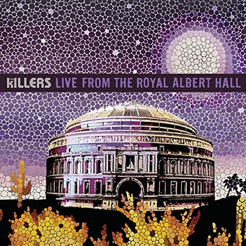

# Live From the Royal Albert Hall

By **The Killers**

## Album Data

- **Catalog:** Beets
- **Format:** Digital, Album
- **Album:** Live From the Royal Albert Hall
- **Artist:** The Killers
- **Albumartist:** The Killers
- **Genre:** Indie Rock
- **MusicBrainz Album Artist ID:** [95e1ead9-4d31-4808-a7ac-32c3614c116b](https://musicbrainz.org/artist/95e1ead9-4d31-4808-a7ac-32c3614c116b)
- **MusicBrainz Album ID:** [b695a7d1-e42f-43c8-b486-e9e1fdc13f48](https://musicbrainz.org/release/b695a7d1-e42f-43c8-b486-e9e1fdc13f48)
- **MusicBrainz Release Group ID:** [f6f2403b-ce78-4333-b2b2-5c1e9863823c](https://musicbrainz.org/release-group/f6f2403b-ce78-4333-b2b2-5c1e9863823c)
- **Year:** 2009
- **Catalog #:** 
- **Label:** Island
- **Total Tracks:** 12

## Album Tracks

### Track 01 - Sam’s Town

- **Artist:** The Killers
- **Format:** AAC
- **Genre:** Indie Rock
- **Length:** 4:06
- **MusicBrainz Track ID:** [0faa740d-fd97-4d1a-a258-2bc45323e4f2](https://musicbrainz.org/recording/0faa740d-fd97-4d1a-a258-2bc45323e4f2)
- **Title:** Sam’s Town
- **Track:** 01
- **Year:** 2006

### Track 02 - Enterlude

- **Artist:** The Killers
- **Format:** AAC
- **Genre:** Indie Rock
- **Length:** 0:51
- **MusicBrainz Track ID:** [6ac184da-c3ee-43f3-9569-fe2943970f39](https://musicbrainz.org/recording/6ac184da-c3ee-43f3-9569-fe2943970f39)
- **Title:** Enterlude
- **Track:** 02
- **Year:** 2006

### Track 03 - When You Were Young

- **Artist:** The Killers
- **Format:** AAC
- **Genre:** Indie Rock
- **Length:** 3:40
- **MusicBrainz Track ID:** [b38f9ded-8ac3-409e-82c3-187495e4da47](https://musicbrainz.org/recording/b38f9ded-8ac3-409e-82c3-187495e4da47)
- **Title:** When You Were Young
- **Track:** 03
- **Year:** 2006

### Track 04 - Bling (Confession of a King)

- **Artist:** The Killers
- **Format:** AAC
- **Genre:** Indie Rock
- **Length:** 4:08
- **MusicBrainz Track ID:** [faa455ce-f3f3-4626-84aa-3892a44a970b](https://musicbrainz.org/recording/faa455ce-f3f3-4626-84aa-3892a44a970b)
- **Title:** Bling (Confession of a King)
- **Track:** 04
- **Year:** 2006

### Track 05 - For Reasons Unknown

- **Artist:** The Killers
- **Format:** AAC
- **Genre:** Indie Rock
- **Length:** 3:32
- **MusicBrainz Track ID:** [da049a30-cba3-4923-a17f-00320f695e9d](https://musicbrainz.org/recording/da049a30-cba3-4923-a17f-00320f695e9d)
- **Title:** For Reasons Unknown
- **Track:** 05
- **Year:** 2006

### Track 06 - Read My Mind

- **Artist:** The Killers
- **Format:** AAC
- **Genre:** Indie Rock
- **Length:** 4:06
- **MusicBrainz Track ID:** [22ce7721-95ac-424c-bb3e-0330bd1a2f7c](https://musicbrainz.org/recording/22ce7721-95ac-424c-bb3e-0330bd1a2f7c)
- **Title:** Read My Mind
- **Track:** 06
- **Year:** 2006

### Track 07 - Uncle Jonny

- **Artist:** The Killers
- **Format:** AAC
- **Genre:** Indie Rock
- **Length:** 4:25
- **MusicBrainz Track ID:** [79a3e662-a540-4100-8c46-e391e693d357](https://musicbrainz.org/recording/79a3e662-a540-4100-8c46-e391e693d357)
- **Title:** Uncle Jonny
- **Track:** 07
- **Year:** 2006

### Track 08 - Bones

- **Artist:** The Killers
- **Format:** AAC
- **Genre:** Indie Rock
- **Length:** 3:47
- **MusicBrainz Track ID:** [41164ae9-e207-4014-8059-07b8a2aa26e2](https://musicbrainz.org/recording/41164ae9-e207-4014-8059-07b8a2aa26e2)
- **Title:** Bones
- **Track:** 08
- **Year:** 2006

### Track 09 - My List

- **Artist:** The Killers
- **Format:** AAC
- **Genre:** Indie Rock
- **Length:** 4:08
- **MusicBrainz Track ID:** [ef0cdd43-25fa-42c5-a6d3-00e286525c56](https://musicbrainz.org/recording/ef0cdd43-25fa-42c5-a6d3-00e286525c56)
- **Title:** My List
- **Track:** 09
- **Year:** 2006

### Track 10 - This River Is Wild

- **Artist:** The Killers
- **Format:** AAC
- **Genre:** Indie Rock
- **Length:** 4:38
- **MusicBrainz Track ID:** [35824339-bfec-4b5f-a4b2-efe804f8bab7](https://musicbrainz.org/recording/35824339-bfec-4b5f-a4b2-efe804f8bab7)
- **Title:** This River Is Wild
- **Track:** 10
- **Year:** 2006

### Track 11 - Why Do I Keep Counting?

- **Artist:** The Killers
- **Format:** AAC
- **Genre:** Indie Rock
- **Length:** 4:24
- **MusicBrainz Track ID:** [1a3ed1fd-c5de-42ca-90ed-5dfab6d761df](https://musicbrainz.org/recording/1a3ed1fd-c5de-42ca-90ed-5dfab6d761df)
- **Title:** Why Do I Keep Counting?
- **Track:** 11
- **Year:** 2006

### Track 12 - Exitlude

- **Artist:** The Killers
- **Format:** AAC
- **Genre:** Indie Rock
- **Length:** 2:26
- **MusicBrainz Track ID:** [954aaf45-1944-4741-8bc7-9c569d5498d5](https://musicbrainz.org/recording/954aaf45-1944-4741-8bc7-9c569d5498d5)
- **Title:** Exitlude
- **Track:** 12
- **Year:** 2006

## See also

- [Day & Age](Day_and_Age.md)
- [Hot Fuss](Hot_Fuss.md)
- [Sam’s Town](Sam’s_Town.md)
- [Sawdust](Sawdust.md)
- [Roon: Day & Age (Bonus Tracks)](../../Roon/The_Killers/Day_and_Age_Bonus_Tracks.md)
- [Roon: Hot Fuss](../../Roon/The_Killers/Hot_Fuss.md)
- [Roon: Imploding The Mirage (Deluxe)](../../Roon/The_Killers/Imploding_The_Mirage_Deluxe.md)
- [Roon: Sam's Town](../../Roon/The_Killers/Sams_Town.md)
