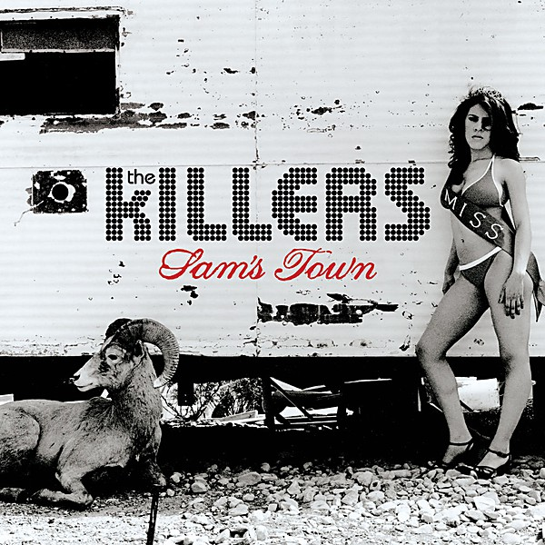

# Sam’s Town

By **The Killers**

## Album Data

- **Catalog:** Beets
- **Format:** Digital, Album
- **Album:** Sam’s Town
- **Artist:** The Killers
- **Albumartist:** The Killers
- **Genre:** Indie Rock
- **MusicBrainz Album Artist ID:** [95e1ead9-4d31-4808-a7ac-32c3614c116b](https://musicbrainz.org/artist/95e1ead9-4d31-4808-a7ac-32c3614c116b)
- **MusicBrainz Album ID:** [cd0296c2-7ee0-422b-a699-3952ebe22104](https://musicbrainz.org/release/cd0296c2-7ee0-422b-a699-3952ebe22104)
- **MusicBrainz Release Group ID:** [e5ae2682-f6cb-327d-9e5e-8e055fb5b094](https://musicbrainz.org/release-group/e5ae2682-f6cb-327d-9e5e-8e055fb5b094)
- **Year:** 2006
- **Catalog #:** 
- **Label:** Island
- **Total Tracks:** 17

## Album Tracks

### Track 02 - Shadowplay

- **Artist:** The Killers
- **Format:** ALAC
- **Genre:** Indie Rock
- **Length:** 4:07
- **MusicBrainz Track ID:** [e413b436-95dc-424a-bb58-7ea80520fa22](https://musicbrainz.org/recording/e413b436-95dc-424a-bb58-7ea80520fa22)
- **Title:** Shadowplay
- **Track:** 02
- **Year:** 2007

### Track 03 - All the Pretty Faces

- **Artist:** The Killers
- **Format:** ALAC
- **Genre:** Indie Rock
- **Length:** 4:45
- **MusicBrainz Track ID:** [f074b325-fe52-450f-ad09-e8314de96318](https://musicbrainz.org/recording/f074b325-fe52-450f-ad09-e8314de96318)
- **Title:** All the Pretty Faces
- **Track:** 03
- **Year:** 2007

### Track 04 - Leave the Bourbon on the Shelf

- **Artist:** The Killers
- **Format:** ALAC
- **Genre:** Indie Rock
- **Length:** 3:38
- **MusicBrainz Track ID:** [3900bc75-63d3-484e-a42e-fe133dd6aeb4](https://musicbrainz.org/recording/3900bc75-63d3-484e-a42e-fe133dd6aeb4)
- **Title:** Leave the Bourbon on the Shelf
- **Track:** 04
- **Year:** 2007

### Track 05 - Sweet Talk

- **Artist:** The Killers
- **Format:** ALAC
- **Genre:** Indie Rock
- **Length:** 4:18
- **MusicBrainz Track ID:** [0a2b7175-976b-4382-9577-becf5f6a0c7f](https://musicbrainz.org/recording/0a2b7175-976b-4382-9577-becf5f6a0c7f)
- **Title:** Sweet Talk
- **Track:** 05
- **Year:** 2007

### Track 06 - Under the Gun

- **Artist:** The Killers
- **Format:** ALAC
- **Genre:** Indie Rock
- **Length:** 2:33
- **MusicBrainz Track ID:** [5892db4d-6865-4ad8-827c-a5a62968052c](https://musicbrainz.org/recording/5892db4d-6865-4ad8-827c-a5a62968052c)
- **Title:** Under the Gun
- **Track:** 06
- **Year:** 2007

### Track 07 - Where the White Boys Dance

- **Artist:** The Killers
- **Format:** ALAC
- **Genre:** Indie Rock
- **Length:** 3:26
- **MusicBrainz Track ID:** [80a82c21-8474-4e6a-b80c-0d94fe53abca](https://musicbrainz.org/recording/80a82c21-8474-4e6a-b80c-0d94fe53abca)
- **Title:** Where the White Boys Dance
- **Track:** 07
- **Year:** 2007

### Track 08 - Show You How

- **Artist:** The Killers
- **Format:** ALAC
- **Genre:** Indie Rock
- **Length:** 2:46
- **MusicBrainz Track ID:** [d9a9cf17-eecb-4c18-8948-0d3064d64239](https://musicbrainz.org/recording/d9a9cf17-eecb-4c18-8948-0d3064d64239)
- **Title:** Show You How
- **Track:** 08
- **Year:** 2007

### Track 09 - Move Away

- **Artist:** The Killers
- **Format:** ALAC
- **Genre:** Indie Rock
- **Length:** 3:50
- **MusicBrainz Track ID:** [ecef4cec-8c3e-42ec-af55-1fd05d6a33af](https://musicbrainz.org/recording/ecef4cec-8c3e-42ec-af55-1fd05d6a33af)
- **Title:** Move Away
- **Track:** 09
- **Year:** 2007

### Track 10 - Glamorous Indie Rock and Roll

- **Artist:** The Killers
- **Format:** ALAC
- **Genre:** Indie Rock
- **Length:** 4:16
- **MusicBrainz Track ID:** [dc42febd-fdfd-4e07-8bfe-b0708a600624](https://musicbrainz.org/recording/dc42febd-fdfd-4e07-8bfe-b0708a600624)
- **Title:** Glamorous Indie Rock and Roll
- **Track:** 10
- **Year:** 2007

### Track 11 - Who Let You Go?

- **Artist:** The Killers
- **Format:** ALAC
- **Genre:** Indie Rock
- **Length:** 3:42
- **MusicBrainz Track ID:** [51b87081-a281-42d0-95cc-4178f367d33a](https://musicbrainz.org/recording/51b87081-a281-42d0-95cc-4178f367d33a)
- **Title:** Who Let You Go?
- **Track:** 11
- **Year:** 2007

### Track 12 - The Ballad of Michael Valentine

- **Artist:** The Killers
- **Format:** ALAC
- **Genre:** Indie Rock
- **Length:** 3:50
- **MusicBrainz Track ID:** [f4543e6c-8a69-4e43-8269-4b5dca2ae85c](https://musicbrainz.org/recording/f4543e6c-8a69-4e43-8269-4b5dca2ae85c)
- **Title:** The Ballad of Michael Valentine
- **Track:** 12
- **Year:** 2007

### Track 13 - Ruby, Don't Take Your Love to Town

- **Artist:** The Killers
- **Format:** ALAC
- **Genre:** Indie Rock
- **Length:** 3:05
- **MusicBrainz Track ID:** [eee9a81a-0f50-4c39-aacb-c3ba542a71da](https://musicbrainz.org/recording/eee9a81a-0f50-4c39-aacb-c3ba542a71da)
- **Title:** Ruby, Don't Take Your Love to Town
- **Track:** 13
- **Year:** 2007

### Track 14 - Daddy's Eyes

- **Artist:** The Killers
- **Format:** ALAC
- **Genre:** Indie Rock
- **Length:** 4:14
- **MusicBrainz Track ID:** [f705db5e-7d1c-4e83-89a9-adde5c71a2d7](https://musicbrainz.org/recording/f705db5e-7d1c-4e83-89a9-adde5c71a2d7)
- **Title:** Daddy's Eyes
- **Track:** 14
- **Year:** 2007

### Track 15 - Sam's Town (Abbey Road version)

- **Artist:** The Killers
- **Format:** ALAC
- **Genre:** Indie Rock
- **Length:** 3:45
- **MusicBrainz Track ID:** [bb7b8d55-91e5-46b8-b30f-dda401aaf8cf](https://musicbrainz.org/recording/bb7b8d55-91e5-46b8-b30f-dda401aaf8cf)
- **Title:** Sam's Town (Abbey Road version)
- **Track:** 15
- **Year:** 2007

### Track 16 - Romeo and Juliet

- **Artist:** The Killers
- **Format:** ALAC
- **Genre:** Indie Rock
- **Length:** 5:27
- **MusicBrainz Track ID:** [e3f4e110-5154-496b-a48a-c735601eda8b](https://musicbrainz.org/recording/e3f4e110-5154-496b-a48a-c735601eda8b)
- **Title:** Romeo and Juliet
- **Track:** 16
- **Year:** 2007

### Track 17 - Mr. Brightside (Jacques Lu Cont's Thin White Duke remix)

- **Artist:** The Killers
- **Format:** ALAC
- **Genre:** Indie Rock
- **Length:** 10:39
- **MusicBrainz Track ID:** [c671d1cf-d6bf-4dcb-a44c-8d3972e613ed](https://musicbrainz.org/recording/c671d1cf-d6bf-4dcb-a44c-8d3972e613ed)
- **Title:** Mr. Brightside (Jacques Lu Cont's Thin White Duke remix)
- **Track:** 17
- **Year:** 2007

### Track 01 - Tranquilize

- **Artist:** The Killers feat. Lou Reed
- **Format:** ALAC
- **Genre:** Indie Rock
- **Length:** 3:45
- **MusicBrainz Track ID:** [da0f0c4c-bec7-478b-95d9-30c3fc04d977](https://musicbrainz.org/recording/da0f0c4c-bec7-478b-95d9-30c3fc04d977)
- **Title:** Tranquilize
- **Track:** 01
- **Year:** 2007

## See also

- [Day & Age](Day_and_Age.md)
- [Hot Fuss](Hot_Fuss.md)
- [Live From the Royal Albert Hall](Live_From_the_Royal_Albert_Hall.md)
- [Sawdust](Sawdust.md)
- [Roon: Day & Age (Bonus Tracks)](../../Roon/The_Killers/Day_and_Age_Bonus_Tracks.md)
- [Roon: Hot Fuss](../../Roon/The_Killers/Hot_Fuss.md)
- [Roon: Imploding The Mirage (Deluxe)](../../Roon/The_Killers/Imploding_The_Mirage_Deluxe.md)
- [Roon: Sam's Town](../../Roon/The_Killers/Sams_Town.md)
