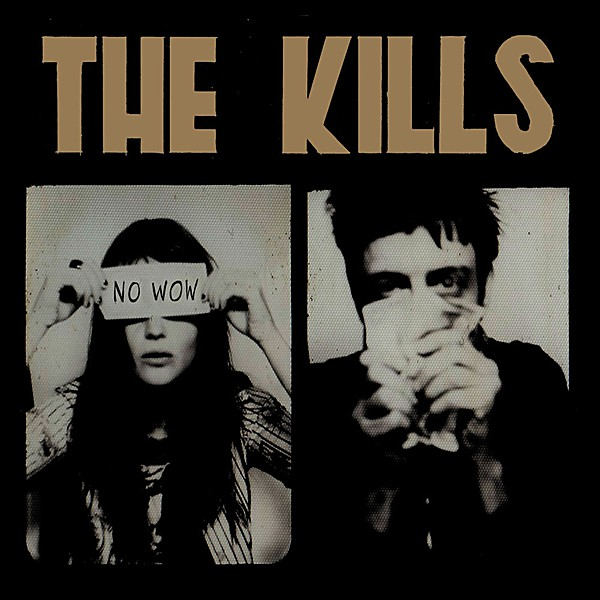

# No Wow

By **The Kills**

## Album Data

- **Catalog:** Beets
- **Format:** Digital, Album
- **Album:** No Wow
- **Artist:** The Kills
- **Albumartist:** The Kills
- **Genre:** Garage Rock
- **MusicBrainz Album Artist ID:** [2c629b8c-d751-4131-b785-5690bb5e0fd7](https://musicbrainz.org/artist/2c629b8c-d751-4131-b785-5690bb5e0fd7)
- **MusicBrainz Album ID:** [55efd586-2938-4db2-8436-bb950ed9b0eb](https://musicbrainz.org/release/55efd586-2938-4db2-8436-bb950ed9b0eb)
- **MusicBrainz Release Group ID:** [2a74067e-64a8-3a1b-8583-831cf962091d](https://musicbrainz.org/release-group/2a74067e-64a8-3a1b-8583-831cf962091d)
- **Year:** 2005
- **Catalog #:** 82876 66403 2
- **Label:** RCA
- **Total Tracks:** 11

## Album Tracks

### Track 01 - No Wow / Telephone Radio Germany

- **Artist:** The Kills
- **Format:** ALAC
- **Genre:** Garage Rock
- **Length:** 4:47
- **MusicBrainz Track ID:** [ecd477bd-c149-4f33-9752-83c2e90f86ab](https://musicbrainz.org/recording/ecd477bd-c149-4f33-9752-83c2e90f86ab)
- **Title:** No Wow / Telephone Radio Germany
- **Track:** 01
- **Year:** 2005

### Track 02 - Love Is a Deserter

- **Artist:** The Kills
- **Format:** ALAC
- **Genre:** Indie Rock
- **Length:** 3:48
- **MusicBrainz Track ID:** [54de2c47-3d8d-4c6b-aba6-c0dc63fb9ab6](https://musicbrainz.org/recording/54de2c47-3d8d-4c6b-aba6-c0dc63fb9ab6)
- **Title:** Love Is a Deserter
- **Track:** 02
- **Year:** 2005

### Track 03 - Dead Road 7

- **Artist:** The Kills
- **Format:** ALAC
- **Genre:** Indie Rock
- **Length:** 3:23
- **MusicBrainz Track ID:** [752a8b5e-8da7-49dc-9253-7ab6d8c87f1a](https://musicbrainz.org/recording/752a8b5e-8da7-49dc-9253-7ab6d8c87f1a)
- **Title:** Dead Road 7
- **Track:** 03
- **Year:** 2005

### Track 04 - The Good Ones

- **Artist:** The Kills
- **Format:** ALAC
- **Genre:** Indie Rock
- **Length:** 3:29
- **MusicBrainz Track ID:** [2aaf1ffd-464a-44f0-a85a-c954a4475201](https://musicbrainz.org/recording/2aaf1ffd-464a-44f0-a85a-c954a4475201)
- **Title:** The Good Ones
- **Track:** 04
- **Year:** 2005

### Track 05 - I Hate the Way You Love

- **Artist:** The Kills
- **Format:** ALAC
- **Genre:** Indie Rock
- **Length:** 3:37
- **MusicBrainz Track ID:** [910e538f-484e-4291-9050-af4919664c07](https://musicbrainz.org/recording/910e538f-484e-4291-9050-af4919664c07)
- **Title:** I Hate the Way You Love
- **Track:** 05
- **Year:** 2005

### Track 06 - I Hate the Way You Love, Part 2

- **Artist:** The Kills
- **Format:** ALAC
- **Genre:** Indie Rock
- **Length:** 1:46
- **MusicBrainz Track ID:** [a693c598-93a8-4276-8d4d-49eb454167bd](https://musicbrainz.org/recording/a693c598-93a8-4276-8d4d-49eb454167bd)
- **Title:** I Hate the Way You Love, Part 2
- **Track:** 06
- **Year:** 2005

### Track 07 - At the Back of the Shell

- **Artist:** The Kills
- **Format:** ALAC
- **Genre:** Indie Rock
- **Length:** 2:27
- **MusicBrainz Track ID:** [18361e82-46fb-4305-9025-18923e9d1c1a](https://musicbrainz.org/recording/18361e82-46fb-4305-9025-18923e9d1c1a)
- **Title:** At the Back of the Shell
- **Track:** 07
- **Year:** 2005

### Track 08 - Sweet Cloud

- **Artist:** The Kills
- **Format:** ALAC
- **Genre:** Indie Rock
- **Length:** 5:06
- **MusicBrainz Track ID:** [dd9cb8b8-2c73-4ec9-9aca-4840539b5b91](https://musicbrainz.org/recording/dd9cb8b8-2c73-4ec9-9aca-4840539b5b91)
- **Title:** Sweet Cloud
- **Track:** 08
- **Year:** 2005

### Track 09 - Rodeo Town

- **Artist:** The Kills
- **Format:** ALAC
- **Genre:** Indie Rock
- **Length:** 4:24
- **MusicBrainz Track ID:** [ac9c88ae-baf9-4246-a408-be8b59fda9e8](https://musicbrainz.org/recording/ac9c88ae-baf9-4246-a408-be8b59fda9e8)
- **Title:** Rodeo Town
- **Track:** 09
- **Year:** 2005

### Track 10 - Murdermile

- **Artist:** The Kills
- **Format:** ALAC
- **Genre:** Indie Rock
- **Length:** 4:25
- **MusicBrainz Track ID:** [32e20be6-8582-4cc4-8312-9f8b6448e036](https://musicbrainz.org/recording/32e20be6-8582-4cc4-8312-9f8b6448e036)
- **Title:** Murdermile
- **Track:** 10
- **Year:** 2005

### Track 11 - Ticket Man

- **Artist:** The Kills
- **Format:** ALAC
- **Genre:** Indie Rock
- **Length:** 2:49
- **MusicBrainz Track ID:** [f2d83d31-e23e-4d2a-a962-5185f3e6057e](https://musicbrainz.org/recording/f2d83d31-e23e-4d2a-a962-5185f3e6057e)
- **Title:** Ticket Man
- **Track:** 11
- **Year:** 2005

## See also

- [Midnight Boom](Midnight_Boom.md)
