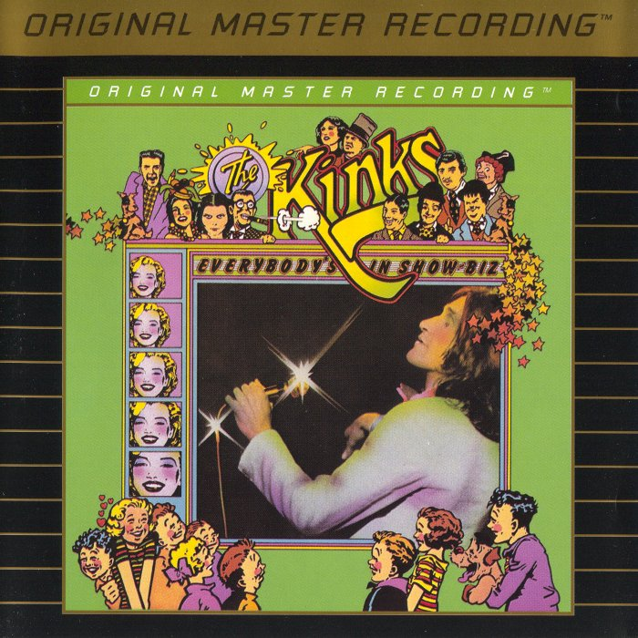

# Everybody’s in Show‐Biz

By **The Kinks**

## Album Data

- **Catalog:** Beets
- **Format:** Digital, Album
- **Album:** Everybody’s in Show‐Biz
- **Artist:** The Kinks
- **Albumartist:** The Kinks
- **Genre:** Rock
- **MusicBrainz Album Artist ID:** [17b53d9f-5c63-4a09-a593-dde4608e0db9](https://musicbrainz.org/artist/17b53d9f-5c63-4a09-a593-dde4608e0db9)
- **MusicBrainz Album ID:** [6cc45240-7c47-4e33-99df-4c3a74a5910b](https://musicbrainz.org/release/6cc45240-7c47-4e33-99df-4c3a74a5910b)
- **MusicBrainz Release Group ID:** [c638a406-599f-3570-b3ca-f211e6d5c00b](https://musicbrainz.org/release-group/c638a406-599f-3570-b3ca-f211e6d5c00b)
- **Year:** 1998
- **Catalog #:** 6423-2
- **Label:** Reprise Records
- **Total Tracks:** 14

## Album Tracks

### Track 01 - Introduction

- **Artist:** The Kinks
- **Format:** ALAC
- **Genre:** Rock
- **Length:** 0:41
- **MusicBrainz Track ID:** [ba1d000e-af5b-4b44-9a2a-bd59b81e992c](https://musicbrainz.org/recording/ba1d000e-af5b-4b44-9a2a-bd59b81e992c)
- **Title:** Introduction
- **Track:** 01
- **Year:** 1988

### Track 02 - The Contenders

- **Artist:** The Kinks
- **Format:** ALAC
- **Genre:** Acid Rock
- **Length:** 2:02
- **MusicBrainz Track ID:** [ddf517b9-bb31-45db-a443-4e9ca110b125](https://musicbrainz.org/recording/ddf517b9-bb31-45db-a443-4e9ca110b125)
- **Title:** The Contenders
- **Track:** 02
- **Year:** 1988

### Track 03 - Strangers

- **Artist:** The Kinks
- **Format:** ALAC
- **Genre:** Rock
- **Length:** 3:22
- **MusicBrainz Track ID:** [15061298-09f8-45c9-af68-3871d65abd8b](https://musicbrainz.org/recording/15061298-09f8-45c9-af68-3871d65abd8b)
- **Title:** Strangers
- **Track:** 03
- **Year:** 1988

### Track 04 - Denmark Street

- **Artist:** The Kinks
- **Format:** ALAC
- **Genre:** Rock
- **Length:** 2:03
- **MusicBrainz Track ID:** [34a1f730-09ed-4aa1-a6c4-81db80b87827](https://musicbrainz.org/recording/34a1f730-09ed-4aa1-a6c4-81db80b87827)
- **Title:** Denmark Street
- **Track:** 04
- **Year:** 1988

### Track 05 - Get Back in Line

- **Artist:** The Kinks
- **Format:** ALAC
- **Genre:** Rock And Roll
- **Length:** 3:06
- **MusicBrainz Track ID:** [4d333a53-f014-43d7-b70d-1e281e563461](https://musicbrainz.org/recording/4d333a53-f014-43d7-b70d-1e281e563461)
- **Title:** Get Back in Line
- **Track:** 05
- **Year:** 1988

### Track 06 - Lola

- **Artist:** The Kinks
- **Format:** ALAC
- **Genre:** Rock
- **Length:** 4:03
- **MusicBrainz Track ID:** [559e771e-c10b-47b0-a058-d4a29f97a23f](https://musicbrainz.org/recording/559e771e-c10b-47b0-a058-d4a29f97a23f)
- **Title:** Lola
- **Track:** 06
- **Year:** 1988

### Track 07 - Top of the Pops

- **Artist:** The Kinks
- **Format:** ALAC
- **Genre:** Psychedelic Rock
- **Length:** 3:40
- **MusicBrainz Track ID:** [1904560c-2ac5-42d0-ab3f-be8add6e045d](https://musicbrainz.org/recording/1904560c-2ac5-42d0-ab3f-be8add6e045d)
- **Title:** Top of the Pops
- **Track:** 07
- **Year:** 1988

### Track 08 - The Moneygoround

- **Artist:** The Kinks
- **Format:** ALAC
- **Genre:** Sunshine Pop
- **Length:** 1:43
- **MusicBrainz Track ID:** [18c09e33-df33-42a5-8403-f355e8cc28ba](https://musicbrainz.org/recording/18c09e33-df33-42a5-8403-f355e8cc28ba)
- **Title:** The Moneygoround
- **Track:** 08
- **Year:** 1988

### Track 09 - This Time Tomorrow

- **Artist:** The Kinks
- **Format:** ALAC
- **Genre:** Rock
- **Length:** 3:24
- **MusicBrainz Track ID:** [a7b10472-2ab6-428e-8810-3e9218633031](https://musicbrainz.org/recording/a7b10472-2ab6-428e-8810-3e9218633031)
- **Title:** This Time Tomorrow
- **Track:** 09
- **Year:** 1988

### Track 10 - A Long Way From Home

- **Artist:** The Kinks
- **Format:** ALAC
- **Genre:** Psychedelic Rock
- **Length:** 2:28
- **MusicBrainz Track ID:** [4c4c65fe-eb95-4311-b15e-ff02c57616e4](https://musicbrainz.org/recording/4c4c65fe-eb95-4311-b15e-ff02c57616e4)
- **Title:** A Long Way From Home
- **Track:** 10
- **Year:** 1988

### Track 11 - Rats

- **Artist:** The Kinks
- **Format:** ALAC
- **Genre:** Hard Rock
- **Length:** 2:41
- **MusicBrainz Track ID:** [a9e7851a-bd64-44c4-866b-c45bea45a4cd](https://musicbrainz.org/recording/a9e7851a-bd64-44c4-866b-c45bea45a4cd)
- **Title:** Rats
- **Track:** 11
- **Year:** 1988

### Track 12 - Apeman

- **Artist:** The Kinks
- **Format:** ALAC
- **Genre:** Rock
- **Length:** 3:54
- **MusicBrainz Track ID:** [ea60c033-c3fd-4c88-95ab-df661eba4bbf](https://musicbrainz.org/recording/ea60c033-c3fd-4c88-95ab-df661eba4bbf)
- **Title:** Apeman
- **Track:** 12
- **Year:** 1988

### Track 13 - Powerman

- **Artist:** The Kinks
- **Format:** ALAC
- **Genre:** Rock
- **Length:** 4:17
- **MusicBrainz Track ID:** [ef537d57-5328-448c-99fe-d8ee67967384](https://musicbrainz.org/recording/ef537d57-5328-448c-99fe-d8ee67967384)
- **Title:** Powerman
- **Track:** 13
- **Year:** 1988

### Track 14 - Got to Be Free

- **Artist:** The Kinks
- **Format:** ALAC
- **Genre:** Pop Rock
- **Length:** 3:00
- **MusicBrainz Track ID:** [b29eb8e7-1811-4b79-b586-11e31477bbb9](https://musicbrainz.org/recording/b29eb8e7-1811-4b79-b586-11e31477bbb9)
- **Title:** Got to Be Free
- **Track:** 14
- **Year:** 1988

## See also

- [Everybody's in Showbiz (Legacy Edition)](Everybodys_in_Showbiz_Legacy_Edition.md)
- [Face To Face](Face_To_Face.md)
- [Lola Versus Powerman and the Moneygoround, Part One](Lola_Versus_Powerman_and_the_Moneygoround__Part_One.md)
- [Low Budget](Low_Budget.md)
- [Misfits](Misfits.md)
- [Muswell Hillbillies](Muswell_Hillbillies.md)
- [Phobia](Phobia.md)
- [Preservation Act 1](Preservation_Act_1.md)
- [Preservation Act 2](Preservation_Act_2.md)
- [Sleepwalker](Sleepwalker.md)
- [Soap Opera](Soap_Opera.md)
- [The Anthology 1964–1971](The_Anthology_1964–1971.md)
- [CD: Lola Versus Powerman And The Money-Go-Round (Part One)](../../CD/The_Kinks/Lola_Versus_Powerman_And_The_Money-Go-Round_Part_One.md)
- [CD: Muswell Hillbillies](../../CD/The_Kinks/Muswell_Hillbillies.md)
- [CD: The Anthology 1964 - 1971 (Disc 1)](../../CD/The_Kinks/The_Anthology_1964_-_1971_Disc_1.md)
- [CD: The Anthology 1964 - 1971 (Disc 2)](../../CD/The_Kinks/The_Anthology_1964_-_1971_Disc_2.md)
- [CD: The Anthology 1964 - 1971 (Disc 3)](../../CD/The_Kinks/The_Anthology_1964_-_1971_Disc_3.md)
- [CD: The Anthology 1964 - 1971 (Disc 4)](../../CD/The_Kinks/The_Anthology_1964_-_1971_Disc_4.md)
- [CD: The Anthology 1964 - 1971 (Disc 5)](../../CD/The_Kinks/The_Anthology_1964_-_1971_Disc_5.md)
- [CD: ](../../CD/The_Kinks/The_Kinks.md)
- [Roon: Arthur or the Decline and Fall of the British Empire (2019 Deluxe)](../../Roon/The_Kinks/Arthur_or_the_Decline_and_Fall_of_the_British_Empire_2019_Deluxe.md)
- [Roon: Come Dancing with the Kinks (The Best of the Kinks 1977-1986)](../../Roon/The_Kinks/Come_Dancing_with_the_Kinks_The_Best_of_the_Kinks_1977-1986.md)
- [Roon: Everybody's in Show-Biz (Deluxe (2022 Remaster))](../../Roon/The_Kinks/Everybodys_in_Show-Biz_Deluxe_2022_Remaster.md)
- [Roon: Everybody's in Show-Biz (Legacy Edition)](../../Roon/The_Kinks/Everybodys_in_Show-Biz_Legacy_Edition.md)
- [Roon: Everybody's in Show-Biz](../../Roon/The_Kinks/Everybodys_in_Show-Biz.md)
- [Roon: Lola Versus Powerman and the Moneygoround, Pt. 1 (Deluxe)](../../Roon/The_Kinks/Lola_Versus_Powerman_and_the_Moneygoround__Pt_1_Deluxe.md)
- [Roon: Lola vs. Powerman and the Moneygoround, Pt. 1](../../Roon/The_Kinks/Lola_vs_Powerman_and_the_Moneygoround__Pt_1.md)
- [Roon: Muswell Hillbillies (Deluxe Edition)](../../Roon/The_Kinks/Muswell_Hillbillies_Deluxe_Edition.md)
- [Roon: Muswell Hillbillies (Super Deluxe)](../../Roon/The_Kinks/Muswell_Hillbillies_Super_Deluxe.md)
- [Roon: Preservation Act 1](../../Roon/The_Kinks/Preservation_Act_1.md)
- [Roon: Schoolboys in Disgrace](../../Roon/The_Kinks/Schoolboys_in_Disgrace.md)
- [Roon: Sleepwalker](../../Roon/The_Kinks/Sleepwalker.md)
- [Roon: Soap Opera](../../Roon/The_Kinks/Soap_Opera.md)
- [Roon: The Anthology 1964 - 1971 (2014 Remastered Version)](../../Roon/The_Kinks/The_Anthology_1964_-_1971_2014_Remastered_Version.md)
- [Roon: The Anthology 1964-1971](../../Roon/The_Kinks/The_Anthology_1964-1971.md)
- [Vinyl: 20th Anniversary Box Set](../../Vinyl/The_Kinks/20th_Anniversary_Box_Set.md)
- [Vinyl: Everybody's In Show-Biz](../../Vinyl/The_Kinks/Everybodys_In_Show-Biz.md)
- [Vinyl: Father Christmas / (Wish I Could Fly Like) Superman](../../Vinyl/The_Kinks/Father_Christmas_-_Wish_I_Could_Fly_Like_Superman.md)
- [Vinyl: Muswell Hillbillies](../../Vinyl/The_Kinks/Muswell_Hillbillies.md)
- [Vinyl: Preservation Act 1](../../Vinyl/The_Kinks/Preservation_Act_1.md)
- [Vinyl: Sleepwalker](../../Vinyl/The_Kinks/Sleepwalker.md)
- [Vinyl: Soap Opera](../../Vinyl/The_Kinks/Soap_Opera.md)
- [Vinyl: ](../../Vinyl/The_Kinks/The_Kinks.md)
- [Vinyl: The Mono Collection](../../Vinyl/The_Kinks/The_Mono_Collection.md)
- [Vinyl: You Really Got Me](../../Vinyl/The_Kinks/You_Really_Got_Me.md)
