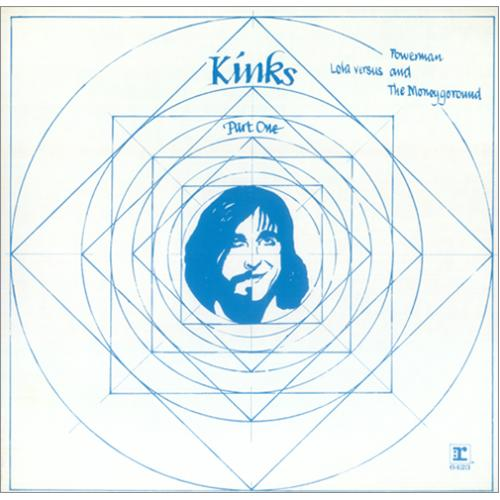

# Lola Versus Powerman and the Moneygoround, Part One

By **The Kinks**

## Album Data

- **Catalog:** Beets
- **Format:** Digital, Album
- **Album:** Lola Versus Powerman and the Moneygoround, Part One
- **Artist:** The Kinks
- **Albumartist:** The Kinks
- **Genre:** Rock
- **MusicBrainz Album Artist ID:** [17b53d9f-5c63-4a09-a593-dde4608e0db9](https://musicbrainz.org/artist/17b53d9f-5c63-4a09-a593-dde4608e0db9)
- **MusicBrainz Album ID:** [a1b07ec2-fca5-3913-a6da-e3d69a04f0d9](https://musicbrainz.org/release/a1b07ec2-fca5-3913-a6da-e3d69a04f0d9)
- **MusicBrainz Release Group ID:** [a84e8dfd-1492-3377-a6f0-34d324dc49d7](https://musicbrainz.org/release-group/a84e8dfd-1492-3377-a6f0-34d324dc49d7)
- **Year:** 1988
- **Catalog #:** 63467-79727-2
- **Label:** Velvel
- **Total Tracks:** 14

## Album Tracks

### Track 01 - Attitude

- **Artist:** The Kinks
- **Format:** ALAC
- **Genre:** Punk Rock
- **Length:** 3:47
- **MusicBrainz Track ID:** [2c2ed465-4368-4be7-8ca9-064c0dfded7b](https://musicbrainz.org/recording/2c2ed465-4368-4be7-8ca9-064c0dfded7b)
- **Title:** Attitude
- **Track:** 01
- **Year:** 1999

### Track 02 - Catch Me Now I’m Falling

- **Artist:** The Kinks
- **Format:** ALAC
- **Genre:** Power Pop
- **Length:** 5:58
- **MusicBrainz Track ID:** [e9866657-00d5-4e5d-8eb2-fbcbdcf8d1c5](https://musicbrainz.org/recording/e9866657-00d5-4e5d-8eb2-fbcbdcf8d1c5)
- **Title:** Catch Me Now I’m Falling
- **Track:** 02
- **Year:** 1999

### Track 03 - Pressure

- **Artist:** The Kinks
- **Format:** ALAC
- **Genre:** Rock And Roll
- **Length:** 2:27
- **MusicBrainz Track ID:** [acd22f22-6b7a-4624-b2ba-25196cc8bdc9](https://musicbrainz.org/recording/acd22f22-6b7a-4624-b2ba-25196cc8bdc9)
- **Title:** Pressure
- **Track:** 03
- **Year:** 1999

### Track 04 - National Health

- **Artist:** The Kinks
- **Format:** ALAC
- **Genre:** Hard Rock
- **Length:** 4:03
- **MusicBrainz Track ID:** [168a30a6-71b7-4a72-b65c-b44e92afb929](https://musicbrainz.org/recording/168a30a6-71b7-4a72-b65c-b44e92afb929)
- **Title:** National Health
- **Track:** 04
- **Year:** 1999

### Track 05 - (Wish I Could Fly Like) Superman

- **Artist:** The Kinks
- **Format:** ALAC
- **Genre:** Hard Rock
- **Length:** 3:36
- **MusicBrainz Track ID:** [1baa36e6-f66e-4378-b770-3e8a6090f07e](https://musicbrainz.org/recording/1baa36e6-f66e-4378-b770-3e8a6090f07e)
- **Title:** (Wish I Could Fly Like) Superman
- **Track:** 05
- **Year:** 1999

### Track 06 - Low Budget

- **Artist:** The Kinks
- **Format:** ALAC
- **Genre:** Hard Rock
- **Length:** 3:51
- **MusicBrainz Track ID:** [fccd3d8b-496f-4b83-9be0-6b505194df43](https://musicbrainz.org/recording/fccd3d8b-496f-4b83-9be0-6b505194df43)
- **Title:** Low Budget
- **Track:** 06
- **Year:** 1999

### Track 07 - In a Space

- **Artist:** The Kinks
- **Format:** ALAC
- **Genre:** Hard Rock
- **Length:** 3:44
- **MusicBrainz Track ID:** [b65532be-1433-4a21-b5fa-39ea3f9dc152](https://musicbrainz.org/recording/b65532be-1433-4a21-b5fa-39ea3f9dc152)
- **Title:** In a Space
- **Track:** 07
- **Year:** 1999

### Track 08 - Little Bit of Emotion

- **Artist:** The Kinks
- **Format:** ALAC
- **Genre:** Rock
- **Length:** 4:51
- **MusicBrainz Track ID:** [ff5f5e9c-4f97-449f-b013-72b0a0c8105a](https://musicbrainz.org/recording/ff5f5e9c-4f97-449f-b013-72b0a0c8105a)
- **Title:** Little Bit of Emotion
- **Track:** 08
- **Year:** 1999

### Track 09 - A Gallon of Gas

- **Artist:** The Kinks
- **Format:** ALAC
- **Genre:** Hard Rock
- **Length:** 3:47
- **MusicBrainz Track ID:** [3f7b766c-a73b-40d0-bd5b-4c0955963f64](https://musicbrainz.org/recording/3f7b766c-a73b-40d0-bd5b-4c0955963f64)
- **Title:** A Gallon of Gas
- **Track:** 09
- **Year:** 1999

### Track 10 - Misery

- **Artist:** The Kinks
- **Format:** ALAC
- **Genre:** Rock
- **Length:** 2:57
- **MusicBrainz Track ID:** [a2671b52-651f-485c-a62c-7d7a28427c66](https://musicbrainz.org/recording/a2671b52-651f-485c-a62c-7d7a28427c66)
- **Title:** Misery
- **Track:** 10
- **Year:** 1999

### Track 11 - Moving Pictures

- **Artist:** The Kinks
- **Format:** ALAC
- **Genre:** Hard Rock
- **Length:** 3:47
- **MusicBrainz Track ID:** [e9e995c0-4f67-4988-99c4-bfdf3ca45678](https://musicbrainz.org/recording/e9e995c0-4f67-4988-99c4-bfdf3ca45678)
- **Title:** Moving Pictures
- **Track:** 11
- **Year:** 1999

### Track 12 - A Gallon of Gas (U.S. single extended edit)

- **Artist:** The Kinks
- **Format:** ALAC
- **Genre:** Hard Rock
- **Length:** 3:52
- **MusicBrainz Track ID:** [128b3f48-575f-4e45-8c46-15ae31f773fc](https://musicbrainz.org/recording/128b3f48-575f-4e45-8c46-15ae31f773fc)
- **Title:** A Gallon of Gas (U.S. single extended edit)
- **Track:** 12
- **Year:** 1999

### Track 13 - Catch Me Now I’m Falling (original extended edit)

- **Artist:** The Kinks
- **Format:** ALAC
- **Genre:** Power Pop
- **Length:** 6:50
- **MusicBrainz Track ID:** [46b52e46-33da-4faf-81ef-423d95b0fa6d](https://musicbrainz.org/recording/46b52e46-33da-4faf-81ef-423d95b0fa6d)
- **Title:** Catch Me Now I’m Falling (original extended edit)
- **Track:** 13
- **Year:** 1999

### Track 14 - (Wish I Could Fly Like) Superman (disco mix extended edit)

- **Artist:** The Kinks
- **Format:** ALAC
- **Genre:** Disco
- **Length:** 5:58
- **MusicBrainz Track ID:** [33caed9b-ef82-44f5-a8cd-9a586833440e](https://musicbrainz.org/recording/33caed9b-ef82-44f5-a8cd-9a586833440e)
- **Title:** (Wish I Could Fly Like) Superman (disco mix extended edit)
- **Track:** 14
- **Year:** 1999

## See also

- [Everybody's in Showbiz (Legacy Edition)](Everybodys_in_Showbiz_Legacy_Edition.md)
- [Everybody’s in Show‐Biz](Everybody’s_in_Show‐Biz.md)
- [Face To Face](Face_To_Face.md)
- [Low Budget](Low_Budget.md)
- [Misfits](Misfits.md)
- [Muswell Hillbillies](Muswell_Hillbillies.md)
- [Phobia](Phobia.md)
- [Preservation Act 1](Preservation_Act_1.md)
- [Preservation Act 2](Preservation_Act_2.md)
- [Sleepwalker](Sleepwalker.md)
- [Soap Opera](Soap_Opera.md)
- [The Anthology 1964–1971](The_Anthology_1964–1971.md)
- [CD: Lola Versus Powerman And The Money-Go-Round (Part One)](../../CD/The_Kinks/Lola_Versus_Powerman_And_The_Money-Go-Round_Part_One.md)
- [CD: Muswell Hillbillies](../../CD/The_Kinks/Muswell_Hillbillies.md)
- [CD: The Anthology 1964 - 1971 (Disc 1)](../../CD/The_Kinks/The_Anthology_1964_-_1971_Disc_1.md)
- [CD: The Anthology 1964 - 1971 (Disc 2)](../../CD/The_Kinks/The_Anthology_1964_-_1971_Disc_2.md)
- [CD: The Anthology 1964 - 1971 (Disc 3)](../../CD/The_Kinks/The_Anthology_1964_-_1971_Disc_3.md)
- [CD: The Anthology 1964 - 1971 (Disc 4)](../../CD/The_Kinks/The_Anthology_1964_-_1971_Disc_4.md)
- [CD: The Anthology 1964 - 1971 (Disc 5)](../../CD/The_Kinks/The_Anthology_1964_-_1971_Disc_5.md)
- [CD: ](../../CD/The_Kinks/The_Kinks.md)
- [Roon: Arthur or the Decline and Fall of the British Empire (2019 Deluxe)](../../Roon/The_Kinks/Arthur_or_the_Decline_and_Fall_of_the_British_Empire_2019_Deluxe.md)
- [Roon: Come Dancing with the Kinks (The Best of the Kinks 1977-1986)](../../Roon/The_Kinks/Come_Dancing_with_the_Kinks_The_Best_of_the_Kinks_1977-1986.md)
- [Roon: Everybody's in Show-Biz (Deluxe (2022 Remaster))](../../Roon/The_Kinks/Everybodys_in_Show-Biz_Deluxe_2022_Remaster.md)
- [Roon: Everybody's in Show-Biz (Legacy Edition)](../../Roon/The_Kinks/Everybodys_in_Show-Biz_Legacy_Edition.md)
- [Roon: Everybody's in Show-Biz](../../Roon/The_Kinks/Everybodys_in_Show-Biz.md)
- [Roon: Lola Versus Powerman and the Moneygoround, Pt. 1 (Deluxe)](../../Roon/The_Kinks/Lola_Versus_Powerman_and_the_Moneygoround__Pt_1_Deluxe.md)
- [Roon: Lola vs. Powerman and the Moneygoround, Pt. 1](../../Roon/The_Kinks/Lola_vs_Powerman_and_the_Moneygoround__Pt_1.md)
- [Roon: Muswell Hillbillies (Deluxe Edition)](../../Roon/The_Kinks/Muswell_Hillbillies_Deluxe_Edition.md)
- [Roon: Muswell Hillbillies (Super Deluxe)](../../Roon/The_Kinks/Muswell_Hillbillies_Super_Deluxe.md)
- [Roon: Preservation Act 1](../../Roon/The_Kinks/Preservation_Act_1.md)
- [Roon: Schoolboys in Disgrace](../../Roon/The_Kinks/Schoolboys_in_Disgrace.md)
- [Roon: Sleepwalker](../../Roon/The_Kinks/Sleepwalker.md)
- [Roon: Soap Opera](../../Roon/The_Kinks/Soap_Opera.md)
- [Roon: The Anthology 1964 - 1971 (2014 Remastered Version)](../../Roon/The_Kinks/The_Anthology_1964_-_1971_2014_Remastered_Version.md)
- [Roon: The Anthology 1964-1971](../../Roon/The_Kinks/The_Anthology_1964-1971.md)
- [Vinyl: 20th Anniversary Box Set](../../Vinyl/The_Kinks/20th_Anniversary_Box_Set.md)
- [Vinyl: Everybody's In Show-Biz](../../Vinyl/The_Kinks/Everybodys_In_Show-Biz.md)
- [Vinyl: Father Christmas / (Wish I Could Fly Like) Superman](../../Vinyl/The_Kinks/Father_Christmas_-_Wish_I_Could_Fly_Like_Superman.md)
- [Vinyl: Muswell Hillbillies](../../Vinyl/The_Kinks/Muswell_Hillbillies.md)
- [Vinyl: Preservation Act 1](../../Vinyl/The_Kinks/Preservation_Act_1.md)
- [Vinyl: Sleepwalker](../../Vinyl/The_Kinks/Sleepwalker.md)
- [Vinyl: Soap Opera](../../Vinyl/The_Kinks/Soap_Opera.md)
- [Vinyl: ](../../Vinyl/The_Kinks/The_Kinks.md)
- [Vinyl: The Mono Collection](../../Vinyl/The_Kinks/The_Mono_Collection.md)
- [Vinyl: You Really Got Me](../../Vinyl/The_Kinks/You_Really_Got_Me.md)
