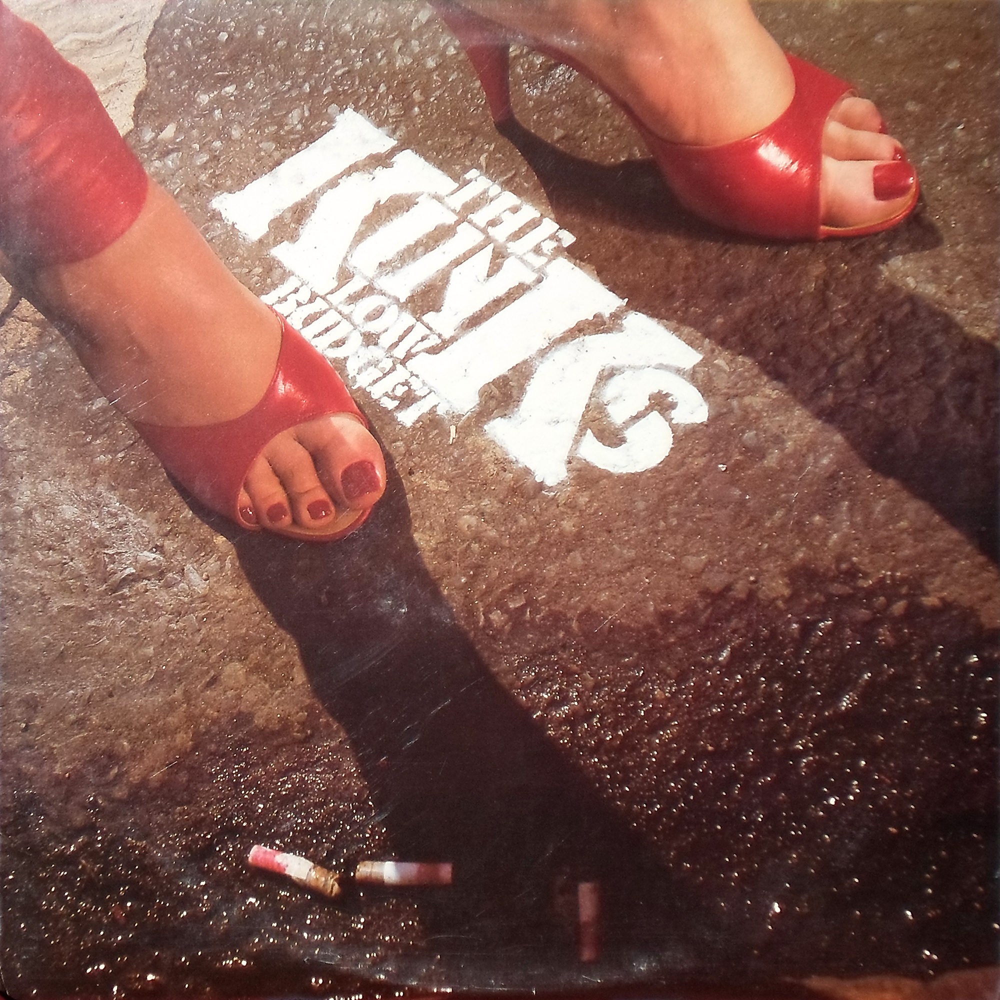

# Low Budget

By **The Kinks**

## Album Data

- **Catalog:** Beets
- **Format:** Digital, Album
- **Album:** Low Budget
- **Artist:** The Kinks
- **Albumartist:** The Kinks
- **Genre:** Power Pop
- **MusicBrainz Album Artist ID:** [17b53d9f-5c63-4a09-a593-dde4608e0db9](https://musicbrainz.org/artist/17b53d9f-5c63-4a09-a593-dde4608e0db9)
- **MusicBrainz Album ID:** [55037d0c-2cdb-477c-be22-bfa477568dbc](https://musicbrainz.org/release/55037d0c-2cdb-477c-be22-bfa477568dbc)
- **MusicBrainz Release Group ID:** [5aaa37e6-3d5b-3158-8783-644dfe7911fe](https://musicbrainz.org/release-group/5aaa37e6-3d5b-3158-8783-644dfe7911fe)
- **Year:** 1999
- **Catalog #:** 63467-79726-2
- **Label:** Velvel
- **Total Tracks:** 14

## Album Tracks

### Track 01 - Misfits

- **Artist:** The Kinks
- **Format:** ALAC
- **Genre:** Rock
- **Length:** 4:43
- **MusicBrainz Track ID:** [bf39336d-18a1-4e0b-ae5d-e2f18471909e](https://musicbrainz.org/recording/bf39336d-18a1-4e0b-ae5d-e2f18471909e)
- **Title:** Misfits
- **Track:** 01
- **Year:** 1998

### Track 02 - Hay Fever

- **Artist:** The Kinks
- **Format:** ALAC
- **Genre:** Hard Rock
- **Length:** 3:33
- **MusicBrainz Track ID:** [1304d4fd-1060-4e7d-bba9-022ff42f7715](https://musicbrainz.org/recording/1304d4fd-1060-4e7d-bba9-022ff42f7715)
- **Title:** Hay Fever
- **Track:** 02
- **Year:** 1998

### Track 03 - Black Messiah

- **Artist:** The Kinks
- **Format:** ALAC
- **Genre:** Ska
- **Length:** 4:10
- **MusicBrainz Track ID:** [de1a78b0-41f9-49e5-8dfc-06aacaf710e9](https://musicbrainz.org/recording/de1a78b0-41f9-49e5-8dfc-06aacaf710e9)
- **Title:** Black Messiah
- **Track:** 03
- **Year:** 1998

### Track 04 - A Rock ’n’ Roll Fantasy

- **Artist:** The Kinks
- **Format:** ALAC
- **Genre:** Rock
- **Length:** 5:02
- **MusicBrainz Track ID:** [eba10651-75e3-457d-8e10-32b6c4bb44ce](https://musicbrainz.org/recording/eba10651-75e3-457d-8e10-32b6c4bb44ce)
- **Title:** A Rock ’n’ Roll Fantasy
- **Track:** 04
- **Year:** 1998

### Track 05 - In a Foreign Land

- **Artist:** The Kinks
- **Format:** ALAC
- **Genre:** Hard Rock
- **Length:** 3:04
- **MusicBrainz Track ID:** [64e013d1-c2d5-485f-963b-49f4655ba239](https://musicbrainz.org/recording/64e013d1-c2d5-485f-963b-49f4655ba239)
- **Title:** In a Foreign Land
- **Track:** 05
- **Year:** 1998

### Track 06 - Permanent Waves

- **Artist:** The Kinks
- **Format:** ALAC
- **Genre:** Hard Rock
- **Length:** 3:49
- **MusicBrainz Track ID:** [8fc137dd-78ae-4328-81c5-8ff13a11bfdd](https://musicbrainz.org/recording/8fc137dd-78ae-4328-81c5-8ff13a11bfdd)
- **Title:** Permanent Waves
- **Track:** 06
- **Year:** 1998

### Track 07 - Live Life (UK album version)

- **Artist:** The Kinks
- **Format:** ALAC
- **Genre:** Rock
- **Length:** 4:49
- **MusicBrainz Track ID:** [928dbe72-9228-4675-94ee-887ea72e3698](https://musicbrainz.org/recording/928dbe72-9228-4675-94ee-887ea72e3698)
- **Title:** Live Life (UK album version)
- **Track:** 07
- **Year:** 1998

### Track 08 - Out of the Wardrobe

- **Artist:** The Kinks
- **Format:** ALAC
- **Genre:** Hard Rock
- **Length:** 3:38
- **MusicBrainz Track ID:** [c0724fb8-5361-49af-b1d5-957f7670d5a5](https://musicbrainz.org/recording/c0724fb8-5361-49af-b1d5-957f7670d5a5)
- **Title:** Out of the Wardrobe
- **Track:** 08
- **Year:** 1998

### Track 09 - Trust Your Heart

- **Artist:** The Kinks
- **Format:** ALAC
- **Genre:** Hard Rock
- **Length:** 4:13
- **MusicBrainz Track ID:** [9896c1ce-ba84-424e-b701-3a1022e6499b](https://musicbrainz.org/recording/9896c1ce-ba84-424e-b701-3a1022e6499b)
- **Title:** Trust Your Heart
- **Track:** 09
- **Year:** 1998

### Track 10 - Get Up

- **Artist:** The Kinks
- **Format:** ALAC
- **Genre:** Hard Rock
- **Length:** 3:23
- **MusicBrainz Track ID:** [c0c4dc1c-5469-42d5-9a7f-0c7c1b5baa02](https://musicbrainz.org/recording/c0c4dc1c-5469-42d5-9a7f-0c7c1b5baa02)
- **Title:** Get Up
- **Track:** 10
- **Year:** 1998

### Track 11 - Black Messiah (single remix)

- **Artist:** The Kinks
- **Format:** ALAC
- **Genre:** Hard Rock
- **Length:** 3:37
- **MusicBrainz Track ID:** [c3964feb-ce1e-4066-979a-e784319cbdb1](https://musicbrainz.org/recording/c3964feb-ce1e-4066-979a-e784319cbdb1)
- **Title:** Black Messiah (single remix)
- **Track:** 11
- **Year:** 1998

### Track 12 - Father Christmas

- **Artist:** The Kinks
- **Format:** ALAC
- **Genre:** Power Pop
- **Length:** 3:41
- **MusicBrainz Track ID:** [27c776f8-e369-43fa-9164-1fdfb5141bd0](https://musicbrainz.org/recording/27c776f8-e369-43fa-9164-1fdfb5141bd0)
- **Title:** Father Christmas
- **Track:** 12
- **Year:** 1998

### Track 13 - A Rock ’n’ Roll Fantasy (US single edit)

- **Artist:** The Kinks
- **Format:** ALAC
- **Genre:** Rock
- **Length:** 4:01
- **MusicBrainz Track ID:** [6b24fa61-29c3-4049-a844-cdd9f635fba2](https://musicbrainz.org/recording/6b24fa61-29c3-4049-a844-cdd9f635fba2)
- **Title:** A Rock ’n’ Roll Fantasy (US single edit)
- **Track:** 13
- **Year:** 1998

### Track 14 - Live Life (US single mix)

- **Artist:** The Kinks
- **Format:** ALAC
- **Genre:** Rock
- **Length:** 3:47
- **MusicBrainz Track ID:** [21088e7f-dac2-448c-a83c-dbdbf6782639](https://musicbrainz.org/recording/21088e7f-dac2-448c-a83c-dbdbf6782639)
- **Title:** Live Life (US single mix)
- **Track:** 14
- **Year:** 1998

## See also

- [Everybody's in Showbiz (Legacy Edition)](Everybodys_in_Showbiz_Legacy_Edition.md)
- [Everybody’s in Show‐Biz](Everybody’s_in_Show‐Biz.md)
- [Face To Face](Face_To_Face.md)
- [Lola Versus Powerman and the Moneygoround, Part One](Lola_Versus_Powerman_and_the_Moneygoround__Part_One.md)
- [Misfits](Misfits.md)
- [Muswell Hillbillies](Muswell_Hillbillies.md)
- [Phobia](Phobia.md)
- [Preservation Act 1](Preservation_Act_1.md)
- [Preservation Act 2](Preservation_Act_2.md)
- [Sleepwalker](Sleepwalker.md)
- [Soap Opera](Soap_Opera.md)
- [The Anthology 1964–1971](The_Anthology_1964–1971.md)
- [CD: Lola Versus Powerman And The Money-Go-Round (Part One)](../../CD/The_Kinks/Lola_Versus_Powerman_And_The_Money-Go-Round_Part_One.md)
- [CD: Muswell Hillbillies](../../CD/The_Kinks/Muswell_Hillbillies.md)
- [CD: The Anthology 1964 - 1971 (Disc 1)](../../CD/The_Kinks/The_Anthology_1964_-_1971_Disc_1.md)
- [CD: The Anthology 1964 - 1971 (Disc 2)](../../CD/The_Kinks/The_Anthology_1964_-_1971_Disc_2.md)
- [CD: The Anthology 1964 - 1971 (Disc 3)](../../CD/The_Kinks/The_Anthology_1964_-_1971_Disc_3.md)
- [CD: The Anthology 1964 - 1971 (Disc 4)](../../CD/The_Kinks/The_Anthology_1964_-_1971_Disc_4.md)
- [CD: The Anthology 1964 - 1971 (Disc 5)](../../CD/The_Kinks/The_Anthology_1964_-_1971_Disc_5.md)
- [CD: ](../../CD/The_Kinks/The_Kinks.md)
- [Roon: Arthur or the Decline and Fall of the British Empire (2019 Deluxe)](../../Roon/The_Kinks/Arthur_or_the_Decline_and_Fall_of_the_British_Empire_2019_Deluxe.md)
- [Roon: Come Dancing with the Kinks (The Best of the Kinks 1977-1986)](../../Roon/The_Kinks/Come_Dancing_with_the_Kinks_The_Best_of_the_Kinks_1977-1986.md)
- [Roon: Everybody's in Show-Biz (Deluxe (2022 Remaster))](../../Roon/The_Kinks/Everybodys_in_Show-Biz_Deluxe_2022_Remaster.md)
- [Roon: Everybody's in Show-Biz (Legacy Edition)](../../Roon/The_Kinks/Everybodys_in_Show-Biz_Legacy_Edition.md)
- [Roon: Everybody's in Show-Biz](../../Roon/The_Kinks/Everybodys_in_Show-Biz.md)
- [Roon: Lola Versus Powerman and the Moneygoround, Pt. 1 (Deluxe)](../../Roon/The_Kinks/Lola_Versus_Powerman_and_the_Moneygoround__Pt_1_Deluxe.md)
- [Roon: Lola vs. Powerman and the Moneygoround, Pt. 1](../../Roon/The_Kinks/Lola_vs_Powerman_and_the_Moneygoround__Pt_1.md)
- [Roon: Muswell Hillbillies (Deluxe Edition)](../../Roon/The_Kinks/Muswell_Hillbillies_Deluxe_Edition.md)
- [Roon: Muswell Hillbillies (Super Deluxe)](../../Roon/The_Kinks/Muswell_Hillbillies_Super_Deluxe.md)
- [Roon: Preservation Act 1](../../Roon/The_Kinks/Preservation_Act_1.md)
- [Roon: Schoolboys in Disgrace](../../Roon/The_Kinks/Schoolboys_in_Disgrace.md)
- [Roon: Sleepwalker](../../Roon/The_Kinks/Sleepwalker.md)
- [Roon: Soap Opera](../../Roon/The_Kinks/Soap_Opera.md)
- [Roon: The Anthology 1964 - 1971 (2014 Remastered Version)](../../Roon/The_Kinks/The_Anthology_1964_-_1971_2014_Remastered_Version.md)
- [Roon: The Anthology 1964-1971](../../Roon/The_Kinks/The_Anthology_1964-1971.md)
- [Vinyl: 20th Anniversary Box Set](../../Vinyl/The_Kinks/20th_Anniversary_Box_Set.md)
- [Vinyl: Everybody's In Show-Biz](../../Vinyl/The_Kinks/Everybodys_In_Show-Biz.md)
- [Vinyl: Father Christmas / (Wish I Could Fly Like) Superman](../../Vinyl/The_Kinks/Father_Christmas_-_Wish_I_Could_Fly_Like_Superman.md)
- [Vinyl: Muswell Hillbillies](../../Vinyl/The_Kinks/Muswell_Hillbillies.md)
- [Vinyl: Preservation Act 1](../../Vinyl/The_Kinks/Preservation_Act_1.md)
- [Vinyl: Sleepwalker](../../Vinyl/The_Kinks/Sleepwalker.md)
- [Vinyl: Soap Opera](../../Vinyl/The_Kinks/Soap_Opera.md)
- [Vinyl: ](../../Vinyl/The_Kinks/The_Kinks.md)
- [Vinyl: The Mono Collection](../../Vinyl/The_Kinks/The_Mono_Collection.md)
- [Vinyl: You Really Got Me](../../Vinyl/The_Kinks/You_Really_Got_Me.md)
