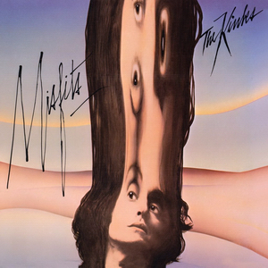

# Misfits

By **The Kinks**

## Album Data

- **Catalog:** Beets
- **Format:** Digital, Album
- **Album:** Misfits
- **Artist:** The Kinks
- **Albumartist:** The Kinks
- **Genre:** Rock
- **MusicBrainz Album Artist ID:** [17b53d9f-5c63-4a09-a593-dde4608e0db9](https://musicbrainz.org/artist/17b53d9f-5c63-4a09-a593-dde4608e0db9)
- **MusicBrainz Album ID:** [77eed40a-6cdf-439a-b18f-b84f5f39e41f](https://musicbrainz.org/release/77eed40a-6cdf-439a-b18f-b84f5f39e41f)
- **MusicBrainz Release Group ID:** [28de1848-f994-310d-a070-ecb756b8f885](https://musicbrainz.org/release-group/28de1848-f994-310d-a070-ecb756b8f885)
- **Year:** 1998
- **Catalog #:** 63467-79719-2
- **Label:** Velvel
- **Total Tracks:** 14

## Album Tracks

### Track 01 - 20th Century Man

- **Artist:** The Kinks
- **Format:** ALAC
- **Genre:** Hard Rock
- **Length:** 5:57
- **MusicBrainz Track ID:** [2c67a14f-b7ea-4743-b7e0-2f8fd3c3a301](https://musicbrainz.org/recording/2c67a14f-b7ea-4743-b7e0-2f8fd3c3a301)
- **Title:** 20th Century Man
- **Track:** 01
- **Year:** 1998

### Track 02 - Acute Schizophrenia Paranoia Blues

- **Artist:** The Kinks
- **Format:** ALAC
- **Genre:** Hard Rock
- **Length:** 3:32
- **MusicBrainz Track ID:** [3d1aac8e-4e8c-4408-9c76-aabad7e641f6](https://musicbrainz.org/recording/3d1aac8e-4e8c-4408-9c76-aabad7e641f6)
- **Title:** Acute Schizophrenia Paranoia Blues
- **Track:** 02
- **Year:** 1998

### Track 03 - Holiday

- **Artist:** The Kinks
- **Format:** ALAC
- **Genre:** Hard Rock
- **Length:** 2:40
- **MusicBrainz Track ID:** [2c1d81fa-bdae-4b94-bb63-5142cf1df437](https://musicbrainz.org/recording/2c1d81fa-bdae-4b94-bb63-5142cf1df437)
- **Title:** Holiday
- **Track:** 03
- **Year:** 1998

### Track 04 - Skin and Bone

- **Artist:** The Kinks
- **Format:** ALAC
- **Genre:** Britpop
- **Length:** 3:39
- **MusicBrainz Track ID:** [bc082e18-0bc9-4fd6-8f7f-64175d06b050](https://musicbrainz.org/recording/bc082e18-0bc9-4fd6-8f7f-64175d06b050)
- **Title:** Skin and Bone
- **Track:** 04
- **Year:** 1998

### Track 05 - Alcohol

- **Artist:** The Kinks
- **Format:** ALAC
- **Genre:** Hard Rock
- **Length:** 3:35
- **MusicBrainz Track ID:** [88faff98-6f53-4310-8d32-9bf25adae4a1](https://musicbrainz.org/recording/88faff98-6f53-4310-8d32-9bf25adae4a1)
- **Title:** Alcohol
- **Track:** 05
- **Year:** 1998

### Track 06 - Complicated Life

- **Artist:** The Kinks
- **Format:** ALAC
- **Genre:** Hard Rock
- **Length:** 4:02
- **MusicBrainz Track ID:** [b4ce7947-7b10-48a0-8b15-fc6652ddb50c](https://musicbrainz.org/recording/b4ce7947-7b10-48a0-8b15-fc6652ddb50c)
- **Title:** Complicated Life
- **Track:** 06
- **Year:** 1998

### Track 07 - Here Come the People in Grey

- **Artist:** The Kinks
- **Format:** ALAC
- **Genre:** Hard Rock
- **Length:** 3:46
- **MusicBrainz Track ID:** [3f08db12-a200-4715-853f-d830ebc4348b](https://musicbrainz.org/recording/3f08db12-a200-4715-853f-d830ebc4348b)
- **Title:** Here Come the People in Grey
- **Track:** 07
- **Year:** 1998

### Track 08 - Have a Cuppa Tea

- **Artist:** The Kinks
- **Format:** ALAC
- **Genre:** Hard Rock
- **Length:** 3:45
- **MusicBrainz Track ID:** [67e6f2bb-2c15-4d7a-b998-f96442abbc74](https://musicbrainz.org/recording/67e6f2bb-2c15-4d7a-b998-f96442abbc74)
- **Title:** Have a Cuppa Tea
- **Track:** 08
- **Year:** 1998

### Track 09 - Holloway Jail

- **Artist:** The Kinks
- **Format:** ALAC
- **Genre:** Hard Rock
- **Length:** 3:29
- **MusicBrainz Track ID:** [86d3474e-3043-4fa7-8117-e2035838599d](https://musicbrainz.org/recording/86d3474e-3043-4fa7-8117-e2035838599d)
- **Title:** Holloway Jail
- **Track:** 09
- **Year:** 1998

### Track 10 - Oklahoma U.S.A.

- **Artist:** The Kinks
- **Format:** ALAC
- **Genre:** Hard Rock
- **Length:** 2:38
- **MusicBrainz Track ID:** [977b036d-9d5b-40bf-b570-2a86b74279fe](https://musicbrainz.org/recording/977b036d-9d5b-40bf-b570-2a86b74279fe)
- **Title:** Oklahoma U.S.A.
- **Track:** 10
- **Year:** 1998

### Track 11 - Uncle Son

- **Artist:** The Kinks
- **Format:** ALAC
- **Genre:** Hard Rock
- **Length:** 2:33
- **MusicBrainz Track ID:** [c0b325ff-1d61-4546-b061-1cb5214727b9](https://musicbrainz.org/recording/c0b325ff-1d61-4546-b061-1cb5214727b9)
- **Title:** Uncle Son
- **Track:** 11
- **Year:** 1998

### Track 12 - Muswell Hillbilly

- **Artist:** The Kinks
- **Format:** ALAC
- **Genre:** Hard Rock
- **Length:** 4:58
- **MusicBrainz Track ID:** [c6547b48-acd2-46d5-b1e3-f14c86acde63](https://musicbrainz.org/recording/c6547b48-acd2-46d5-b1e3-f14c86acde63)
- **Title:** Muswell Hillbilly
- **Track:** 12
- **Year:** 1998

### Track 13 - Mountain Woman

- **Artist:** The Kinks
- **Format:** ALAC
- **Genre:** Country Rock
- **Length:** 3:08
- **MusicBrainz Track ID:** [7adeb82d-bf55-4e08-8972-e9b2f95397a7](https://musicbrainz.org/recording/7adeb82d-bf55-4e08-8972-e9b2f95397a7)
- **Title:** Mountain Woman
- **Track:** 13
- **Year:** 1998

### Track 14 - Kentucky Moon

- **Artist:** The Kinks
- **Format:** ALAC
- **Genre:** Country Rock
- **Length:** 3:57
- **MusicBrainz Track ID:** [5787c37f-7800-4a42-b0a7-f9834c841133](https://musicbrainz.org/recording/5787c37f-7800-4a42-b0a7-f9834c841133)
- **Title:** Kentucky Moon
- **Track:** 14
- **Year:** 1998

## See also

- [Everybody's in Showbiz (Legacy Edition)](Everybodys_in_Showbiz_Legacy_Edition.md)
- [Everybody’s in Show‐Biz](Everybody’s_in_Show‐Biz.md)
- [Face To Face](Face_To_Face.md)
- [Lola Versus Powerman and the Moneygoround, Part One](Lola_Versus_Powerman_and_the_Moneygoround__Part_One.md)
- [Low Budget](Low_Budget.md)
- [Muswell Hillbillies](Muswell_Hillbillies.md)
- [Phobia](Phobia.md)
- [Preservation Act 1](Preservation_Act_1.md)
- [Preservation Act 2](Preservation_Act_2.md)
- [Sleepwalker](Sleepwalker.md)
- [Soap Opera](Soap_Opera.md)
- [The Anthology 1964–1971](The_Anthology_1964–1971.md)
- [CD: Lola Versus Powerman And The Money-Go-Round (Part One)](../../CD/The_Kinks/Lola_Versus_Powerman_And_The_Money-Go-Round_Part_One.md)
- [CD: Muswell Hillbillies](../../CD/The_Kinks/Muswell_Hillbillies.md)
- [CD: The Anthology 1964 - 1971 (Disc 1)](../../CD/The_Kinks/The_Anthology_1964_-_1971_Disc_1.md)
- [CD: The Anthology 1964 - 1971 (Disc 2)](../../CD/The_Kinks/The_Anthology_1964_-_1971_Disc_2.md)
- [CD: The Anthology 1964 - 1971 (Disc 3)](../../CD/The_Kinks/The_Anthology_1964_-_1971_Disc_3.md)
- [CD: The Anthology 1964 - 1971 (Disc 4)](../../CD/The_Kinks/The_Anthology_1964_-_1971_Disc_4.md)
- [CD: The Anthology 1964 - 1971 (Disc 5)](../../CD/The_Kinks/The_Anthology_1964_-_1971_Disc_5.md)
- [CD: ](../../CD/The_Kinks/The_Kinks.md)
- [Roon: Arthur or the Decline and Fall of the British Empire (2019 Deluxe)](../../Roon/The_Kinks/Arthur_or_the_Decline_and_Fall_of_the_British_Empire_2019_Deluxe.md)
- [Roon: Come Dancing with the Kinks (The Best of the Kinks 1977-1986)](../../Roon/The_Kinks/Come_Dancing_with_the_Kinks_The_Best_of_the_Kinks_1977-1986.md)
- [Roon: Everybody's in Show-Biz (Deluxe (2022 Remaster))](../../Roon/The_Kinks/Everybodys_in_Show-Biz_Deluxe_2022_Remaster.md)
- [Roon: Everybody's in Show-Biz (Legacy Edition)](../../Roon/The_Kinks/Everybodys_in_Show-Biz_Legacy_Edition.md)
- [Roon: Everybody's in Show-Biz](../../Roon/The_Kinks/Everybodys_in_Show-Biz.md)
- [Roon: Lola Versus Powerman and the Moneygoround, Pt. 1 (Deluxe)](../../Roon/The_Kinks/Lola_Versus_Powerman_and_the_Moneygoround__Pt_1_Deluxe.md)
- [Roon: Lola vs. Powerman and the Moneygoround, Pt. 1](../../Roon/The_Kinks/Lola_vs_Powerman_and_the_Moneygoround__Pt_1.md)
- [Roon: Muswell Hillbillies (Deluxe Edition)](../../Roon/The_Kinks/Muswell_Hillbillies_Deluxe_Edition.md)
- [Roon: Muswell Hillbillies (Super Deluxe)](../../Roon/The_Kinks/Muswell_Hillbillies_Super_Deluxe.md)
- [Roon: Preservation Act 1](../../Roon/The_Kinks/Preservation_Act_1.md)
- [Roon: Schoolboys in Disgrace](../../Roon/The_Kinks/Schoolboys_in_Disgrace.md)
- [Roon: Sleepwalker](../../Roon/The_Kinks/Sleepwalker.md)
- [Roon: Soap Opera](../../Roon/The_Kinks/Soap_Opera.md)
- [Roon: The Anthology 1964 - 1971 (2014 Remastered Version)](../../Roon/The_Kinks/The_Anthology_1964_-_1971_2014_Remastered_Version.md)
- [Roon: The Anthology 1964-1971](../../Roon/The_Kinks/The_Anthology_1964-1971.md)
- [Vinyl: 20th Anniversary Box Set](../../Vinyl/The_Kinks/20th_Anniversary_Box_Set.md)
- [Vinyl: Everybody's In Show-Biz](../../Vinyl/The_Kinks/Everybodys_In_Show-Biz.md)
- [Vinyl: Father Christmas / (Wish I Could Fly Like) Superman](../../Vinyl/The_Kinks/Father_Christmas_-_Wish_I_Could_Fly_Like_Superman.md)
- [Vinyl: Muswell Hillbillies](../../Vinyl/The_Kinks/Muswell_Hillbillies.md)
- [Vinyl: Preservation Act 1](../../Vinyl/The_Kinks/Preservation_Act_1.md)
- [Vinyl: Sleepwalker](../../Vinyl/The_Kinks/Sleepwalker.md)
- [Vinyl: Soap Opera](../../Vinyl/The_Kinks/Soap_Opera.md)
- [Vinyl: ](../../Vinyl/The_Kinks/The_Kinks.md)
- [Vinyl: The Mono Collection](../../Vinyl/The_Kinks/The_Mono_Collection.md)
- [Vinyl: You Really Got Me](../../Vinyl/The_Kinks/You_Really_Got_Me.md)
