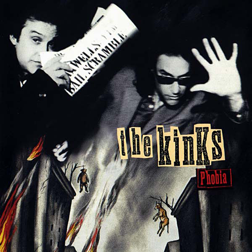

# Phobia

By **The Kinks**

## Album Data

- **Catalog:** Beets
- **Format:** Digital, Album
- **Album:** Phobia
- **Artist:** The Kinks
- **Albumartist:** The Kinks
- **Genre:** Rock
- **MusicBrainz Album Artist ID:** [17b53d9f-5c63-4a09-a593-dde4608e0db9](https://musicbrainz.org/artist/17b53d9f-5c63-4a09-a593-dde4608e0db9)
- **MusicBrainz Album ID:** [f8b0b19b-9568-42cf-be7b-c0674217e0db](https://musicbrainz.org/release/f8b0b19b-9568-42cf-be7b-c0674217e0db)
- **MusicBrainz Release Group ID:** [66cc4f28-af7c-3865-b444-8f595e30f84a](https://musicbrainz.org/release-group/66cc4f28-af7c-3865-b444-8f595e30f84a)
- **Year:** 1993
- **Catalog #:** 
- **Label:** Sanctuary Records
- **Total Tracks:** 21

## Album Tracks

### Track 01 - Announcement 1

- **Artist:** The Kinks
- **Format:** AAC
- **Genre:** Rock
- **Length:** 0:42
- **MusicBrainz Track ID:** [1b973c45-fdd3-4564-8e2f-d0aabff697fc](https://musicbrainz.org/recording/1b973c45-fdd3-4564-8e2f-d0aabff697fc)
- **Title:** Announcement 1
- **Track:** 01
- **Year:** 1974

### Track 02 - Introduction to Solution

- **Artist:** The Kinks
- **Format:** AAC
- **Genre:** Rock
- **Length:** 2:44
- **MusicBrainz Track ID:** [55464c7c-f27f-4b06-b209-ad88b4773d6a](https://musicbrainz.org/recording/55464c7c-f27f-4b06-b209-ad88b4773d6a)
- **Title:** Introduction to Solution
- **Track:** 02
- **Year:** 1974

### Track 03 - When a Solution Comes

- **Artist:** The Kinks
- **Format:** AAC
- **Genre:** Rock
- **Length:** 3:43
- **MusicBrainz Track ID:** [0634770e-d852-4c62-aad1-f7ea8c249dd3](https://musicbrainz.org/recording/0634770e-d852-4c62-aad1-f7ea8c249dd3)
- **Title:** When a Solution Comes
- **Track:** 03
- **Year:** 1974

### Track 04 - Money Talks

- **Artist:** The Kinks
- **Format:** AAC
- **Genre:** Rock
- **Length:** 3:48
- **MusicBrainz Track ID:** [197fa735-2b7e-41e1-866e-4e4cf2a5b291](https://musicbrainz.org/recording/197fa735-2b7e-41e1-866e-4e4cf2a5b291)
- **Title:** Money Talks
- **Track:** 04
- **Year:** 1974

### Track 05 - Announcement 2

- **Artist:** The Kinks
- **Format:** AAC
- **Genre:** Rock
- **Length:** 0:56
- **MusicBrainz Track ID:** [405e902c-18e5-49ad-8e56-385bfef80e47](https://musicbrainz.org/recording/405e902c-18e5-49ad-8e56-385bfef80e47)
- **Title:** Announcement 2
- **Track:** 05
- **Year:** 1974

### Track 06 - Shepherds of the Nation

- **Artist:** The Kinks
- **Format:** AAC
- **Genre:** Rock
- **Length:** 4:20
- **MusicBrainz Track ID:** [0f2ea88b-9744-4bd5-a65d-666bc5305eb3](https://musicbrainz.org/recording/0f2ea88b-9744-4bd5-a65d-666bc5305eb3)
- **Title:** Shepherds of the Nation
- **Track:** 06
- **Year:** 1974

### Track 07 - Scum of the Earth

- **Artist:** The Kinks
- **Format:** AAC
- **Genre:** Rock
- **Length:** 2:48
- **MusicBrainz Track ID:** [fb15bb4b-5872-4482-8f4d-425a44e5f337](https://musicbrainz.org/recording/fb15bb4b-5872-4482-8f4d-425a44e5f337)
- **Title:** Scum of the Earth
- **Track:** 07
- **Year:** 1974

### Track 08 - Second‐Hand Car Spiv

- **Artist:** The Kinks
- **Format:** AAC
- **Genre:** Rock
- **Length:** 4:05
- **MusicBrainz Track ID:** [fc3194db-2565-4455-beb2-0b316e68b2a9](https://musicbrainz.org/recording/fc3194db-2565-4455-beb2-0b316e68b2a9)
- **Title:** Second‐Hand Car Spiv
- **Track:** 08
- **Year:** 1974

### Track 09 - He’s Evil

- **Artist:** The Kinks
- **Format:** AAC
- **Genre:** Rock
- **Length:** 4:29
- **MusicBrainz Track ID:** [370f5a88-ca32-464a-b439-27769e22edbb](https://musicbrainz.org/recording/370f5a88-ca32-464a-b439-27769e22edbb)
- **Title:** He’s Evil
- **Track:** 09
- **Year:** 1974

### Track 10 - Mirror of Love

- **Artist:** The Kinks
- **Format:** AAC
- **Genre:** Rock
- **Length:** 3:32
- **MusicBrainz Track ID:** [7a7bbd20-f210-4691-8a5a-b4a5c796d62a](https://musicbrainz.org/recording/7a7bbd20-f210-4691-8a5a-b4a5c796d62a)
- **Title:** Mirror of Love
- **Track:** 10
- **Year:** 1974

### Track 11 - Announcement 3

- **Artist:** The Kinks
- **Format:** AAC
- **Genre:** Rock
- **Length:** 0:35
- **MusicBrainz Track ID:** [bd676400-88c1-4bb9-88b6-f753693278ae](https://musicbrainz.org/recording/bd676400-88c1-4bb9-88b6-f753693278ae)
- **Title:** Announcement 3
- **Track:** 11
- **Year:** 1974

### Track 12 - Nobody Gives

- **Artist:** The Kinks
- **Format:** AAC
- **Genre:** Rock
- **Length:** 6:42
- **MusicBrainz Track ID:** [0a619127-fcc0-4b2e-a9ba-bb989eb44f33](https://musicbrainz.org/recording/0a619127-fcc0-4b2e-a9ba-bb989eb44f33)
- **Title:** Nobody Gives
- **Track:** 12
- **Year:** 1974

### Track 13 - Oh Where Oh Where Is Love?

- **Artist:** The Kinks
- **Format:** AAC
- **Genre:** Rock
- **Length:** 3:43
- **MusicBrainz Track ID:** [a5478ac6-e5f1-4455-9615-055ab05f6a04](https://musicbrainz.org/recording/a5478ac6-e5f1-4455-9615-055ab05f6a04)
- **Title:** Oh Where Oh Where Is Love?
- **Track:** 13
- **Year:** 1974

### Track 14 - Flash’s Dream (The Final Elbow)

- **Artist:** The Kinks
- **Format:** AAC
- **Genre:** Rock
- **Length:** 3:59
- **MusicBrainz Track ID:** [2137fdc8-c6c4-4749-a4f5-0d81151982fc](https://musicbrainz.org/recording/2137fdc8-c6c4-4749-a4f5-0d81151982fc)
- **Title:** Flash’s Dream (The Final Elbow)
- **Track:** 14
- **Year:** 1974

### Track 15 - Flash’s Confession

- **Artist:** The Kinks
- **Format:** AAC
- **Genre:** Rock
- **Length:** 4:32
- **MusicBrainz Track ID:** [f5163582-9e79-4981-ad27-3c274d288cff](https://musicbrainz.org/recording/f5163582-9e79-4981-ad27-3c274d288cff)
- **Title:** Flash’s Confession
- **Track:** 15
- **Year:** 1974

### Track 16 - Nothing Lasts Forever

- **Artist:** The Kinks
- **Format:** AAC
- **Genre:** Rock
- **Length:** 3:46
- **MusicBrainz Track ID:** [ca02009c-5f36-4596-a002-cee14087e4ab](https://musicbrainz.org/recording/ca02009c-5f36-4596-a002-cee14087e4ab)
- **Title:** Nothing Lasts Forever
- **Track:** 16
- **Year:** 1974

### Track 17 - Announcement 4

- **Artist:** The Kinks
- **Format:** AAC
- **Genre:** Rock
- **Length:** 0:20
- **MusicBrainz Track ID:** [6482c84f-c5ad-4851-93ac-0ea3770f5a37](https://musicbrainz.org/recording/6482c84f-c5ad-4851-93ac-0ea3770f5a37)
- **Title:** Announcement 4
- **Track:** 17
- **Year:** 1974

### Track 18 - Artificial Man

- **Artist:** The Kinks
- **Format:** AAC
- **Genre:** Rock
- **Length:** 5:34
- **MusicBrainz Track ID:** [af346e8c-f3d4-40c4-b026-e5f820c45f1d](https://musicbrainz.org/recording/af346e8c-f3d4-40c4-b026-e5f820c45f1d)
- **Title:** Artificial Man
- **Track:** 18
- **Year:** 1974

### Track 19 - Scrapheap City

- **Artist:** The Kinks
- **Format:** AAC
- **Genre:** Rock
- **Length:** 3:19
- **MusicBrainz Track ID:** [c2cc2248-99ee-45be-a1e2-679354cb4663](https://musicbrainz.org/recording/c2cc2248-99ee-45be-a1e2-679354cb4663)
- **Title:** Scrapheap City
- **Track:** 19
- **Year:** 1974

### Track 20 - Announcement 5

- **Artist:** The Kinks
- **Format:** AAC
- **Genre:** Rock
- **Length:** 1:06
- **MusicBrainz Track ID:** [cbcc4e62-39b0-4ddb-92e7-21d108346163](https://musicbrainz.org/recording/cbcc4e62-39b0-4ddb-92e7-21d108346163)
- **Title:** Announcement 5
- **Track:** 20
- **Year:** 1974

### Track 21 - Salvation Road

- **Artist:** The Kinks
- **Format:** AAC
- **Genre:** Rock
- **Length:** 3:22
- **MusicBrainz Track ID:** [0e57c10c-d8e8-4804-ab7e-1637d43a8b75](https://musicbrainz.org/recording/0e57c10c-d8e8-4804-ab7e-1637d43a8b75)
- **Title:** Salvation Road
- **Track:** 21
- **Year:** 1974

## See also

- [Everybody's in Showbiz (Legacy Edition)](Everybodys_in_Showbiz_Legacy_Edition.md)
- [Everybody’s in Show‐Biz](Everybody’s_in_Show‐Biz.md)
- [Face To Face](Face_To_Face.md)
- [Lola Versus Powerman and the Moneygoround, Part One](Lola_Versus_Powerman_and_the_Moneygoround__Part_One.md)
- [Low Budget](Low_Budget.md)
- [Misfits](Misfits.md)
- [Muswell Hillbillies](Muswell_Hillbillies.md)
- [Preservation Act 1](Preservation_Act_1.md)
- [Preservation Act 2](Preservation_Act_2.md)
- [Sleepwalker](Sleepwalker.md)
- [Soap Opera](Soap_Opera.md)
- [The Anthology 1964–1971](The_Anthology_1964–1971.md)
- [CD: Lola Versus Powerman And The Money-Go-Round (Part One)](../../CD/The_Kinks/Lola_Versus_Powerman_And_The_Money-Go-Round_Part_One.md)
- [CD: Muswell Hillbillies](../../CD/The_Kinks/Muswell_Hillbillies.md)
- [CD: The Anthology 1964 - 1971 (Disc 1)](../../CD/The_Kinks/The_Anthology_1964_-_1971_Disc_1.md)
- [CD: The Anthology 1964 - 1971 (Disc 2)](../../CD/The_Kinks/The_Anthology_1964_-_1971_Disc_2.md)
- [CD: The Anthology 1964 - 1971 (Disc 3)](../../CD/The_Kinks/The_Anthology_1964_-_1971_Disc_3.md)
- [CD: The Anthology 1964 - 1971 (Disc 4)](../../CD/The_Kinks/The_Anthology_1964_-_1971_Disc_4.md)
- [CD: The Anthology 1964 - 1971 (Disc 5)](../../CD/The_Kinks/The_Anthology_1964_-_1971_Disc_5.md)
- [CD: ](../../CD/The_Kinks/The_Kinks.md)
- [Roon: Arthur or the Decline and Fall of the British Empire (2019 Deluxe)](../../Roon/The_Kinks/Arthur_or_the_Decline_and_Fall_of_the_British_Empire_2019_Deluxe.md)
- [Roon: Come Dancing with the Kinks (The Best of the Kinks 1977-1986)](../../Roon/The_Kinks/Come_Dancing_with_the_Kinks_The_Best_of_the_Kinks_1977-1986.md)
- [Roon: Everybody's in Show-Biz (Deluxe (2022 Remaster))](../../Roon/The_Kinks/Everybodys_in_Show-Biz_Deluxe_2022_Remaster.md)
- [Roon: Everybody's in Show-Biz (Legacy Edition)](../../Roon/The_Kinks/Everybodys_in_Show-Biz_Legacy_Edition.md)
- [Roon: Everybody's in Show-Biz](../../Roon/The_Kinks/Everybodys_in_Show-Biz.md)
- [Roon: Lola Versus Powerman and the Moneygoround, Pt. 1 (Deluxe)](../../Roon/The_Kinks/Lola_Versus_Powerman_and_the_Moneygoround__Pt_1_Deluxe.md)
- [Roon: Lola vs. Powerman and the Moneygoround, Pt. 1](../../Roon/The_Kinks/Lola_vs_Powerman_and_the_Moneygoround__Pt_1.md)
- [Roon: Muswell Hillbillies (Deluxe Edition)](../../Roon/The_Kinks/Muswell_Hillbillies_Deluxe_Edition.md)
- [Roon: Muswell Hillbillies (Super Deluxe)](../../Roon/The_Kinks/Muswell_Hillbillies_Super_Deluxe.md)
- [Roon: Preservation Act 1](../../Roon/The_Kinks/Preservation_Act_1.md)
- [Roon: Schoolboys in Disgrace](../../Roon/The_Kinks/Schoolboys_in_Disgrace.md)
- [Roon: Sleepwalker](../../Roon/The_Kinks/Sleepwalker.md)
- [Roon: Soap Opera](../../Roon/The_Kinks/Soap_Opera.md)
- [Roon: The Anthology 1964 - 1971 (2014 Remastered Version)](../../Roon/The_Kinks/The_Anthology_1964_-_1971_2014_Remastered_Version.md)
- [Roon: The Anthology 1964-1971](../../Roon/The_Kinks/The_Anthology_1964-1971.md)
- [Vinyl: 20th Anniversary Box Set](../../Vinyl/The_Kinks/20th_Anniversary_Box_Set.md)
- [Vinyl: Everybody's In Show-Biz](../../Vinyl/The_Kinks/Everybodys_In_Show-Biz.md)
- [Vinyl: Father Christmas / (Wish I Could Fly Like) Superman](../../Vinyl/The_Kinks/Father_Christmas_-_Wish_I_Could_Fly_Like_Superman.md)
- [Vinyl: Muswell Hillbillies](../../Vinyl/The_Kinks/Muswell_Hillbillies.md)
- [Vinyl: Preservation Act 1](../../Vinyl/The_Kinks/Preservation_Act_1.md)
- [Vinyl: Sleepwalker](../../Vinyl/The_Kinks/Sleepwalker.md)
- [Vinyl: Soap Opera](../../Vinyl/The_Kinks/Soap_Opera.md)
- [Vinyl: ](../../Vinyl/The_Kinks/The_Kinks.md)
- [Vinyl: The Mono Collection](../../Vinyl/The_Kinks/The_Mono_Collection.md)
- [Vinyl: You Really Got Me](../../Vinyl/The_Kinks/You_Really_Got_Me.md)
