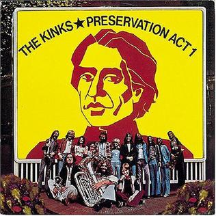

# Preservation Act 1

By **The Kinks**

## Album Data

- **Catalog:** Beets
- **Format:** Digital, Album
- **Album:** Preservation Act 1
- **Artist:** The Kinks
- **Albumartist:** The Kinks
- **Genre:** Rock
- **MusicBrainz Album Artist ID:** 
- **MusicBrainz Album ID:** 
- **MusicBrainz Release Group ID:** 
- **Year:** 1973
- **Catalog #:** 
- **Label:** 
- **Total Tracks:** 11

## Album Tracks

### Track 01 - Morning Song

- **Artist:** The Kinks
- **Format:** AAC
- **Genre:** Progressive Rock
- **Length:** 1:55
- **MusicBrainz Track ID:** 
- **Title:** Morning Song
- **Track:** 01
- **Year:** 1973

### Track 02 - Daylight

- **Artist:** The Kinks
- **Format:** AAC
- **Genre:** Rock
- **Length:** 3:22
- **MusicBrainz Track ID:** 
- **Title:** Daylight
- **Track:** 02
- **Year:** 1973

### Track 02 - Morning Song

- **Artist:** The Kinks
- **Format:** AAC
- **Genre:** Progressive Rock
- **Length:** 1:55
- **MusicBrainz Track ID:** 
- **Title:** Morning Song
- **Track:** 02
- **Year:** 0000

### Track 03 - Daylight

- **Artist:** The Kinks
- **Format:** AAC
- **Genre:** Rock
- **Length:** 3:22
- **MusicBrainz Track ID:** 
- **Title:** Daylight
- **Track:** 03
- **Year:** 0000

### Track 03 - Sweet Lady Genevieve

- **Artist:** The Kinks
- **Format:** AAC
- **Genre:** Rock
- **Length:** 3:30
- **MusicBrainz Track ID:** 
- **Title:** Sweet Lady Genevieve
- **Track:** 03
- **Year:** 1973

### Track 04 - Sweet Lady Genevieve

- **Artist:** The Kinks
- **Format:** AAC
- **Genre:** Rock
- **Length:** 3:30
- **MusicBrainz Track ID:** 
- **Title:** Sweet Lady Genevieve
- **Track:** 04
- **Year:** 0000

### Track 04 - There's a Change in the Weather

- **Artist:** The Kinks
- **Format:** AAC
- **Genre:** Rock
- **Length:** 3:02
- **MusicBrainz Track ID:** 
- **Title:** There's a Change in the Weather
- **Track:** 04
- **Year:** 1973

### Track 05 - There's a Change in the Weather

- **Artist:** The Kinks
- **Format:** AAC
- **Genre:** Rock
- **Length:** 3:02
- **MusicBrainz Track ID:** 
- **Title:** There's a Change in the Weather
- **Track:** 05
- **Year:** 0000

### Track 05 - Where Are They Now

- **Artist:** The Kinks
- **Format:** AAC
- **Genre:** Rock
- **Length:** 3:32
- **MusicBrainz Track ID:** 
- **Title:** Where Are They Now
- **Track:** 05
- **Year:** 1973

### Track 06 - One of the Survivors

- **Artist:** The Kinks
- **Format:** AAC
- **Genre:** Rock
- **Length:** 4:34
- **MusicBrainz Track ID:** 
- **Title:** One of the Survivors
- **Track:** 06
- **Year:** 1973

### Track 06 - Where Are They Now

- **Artist:** The Kinks
- **Format:** AAC
- **Genre:** Rock
- **Length:** 3:32
- **MusicBrainz Track ID:** 
- **Title:** Where Are They Now
- **Track:** 06
- **Year:** 0000

### Track 07 - Cricket

- **Artist:** The Kinks
- **Format:** AAC
- **Genre:** Rock
- **Length:** 3:04
- **MusicBrainz Track ID:** 
- **Title:** Cricket
- **Track:** 07
- **Year:** 1973

### Track 07 - One of the Survivors

- **Artist:** The Kinks
- **Format:** AAC
- **Genre:** Rock
- **Length:** 4:34
- **MusicBrainz Track ID:** 
- **Title:** One of the Survivors
- **Track:** 07
- **Year:** 1973

### Track 08 - Cricket

- **Artist:** The Kinks
- **Format:** AAC
- **Genre:** Rock
- **Length:** 3:04
- **MusicBrainz Track ID:** 
- **Title:** Cricket
- **Track:** 08
- **Year:** 0000

### Track 08 - Money & Corruption-I Am Your Man

- **Artist:** The Kinks
- **Format:** AAC
- **Genre:** Rock
- **Length:** 6:04
- **MusicBrainz Track ID:** 
- **Title:** Money & Corruption-I Am Your Man
- **Track:** 08
- **Year:** 1973

### Track 09 - Here Comes Flash

- **Artist:** The Kinks
- **Format:** AAC
- **Genre:** Rock
- **Length:** 2:44
- **MusicBrainz Track ID:** 
- **Title:** Here Comes Flash
- **Track:** 09
- **Year:** 1973

### Track 09 - Money & Corruption-I Am Your Man

- **Artist:** The Kinks
- **Format:** AAC
- **Genre:** Rock
- **Length:** 6:04
- **MusicBrainz Track ID:** 
- **Title:** Money & Corruption-I Am Your Man
- **Track:** 09
- **Year:** 1973

### Track 10 - Here Comes Flash

- **Artist:** The Kinks
- **Format:** AAC
- **Genre:** Rock
- **Length:** 2:44
- **MusicBrainz Track ID:** 
- **Title:** Here Comes Flash
- **Track:** 10
- **Year:** 0000

### Track 10 - Sitting in the Midday Sun

- **Artist:** The Kinks
- **Format:** AAC
- **Genre:** Rock
- **Length:** 3:50
- **MusicBrainz Track ID:** 
- **Title:** Sitting in the Midday Sun
- **Track:** 10
- **Year:** 1973

### Track 11 - Demolition

- **Artist:** The Kinks
- **Format:** AAC
- **Genre:** Rock
- **Length:** 4:12
- **MusicBrainz Track ID:** 
- **Title:** Demolition
- **Track:** 11
- **Year:** 1973

### Track 11 - Sitting in the Midday Sun

- **Artist:** The Kinks
- **Format:** AAC
- **Genre:** Rock
- **Length:** 3:50
- **MusicBrainz Track ID:** 
- **Title:** Sitting in the Midday Sun
- **Track:** 11
- **Year:** 1973

### Track 12 - Demolition

- **Artist:** The Kinks
- **Format:** AAC
- **Genre:** Rock
- **Length:** 4:12
- **MusicBrainz Track ID:** 
- **Title:** Demolition
- **Track:** 12
- **Year:** 1973

## See also

- [Everybody's in Showbiz (Legacy Edition)](Everybodys_in_Showbiz_Legacy_Edition.md)
- [Everybody’s in Show‐Biz](Everybody’s_in_Show‐Biz.md)
- [Face To Face](Face_To_Face.md)
- [Lola Versus Powerman and the Moneygoround, Part One](Lola_Versus_Powerman_and_the_Moneygoround__Part_One.md)
- [Low Budget](Low_Budget.md)
- [Misfits](Misfits.md)
- [Muswell Hillbillies](Muswell_Hillbillies.md)
- [Phobia](Phobia.md)
- [Preservation Act 2](Preservation_Act_2.md)
- [Sleepwalker](Sleepwalker.md)
- [Soap Opera](Soap_Opera.md)
- [The Anthology 1964–1971](The_Anthology_1964–1971.md)
- [CD: Lola Versus Powerman And The Money-Go-Round (Part One)](../../CD/The_Kinks/Lola_Versus_Powerman_And_The_Money-Go-Round_Part_One.md)
- [CD: Muswell Hillbillies](../../CD/The_Kinks/Muswell_Hillbillies.md)
- [CD: The Anthology 1964 - 1971 (Disc 1)](../../CD/The_Kinks/The_Anthology_1964_-_1971_Disc_1.md)
- [CD: The Anthology 1964 - 1971 (Disc 2)](../../CD/The_Kinks/The_Anthology_1964_-_1971_Disc_2.md)
- [CD: The Anthology 1964 - 1971 (Disc 3)](../../CD/The_Kinks/The_Anthology_1964_-_1971_Disc_3.md)
- [CD: The Anthology 1964 - 1971 (Disc 4)](../../CD/The_Kinks/The_Anthology_1964_-_1971_Disc_4.md)
- [CD: The Anthology 1964 - 1971 (Disc 5)](../../CD/The_Kinks/The_Anthology_1964_-_1971_Disc_5.md)
- [CD: ](../../CD/The_Kinks/The_Kinks.md)
- [Roon: Arthur or the Decline and Fall of the British Empire (2019 Deluxe)](../../Roon/The_Kinks/Arthur_or_the_Decline_and_Fall_of_the_British_Empire_2019_Deluxe.md)
- [Roon: Come Dancing with the Kinks (The Best of the Kinks 1977-1986)](../../Roon/The_Kinks/Come_Dancing_with_the_Kinks_The_Best_of_the_Kinks_1977-1986.md)
- [Roon: Everybody's in Show-Biz (Deluxe (2022 Remaster))](../../Roon/The_Kinks/Everybodys_in_Show-Biz_Deluxe_2022_Remaster.md)
- [Roon: Everybody's in Show-Biz (Legacy Edition)](../../Roon/The_Kinks/Everybodys_in_Show-Biz_Legacy_Edition.md)
- [Roon: Everybody's in Show-Biz](../../Roon/The_Kinks/Everybodys_in_Show-Biz.md)
- [Roon: Lola Versus Powerman and the Moneygoround, Pt. 1 (Deluxe)](../../Roon/The_Kinks/Lola_Versus_Powerman_and_the_Moneygoround__Pt_1_Deluxe.md)
- [Roon: Lola vs. Powerman and the Moneygoround, Pt. 1](../../Roon/The_Kinks/Lola_vs_Powerman_and_the_Moneygoround__Pt_1.md)
- [Roon: Muswell Hillbillies (Deluxe Edition)](../../Roon/The_Kinks/Muswell_Hillbillies_Deluxe_Edition.md)
- [Roon: Muswell Hillbillies (Super Deluxe)](../../Roon/The_Kinks/Muswell_Hillbillies_Super_Deluxe.md)
- [Roon: Preservation Act 1](../../Roon/The_Kinks/Preservation_Act_1.md)
- [Roon: Schoolboys in Disgrace](../../Roon/The_Kinks/Schoolboys_in_Disgrace.md)
- [Roon: Sleepwalker](../../Roon/The_Kinks/Sleepwalker.md)
- [Roon: Soap Opera](../../Roon/The_Kinks/Soap_Opera.md)
- [Roon: The Anthology 1964 - 1971 (2014 Remastered Version)](../../Roon/The_Kinks/The_Anthology_1964_-_1971_2014_Remastered_Version.md)
- [Roon: The Anthology 1964-1971](../../Roon/The_Kinks/The_Anthology_1964-1971.md)
- [Vinyl: 20th Anniversary Box Set](../../Vinyl/The_Kinks/20th_Anniversary_Box_Set.md)
- [Vinyl: Everybody's In Show-Biz](../../Vinyl/The_Kinks/Everybodys_In_Show-Biz.md)
- [Vinyl: Father Christmas / (Wish I Could Fly Like) Superman](../../Vinyl/The_Kinks/Father_Christmas_-_Wish_I_Could_Fly_Like_Superman.md)
- [Vinyl: Muswell Hillbillies](../../Vinyl/The_Kinks/Muswell_Hillbillies.md)
- [Vinyl: Preservation Act 1](../../Vinyl/The_Kinks/Preservation_Act_1.md)
- [Vinyl: Sleepwalker](../../Vinyl/The_Kinks/Sleepwalker.md)
- [Vinyl: Soap Opera](../../Vinyl/The_Kinks/Soap_Opera.md)
- [Vinyl: ](../../Vinyl/The_Kinks/The_Kinks.md)
- [Vinyl: The Mono Collection](../../Vinyl/The_Kinks/The_Mono_Collection.md)
- [Vinyl: You Really Got Me](../../Vinyl/The_Kinks/You_Really_Got_Me.md)
