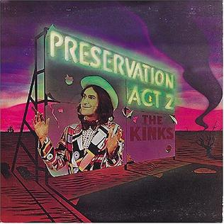

# Preservation Act 2

By **The Kinks**

## Album Data

- **Catalog:** Beets
- **Format:** Digital, Album
- **Album:** Preservation Act 2
- **Artist:** The Kinks
- **Albumartist:** The Kinks
- **Genre:** Rock
- **MusicBrainz Album Artist ID:** [17b53d9f-5c63-4a09-a593-dde4608e0db9](https://musicbrainz.org/artist/17b53d9f-5c63-4a09-a593-dde4608e0db9)
- **MusicBrainz Album ID:** [01b3161b-2aaa-4a75-9b62-a5ca079d55f2](https://musicbrainz.org/release/01b3161b-2aaa-4a75-9b62-a5ca079d55f2)
- **MusicBrainz Release Group ID:** [7ff726de-2dcd-3615-8a08-8e13a641a859](https://musicbrainz.org/release-group/7ff726de-2dcd-3615-8a08-8e13a641a859)
- **Year:** 1974
- **Catalog #:** 63467-79725-2
- **Label:** Velvel
- **Total Tracks:** 14

## Album Tracks

### Track 01 - Life on the Road

- **Artist:** The Kinks
- **Format:** ALAC
- **Genre:** Rock
- **Length:** 5:02
- **MusicBrainz Track ID:** [450d35aa-a9ac-4d02-bb1d-2d85088515b3](https://musicbrainz.org/recording/450d35aa-a9ac-4d02-bb1d-2d85088515b3)
- **Title:** Life on the Road
- **Track:** 01
- **Year:** 1998

### Track 02 - Mr. Big Man

- **Artist:** The Kinks
- **Format:** ALAC
- **Genre:** Rock
- **Length:** 3:49
- **MusicBrainz Track ID:** [e9c6fc0c-f4ad-464d-a99a-5b21d105ea6a](https://musicbrainz.org/recording/e9c6fc0c-f4ad-464d-a99a-5b21d105ea6a)
- **Title:** Mr. Big Man
- **Track:** 02
- **Year:** 1998

### Track 03 - Sleepwalker

- **Artist:** The Kinks
- **Format:** ALAC
- **Genre:** Power Pop
- **Length:** 4:04
- **MusicBrainz Track ID:** [23c72641-fc68-4e25-9139-4c970c9cf15c](https://musicbrainz.org/recording/23c72641-fc68-4e25-9139-4c970c9cf15c)
- **Title:** Sleepwalker
- **Track:** 03
- **Year:** 1998

### Track 04 - Brother

- **Artist:** The Kinks
- **Format:** ALAC
- **Genre:** Rock
- **Length:** 5:28
- **MusicBrainz Track ID:** [820af7c1-bb1e-4cab-b131-02c57527626b](https://musicbrainz.org/recording/820af7c1-bb1e-4cab-b131-02c57527626b)
- **Title:** Brother
- **Track:** 04
- **Year:** 1998

### Track 05 - Juke Box Music

- **Artist:** The Kinks
- **Format:** ALAC
- **Genre:** Hard Rock
- **Length:** 5:32
- **MusicBrainz Track ID:** [bde02faf-e0e6-4b57-bd08-0f1f707d4270](https://musicbrainz.org/recording/bde02faf-e0e6-4b57-bd08-0f1f707d4270)
- **Title:** Juke Box Music
- **Track:** 05
- **Year:** 1998

### Track 06 - Sleepless Night

- **Artist:** The Kinks
- **Format:** ALAC
- **Genre:** Rock
- **Length:** 3:18
- **MusicBrainz Track ID:** [19917210-fdd4-4cc7-a1d2-2a40b6b46ff4](https://musicbrainz.org/recording/19917210-fdd4-4cc7-a1d2-2a40b6b46ff4)
- **Title:** Sleepless Night
- **Track:** 06
- **Year:** 1998

### Track 07 - Stormy Sky

- **Artist:** The Kinks
- **Format:** ALAC
- **Genre:** Rock
- **Length:** 3:58
- **MusicBrainz Track ID:** [5b869df5-4d91-4fa3-a3cf-0e06299ff58b](https://musicbrainz.org/recording/5b869df5-4d91-4fa3-a3cf-0e06299ff58b)
- **Title:** Stormy Sky
- **Track:** 07
- **Year:** 1998

### Track 08 - Full Moon

- **Artist:** The Kinks
- **Format:** ALAC
- **Genre:** Rock
- **Length:** 3:52
- **MusicBrainz Track ID:** [caa36eb3-5817-4d54-8b39-b97c0f3d2742](https://musicbrainz.org/recording/caa36eb3-5817-4d54-8b39-b97c0f3d2742)
- **Title:** Full Moon
- **Track:** 08
- **Year:** 1998

### Track 09 - Life Goes On

- **Artist:** The Kinks
- **Format:** ALAC
- **Genre:** Rock
- **Length:** 5:03
- **MusicBrainz Track ID:** [9cb2c5df-ee8e-41f5-a86a-d787e913cc68](https://musicbrainz.org/recording/9cb2c5df-ee8e-41f5-a86a-d787e913cc68)
- **Title:** Life Goes On
- **Track:** 09
- **Year:** 1998

### Track 10 - Artificial Light

- **Artist:** The Kinks
- **Format:** ALAC
- **Genre:** Country Rock
- **Length:** 3:26
- **MusicBrainz Track ID:** [95b4b1a9-6883-4ac2-b1ca-65b760a5e3ad](https://musicbrainz.org/recording/95b4b1a9-6883-4ac2-b1ca-65b760a5e3ad)
- **Title:** Artificial Light
- **Track:** 10
- **Year:** 1998

### Track 11 - Prince of the Punks

- **Artist:** The Kinks
- **Format:** ALAC
- **Genre:** Pop Punk
- **Length:** 3:18
- **MusicBrainz Track ID:** [c7cdc4ca-4bc1-4e29-82f1-a150a1f0f39a](https://musicbrainz.org/recording/c7cdc4ca-4bc1-4e29-82f1-a150a1f0f39a)
- **Title:** Prince of the Punks
- **Track:** 11
- **Year:** 1998

### Track 12 - The Poseur

- **Artist:** The Kinks
- **Format:** ALAC
- **Genre:** Rock
- **Length:** 2:53
- **MusicBrainz Track ID:** [380c3a89-efad-4e29-af2a-af9ce2ccb810](https://musicbrainz.org/recording/380c3a89-efad-4e29-af2a-af9ce2ccb810)
- **Title:** The Poseur
- **Track:** 12
- **Year:** 1998

### Track 13 - On the Outside (1977 mix)

- **Artist:** The Kinks
- **Format:** ALAC
- **Genre:** Rock
- **Length:** 5:07
- **MusicBrainz Track ID:** [47400af6-6dea-44bc-aca7-71b3d1d0a2e6](https://musicbrainz.org/recording/47400af6-6dea-44bc-aca7-71b3d1d0a2e6)
- **Title:** On the Outside (1977 mix)
- **Track:** 13
- **Year:** 1998

### Track 14 - On the Outside (1994 mix)

- **Artist:** The Kinks
- **Format:** ALAC
- **Genre:** Rock
- **Length:** 5:19
- **MusicBrainz Track ID:** [4f96e350-dd1b-4827-a280-e3f0f13837b2](https://musicbrainz.org/recording/4f96e350-dd1b-4827-a280-e3f0f13837b2)
- **Title:** On the Outside (1994 mix)
- **Track:** 14
- **Year:** 1998

## See also

- [Everybody's in Showbiz (Legacy Edition)](Everybodys_in_Showbiz_Legacy_Edition.md)
- [Everybody’s in Show‐Biz](Everybody’s_in_Show‐Biz.md)
- [Face To Face](Face_To_Face.md)
- [Lola Versus Powerman and the Moneygoround, Part One](Lola_Versus_Powerman_and_the_Moneygoround__Part_One.md)
- [Low Budget](Low_Budget.md)
- [Misfits](Misfits.md)
- [Muswell Hillbillies](Muswell_Hillbillies.md)
- [Phobia](Phobia.md)
- [Preservation Act 1](Preservation_Act_1.md)
- [Sleepwalker](Sleepwalker.md)
- [Soap Opera](Soap_Opera.md)
- [The Anthology 1964–1971](The_Anthology_1964–1971.md)
- [CD: Lola Versus Powerman And The Money-Go-Round (Part One)](../../CD/The_Kinks/Lola_Versus_Powerman_And_The_Money-Go-Round_Part_One.md)
- [CD: Muswell Hillbillies](../../CD/The_Kinks/Muswell_Hillbillies.md)
- [CD: The Anthology 1964 - 1971 (Disc 1)](../../CD/The_Kinks/The_Anthology_1964_-_1971_Disc_1.md)
- [CD: The Anthology 1964 - 1971 (Disc 2)](../../CD/The_Kinks/The_Anthology_1964_-_1971_Disc_2.md)
- [CD: The Anthology 1964 - 1971 (Disc 3)](../../CD/The_Kinks/The_Anthology_1964_-_1971_Disc_3.md)
- [CD: The Anthology 1964 - 1971 (Disc 4)](../../CD/The_Kinks/The_Anthology_1964_-_1971_Disc_4.md)
- [CD: The Anthology 1964 - 1971 (Disc 5)](../../CD/The_Kinks/The_Anthology_1964_-_1971_Disc_5.md)
- [CD: ](../../CD/The_Kinks/The_Kinks.md)
- [Roon: Arthur or the Decline and Fall of the British Empire (2019 Deluxe)](../../Roon/The_Kinks/Arthur_or_the_Decline_and_Fall_of_the_British_Empire_2019_Deluxe.md)
- [Roon: Come Dancing with the Kinks (The Best of the Kinks 1977-1986)](../../Roon/The_Kinks/Come_Dancing_with_the_Kinks_The_Best_of_the_Kinks_1977-1986.md)
- [Roon: Everybody's in Show-Biz (Deluxe (2022 Remaster))](../../Roon/The_Kinks/Everybodys_in_Show-Biz_Deluxe_2022_Remaster.md)
- [Roon: Everybody's in Show-Biz (Legacy Edition)](../../Roon/The_Kinks/Everybodys_in_Show-Biz_Legacy_Edition.md)
- [Roon: Everybody's in Show-Biz](../../Roon/The_Kinks/Everybodys_in_Show-Biz.md)
- [Roon: Lola Versus Powerman and the Moneygoround, Pt. 1 (Deluxe)](../../Roon/The_Kinks/Lola_Versus_Powerman_and_the_Moneygoround__Pt_1_Deluxe.md)
- [Roon: Lola vs. Powerman and the Moneygoround, Pt. 1](../../Roon/The_Kinks/Lola_vs_Powerman_and_the_Moneygoround__Pt_1.md)
- [Roon: Muswell Hillbillies (Deluxe Edition)](../../Roon/The_Kinks/Muswell_Hillbillies_Deluxe_Edition.md)
- [Roon: Muswell Hillbillies (Super Deluxe)](../../Roon/The_Kinks/Muswell_Hillbillies_Super_Deluxe.md)
- [Roon: Preservation Act 1](../../Roon/The_Kinks/Preservation_Act_1.md)
- [Roon: Schoolboys in Disgrace](../../Roon/The_Kinks/Schoolboys_in_Disgrace.md)
- [Roon: Sleepwalker](../../Roon/The_Kinks/Sleepwalker.md)
- [Roon: Soap Opera](../../Roon/The_Kinks/Soap_Opera.md)
- [Roon: The Anthology 1964 - 1971 (2014 Remastered Version)](../../Roon/The_Kinks/The_Anthology_1964_-_1971_2014_Remastered_Version.md)
- [Roon: The Anthology 1964-1971](../../Roon/The_Kinks/The_Anthology_1964-1971.md)
- [Vinyl: 20th Anniversary Box Set](../../Vinyl/The_Kinks/20th_Anniversary_Box_Set.md)
- [Vinyl: Everybody's In Show-Biz](../../Vinyl/The_Kinks/Everybodys_In_Show-Biz.md)
- [Vinyl: Father Christmas / (Wish I Could Fly Like) Superman](../../Vinyl/The_Kinks/Father_Christmas_-_Wish_I_Could_Fly_Like_Superman.md)
- [Vinyl: Muswell Hillbillies](../../Vinyl/The_Kinks/Muswell_Hillbillies.md)
- [Vinyl: Preservation Act 1](../../Vinyl/The_Kinks/Preservation_Act_1.md)
- [Vinyl: Sleepwalker](../../Vinyl/The_Kinks/Sleepwalker.md)
- [Vinyl: Soap Opera](../../Vinyl/The_Kinks/Soap_Opera.md)
- [Vinyl: ](../../Vinyl/The_Kinks/The_Kinks.md)
- [Vinyl: The Mono Collection](../../Vinyl/The_Kinks/The_Mono_Collection.md)
- [Vinyl: You Really Got Me](../../Vinyl/The_Kinks/You_Really_Got_Me.md)
