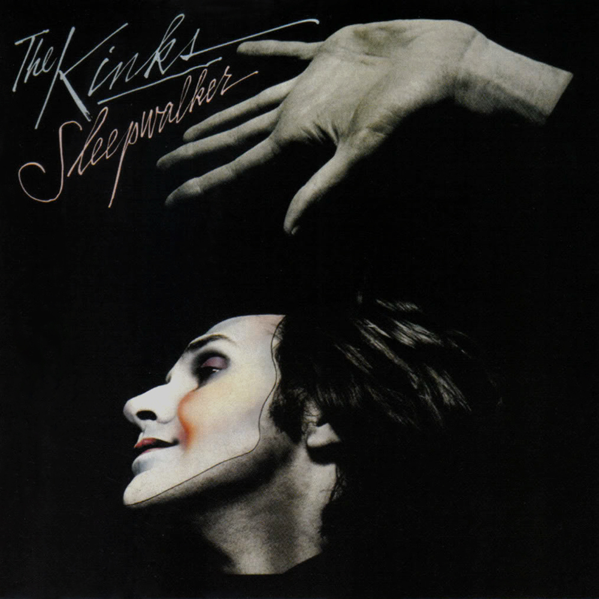

# Sleepwalker

By **The Kinks**

## Album Data

- **Catalog:** Beets
- **Format:** Digital, Album
- **Album:** Sleepwalker
- **Artist:** The Kinks
- **Albumartist:** The Kinks
- **Genre:** Rock
- **MusicBrainz Album Artist ID:** [17b53d9f-5c63-4a09-a593-dde4608e0db9](https://musicbrainz.org/artist/17b53d9f-5c63-4a09-a593-dde4608e0db9)
- **MusicBrainz Album ID:** [1fe86fff-a9d1-4c27-bb9a-80cf6f8feecc](https://musicbrainz.org/release/1fe86fff-a9d1-4c27-bb9a-80cf6f8feecc)
- **MusicBrainz Release Group ID:** [b108dcfc-da3a-3d7a-b9b8-eb565fcd6f32](https://musicbrainz.org/release-group/b108dcfc-da3a-3d7a-b9b8-eb565fcd6f32)
- **Year:** 1998
- **Catalog #:** R2 70936
- **Label:** Rhino
- **Total Tracks:** 12

## Album Tracks

### Track 01 - Everybody’s a Star (Starmaker)

- **Artist:** The Kinks
- **Format:** AAC
- **Genre:** Progressive Rock
- **Length:** 3:03
- **MusicBrainz Track ID:** [f4833f34-083f-4560-abbf-0eff6625c110](https://musicbrainz.org/recording/f4833f34-083f-4560-abbf-0eff6625c110)
- **Title:** Everybody’s a Star (Starmaker)
- **Track:** 01
- **Year:** 1990

### Track 02 - Ordinary People

- **Artist:** The Kinks
- **Format:** AAC
- **Genre:** Progressive Rock
- **Length:** 3:51
- **MusicBrainz Track ID:** [8701a34c-c5c3-4653-88cd-ef665ae50fb6](https://musicbrainz.org/recording/8701a34c-c5c3-4653-88cd-ef665ae50fb6)
- **Title:** Ordinary People
- **Track:** 02
- **Year:** 1990

### Track 03 - Rush Hour Blues

- **Artist:** The Kinks
- **Format:** AAC
- **Genre:** Progressive Rock
- **Length:** 4:33
- **MusicBrainz Track ID:** [047d15cf-3485-40e6-8f55-92c449d4656b](https://musicbrainz.org/recording/047d15cf-3485-40e6-8f55-92c449d4656b)
- **Title:** Rush Hour Blues
- **Track:** 03
- **Year:** 1990

### Track 04 - Nine to Five

- **Artist:** The Kinks
- **Format:** AAC
- **Genre:** Progressive Rock
- **Length:** 1:52
- **MusicBrainz Track ID:** [6990c8b5-1507-4c7b-a49f-0e821326b655](https://musicbrainz.org/recording/6990c8b5-1507-4c7b-a49f-0e821326b655)
- **Title:** Nine to Five
- **Track:** 04
- **Year:** 1990

### Track 05 - When Work Is Over

- **Artist:** The Kinks
- **Format:** AAC
- **Genre:** Progressive Rock
- **Length:** 2:08
- **MusicBrainz Track ID:** [c1a2ee81-1ff1-4db2-b0d5-101386c7b690](https://musicbrainz.org/recording/c1a2ee81-1ff1-4db2-b0d5-101386c7b690)
- **Title:** When Work Is Over
- **Track:** 05
- **Year:** 1990

### Track 06 - Have Another Drink

- **Artist:** The Kinks
- **Format:** AAC
- **Genre:** Progressive Rock
- **Length:** 2:43
- **MusicBrainz Track ID:** [63da03c6-04b5-430e-81d1-f0c90878ede1](https://musicbrainz.org/recording/63da03c6-04b5-430e-81d1-f0c90878ede1)
- **Title:** Have Another Drink
- **Track:** 06
- **Year:** 1990

### Track 07 - Underneath the Neon Sign

- **Artist:** The Kinks
- **Format:** AAC
- **Genre:** Progressive Rock
- **Length:** 3:59
- **MusicBrainz Track ID:** [b1214a6a-b3dc-4b0c-8293-4b69e8bbd263](https://musicbrainz.org/recording/b1214a6a-b3dc-4b0c-8293-4b69e8bbd263)
- **Title:** Underneath the Neon Sign
- **Track:** 07
- **Year:** 1990

### Track 08 - Holiday Romance

- **Artist:** The Kinks
- **Format:** AAC
- **Genre:** Progressive Rock
- **Length:** 3:16
- **MusicBrainz Track ID:** [d5a21028-5443-4431-aa5b-3f6792af5536](https://musicbrainz.org/recording/d5a21028-5443-4431-aa5b-3f6792af5536)
- **Title:** Holiday Romance
- **Track:** 08
- **Year:** 1990

### Track 09 - You Make It All Worthwhile

- **Artist:** The Kinks
- **Format:** AAC
- **Genre:** Progressive Rock
- **Length:** 3:55
- **MusicBrainz Track ID:** [f331cb67-944e-43f0-b232-bafd0db3be0f](https://musicbrainz.org/recording/f331cb67-944e-43f0-b232-bafd0db3be0f)
- **Title:** You Make It All Worthwhile
- **Track:** 09
- **Year:** 1990

### Track 10 - Ducks on the Wall

- **Artist:** The Kinks
- **Format:** AAC
- **Genre:** Progressive Rock
- **Length:** 3:26
- **MusicBrainz Track ID:** [b8c3f1a8-aff9-4fd5-9b04-8c9f32c41b36](https://musicbrainz.org/recording/b8c3f1a8-aff9-4fd5-9b04-8c9f32c41b36)
- **Title:** Ducks on the Wall
- **Track:** 10
- **Year:** 1990

### Track 11 - (A) Face in the Crowd

- **Artist:** The Kinks
- **Format:** AAC
- **Genre:** Progressive Rock
- **Length:** 2:22
- **MusicBrainz Track ID:** [3af380a9-7294-4bef-a9c9-5340150f3fc7](https://musicbrainz.org/recording/3af380a9-7294-4bef-a9c9-5340150f3fc7)
- **Title:** (A) Face in the Crowd
- **Track:** 11
- **Year:** 1990

### Track 12 - You Can’t Stop the Music

- **Artist:** The Kinks
- **Format:** AAC
- **Genre:** Progressive Rock
- **Length:** 3:16
- **MusicBrainz Track ID:** [471c4afe-2f9f-43a2-b5d7-f425db2a94da](https://musicbrainz.org/recording/471c4afe-2f9f-43a2-b5d7-f425db2a94da)
- **Title:** You Can’t Stop the Music
- **Track:** 12
- **Year:** 1990

