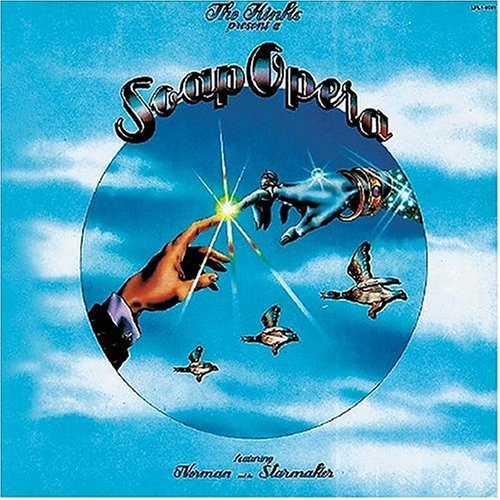

# Soap Opera

By **The Kinks**

## Album Data

- **Catalog:** Beets
- **Format:** Digital, Album
- **Album:** Soap Opera
- **Artist:** The Kinks
- **Albumartist:** The Kinks
- **Genre:** Progressive Rock
- **MusicBrainz Album Artist ID:** [17b53d9f-5c63-4a09-a593-dde4608e0db9](https://musicbrainz.org/artist/17b53d9f-5c63-4a09-a593-dde4608e0db9)
- **MusicBrainz Album ID:** [5a0e84f7-85a4-3198-a295-34b73eef5535](https://musicbrainz.org/release/5a0e84f7-85a4-3198-a295-34b73eef5535)
- **MusicBrainz Release Group ID:** [c8118529-2bab-436a-b158-69315ee4759b](https://musicbrainz.org/release-group/c8118529-2bab-436a-b158-69315ee4759b)
- **Year:** 1990
- **Catalog #:** BMG14055
- **Label:** BMG
- **Total Tracks:** 142

## Album Tracks

### Track 81 - Death of a Clown

- **Artist:** Dave Davies
- **Format:** ALAC
- **Genre:** Rock
- **Length:** 3:31
- **MusicBrainz Track ID:** [2be79e8b-b5c7-4696-80a8-1a174f394eb7](https://musicbrainz.org/recording/2be79e8b-b5c7-4696-80a8-1a174f394eb7)
- **Title:** Death of a Clown
- **Track:** 81
- **Year:** 2014

### Track 82 - Love Me Till the Sun Shines

- **Artist:** Dave Davies
- **Format:** ALAC
- **Genre:** Pop Rock
- **Length:** 3:21
- **MusicBrainz Track ID:** [957fa7a0-16cb-4c0f-84b3-427fcfcf6672](https://musicbrainz.org/recording/957fa7a0-16cb-4c0f-84b3-427fcfcf6672)
- **Title:** Love Me Till the Sun Shines
- **Track:** 82
- **Year:** 2014

### Track 86 - Funny Face

- **Artist:** Dave Davies
- **Format:** ALAC
- **Genre:** Pop Rock
- **Length:** 2:35
- **MusicBrainz Track ID:** [48c83e64-3cfc-4569-baea-ae0edc6d417e](https://musicbrainz.org/recording/48c83e64-3cfc-4569-baea-ae0edc6d417e)
- **Title:** Funny Face
- **Track:** 86
- **Year:** 2014

### Track 88 - Susannah’s Still Alive

- **Artist:** Dave Davies
- **Format:** ALAC
- **Genre:** Pop Rock
- **Length:** 2:21
- **MusicBrainz Track ID:** [0b5fcf23-0c62-446e-9203-10ff5649c30d](https://musicbrainz.org/recording/0b5fcf23-0c62-446e-9203-10ff5649c30d)
- **Title:** Susannah’s Still Alive
- **Track:** 88
- **Year:** 2014

### Track 89 - Good Luck Charm (previously unissued mix)

- **Artist:** Dave Davies
- **Format:** ALAC
- **Genre:** Pop Rock
- **Length:** 1:55
- **MusicBrainz Track ID:** [13a48638-b062-4bb9-99de-bfdef0632b35](https://musicbrainz.org/recording/13a48638-b062-4bb9-99de-bfdef0632b35)
- **Title:** Good Luck Charm (previously unissued mix)
- **Track:** 89
- **Year:** 2014

### Track 95 - Lincoln County (stereo single version)

- **Artist:** Dave Davies
- **Format:** ALAC
- **Genre:** Pop Rock
- **Length:** 3:22
- **MusicBrainz Track ID:** [18257283-b671-4f97-9cad-21d16a251776](https://musicbrainz.org/recording/18257283-b671-4f97-9cad-21d16a251776)
- **Title:** Lincoln County (stereo single version)
- **Track:** 95
- **Year:** 2014

### Track 111 - Hold My Hand

- **Artist:** Dave Davies
- **Format:** ALAC
- **Genre:** Pop Rock
- **Length:** 3:14
- **MusicBrainz Track ID:** [5ebda3b0-527c-45ce-ba1e-c428b706c312](https://musicbrainz.org/recording/5ebda3b0-527c-45ce-ba1e-c428b706c312)
- **Title:** Hold My Hand
- **Track:** 111
- **Year:** 2014

### Track 112 - Creeping Jean

- **Artist:** Dave Davies
- **Format:** ALAC
- **Genre:** Pop Rock
- **Length:** 3:10
- **MusicBrainz Track ID:** [8bb4aa86-a7f2-410e-bdfa-4844d5db2e2e](https://musicbrainz.org/recording/8bb4aa86-a7f2-410e-bdfa-4844d5db2e2e)
- **Title:** Creeping Jean
- **Track:** 112
- **Year:** 2014

### Track 36 - I Go to Sleep (demo)

- **Artist:** Ray Davies
- **Format:** ALAC
- **Genre:** Rock
- **Length:** 2:43
- **MusicBrainz Track ID:** [ae9c35db-8bb3-484e-9b4a-8e2f095f1009](https://musicbrainz.org/recording/ae9c35db-8bb3-484e-9b4a-8e2f095f1009)
- **Title:** I Go to Sleep (demo)
- **Track:** 36
- **Year:** 2014

### Track 37 - A Little Bit of Sunlight (demo)

- **Artist:** Ray Davies
- **Format:** ALAC
- **Genre:** Rock
- **Length:** 1:54
- **MusicBrainz Track ID:** [4c3cd26a-2c05-4e96-a830-1d278fabf76f](https://musicbrainz.org/recording/4c3cd26a-2c05-4e96-a830-1d278fabf76f)
- **Title:** A Little Bit of Sunlight (demo)
- **Track:** 37
- **Year:** 2014

### Track 38 - Tell Me Now So I’ll Know (alternate demo)

- **Artist:** Ray Davies
- **Format:** ALAC
- **Genre:** Rock
- **Length:** 2:01
- **MusicBrainz Track ID:** [9e870a40-f1ce-4033-8e30-f9c6f35cfbe4](https://musicbrainz.org/recording/9e870a40-f1ce-4033-8e30-f9c6f35cfbe4)
- **Title:** Tell Me Now So I’ll Know (alternate demo)
- **Track:** 38
- **Year:** 2014

### Track 39 - When I See That Girl of Mine (demo)

- **Artist:** Ray Davies
- **Format:** ALAC
- **Genre:** Rock
- **Length:** 2:03
- **MusicBrainz Track ID:** [7ab5f4cc-4e2a-468d-b63c-0a0c6382e31a](https://musicbrainz.org/recording/7ab5f4cc-4e2a-468d-b63c-0a0c6382e31a)
- **Title:** When I See That Girl of Mine (demo)
- **Track:** 39
- **Year:** 2014

### Track 40 - There’s a New World Just Opening for Me (demo)

- **Artist:** Ray Davies
- **Format:** ALAC
- **Genre:** Rock
- **Length:** 2:33
- **MusicBrainz Track ID:** [98535299-10b8-4ca3-932d-9660f6ffcf45](https://musicbrainz.org/recording/98535299-10b8-4ca3-932d-9660f6ffcf45)
- **Title:** There’s a New World Just Opening for Me (demo)
- **Track:** 40
- **Year:** 2014

### Track 60 - All Night Stand (demo)

- **Artist:** Ray Davies
- **Format:** ALAC
- **Genre:** Rock
- **Length:** 1:50
- **MusicBrainz Track ID:** [6ed46949-2ced-4c8c-a4d1-ae2fb41a20c3](https://musicbrainz.org/recording/6ed46949-2ced-4c8c-a4d1-ae2fb41a20c3)
- **Title:** All Night Stand (demo)
- **Track:** 60
- **Year:** 2014

### Track 01 - I Took My Baby Home

- **Artist:** The Kinks
- **Format:** ALAC
- **Genre:** Rock
- **Length:** 1:48
- **MusicBrainz Track ID:** [c22ec9fb-cba9-44ec-b13f-8e286e774b38](https://musicbrainz.org/recording/c22ec9fb-cba9-44ec-b13f-8e286e774b38)
- **Title:** I Took My Baby Home
- **Track:** 01
- **Year:** 2014

### Track 02 - I’m a Hog for You, Baby

- **Artist:** The Kinks
- **Format:** ALAC
- **Genre:** Rock
- **Length:** 1:40
- **MusicBrainz Track ID:** [6492a81f-2723-4a82-9da6-bf67a9f1caad](https://musicbrainz.org/recording/6492a81f-2723-4a82-9da6-bf67a9f1caad)
- **Title:** I’m a Hog for You, Baby
- **Track:** 02
- **Year:** 2014

### Track 03 - I Don’t Need You Anymore (demo)

- **Artist:** The Kinks
- **Format:** ALAC
- **Genre:** Rock
- **Length:** 2:14
- **MusicBrainz Track ID:** [ab5e46bf-126c-4db6-998e-85e397f36c08](https://musicbrainz.org/recording/ab5e46bf-126c-4db6-998e-85e397f36c08)
- **Title:** I Don’t Need You Anymore (demo)
- **Track:** 03
- **Year:** 2014

### Track 04 - Ev’rybody’s Gonna Be Happy (demo)

- **Artist:** The Kinks
- **Format:** ALAC
- **Genre:** Rock
- **Length:** 2:22
- **MusicBrainz Track ID:** [d6b3f0db-535a-4a7d-8417-9895bd9d5499](https://musicbrainz.org/recording/d6b3f0db-535a-4a7d-8417-9895bd9d5499)
- **Title:** Ev’rybody’s Gonna Be Happy (demo)
- **Track:** 04
- **Year:** 2014

### Track 05 - Long Tall Sally

- **Artist:** The Kinks
- **Format:** ALAC
- **Genre:** Rock And Roll
- **Length:** 2:12
- **MusicBrainz Track ID:** [2040322d-b1ff-47da-8a7a-a5d962c29a40](https://musicbrainz.org/recording/2040322d-b1ff-47da-8a7a-a5d962c29a40)
- **Title:** Long Tall Sally
- **Track:** 05
- **Year:** 2014

### Track 06 - You Still Want Me

- **Artist:** The Kinks
- **Format:** ALAC
- **Genre:** Rock And Roll
- **Length:** 2:00
- **MusicBrainz Track ID:** [f58cdaaa-e5aa-4d5b-bfc9-f8f08f0e37fa](https://musicbrainz.org/recording/f58cdaaa-e5aa-4d5b-bfc9-f8f08f0e37fa)
- **Title:** You Still Want Me
- **Track:** 06
- **Year:** 2014

### Track 07 - You Do Something to Me

- **Artist:** The Kinks
- **Format:** ALAC
- **Genre:** Indie Rock
- **Length:** 2:25
- **MusicBrainz Track ID:** [127559f3-06df-440a-b8a2-334ad7a68ea1](https://musicbrainz.org/recording/127559f3-06df-440a-b8a2-334ad7a68ea1)
- **Title:** You Do Something to Me
- **Track:** 07
- **Year:** 2014

### Track 08 - You Really Got Me

- **Artist:** The Kinks
- **Format:** ALAC
- **Genre:** Rock
- **Length:** 2:14
- **MusicBrainz Track ID:** [7491cee5-32f2-4d5e-82d1-9823418e38fb](https://musicbrainz.org/recording/7491cee5-32f2-4d5e-82d1-9823418e38fb)
- **Title:** You Really Got Me
- **Track:** 08
- **Year:** 2014

### Track 09 - It’s All Right

- **Artist:** The Kinks
- **Format:** ALAC
- **Genre:** Rock
- **Length:** 2:36
- **MusicBrainz Track ID:** [2b8e7b82-3149-49e9-a3da-767e0967e5d4](https://musicbrainz.org/recording/2b8e7b82-3149-49e9-a3da-767e0967e5d4)
- **Title:** It’s All Right
- **Track:** 09
- **Year:** 2014

### Track 10 - Beautiful Delilah (alternate mono mix)

- **Artist:** The Kinks
- **Format:** ALAC
- **Genre:** Rock
- **Length:** 2:06
- **MusicBrainz Track ID:** [ae37f71d-8fe6-4cbf-9964-1b739b1fd2a3](https://musicbrainz.org/recording/ae37f71d-8fe6-4cbf-9964-1b739b1fd2a3)
- **Title:** Beautiful Delilah (alternate mono mix)
- **Track:** 10
- **Year:** 2014

### Track 11 - Just Can’t Go to Sleep

- **Artist:** The Kinks
- **Format:** ALAC
- **Genre:** Rock
- **Length:** 1:59
- **MusicBrainz Track ID:** [6f8b7e7d-8c35-426c-b11e-72b1b4b9164d](https://musicbrainz.org/recording/6f8b7e7d-8c35-426c-b11e-72b1b4b9164d)
- **Title:** Just Can’t Go to Sleep
- **Track:** 11
- **Year:** 2014

### Track 12 - I’m a Lover, Not a Fighter (alternate mono mix)

- **Artist:** The Kinks
- **Format:** ALAC
- **Genre:** Rock
- **Length:** 2:01
- **MusicBrainz Track ID:** [6226a956-9360-478b-8011-97b32804e5c0](https://musicbrainz.org/recording/6226a956-9360-478b-8011-97b32804e5c0)
- **Title:** I’m a Lover, Not a Fighter (alternate mono mix)
- **Track:** 12
- **Year:** 2014

### Track 13 - Little Queenie (live at the Playhouse Theatre, 1964)

- **Artist:** The Kinks
- **Format:** ALAC
- **Genre:** Rock
- **Length:** 1:49
- **MusicBrainz Track ID:** [6727f3e2-bf20-451c-a564-62a99d485b92](https://musicbrainz.org/recording/6727f3e2-bf20-451c-a564-62a99d485b92)
- **Title:** Little Queenie (live at the Playhouse Theatre, 1964)
- **Track:** 13
- **Year:** 2014

### Track 14 - Too Much Monkey Business (alternate take)

- **Artist:** The Kinks
- **Format:** ALAC
- **Genre:** Rock And Roll
- **Length:** 2:08
- **MusicBrainz Track ID:** [5ade76b6-eb77-4f77-b02e-0cf37f347c09](https://musicbrainz.org/recording/5ade76b6-eb77-4f77-b02e-0cf37f347c09)
- **Title:** Too Much Monkey Business (alternate take)
- **Track:** 14
- **Year:** 2014

### Track 15 - Stop Your Sobbing

- **Artist:** The Kinks
- **Format:** ALAC
- **Genre:** Rock
- **Length:** 2:05
- **MusicBrainz Track ID:** [68cf3df3-fab1-42d7-8df1-f4a7f6791cfa](https://musicbrainz.org/recording/68cf3df3-fab1-42d7-8df1-f4a7f6791cfa)
- **Title:** Stop Your Sobbing
- **Track:** 15
- **Year:** 2014

### Track 16 - All Day and All of the Night

- **Artist:** The Kinks
- **Format:** ALAC
- **Genre:** Garage Rock
- **Length:** 2:22
- **MusicBrainz Track ID:** [228468dc-8a4c-44f5-b8f5-f743752451a0](https://musicbrainz.org/recording/228468dc-8a4c-44f5-b8f5-f743752451a0)
- **Title:** All Day and All of the Night
- **Track:** 16
- **Year:** 2014

### Track 17 - I Gotta Move

- **Artist:** The Kinks
- **Format:** ALAC
- **Genre:** Rock And Roll
- **Length:** 2:24
- **MusicBrainz Track ID:** [a3da48cc-ec9d-469e-b252-9eab5b6c38a0](https://musicbrainz.org/recording/a3da48cc-ec9d-469e-b252-9eab5b6c38a0)
- **Title:** I Gotta Move
- **Track:** 17
- **Year:** 2014

### Track 18 - I Gotta Go Now

- **Artist:** The Kinks
- **Format:** ALAC
- **Genre:** Rock
- **Length:** 2:53
- **MusicBrainz Track ID:** [8d95220a-d9ec-4a62-9647-054e3b996fd8](https://musicbrainz.org/recording/8d95220a-d9ec-4a62-9647-054e3b996fd8)
- **Title:** I Gotta Go Now
- **Track:** 18
- **Year:** 2014

### Track 19 - I’ve Got That Feeling (live at Picadily Studios, 1964)

- **Artist:** The Kinks
- **Format:** ALAC
- **Genre:** Rock
- **Length:** 2:45
- **MusicBrainz Track ID:** [0704605d-caad-42ff-81d3-d002aa716ff9](https://musicbrainz.org/recording/0704605d-caad-42ff-81d3-d002aa716ff9)
- **Title:** I’ve Got That Feeling (live at Picadily Studios, 1964)
- **Track:** 19
- **Year:** 2014

### Track 20 - Tired of Waiting for You

- **Artist:** The Kinks
- **Format:** ALAC
- **Genre:** Rock
- **Length:** 2:31
- **MusicBrainz Track ID:** [00f6cb3e-236f-48a9-8f1d-466bf80e61bb](https://musicbrainz.org/recording/00f6cb3e-236f-48a9-8f1d-466bf80e61bb)
- **Title:** Tired of Waiting for You
- **Track:** 20
- **Year:** 2014

### Track 21 - Come On Now (alternate mix)

- **Artist:** The Kinks
- **Format:** ALAC
- **Genre:** Rock And Roll
- **Length:** 1:46
- **MusicBrainz Track ID:** [f44e09e2-8e4c-4994-bb17-030632a9a07e](https://musicbrainz.org/recording/f44e09e2-8e4c-4994-bb17-030632a9a07e)
- **Title:** Come On Now (alternate mix)
- **Track:** 21
- **Year:** 2014

### Track 22 - Look for Me Baby

- **Artist:** The Kinks
- **Format:** ALAC
- **Genre:** Rock
- **Length:** 2:15
- **MusicBrainz Track ID:** [06987e5d-6532-4448-b286-81795a16a2fa](https://musicbrainz.org/recording/06987e5d-6532-4448-b286-81795a16a2fa)
- **Title:** Look for Me Baby
- **Track:** 22
- **Year:** 2014

### Track 23 - Nothin’ in the World Can Stop Me Worryin’ ’Bout That Girl

- **Artist:** The Kinks
- **Format:** ALAC
- **Genre:** Rock
- **Length:** 2:45
- **MusicBrainz Track ID:** [166e9992-5f3e-4518-8bd3-8a97440df478](https://musicbrainz.org/recording/166e9992-5f3e-4518-8bd3-8a97440df478)
- **Title:** Nothin’ in the World Can Stop Me Worryin’ ’Bout That Girl
- **Track:** 23
- **Year:** 2014

### Track 24 - Wonder Where My Baby Is Tonight

- **Artist:** The Kinks
- **Format:** ALAC
- **Genre:** Britpop
- **Length:** 2:00
- **MusicBrainz Track ID:** [6b43d16c-4c38-4e6e-b4fd-1ddf78b56e88](https://musicbrainz.org/recording/6b43d16c-4c38-4e6e-b4fd-1ddf78b56e88)
- **Title:** Wonder Where My Baby Is Tonight
- **Track:** 24
- **Year:** 2014

### Track 25 - Don’t Ever Change

- **Artist:** The Kinks
- **Format:** ALAC
- **Genre:** Rock
- **Length:** 2:23
- **MusicBrainz Track ID:** [2a5846ea-5ccc-4311-a935-d72cf4dd47ad](https://musicbrainz.org/recording/2a5846ea-5ccc-4311-a935-d72cf4dd47ad)
- **Title:** Don’t Ever Change
- **Track:** 25
- **Year:** 2014

### Track 26 - You Shouldn’t Be Sad

- **Artist:** The Kinks
- **Format:** ALAC
- **Genre:** Rock
- **Length:** 2:00
- **MusicBrainz Track ID:** [bed175a1-d0a0-4571-a1b7-25ee7774a3cb](https://musicbrainz.org/recording/bed175a1-d0a0-4571-a1b7-25ee7774a3cb)
- **Title:** You Shouldn’t Be Sad
- **Track:** 26
- **Year:** 2014

### Track 27 - Something Better Beginning

- **Artist:** The Kinks
- **Format:** ALAC
- **Genre:** Rock
- **Length:** 2:24
- **MusicBrainz Track ID:** [895aa292-dde5-4b22-8e91-e2fc2fef4502](https://musicbrainz.org/recording/895aa292-dde5-4b22-8e91-e2fc2fef4502)
- **Title:** Something Better Beginning
- **Track:** 27
- **Year:** 2014

### Track 28 - Ev’rybody’s Gonna Be Happy

- **Artist:** The Kinks
- **Format:** ALAC
- **Genre:** Rock
- **Length:** 2:16
- **MusicBrainz Track ID:** [d6d01bea-acec-4e2b-a45b-d96c9193e5f1](https://musicbrainz.org/recording/d6d01bea-acec-4e2b-a45b-d96c9193e5f1)
- **Title:** Ev’rybody’s Gonna Be Happy
- **Track:** 28
- **Year:** 2014

### Track 29 - Who’ll Be the Next in Line (session excerpt – backing track

- **Artist:** The Kinks
- **Format:** ALAC
- **Genre:** Rock
- **Length:** 2:32
- **MusicBrainz Track ID:** [adcec956-94de-4fb4-b59c-a2578589a451](https://musicbrainz.org/recording/adcec956-94de-4fb4-b59c-a2578589a451)
- **Title:** Who’ll Be the Next in Line (session excerpt – backing track
- **Track:** 29
- **Year:** 2014

### Track 30 - Who’ll Be the Next in Line (alternate mix)

- **Artist:** The Kinks
- **Format:** ALAC
- **Genre:** Rock
- **Length:** 2:09
- **MusicBrainz Track ID:** [31250861-ea14-4b96-81f7-4a7ec678a0ee](https://musicbrainz.org/recording/31250861-ea14-4b96-81f7-4a7ec678a0ee)
- **Title:** Who’ll Be the Next in Line (alternate mix)
- **Track:** 30
- **Year:** 2014

### Track 31 - Set Me Free

- **Artist:** The Kinks
- **Format:** ALAC
- **Genre:** Rock
- **Length:** 2:11
- **MusicBrainz Track ID:** [2ba5c6b4-b6cf-4d00-98a3-5141733e8259](https://musicbrainz.org/recording/2ba5c6b4-b6cf-4d00-98a3-5141733e8259)
- **Title:** Set Me Free
- **Track:** 31
- **Year:** 2014

### Track 32 - I Need You

- **Artist:** The Kinks
- **Format:** ALAC
- **Genre:** Rock
- **Length:** 2:25
- **MusicBrainz Track ID:** [538301e1-3fe4-4429-8d8a-de29b6cc5e2f](https://musicbrainz.org/recording/538301e1-3fe4-4429-8d8a-de29b6cc5e2f)
- **Title:** I Need You
- **Track:** 32
- **Year:** 2014

### Track 33 - Interview

- **Artist:** The Kinks
- **Format:** ALAC
- **Genre:** Rock
- **Length:** 2:26
- **MusicBrainz Track ID:** [16e08adb-a475-4d86-80c8-515c38bb1bf0](https://musicbrainz.org/recording/16e08adb-a475-4d86-80c8-515c38bb1bf0)
- **Title:** Interview
- **Track:** 33
- **Year:** 2014

### Track 34 - See My Friends

- **Artist:** The Kinks
- **Format:** ALAC
- **Genre:** Raga Rock
- **Length:** 2:45
- **MusicBrainz Track ID:** [2002ff69-bd10-40c1-9a26-89bc2009d089](https://musicbrainz.org/recording/2002ff69-bd10-40c1-9a26-89bc2009d089)
- **Title:** See My Friends
- **Track:** 34
- **Year:** 2014

### Track 35 - Never Met a Girl Like You Before

- **Artist:** The Kinks
- **Format:** ALAC
- **Genre:** Rock
- **Length:** 2:03
- **MusicBrainz Track ID:** [ceba2869-b4e4-4255-b89f-351b936a23cf](https://musicbrainz.org/recording/ceba2869-b4e4-4255-b89f-351b936a23cf)
- **Title:** Never Met a Girl Like You Before
- **Track:** 35
- **Year:** 2014

### Track 41 - This Strange Effect (live at the Aeolian Hall, 1965)

- **Artist:** The Kinks
- **Format:** ALAC
- **Genre:** Rock
- **Length:** 2:32
- **MusicBrainz Track ID:** [a902803e-f7a5-4e84-83e0-af40948a0965](https://musicbrainz.org/recording/a902803e-f7a5-4e84-83e0-af40948a0965)
- **Title:** This Strange Effect (live at the Aeolian Hall, 1965)
- **Track:** 41
- **Year:** 2014

### Track 42 - Hide and Seek (live at the Aeolian Hall, 1965)

- **Artist:** The Kinks
- **Format:** ALAC
- **Genre:** Rock
- **Length:** 2:15
- **MusicBrainz Track ID:** [0a883ca4-b137-4779-888a-8eb7ffeca2f2](https://musicbrainz.org/recording/0a883ca4-b137-4779-888a-8eb7ffeca2f2)
- **Title:** Hide and Seek (live at the Aeolian Hall, 1965)
- **Track:** 42
- **Year:** 2014

### Track 43 - A Well Respected Man

- **Artist:** The Kinks
- **Format:** ALAC
- **Genre:** Rock
- **Length:** 2:41
- **MusicBrainz Track ID:** [dc7b61f9-65be-49ee-b072-34446f7c836e](https://musicbrainz.org/recording/dc7b61f9-65be-49ee-b072-34446f7c836e)
- **Title:** A Well Respected Man
- **Track:** 43
- **Year:** 2014

### Track 44 - Such a Shame

- **Artist:** The Kinks
- **Format:** ALAC
- **Genre:** Rock
- **Length:** 2:18
- **MusicBrainz Track ID:** [547938f2-34e7-40e0-9c8d-685835cd56e2](https://musicbrainz.org/recording/547938f2-34e7-40e0-9c8d-685835cd56e2)
- **Title:** Such a Shame
- **Track:** 44
- **Year:** 2014

### Track 45 - Don’t You Fret

- **Artist:** The Kinks
- **Format:** ALAC
- **Genre:** Rock
- **Length:** 2:42
- **MusicBrainz Track ID:** [14a1085f-cc7d-4ee8-ba8b-6070e3eb9d4c](https://musicbrainz.org/recording/14a1085f-cc7d-4ee8-ba8b-6070e3eb9d4c)
- **Title:** Don’t You Fret
- **Track:** 45
- **Year:** 2014

### Track 46 - Till the End of the Day

- **Artist:** The Kinks
- **Format:** ALAC
- **Genre:** Rock
- **Length:** 2:19
- **MusicBrainz Track ID:** [f4c1c58e-12f7-4c64-84d4-35f6122a0c4f](https://musicbrainz.org/recording/f4c1c58e-12f7-4c64-84d4-35f6122a0c4f)
- **Title:** Till the End of the Day
- **Track:** 46
- **Year:** 2014

### Track 47 - Where Have All the Good Times Gone

- **Artist:** The Kinks
- **Format:** ALAC
- **Genre:** Pop Rock
- **Length:** 2:49
- **MusicBrainz Track ID:** [0188e2a6-7ff5-4dff-8ef0-7991e692a7c8](https://musicbrainz.org/recording/0188e2a6-7ff5-4dff-8ef0-7991e692a7c8)
- **Title:** Where Have All the Good Times Gone
- **Track:** 47
- **Year:** 2014

### Track 48 - Milk Cow Blues

- **Artist:** The Kinks
- **Format:** ALAC
- **Genre:** Rock And Roll
- **Length:** 3:42
- **MusicBrainz Track ID:** [33e46cad-9c44-4f8b-9d44-348b5f8107c0](https://musicbrainz.org/recording/33e46cad-9c44-4f8b-9d44-348b5f8107c0)
- **Title:** Milk Cow Blues
- **Track:** 48
- **Year:** 2014

### Track 49 - I Am Free

- **Artist:** The Kinks
- **Format:** ALAC
- **Genre:** Hard Rock
- **Length:** 2:28
- **MusicBrainz Track ID:** [b339baf0-fc00-40cf-9a59-e71bb4fb197a](https://musicbrainz.org/recording/b339baf0-fc00-40cf-9a59-e71bb4fb197a)
- **Title:** I Am Free
- **Track:** 49
- **Year:** 2014

### Track 50 - The World Keeps Going Round

- **Artist:** The Kinks
- **Format:** ALAC
- **Genre:** Rock
- **Length:** 2:33
- **MusicBrainz Track ID:** [28153295-8211-44ce-9acf-c145066c4054](https://musicbrainz.org/recording/28153295-8211-44ce-9acf-c145066c4054)
- **Title:** The World Keeps Going Round
- **Track:** 50
- **Year:** 2014

### Track 51 - I’m on an Island

- **Artist:** The Kinks
- **Format:** ALAC
- **Genre:** Rock
- **Length:** 2:14
- **MusicBrainz Track ID:** [ab962c0d-82a4-44b3-a39f-a9f683c0f7e3](https://musicbrainz.org/recording/ab962c0d-82a4-44b3-a39f-a9f683c0f7e3)
- **Title:** I’m on an Island
- **Track:** 51
- **Year:** 2014

### Track 52 - You Can’t Win

- **Artist:** The Kinks
- **Format:** ALAC
- **Genre:** Rock
- **Length:** 2:40
- **MusicBrainz Track ID:** [3b3ff949-9af4-42d1-a6d6-8f658663e141](https://musicbrainz.org/recording/3b3ff949-9af4-42d1-a6d6-8f658663e141)
- **Title:** You Can’t Win
- **Track:** 52
- **Year:** 2014

### Track 53 - Time Will Tell

- **Artist:** The Kinks
- **Format:** ALAC
- **Genre:** Garage Rock
- **Length:** 2:34
- **MusicBrainz Track ID:** [d92d1d32-00ba-42c6-ba3c-9fc425ae6a84](https://musicbrainz.org/recording/d92d1d32-00ba-42c6-ba3c-9fc425ae6a84)
- **Title:** Time Will Tell
- **Track:** 53
- **Year:** 2014

### Track 54 - Dedicated Follower of Fashion (session excerpt – takes 1–3)

- **Artist:** The Kinks
- **Format:** ALAC
- **Genre:** Rock
- **Length:** 7:15
- **MusicBrainz Track ID:** [3a5d469c-a8cf-4e08-9de8-3f938ce122c3](https://musicbrainz.org/recording/3a5d469c-a8cf-4e08-9de8-3f938ce122c3)
- **Title:** Dedicated Follower of Fashion (session excerpt – takes 1–3)
- **Track:** 54
- **Year:** 2014

### Track 55 - Dedicated Follower of Fashion (single version)

- **Artist:** The Kinks
- **Format:** ALAC
- **Genre:** Rock
- **Length:** 3:01
- **MusicBrainz Track ID:** [a834b308-0c89-4004-8288-cd5091aad9d5](https://musicbrainz.org/recording/a834b308-0c89-4004-8288-cd5091aad9d5)
- **Title:** Dedicated Follower of Fashion (single version)
- **Track:** 55
- **Year:** 2014

### Track 56 - Sittin’ on My Sofa

- **Artist:** The Kinks
- **Format:** ALAC
- **Genre:** Rock
- **Length:** 3:05
- **MusicBrainz Track ID:** [b98961ae-4c81-4f98-b57d-37af8e8665e5](https://musicbrainz.org/recording/b98961ae-4c81-4f98-b57d-37af8e8665e5)
- **Title:** Sittin’ on My Sofa
- **Track:** 56
- **Year:** 2014

### Track 57 - She’s Got Everything (backing track – take 2)

- **Artist:** The Kinks
- **Format:** ALAC
- **Genre:** Rock
- **Length:** 3:14
- **MusicBrainz Track ID:** [49a182c7-1960-4299-8fcc-bde35182f99f](https://musicbrainz.org/recording/49a182c7-1960-4299-8fcc-bde35182f99f)
- **Title:** She’s Got Everything (backing track – take 2)
- **Track:** 57
- **Year:** 2014

### Track 58 - She’s Got Everything (alternate mono mix)

- **Artist:** The Kinks
- **Format:** ALAC
- **Genre:** Rock
- **Length:** 3:10
- **MusicBrainz Track ID:** [4b031290-24a1-4f08-9cde-78edc5632da2](https://musicbrainz.org/recording/4b031290-24a1-4f08-9cde-78edc5632da2)
- **Title:** She’s Got Everything (alternate mono mix)
- **Track:** 58
- **Year:** 2014

### Track 59 - Mr. Reporter (version one)

- **Artist:** The Kinks
- **Format:** ALAC
- **Genre:** Rock
- **Length:** 3:55
- **MusicBrainz Track ID:** [775429b3-337c-4892-8824-79b060aebe57](https://musicbrainz.org/recording/775429b3-337c-4892-8824-79b060aebe57)
- **Title:** Mr. Reporter (version one)
- **Track:** 59
- **Year:** 2014

### Track 61 - Sunny Afternoon

- **Artist:** The Kinks
- **Format:** ALAC
- **Genre:** Rock
- **Length:** 3:35
- **MusicBrainz Track ID:** [20f761a9-ba21-492e-a0a0-f43ca14ea651](https://musicbrainz.org/recording/20f761a9-ba21-492e-a0a0-f43ca14ea651)
- **Title:** Sunny Afternoon
- **Track:** 61
- **Year:** 2014

### Track 62 - I’m Not Like Everybody Else

- **Artist:** The Kinks
- **Format:** ALAC
- **Genre:** Rock
- **Length:** 3:27
- **MusicBrainz Track ID:** [e4734ed6-7763-4c46-bdc4-60cb4bee3fc7](https://musicbrainz.org/recording/e4734ed6-7763-4c46-bdc4-60cb4bee3fc7)
- **Title:** I’m Not Like Everybody Else
- **Track:** 62
- **Year:** 2014

### Track 63 - Dandy

- **Artist:** The Kinks
- **Format:** ALAC
- **Genre:** Pop Rock
- **Length:** 2:11
- **MusicBrainz Track ID:** [c57cd79a-357b-4f23-9e06-3c130c0d36a5](https://musicbrainz.org/recording/c57cd79a-357b-4f23-9e06-3c130c0d36a5)
- **Title:** Dandy
- **Track:** 63
- **Year:** 2014

### Track 64 - Party Line

- **Artist:** The Kinks
- **Format:** ALAC
- **Genre:** Rock
- **Length:** 2:34
- **MusicBrainz Track ID:** [c42cc606-ad7a-49cc-b3c1-6aa89d75261d](https://musicbrainz.org/recording/c42cc606-ad7a-49cc-b3c1-6aa89d75261d)
- **Title:** Party Line
- **Track:** 64
- **Year:** 2014

### Track 65 - Rosy Won’t You Please Come Home

- **Artist:** The Kinks
- **Format:** ALAC
- **Genre:** Rock
- **Length:** 2:32
- **MusicBrainz Track ID:** [447fdc92-b107-4fb8-98a2-e5e4ed40d09a](https://musicbrainz.org/recording/447fdc92-b107-4fb8-98a2-e5e4ed40d09a)
- **Title:** Rosy Won’t You Please Come Home
- **Track:** 65
- **Year:** 2014

### Track 66 - Too Much on My Mind

- **Artist:** The Kinks
- **Format:** ALAC
- **Genre:** Pop Rock
- **Length:** 2:27
- **MusicBrainz Track ID:** [7ed48ee8-67a7-45ca-8faf-c5cec558a612](https://musicbrainz.org/recording/7ed48ee8-67a7-45ca-8faf-c5cec558a612)
- **Title:** Too Much on My Mind
- **Track:** 66
- **Year:** 2014

### Track 67 - Session Man

- **Artist:** The Kinks
- **Format:** ALAC
- **Genre:** Power Pop
- **Length:** 2:16
- **MusicBrainz Track ID:** [cdf5b412-b5b7-45aa-9fd3-d7d7fc85f1e4](https://musicbrainz.org/recording/cdf5b412-b5b7-45aa-9fd3-d7d7fc85f1e4)
- **Title:** Session Man
- **Track:** 67
- **Year:** 2014

### Track 68 - Most Exclusive Residence for Sale

- **Artist:** The Kinks
- **Format:** ALAC
- **Genre:** Pop Rock
- **Length:** 2:45
- **MusicBrainz Track ID:** [379f2430-770a-43db-93a9-7eaf114fb590](https://musicbrainz.org/recording/379f2430-770a-43db-93a9-7eaf114fb590)
- **Title:** Most Exclusive Residence for Sale
- **Track:** 68
- **Year:** 2014

### Track 69 - Fancy

- **Artist:** The Kinks
- **Format:** ALAC
- **Genre:** Raga Rock
- **Length:** 2:29
- **MusicBrainz Track ID:** [4d320897-5b21-4509-98aa-d5085bcf0744](https://musicbrainz.org/recording/4d320897-5b21-4509-98aa-d5085bcf0744)
- **Title:** Fancy
- **Track:** 69
- **Year:** 2014

### Track 70 - Dead End Street

- **Artist:** The Kinks
- **Format:** ALAC
- **Genre:** Rock
- **Length:** 3:21
- **MusicBrainz Track ID:** [4ee48cf1-0abe-426a-938e-e65705fde729](https://musicbrainz.org/recording/4ee48cf1-0abe-426a-938e-e65705fde729)
- **Title:** Dead End Street
- **Track:** 70
- **Year:** 2014

### Track 71 - Big Black Smoke (alternate mix)

- **Artist:** The Kinks
- **Format:** ALAC
- **Genre:** Rock
- **Length:** 2:37
- **MusicBrainz Track ID:** [fcbf9d67-5e4b-4caa-acc5-2e3361ae6286](https://musicbrainz.org/recording/fcbf9d67-5e4b-4caa-acc5-2e3361ae6286)
- **Title:** Big Black Smoke (alternate mix)
- **Track:** 71
- **Year:** 2014

### Track 72 - Mr. Pleasant (previously unissued mix)

- **Artist:** The Kinks
- **Format:** ALAC
- **Genre:** Rock
- **Length:** 3:02
- **MusicBrainz Track ID:** [83e441b4-a69d-43db-a2f7-8d110a6a3e1b](https://musicbrainz.org/recording/83e441b4-a69d-43db-a2f7-8d110a6a3e1b)
- **Title:** Mr. Pleasant (previously unissued mix)
- **Track:** 72
- **Year:** 2014

### Track 73 - This Is Where I Belong (previously unissued mix)

- **Artist:** The Kinks
- **Format:** ALAC
- **Genre:** Rock
- **Length:** 2:41
- **MusicBrainz Track ID:** [7afd93fd-9333-460c-903f-e289c2692e2c](https://musicbrainz.org/recording/7afd93fd-9333-460c-903f-e289c2692e2c)
- **Title:** This Is Where I Belong (previously unissued mix)
- **Track:** 73
- **Year:** 2014

### Track 74 - Village Green (previously unissued mix)

- **Artist:** The Kinks
- **Format:** ALAC
- **Genre:** Rock
- **Length:** 2:11
- **MusicBrainz Track ID:** [7a211a6d-98b1-412b-8512-9bd5ee892a5b](https://musicbrainz.org/recording/7a211a6d-98b1-412b-8512-9bd5ee892a5b)
- **Title:** Village Green (previously unissued mix)
- **Track:** 74
- **Year:** 2014

### Track 75 - Two Sisters (previously unissued mix)

- **Artist:** The Kinks
- **Format:** ALAC
- **Genre:** Rock
- **Length:** 2:08
- **MusicBrainz Track ID:** [5644236c-b5c5-4257-b504-77ef191af91e](https://musicbrainz.org/recording/5644236c-b5c5-4257-b504-77ef191af91e)
- **Title:** Two Sisters (previously unissued mix)
- **Track:** 75
- **Year:** 2014

### Track 76 - Waterloo Sunset (session excerpt – backing track

- **Artist:** The Kinks
- **Format:** ALAC
- **Genre:** Rock
- **Length:** 3:48
- **MusicBrainz Track ID:** [58ea919a-f426-4e5c-8a8b-a88cba0a1f34](https://musicbrainz.org/recording/58ea919a-f426-4e5c-8a8b-a88cba0a1f34)
- **Title:** Waterloo Sunset (session excerpt – backing track
- **Track:** 76
- **Year:** 2014

### Track 77 - Waterloo Sunset

- **Artist:** The Kinks
- **Format:** ALAC
- **Genre:** Rock
- **Length:** 3:18
- **MusicBrainz Track ID:** [eebfa4b4-71fc-4465-b991-c2ba6534e4dc](https://musicbrainz.org/recording/eebfa4b4-71fc-4465-b991-c2ba6534e4dc)
- **Title:** Waterloo Sunset
- **Track:** 77
- **Year:** 2014

### Track 78 - Act Nice and Gentle (previously unissued mix)

- **Artist:** The Kinks
- **Format:** ALAC
- **Genre:** Rock
- **Length:** 3:02
- **MusicBrainz Track ID:** [5e7c4b92-9572-4ceb-a2fc-cd02f4bb57fb](https://musicbrainz.org/recording/5e7c4b92-9572-4ceb-a2fc-cd02f4bb57fb)
- **Title:** Act Nice and Gentle (previously unissued mix)
- **Track:** 78
- **Year:** 2014

### Track 79 - Harry Rag (session excerpt)

- **Artist:** The Kinks
- **Format:** ALAC
- **Genre:** Rock
- **Length:** 0:19
- **MusicBrainz Track ID:** [fa74bf77-4b45-423d-9df4-d2b21171977f](https://musicbrainz.org/recording/fa74bf77-4b45-423d-9df4-d2b21171977f)
- **Title:** Harry Rag (session excerpt)
- **Track:** 79
- **Year:** 2014

### Track 80 - Harry Rag

- **Artist:** The Kinks
- **Format:** ALAC
- **Genre:** Glam Rock
- **Length:** 2:18
- **MusicBrainz Track ID:** [95109c8f-f4a1-47fb-929a-9b0c2552f418](https://musicbrainz.org/recording/95109c8f-f4a1-47fb-929a-9b0c2552f418)
- **Title:** Harry Rag
- **Track:** 80
- **Year:** 2014

### Track 83 - David Watts

- **Artist:** The Kinks
- **Format:** ALAC
- **Genre:** Rock
- **Length:** 2:37
- **MusicBrainz Track ID:** [7561114b-269c-4c32-b407-a23929cdd379](https://musicbrainz.org/recording/7561114b-269c-4c32-b407-a23929cdd379)
- **Title:** David Watts
- **Track:** 83
- **Year:** 2014

### Track 84 - Tin Soldier Man

- **Artist:** The Kinks
- **Format:** ALAC
- **Genre:** Pop Rock
- **Length:** 2:53
- **MusicBrainz Track ID:** [e31df1e0-d5f7-42a4-b7df-57b813e74d9f](https://musicbrainz.org/recording/e31df1e0-d5f7-42a4-b7df-57b813e74d9f)
- **Title:** Tin Soldier Man
- **Track:** 84
- **Year:** 2014

### Track 85 - Afternoon Tea (alternate mix)

- **Artist:** The Kinks
- **Format:** ALAC
- **Genre:** Rock
- **Length:** 3:42
- **MusicBrainz Track ID:** [6804a5eb-b3e1-41db-b59b-c42234a6e3ca](https://musicbrainz.org/recording/6804a5eb-b3e1-41db-b59b-c42234a6e3ca)
- **Title:** Afternoon Tea (alternate mix)
- **Track:** 85
- **Year:** 2014

### Track 87 - Lazy Old Sun (alternate mix)

- **Artist:** The Kinks
- **Format:** ALAC
- **Genre:** Rock
- **Length:** 3:11
- **MusicBrainz Track ID:** [7ac88aae-5a9d-422b-ba3c-658110a906cf](https://musicbrainz.org/recording/7ac88aae-5a9d-422b-ba3c-658110a906cf)
- **Title:** Lazy Old Sun (alternate mix)
- **Track:** 87
- **Year:** 2014

### Track 90 - Autumn Almanac

- **Artist:** The Kinks
- **Format:** ALAC
- **Genre:** Pop Rock
- **Length:** 3:10
- **MusicBrainz Track ID:** [fd7f16be-a314-4085-be20-a945f7812164](https://musicbrainz.org/recording/fd7f16be-a314-4085-be20-a945f7812164)
- **Title:** Autumn Almanac
- **Track:** 90
- **Year:** 2014

### Track 91 - Lavender Hill

- **Artist:** The Kinks
- **Format:** ALAC
- **Genre:** Baroque
- **Length:** 2:55
- **MusicBrainz Track ID:** [fdca271d-d628-4adb-9fb9-24c66aa7ee87](https://musicbrainz.org/recording/fdca271d-d628-4adb-9fb9-24c66aa7ee87)
- **Title:** Lavender Hill
- **Track:** 91
- **Year:** 2014

### Track 92 - Rosemary Rose (previously unissued mix)

- **Artist:** The Kinks
- **Format:** ALAC
- **Genre:** Rock
- **Length:** 1:59
- **MusicBrainz Track ID:** [fc09b0c4-be34-4652-8f2a-77216dc66116](https://musicbrainz.org/recording/fc09b0c4-be34-4652-8f2a-77216dc66116)
- **Title:** Rosemary Rose (previously unissued mix)
- **Track:** 92
- **Year:** 2014

### Track 93 - Wonderboy

- **Artist:** The Kinks
- **Format:** ALAC
- **Genre:** Rock
- **Length:** 2:49
- **MusicBrainz Track ID:** [c287bd52-a20d-4040-88c6-7d60c6bed17d](https://musicbrainz.org/recording/c287bd52-a20d-4040-88c6-7d60c6bed17d)
- **Title:** Wonderboy
- **Track:** 93
- **Year:** 2014

### Track 94 - Polly

- **Artist:** The Kinks
- **Format:** ALAC
- **Genre:** Rock
- **Length:** 2:51
- **MusicBrainz Track ID:** [ef17b885-463b-4daf-94d2-f6c2b0d74596](https://musicbrainz.org/recording/ef17b885-463b-4daf-94d2-f6c2b0d74596)
- **Title:** Polly
- **Track:** 94
- **Year:** 2014

### Track 96 - Did You See His Name? (stereo with alternate ending)

- **Artist:** The Kinks
- **Format:** ALAC
- **Genre:** Rock
- **Length:** 2:01
- **MusicBrainz Track ID:** [5bc1419b-49ce-43af-bc2e-52698cd481ad](https://musicbrainz.org/recording/5bc1419b-49ce-43af-bc2e-52698cd481ad)
- **Title:** Did You See His Name? (stereo with alternate ending)
- **Track:** 96
- **Year:** 2014

### Track 97 - Days (session excerpt)

- **Artist:** The Kinks
- **Format:** ALAC
- **Genre:** Rock
- **Length:** 0:39
- **MusicBrainz Track ID:** [5c171fe5-8ba6-436e-9c09-44e232b70f3b](https://musicbrainz.org/recording/5c171fe5-8ba6-436e-9c09-44e232b70f3b)
- **Title:** Days (session excerpt)
- **Track:** 97
- **Year:** 2014

### Track 98 - Days

- **Artist:** The Kinks
- **Format:** ALAC
- **Genre:** Rock
- **Length:** 2:55
- **MusicBrainz Track ID:** [c2fbc81f-4cac-4778-a144-127090893625](https://musicbrainz.org/recording/c2fbc81f-4cac-4778-a144-127090893625)
- **Title:** Days
- **Track:** 98
- **Year:** 2014

### Track 99 - Misty Water (alternate mix) (previously unissued mix)

- **Artist:** The Kinks
- **Format:** ALAC
- **Genre:** Rock
- **Length:** 3:28
- **MusicBrainz Track ID:** [5844c208-2070-46e3-ba57-061521d02412](https://musicbrainz.org/recording/5844c208-2070-46e3-ba57-061521d02412)
- **Title:** Misty Water (alternate mix) (previously unissued mix)
- **Track:** 99
- **Year:** 2014

### Track 100 - Do You Remember Walter

- **Artist:** The Kinks
- **Format:** ALAC
- **Genre:** Britpop
- **Length:** 2:26
- **MusicBrainz Track ID:** [f147dc0a-8c53-404e-973d-e6e3916b2ae5](https://musicbrainz.org/recording/f147dc0a-8c53-404e-973d-e6e3916b2ae5)
- **Title:** Do You Remember Walter
- **Track:** 100
- **Year:** 2014

### Track 101 - Picture Book

- **Artist:** The Kinks
- **Format:** ALAC
- **Genre:** Rock
- **Length:** 2:35
- **MusicBrainz Track ID:** [d8736d97-d9f3-4b6e-bee1-47e9efc84649](https://musicbrainz.org/recording/d8736d97-d9f3-4b6e-bee1-47e9efc84649)
- **Title:** Picture Book
- **Track:** 101
- **Year:** 2014

### Track 102 - Johnny Thunder (session excerpt)

- **Artist:** The Kinks
- **Format:** ALAC
- **Genre:** Rock
- **Length:** 0:12
- **MusicBrainz Track ID:** [2c7e5c68-caec-40b7-b798-9dbde701a0ce](https://musicbrainz.org/recording/2c7e5c68-caec-40b7-b798-9dbde701a0ce)
- **Title:** Johnny Thunder (session excerpt)
- **Track:** 102
- **Year:** 2014

### Track 103 - Johnny Thunder (stereo remix)

- **Artist:** The Kinks
- **Format:** ALAC
- **Genre:** Rock
- **Length:** 2:31
- **MusicBrainz Track ID:** [a210093f-f1c7-4b9e-a37f-e664ec705d87](https://musicbrainz.org/recording/a210093f-f1c7-4b9e-a37f-e664ec705d87)
- **Title:** Johnny Thunder (stereo remix)
- **Track:** 103
- **Year:** 2014

### Track 104 - Big Sky

- **Artist:** The Kinks
- **Format:** ALAC
- **Genre:** Rock
- **Length:** 2:49
- **MusicBrainz Track ID:** [37f810ea-1bda-4bc0-920b-a0dc5edbd8b2](https://musicbrainz.org/recording/37f810ea-1bda-4bc0-920b-a0dc5edbd8b2)
- **Title:** Big Sky
- **Track:** 104
- **Year:** 2014

### Track 105 - Animal Farm

- **Artist:** The Kinks
- **Format:** ALAC
- **Genre:** Rock
- **Length:** 2:59
- **MusicBrainz Track ID:** [20834a3b-500c-471d-81da-ed471e64d6c1](https://musicbrainz.org/recording/20834a3b-500c-471d-81da-ed471e64d6c1)
- **Title:** Animal Farm
- **Track:** 105
- **Year:** 2014

### Track 106 - Starstruck

- **Artist:** The Kinks
- **Format:** ALAC
- **Genre:** Britpop
- **Length:** 2:40
- **MusicBrainz Track ID:** [1c18f18b-cd72-49b8-90bf-036993c2d012](https://musicbrainz.org/recording/1c18f18b-cd72-49b8-90bf-036993c2d012)
- **Title:** Starstruck
- **Track:** 106
- **Year:** 2014

### Track 107 - Pictures in the Sand

- **Artist:** The Kinks
- **Format:** ALAC
- **Genre:** Rock
- **Length:** 2:47
- **MusicBrainz Track ID:** [b0fa86a4-f299-42dc-8160-ee798174d257](https://musicbrainz.org/recording/b0fa86a4-f299-42dc-8160-ee798174d257)
- **Title:** Pictures in the Sand
- **Track:** 107
- **Year:** 2014

### Track 108 - People Take Pictures of Each Other (European stereo mix)

- **Artist:** The Kinks
- **Format:** ALAC
- **Genre:** Rock
- **Length:** 2:22
- **MusicBrainz Track ID:** [f895acfa-1c23-4934-bd16-ddb293f222a7](https://musicbrainz.org/recording/f895acfa-1c23-4934-bd16-ddb293f222a7)
- **Title:** People Take Pictures of Each Other (European stereo mix)
- **Track:** 108
- **Year:** 2014

### Track 109 - Interview

- **Artist:** The Kinks
- **Format:** ALAC
- **Genre:** Rock
- **Length:** 1:22
- **MusicBrainz Track ID:** [57aafc3a-251a-4076-994f-d2369f364ef2](https://musicbrainz.org/recording/57aafc3a-251a-4076-994f-d2369f364ef2)
- **Title:** Interview
- **Track:** 109
- **Year:** 2014

### Track 110 - The Village Green Preservation Society (live at the Playhouse Theatre, 1968)

- **Artist:** The Kinks
- **Format:** ALAC
- **Genre:** Rock
- **Length:** 2:49
- **MusicBrainz Track ID:** [637f0540-32b7-400d-b07b-6e056a63a036](https://musicbrainz.org/recording/637f0540-32b7-400d-b07b-6e056a63a036)
- **Title:** The Village Green Preservation Society (live at the Playhouse Theatre, 1968)
- **Track:** 110
- **Year:** 2014

### Track 113 - Berkeley Mews

- **Artist:** The Kinks
- **Format:** ALAC
- **Genre:** Hard Rock
- **Length:** 2:37
- **MusicBrainz Track ID:** [918310b5-3e48-49b5-b445-75cb9adb9b30](https://musicbrainz.org/recording/918310b5-3e48-49b5-b445-75cb9adb9b30)
- **Title:** Berkeley Mews
- **Track:** 113
- **Year:** 2014

### Track 114 - Till Death Us Do Part

- **Artist:** The Kinks
- **Format:** ALAC
- **Genre:** Rock
- **Length:** 3:17
- **MusicBrainz Track ID:** [e66b31c5-13c1-4c73-a0db-d730303668f7](https://musicbrainz.org/recording/e66b31c5-13c1-4c73-a0db-d730303668f7)
- **Title:** Till Death Us Do Part
- **Track:** 114
- **Year:** 2014

### Track 115 - When I Turn Off the Living Room Light

- **Artist:** The Kinks
- **Format:** ALAC
- **Genre:** Rock
- **Length:** 2:19
- **MusicBrainz Track ID:** [19d7362a-41f7-4489-a9d1-c31b638285d4](https://musicbrainz.org/recording/19d7362a-41f7-4489-a9d1-c31b638285d4)
- **Title:** When I Turn Off the Living Room Light
- **Track:** 115
- **Year:** 2014

### Track 116 - Where Did My Spring Go

- **Artist:** The Kinks
- **Format:** ALAC
- **Genre:** Rock
- **Length:** 2:09
- **MusicBrainz Track ID:** [9ae845b6-8fd9-4640-9eee-06dfcaff5cca](https://musicbrainz.org/recording/9ae845b6-8fd9-4640-9eee-06dfcaff5cca)
- **Title:** Where Did My Spring Go
- **Track:** 116
- **Year:** 2014

### Track 117 - Plastic Man

- **Artist:** The Kinks
- **Format:** ALAC
- **Genre:** Rock
- **Length:** 3:01
- **MusicBrainz Track ID:** [e0c7cc73-6aa1-4006-8f88-5074978863d8](https://musicbrainz.org/recording/e0c7cc73-6aa1-4006-8f88-5074978863d8)
- **Title:** Plastic Man
- **Track:** 117
- **Year:** 2014

### Track 118 - King Kong

- **Artist:** The Kinks
- **Format:** ALAC
- **Genre:** Rock
- **Length:** 3:22
- **MusicBrainz Track ID:** [bb754989-02d6-485d-89c6-e863869e8d80](https://musicbrainz.org/recording/bb754989-02d6-485d-89c6-e863869e8d80)
- **Title:** King Kong
- **Track:** 118
- **Year:** 2014

### Track 119 - This Man He Weeps Tonight

- **Artist:** The Kinks
- **Format:** ALAC
- **Genre:** Rock
- **Length:** 2:40
- **MusicBrainz Track ID:** [0723ead2-8683-45ec-aa64-fb4d443ca071](https://musicbrainz.org/recording/0723ead2-8683-45ec-aa64-fb4d443ca071)
- **Title:** This Man He Weeps Tonight
- **Track:** 119
- **Year:** 2014

### Track 120 - Reprise US Tour Spot

- **Artist:** The Kinks
- **Format:** ALAC
- **Genre:** Rock
- **Length:** 1:39
- **MusicBrainz Track ID:** [2684065a-a7e1-4777-bbd7-c223a766c578](https://musicbrainz.org/recording/2684065a-a7e1-4777-bbd7-c223a766c578)
- **Title:** Reprise US Tour Spot
- **Track:** 120
- **Year:** 2014

### Track 121 - Victoria

- **Artist:** The Kinks
- **Format:** ALAC
- **Genre:** Rock And Roll
- **Length:** 3:39
- **MusicBrainz Track ID:** [4bb519fb-0e94-4fa1-af13-84835e8fe52f](https://musicbrainz.org/recording/4bb519fb-0e94-4fa1-af13-84835e8fe52f)
- **Title:** Victoria
- **Track:** 121
- **Year:** 2014

### Track 122 - Some Mother’s Son

- **Artist:** The Kinks
- **Format:** ALAC
- **Genre:** Rock
- **Length:** 3:25
- **MusicBrainz Track ID:** [dd7f06bd-f66e-4c0f-8bcd-d21a388268ee](https://musicbrainz.org/recording/dd7f06bd-f66e-4c0f-8bcd-d21a388268ee)
- **Title:** Some Mother’s Son
- **Track:** 122
- **Year:** 2014

### Track 123 - Drivin’

- **Artist:** The Kinks
- **Format:** ALAC
- **Genre:** Rock
- **Length:** 3:20
- **MusicBrainz Track ID:** [04b5aa7a-bcda-473c-82e0-8762fbd64fed](https://musicbrainz.org/recording/04b5aa7a-bcda-473c-82e0-8762fbd64fed)
- **Title:** Drivin’
- **Track:** 123
- **Year:** 2014

### Track 124 - Shangri‐La

- **Artist:** The Kinks
- **Format:** ALAC
- **Genre:** Rock
- **Length:** 5:19
- **MusicBrainz Track ID:** [f3b1594b-983b-40b1-8761-0815c1203790](https://musicbrainz.org/recording/f3b1594b-983b-40b1-8761-0815c1203790)
- **Title:** Shangri‐La
- **Track:** 124
- **Year:** 2014

### Track 125 - She’s Bought a Hat Like Princess Marina

- **Artist:** The Kinks
- **Format:** ALAC
- **Genre:** Rock
- **Length:** 3:07
- **MusicBrainz Track ID:** [77f18ded-9e65-4e08-b510-c6d2f00e1408](https://musicbrainz.org/recording/77f18ded-9e65-4e08-b510-c6d2f00e1408)
- **Title:** She’s Bought a Hat Like Princess Marina
- **Track:** 125
- **Year:** 2014

### Track 126 - Young and Innocent Days

- **Artist:** The Kinks
- **Format:** ALAC
- **Genre:** Baroque Pop
- **Length:** 3:20
- **MusicBrainz Track ID:** [f3bb2727-1d0a-4ec5-a3ad-ce73a3dff1f5](https://musicbrainz.org/recording/f3bb2727-1d0a-4ec5-a3ad-ce73a3dff1f5)
- **Title:** Young and Innocent Days
- **Track:** 126
- **Year:** 2014

### Track 127 - Mindless Child of Motherhood

- **Artist:** The Kinks
- **Format:** ALAC
- **Genre:** Rock
- **Length:** 3:10
- **MusicBrainz Track ID:** [341d81d6-2a3f-4914-88c4-a8d5f8f132bb](https://musicbrainz.org/recording/341d81d6-2a3f-4914-88c4-a8d5f8f132bb)
- **Title:** Mindless Child of Motherhood
- **Track:** 127
- **Year:** 2014

### Track 128 - Lola

- **Artist:** The Kinks
- **Format:** ALAC
- **Genre:** Rock
- **Length:** 4:04
- **MusicBrainz Track ID:** [a5b48f20-9219-4b81-9549-0af67126722c](https://musicbrainz.org/recording/a5b48f20-9219-4b81-9549-0af67126722c)
- **Title:** Lola
- **Track:** 128
- **Year:** 2014

### Track 129 - Apeman

- **Artist:** The Kinks
- **Format:** ALAC
- **Genre:** Rock
- **Length:** 3:52
- **MusicBrainz Track ID:** [66b3827b-adaf-4764-901d-8a3874921563](https://musicbrainz.org/recording/66b3827b-adaf-4764-901d-8a3874921563)
- **Title:** Apeman
- **Track:** 129
- **Year:** 2014

### Track 130 - Strangers

- **Artist:** The Kinks
- **Format:** ALAC
- **Genre:** Rock
- **Length:** 3:17
- **MusicBrainz Track ID:** [5c99d1f8-67c2-4843-8dbf-c6530954e27b](https://musicbrainz.org/recording/5c99d1f8-67c2-4843-8dbf-c6530954e27b)
- **Title:** Strangers
- **Track:** 130
- **Year:** 2014

### Track 131 - Get Back in Line

- **Artist:** The Kinks
- **Format:** ALAC
- **Genre:** Rock And Roll
- **Length:** 3:03
- **MusicBrainz Track ID:** [8fbc193c-e1cb-44f7-83c6-49d51cb7d74b](https://musicbrainz.org/recording/8fbc193c-e1cb-44f7-83c6-49d51cb7d74b)
- **Title:** Get Back in Line
- **Track:** 131
- **Year:** 2014

### Track 132 - Anytime

- **Artist:** The Kinks
- **Format:** ALAC
- **Genre:** Rock
- **Length:** 3:32
- **MusicBrainz Track ID:** [6e6bf9e3-3676-4168-83b4-bb855f49bd18](https://musicbrainz.org/recording/6e6bf9e3-3676-4168-83b4-bb855f49bd18)
- **Title:** Anytime
- **Track:** 132
- **Year:** 2014

### Track 133 - This Time Tomorrow

- **Artist:** The Kinks
- **Format:** ALAC
- **Genre:** Rock
- **Length:** 3:23
- **MusicBrainz Track ID:** [1f159117-62dc-4b88-96dc-2c8cf820b727](https://musicbrainz.org/recording/1f159117-62dc-4b88-96dc-2c8cf820b727)
- **Title:** This Time Tomorrow
- **Track:** 133
- **Year:** 2014

### Track 134 - A Long Way From Home

- **Artist:** The Kinks
- **Format:** ALAC
- **Genre:** Psychedelic Rock
- **Length:** 2:27
- **MusicBrainz Track ID:** [54f39929-9d79-48b3-a034-af6de50d7ce2](https://musicbrainz.org/recording/54f39929-9d79-48b3-a034-af6de50d7ce2)
- **Title:** A Long Way From Home
- **Track:** 134
- **Year:** 2014

### Track 135 - Powerman

- **Artist:** The Kinks
- **Format:** ALAC
- **Genre:** Rock
- **Length:** 4:16
- **MusicBrainz Track ID:** [6d8d491c-d3ec-451a-87f0-b5ae8e169bfa](https://musicbrainz.org/recording/6d8d491c-d3ec-451a-87f0-b5ae8e169bfa)
- **Title:** Powerman
- **Track:** 135
- **Year:** 2014

### Track 136 - Got to Be Free

- **Artist:** The Kinks
- **Format:** ALAC
- **Genre:** Pop Rock
- **Length:** 2:59
- **MusicBrainz Track ID:** [fe8f5059-7092-498a-8d9a-103b5e004968](https://musicbrainz.org/recording/fe8f5059-7092-498a-8d9a-103b5e004968)
- **Title:** Got to Be Free
- **Track:** 136
- **Year:** 2014

### Track 137 - Dreams

- **Artist:** The Kinks
- **Format:** ALAC
- **Genre:** Rock
- **Length:** 3:43
- **MusicBrainz Track ID:** [1d698805-cd33-4574-986e-699a0fc019cd](https://musicbrainz.org/recording/1d698805-cd33-4574-986e-699a0fc019cd)
- **Title:** Dreams
- **Track:** 137
- **Year:** 2014

### Track 138 - Moments

- **Artist:** The Kinks
- **Format:** ALAC
- **Genre:** Rock
- **Length:** 2:58
- **MusicBrainz Track ID:** [8a0a3baf-c3fc-41bb-bf96-fe8813024a23](https://musicbrainz.org/recording/8a0a3baf-c3fc-41bb-bf96-fe8813024a23)
- **Title:** Moments
- **Track:** 138
- **Year:** 2014

### Track 139 - The Way Love Used to Be

- **Artist:** The Kinks
- **Format:** ALAC
- **Genre:** Rock
- **Length:** 2:14
- **MusicBrainz Track ID:** [742b011b-eb5f-4933-8dca-23ed9233d2af](https://musicbrainz.org/recording/742b011b-eb5f-4933-8dca-23ed9233d2af)
- **Title:** The Way Love Used to Be
- **Track:** 139
- **Year:** 2014

### Track 140 - God’s Children

- **Artist:** The Kinks
- **Format:** ALAC
- **Genre:** Rock
- **Length:** 3:18
- **MusicBrainz Track ID:** [8ba469e7-cb6d-4d98-8a37-c7c41e6163d5](https://musicbrainz.org/recording/8ba469e7-cb6d-4d98-8a37-c7c41e6163d5)
- **Title:** God’s Children
- **Track:** 140
- **Year:** 2014

## See also

- [Everybody's in Showbiz (Legacy Edition)](Everybodys_in_Showbiz_Legacy_Edition.md)
- [Everybody’s in Show‐Biz](Everybody’s_in_Show‐Biz.md)
- [Face To Face](Face_To_Face.md)
- [Lola Versus Powerman and the Moneygoround, Part One](Lola_Versus_Powerman_and_the_Moneygoround__Part_One.md)
- [Low Budget](Low_Budget.md)
- [Misfits](Misfits.md)
- [Muswell Hillbillies](Muswell_Hillbillies.md)
- [Phobia](Phobia.md)
- [Preservation Act 1](Preservation_Act_1.md)
- [Preservation Act 2](Preservation_Act_2.md)
- [Sleepwalker](Sleepwalker.md)
- [The Anthology 1964–1971](The_Anthology_1964–1971.md)
- [CD: Lola Versus Powerman And The Money-Go-Round (Part One)](../../CD/The_Kinks/Lola_Versus_Powerman_And_The_Money-Go-Round_Part_One.md)
- [CD: Muswell Hillbillies](../../CD/The_Kinks/Muswell_Hillbillies.md)
- [CD: The Anthology 1964 - 1971 (Disc 1)](../../CD/The_Kinks/The_Anthology_1964_-_1971_Disc_1.md)
- [CD: The Anthology 1964 - 1971 (Disc 2)](../../CD/The_Kinks/The_Anthology_1964_-_1971_Disc_2.md)
- [CD: The Anthology 1964 - 1971 (Disc 3)](../../CD/The_Kinks/The_Anthology_1964_-_1971_Disc_3.md)
- [CD: The Anthology 1964 - 1971 (Disc 4)](../../CD/The_Kinks/The_Anthology_1964_-_1971_Disc_4.md)
- [CD: The Anthology 1964 - 1971 (Disc 5)](../../CD/The_Kinks/The_Anthology_1964_-_1971_Disc_5.md)
- [CD: ](../../CD/The_Kinks/The_Kinks.md)
- [Roon: Arthur or the Decline and Fall of the British Empire (2019 Deluxe)](../../Roon/The_Kinks/Arthur_or_the_Decline_and_Fall_of_the_British_Empire_2019_Deluxe.md)
- [Roon: Come Dancing with the Kinks (The Best of the Kinks 1977-1986)](../../Roon/The_Kinks/Come_Dancing_with_the_Kinks_The_Best_of_the_Kinks_1977-1986.md)
- [Roon: Everybody's in Show-Biz (Deluxe (2022 Remaster))](../../Roon/The_Kinks/Everybodys_in_Show-Biz_Deluxe_2022_Remaster.md)
- [Roon: Everybody's in Show-Biz (Legacy Edition)](../../Roon/The_Kinks/Everybodys_in_Show-Biz_Legacy_Edition.md)
- [Roon: Everybody's in Show-Biz](../../Roon/The_Kinks/Everybodys_in_Show-Biz.md)
- [Roon: Lola Versus Powerman and the Moneygoround, Pt. 1 (Deluxe)](../../Roon/The_Kinks/Lola_Versus_Powerman_and_the_Moneygoround__Pt_1_Deluxe.md)
- [Roon: Lola vs. Powerman and the Moneygoround, Pt. 1](../../Roon/The_Kinks/Lola_vs_Powerman_and_the_Moneygoround__Pt_1.md)
- [Roon: Muswell Hillbillies (Deluxe Edition)](../../Roon/The_Kinks/Muswell_Hillbillies_Deluxe_Edition.md)
- [Roon: Muswell Hillbillies (Super Deluxe)](../../Roon/The_Kinks/Muswell_Hillbillies_Super_Deluxe.md)
- [Roon: Preservation Act 1](../../Roon/The_Kinks/Preservation_Act_1.md)
- [Roon: Schoolboys in Disgrace](../../Roon/The_Kinks/Schoolboys_in_Disgrace.md)
- [Roon: Sleepwalker](../../Roon/The_Kinks/Sleepwalker.md)
- [Roon: Soap Opera](../../Roon/The_Kinks/Soap_Opera.md)
- [Roon: The Anthology 1964 - 1971 (2014 Remastered Version)](../../Roon/The_Kinks/The_Anthology_1964_-_1971_2014_Remastered_Version.md)
- [Roon: The Anthology 1964-1971](../../Roon/The_Kinks/The_Anthology_1964-1971.md)
- [Vinyl: 20th Anniversary Box Set](../../Vinyl/The_Kinks/20th_Anniversary_Box_Set.md)
- [Vinyl: Everybody's In Show-Biz](../../Vinyl/The_Kinks/Everybodys_In_Show-Biz.md)
- [Vinyl: Father Christmas / (Wish I Could Fly Like) Superman](../../Vinyl/The_Kinks/Father_Christmas_-_Wish_I_Could_Fly_Like_Superman.md)
- [Vinyl: Muswell Hillbillies](../../Vinyl/The_Kinks/Muswell_Hillbillies.md)
- [Vinyl: Preservation Act 1](../../Vinyl/The_Kinks/Preservation_Act_1.md)
- [Vinyl: Sleepwalker](../../Vinyl/The_Kinks/Sleepwalker.md)
- [Vinyl: Soap Opera](../../Vinyl/The_Kinks/Soap_Opera.md)
- [Vinyl: ](../../Vinyl/The_Kinks/The_Kinks.md)
- [Vinyl: The Mono Collection](../../Vinyl/The_Kinks/The_Mono_Collection.md)
- [Vinyl: You Really Got Me](../../Vinyl/The_Kinks/You_Really_Got_Me.md)
