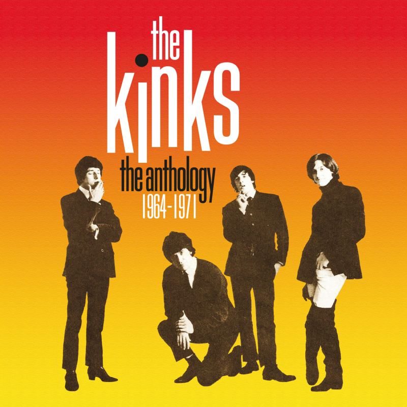

# The Anthology 1964–1971

By **The Kinks**

## Album Data

- **Catalog:** Beets
- **Format:** Digital, Album
- **Album:** The Anthology 1964–1971
- **Artist:** The Kinks
- **Albumartist:** The Kinks
- **Genre:** Rock
- **MusicBrainz Album Artist ID:** [17b53d9f-5c63-4a09-a593-dde4608e0db9](https://musicbrainz.org/artist/17b53d9f-5c63-4a09-a593-dde4608e0db9)
- **MusicBrainz Album ID:** [77a1df85-3393-4f6f-988b-5d0391eac9d7](https://musicbrainz.org/release/77a1df85-3393-4f6f-988b-5d0391eac9d7)
- **MusicBrainz Release Group ID:** [2825d86f-f669-4760-9a7e-054a4c51a50c](https://musicbrainz.org/release-group/2825d86f-f669-4760-9a7e-054a4c51a50c)
- **Year:** 2014
- **Catalog #:** 
- **Label:** 
- **Total Tracks:** 11

## Album Tracks

### Track 02 - Brainwashed

- **Artist:** The Kinks
- **Format:** MP3
- **Genre:** Rock
- **Length:** 2:58
- **MusicBrainz Track ID:** [f72c9441-2836-496e-921c-deb21d3c3d0f](https://musicbrainz.org/recording/f72c9441-2836-496e-921c-deb21d3c3d0f)
- **Title:** Brainwashed
- **Track:** 02
- **Year:** 1972

### Track 03 - Mr. Wonderful

- **Artist:** The Kinks
- **Format:** MP3
- **Genre:** Rock
- **Length:** 0:43
- **MusicBrainz Track ID:** [adeb9b74-6271-4259-9931-793555274992](https://musicbrainz.org/recording/adeb9b74-6271-4259-9931-793555274992)
- **Title:** Mr. Wonderful
- **Track:** 03
- **Year:** 1972

### Track 08 - Banana Boat Song

- **Artist:** The Kinks
- **Format:** MP3
- **Genre:** Rock
- **Length:** 1:40
- **MusicBrainz Track ID:** [53fdfb9b-86fd-443d-a01e-7a50ae0b9fa7](https://musicbrainz.org/recording/53fdfb9b-86fd-443d-a01e-7a50ae0b9fa7)
- **Title:** Banana Boat Song
- **Track:** 08
- **Year:** 1972

### Track 10 - Baby Face

- **Artist:** The Kinks
- **Format:** MP3
- **Genre:** Rock
- **Length:** 1:53
- **MusicBrainz Track ID:** [99b45b5b-50d3-40f5-8f1b-3c74cf4fb88e](https://musicbrainz.org/recording/99b45b5b-50d3-40f5-8f1b-3c74cf4fb88e)
- **Title:** Baby Face
- **Track:** 10
- **Year:** 1972

### Track 04 - Have a Cuppa Tea (live)

- **Artist:** The Kinks
- **Format:** MP3
- **Genre:** Rock
- **Length:** 2:57
- **MusicBrainz Track ID:** [7081d2b3-d419-4707-a635-3a805bc19a43](https://musicbrainz.org/recording/7081d2b3-d419-4707-a635-3a805bc19a43)
- **Title:** Have a Cuppa Tea (live)
- **Track:** 04
- **Year:** 1972

### Track 05 - Sunny Afternoon (The Kinks at the Rainbow, 1972)

- **Artist:** The Kinks
- **Format:** MP3
- **Genre:** Rock
- **Length:** 2:37
- **MusicBrainz Track ID:** [4a4a6374-eaeb-4365-9e5d-9fcad850a95d](https://musicbrainz.org/recording/4a4a6374-eaeb-4365-9e5d-9fcad850a95d)
- **Title:** Sunny Afternoon (The Kinks at the Rainbow, 1972)
- **Track:** 05
- **Year:** 1972

### Track 11 - Complicated Life (live)

- **Artist:** The Kinks
- **Format:** MP3
- **Genre:** Rock
- **Length:** 3:22
- **MusicBrainz Track ID:** [7dc04f01-ab35-4428-90d1-256634d62275](https://musicbrainz.org/recording/7dc04f01-ab35-4428-90d1-256634d62275)
- **Title:** Complicated Life (live)
- **Track:** 11
- **Year:** 1972

### Track 12 - She's Bought a Hat Like Princess Marina

- **Artist:** The Kinks
- **Format:** MP3
- **Genre:** Britpop
- **Length:** 3:16
- **MusicBrainz Track ID:** [6916a8aa-dd83-4af3-996c-a6ac4fa281ab](https://musicbrainz.org/recording/6916a8aa-dd83-4af3-996c-a6ac4fa281ab)
- **Title:** She's Bought a Hat Like Princess Marina
- **Track:** 12
- **Year:** 1972

### Track 13 - Long Tall Shorty

- **Artist:** The Kinks
- **Format:** MP3
- **Genre:** Rock
- **Length:** 2:29
- **MusicBrainz Track ID:** [2e51ab5e-ed6f-401b-8fbf-510759aa4db5](https://musicbrainz.org/recording/2e51ab5e-ed6f-401b-8fbf-510759aa4db5)
- **Title:** Long Tall Shorty
- **Track:** 13
- **Year:** 1972

### Track 14 - History

- **Artist:** The Kinks
- **Format:** MP3
- **Genre:** Rock
- **Length:** 5:20
- **MusicBrainz Track ID:** [f4afb1b1-cd13-40b9-8d60-6b3d1d401480](https://musicbrainz.org/recording/f4afb1b1-cd13-40b9-8d60-6b3d1d401480)
- **Title:** History
- **Track:** 14
- **Year:** 1972

### Track 16 - Unreal Reality (alternate mix)

- **Artist:** The Kinks
- **Format:** MP3
- **Genre:** Rock
- **Length:** 3:58
- **MusicBrainz Track ID:** [9dc4fa78-c30f-4ffb-b026-0ce4e9e0171d](https://musicbrainz.org/recording/9dc4fa78-c30f-4ffb-b026-0ce4e9e0171d)
- **Title:** Unreal Reality (alternate mix)
- **Track:** 16
- **Year:** 1972

### Track 17 - Sophisticated Lady (backing track)

- **Artist:** The Kinks
- **Format:** MP3
- **Genre:** Rock
- **Length:** 3:21
- **MusicBrainz Track ID:** [56e2c1d0-a603-4a6b-a5be-ac2f66451527](https://musicbrainz.org/recording/56e2c1d0-a603-4a6b-a5be-ac2f66451527)
- **Title:** Sophisticated Lady (backing track)
- **Track:** 17
- **Year:** 1972

