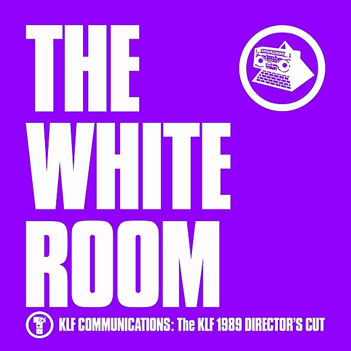

# The White Room

By **The KLF**

## Album Data

- **Catalog:** Beets
- **Format:** Digital, Album
- **Album:** The White Room
- **Artist:** The Klf
- **Albumartist:** The KLF
- **Genre:** Ambient House
- **MusicBrainz Album Artist ID:** [8092b8b7-235e-4844-9f72-95a9d5a73dbf](https://musicbrainz.org/artist/8092b8b7-235e-4844-9f72-95a9d5a73dbf)
- **MusicBrainz Album ID:** [f103dc90-634b-4cc7-82d6-1f91e04cb0a4](https://musicbrainz.org/release/f103dc90-634b-4cc7-82d6-1f91e04cb0a4)
- **MusicBrainz Release Group ID:** [30e20b6b-778b-3d6a-aa72-3f821a8dd538](https://musicbrainz.org/release-group/30e20b6b-778b-3d6a-aa72-3f821a8dd538)
- **Year:** 2003
- **Catalog #:** 07822 18707-2
- **Label:** Arista
- **Total Tracks:** 14

## Album Tracks

### Track 01 - What Time Is Love? (LP mix)

- **Artist:** The KLF
- **Format:** ALAC
- **Genre:** Ambient House
- **Length:** 5:17
- **MusicBrainz Track ID:** [e3de106c-4135-4be0-b26c-b8095787bdf3](https://musicbrainz.org/recording/e3de106c-4135-4be0-b26c-b8095787bdf3)
- **Title:** What Time Is Love? (LP mix)
- **Track:** 01
- **Year:** 2003

### Track 02 - Make It Rain

- **Artist:** The KLF
- **Format:** ALAC
- **Genre:** Ambient House
- **Length:** 3:36
- **MusicBrainz Track ID:** [b1aa9435-2576-44b7-b1c4-a082958849e2](https://musicbrainz.org/recording/b1aa9435-2576-44b7-b1c4-a082958849e2)
- **Title:** Make It Rain
- **Track:** 02
- **Year:** 2003

### Track 03 - 3 A.M. Eternal (live at the S.S.L.)

- **Artist:** The KLF
- **Format:** ALAC
- **Genre:** Ambient House
- **Length:** 3:35
- **MusicBrainz Track ID:** [b5cb57ee-0c93-4cf2-9507-29528516c9af](https://musicbrainz.org/recording/b5cb57ee-0c93-4cf2-9507-29528516c9af)
- **Title:** 3 A.M. Eternal (live at the S.S.L.)
- **Track:** 03
- **Year:** 2003

### Track 04 - Church of the KLF

- **Artist:** The KLF
- **Format:** ALAC
- **Genre:** Vocal House
- **Length:** 1:53
- **MusicBrainz Track ID:** [b77c681b-d303-4fd3-81ef-0b973f8a2d86](https://musicbrainz.org/recording/b77c681b-d303-4fd3-81ef-0b973f8a2d86)
- **Title:** Church of the KLF
- **Track:** 04
- **Year:** 2003

### Track 05 - Last Train to Trancentral (live From the Lost Continent)

- **Artist:** The KLF
- **Format:** ALAC
- **Genre:** Acid House
- **Length:** 3:41
- **MusicBrainz Track ID:** [e7924803-e84b-4cfd-ba0a-1f02a752634f](https://musicbrainz.org/recording/e7924803-e84b-4cfd-ba0a-1f02a752634f)
- **Title:** Last Train to Trancentral (live From the Lost Continent)
- **Track:** 05
- **Year:** 2003

### Track 06 - Build a Fire

- **Artist:** The KLF
- **Format:** ALAC
- **Genre:** Ambient House
- **Length:** 4:35
- **MusicBrainz Track ID:** [db4669d3-2161-4db7-8af3-8f5cd9bd0213](https://musicbrainz.org/recording/db4669d3-2161-4db7-8af3-8f5cd9bd0213)
- **Title:** Build a Fire
- **Track:** 06
- **Year:** 2003

### Track 07 - The White Room

- **Artist:** The KLF
- **Format:** ALAC
- **Genre:** Ambient House
- **Length:** 5:15
- **MusicBrainz Track ID:** [2b157873-a601-4bd1-b396-36c2324e74aa](https://musicbrainz.org/recording/2b157873-a601-4bd1-b396-36c2324e74aa)
- **Title:** The White Room
- **Track:** 07
- **Year:** 2003

### Track 08 - No More Tears

- **Artist:** The KLF
- **Format:** ALAC
- **Genre:** Dub
- **Length:** 6:41
- **MusicBrainz Track ID:** [6345bf16-9d90-4d8d-929d-3e5019a805fa](https://musicbrainz.org/recording/6345bf16-9d90-4d8d-929d-3e5019a805fa)
- **Title:** No More Tears
- **Track:** 08
- **Year:** 2003

### Track 09 - Justified and Ancient

- **Artist:** The KLF
- **Format:** ALAC
- **Genre:** Ambient House
- **Length:** 5:05
- **MusicBrainz Track ID:** [ad5d3878-d0de-4853-a0a0-ea974ac49248](https://musicbrainz.org/recording/ad5d3878-d0de-4853-a0a0-ea974ac49248)
- **Title:** Justified and Ancient
- **Track:** 09
- **Year:** 2003

### Track 10 - Justified & Ancient (Stand by the Jams)

- **Artist:** The KLF
- **Format:** ALAC
- **Genre:** Electronica
- **Length:** 3:39
- **MusicBrainz Track ID:** [7e517825-559a-4d88-9dcd-154b153f760c](https://musicbrainz.org/recording/7e517825-559a-4d88-9dcd-154b153f760c)
- **Title:** Justified & Ancient (Stand by the Jams)
- **Track:** 10
- **Year:** 2003

### Track 11 - Justified & Ancient (Stand by the Jams 12" version)

- **Artist:** The KLF
- **Format:** ALAC
- **Genre:** Electronic
- **Length:** 5:31
- **MusicBrainz Track ID:** [d302e608-d437-4ed5-a679-e95d4634fd94](https://musicbrainz.org/recording/d302e608-d437-4ed5-a679-e95d4634fd94)
- **Title:** Justified & Ancient (Stand by the Jams 12" version)
- **Track:** 11
- **Year:** 2003

### Track 12 - Justified & Ancient ("The White Room" version)

- **Artist:** The KLF
- **Format:** ALAC
- **Genre:** Synthpop
- **Length:** 5:07
- **MusicBrainz Track ID:** [ad5d3878-d0de-4853-a0a0-ea974ac49248](https://musicbrainz.org/recording/ad5d3878-d0de-4853-a0a0-ea974ac49248)
- **Title:** Justified & Ancient ("The White Room" version)
- **Track:** 12
- **Year:** 2003

### Track 13 - Justified & Ancient (All Bound for Mu Mu Land)

- **Artist:** The KLF
- **Format:** ALAC
- **Genre:** Trance
- **Length:** 7:50
- **MusicBrainz Track ID:** [b64584ad-c1e8-4dab-8353-7b6982694112](https://musicbrainz.org/recording/b64584ad-c1e8-4dab-8353-7b6982694112)
- **Title:** Justified & Ancient (All Bound for Mu Mu Land)
- **Track:** 13
- **Year:** 2003

### Track 14 - Justified & Ancient (Let Them Eat Ice Cream)

- **Artist:** The KLF
- **Format:** ALAC
- **Genre:** Trance
- **Length:** 6:30
- **MusicBrainz Track ID:** [a7ddb509-0ded-4420-a0fb-1ef8cb2dcf62](https://musicbrainz.org/recording/a7ddb509-0ded-4420-a0fb-1ef8cb2dcf62)
- **Title:** Justified & Ancient (Let Them Eat Ice Cream)
- **Track:** 14
- **Year:** 2003

