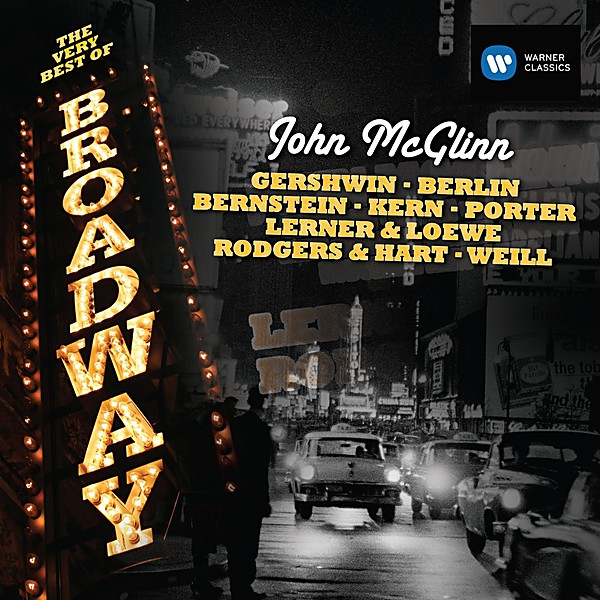

# The Very Best Of The Knickerbockers

By **The Knickerbockers**

## Album Data

- **Catalog:** Beets
- **Format:** Digital, Album
- **Album:** The Very Best Of The Knickerbockers
- **Artist:** The Knickerbockers
- **Albumartist:** The Knickerbockers
- **Genre:** Psychedelic Rock
- **MusicBrainz Album Artist ID:** 
- **MusicBrainz Album ID:** 
- **MusicBrainz Release Group ID:** 
- **Year:** 1998
- **Catalog #:** 
- **Label:** 
- **Total Tracks:** 24

## Album Tracks

### Track 01 - Lies

- **Artist:** The Knickerbockers
- **Format:** ALAC
- **Genre:** Power Pop
- **Length:** 2:42
- **MusicBrainz Track ID:** 
- **Title:** Lies
- **Track:** 01
- **Year:** 1998

### Track 02 - Harlem Nocturne

- **Artist:** The Knickerbockers
- **Format:** ALAC
- **Genre:** Psychedelic Rock
- **Length:** 3:47
- **MusicBrainz Track ID:** 
- **Title:** Harlem Nocturne
- **Track:** 02
- **Year:** 1998

### Track 03 - Twine Time

- **Artist:** The Knickerbockers
- **Format:** ALAC
- **Genre:** Psychedelic Rock
- **Length:** 2:47
- **MusicBrainz Track ID:** 
- **Title:** Twine Time
- **Track:** 03
- **Year:** 1998

### Track 04 - Money

- **Artist:** The Knickerbockers
- **Format:** ALAC
- **Genre:** Garage Rock
- **Length:** 3:57
- **MusicBrainz Track ID:** 
- **Title:** Money
- **Track:** 04
- **Year:** 1998

### Track 05 - Jolly Green Giant

- **Artist:** The Knickerbockers
- **Format:** ALAC
- **Genre:** Psychedelic Rock
- **Length:** 2:51
- **MusicBrainz Track ID:** 
- **Title:** Jolly Green Giant
- **Track:** 05
- **Year:** 1998

### Track 06 - Playgirl

- **Artist:** The Knickerbockers
- **Format:** ALAC
- **Genre:** Psychedelic Rock
- **Length:** 2:26
- **MusicBrainz Track ID:** 
- **Title:** Playgirl
- **Track:** 06
- **Year:** 1998

### Track 07 - Chuck Berry Medley

- **Artist:** The Knickerbockers
- **Format:** ALAC
- **Genre:** Rockabilly
- **Length:** 3:00
- **MusicBrainz Track ID:** 
- **Title:** Chuck Berry Medley
- **Track:** 07
- **Year:** 1998

### Track 08 - Turn To Me

- **Artist:** The Knickerbockers
- **Format:** ALAC
- **Genre:** Psychedelic Rock
- **Length:** 2:30
- **MusicBrainz Track ID:** 
- **Title:** Turn To Me
- **Track:** 08
- **Year:** 1998

### Track 09 - Stick With Me

- **Artist:** The Knickerbockers
- **Format:** ALAC
- **Genre:** Garage Rock
- **Length:** 2:28
- **MusicBrainz Track ID:** 
- **Title:** Stick With Me
- **Track:** 09
- **Year:** 1998

### Track 10 - You're Bad

- **Artist:** The Knickerbockers
- **Format:** ALAC
- **Genre:** Psychedelic Rock
- **Length:** 2:05
- **MusicBrainz Track ID:** 
- **Title:** You're Bad
- **Track:** 10
- **Year:** 1998

### Track 11 - She's Not There

- **Artist:** The Knickerbockers
- **Format:** ALAC
- **Genre:** Garage Rock
- **Length:** 2:28
- **MusicBrainz Track ID:** 
- **Title:** She's Not There
- **Track:** 11
- **Year:** 1998

### Track 12 - One Track Mind

- **Artist:** The Knickerbockers
- **Format:** ALAC
- **Genre:** Psychedelic Rock
- **Length:** 2:19
- **MusicBrainz Track ID:** 
- **Title:** One Track Mind
- **Track:** 12
- **Year:** 1966

### Track 13 - Jerktown

- **Artist:** The Knickerbockers
- **Format:** ALAC
- **Genre:** Psychedelic Rock
- **Length:** 2:30
- **MusicBrainz Track ID:** 
- **Title:** Jerktown
- **Track:** 13
- **Year:** 1998

### Track 14 - You Really Got Me

- **Artist:** The Knickerbockers
- **Format:** ALAC
- **Genre:** Psychedelic Rock
- **Length:** 2:17
- **MusicBrainz Track ID:** 
- **Title:** You Really Got Me
- **Track:** 14
- **Year:** 1998

### Track 15 - She's Gotten To Me

- **Artist:** The Knickerbockers
- **Format:** ALAC
- **Genre:** Psychedelic Rock
- **Length:** 2:08
- **MusicBrainz Track ID:** 
- **Title:** She's Gotten To Me
- **Track:** 15
- **Year:** 1998

### Track 16 - Like Little Children

- **Artist:** The Knickerbockers
- **Format:** ALAC
- **Genre:** Psychedelic Rock
- **Length:** 2:35
- **MusicBrainz Track ID:** 
- **Title:** Like Little Children
- **Track:** 16
- **Year:** 1998

### Track 17 - Just One Girl

- **Artist:** The Knickerbockers
- **Format:** ALAC
- **Genre:** Garage Rock
- **Length:** 2:05
- **MusicBrainz Track ID:** 
- **Title:** Just One Girl
- **Track:** 17
- **Year:** 1998

### Track 18 - Wishful Thinking

- **Artist:** The Knickerbockers
- **Format:** ALAC
- **Genre:** Psychedelic Rock
- **Length:** 2:48
- **MusicBrainz Track ID:** 
- **Title:** Wishful Thinking
- **Track:** 18
- **Year:** 1998

### Track 19 - All Day & All Of The Night

- **Artist:** The Knickerbockers
- **Format:** ALAC
- **Genre:** Psychedelic Rock
- **Length:** 2:25
- **MusicBrainz Track ID:** 
- **Title:** All Day & All Of The Night
- **Track:** 19
- **Year:** 1998

### Track 20 - Land Of 1000 Dances

- **Artist:** The Knickerbockers
- **Format:** ALAC
- **Genre:** Garage Rock
- **Length:** 2:30
- **MusicBrainz Track ID:** 
- **Title:** Land Of 1000 Dances
- **Track:** 20
- **Year:** 1998

### Track 21 - High On Love

- **Artist:** The Knickerbockers
- **Format:** ALAC
- **Genre:** Psychedelic Rock
- **Length:** 3:03
- **MusicBrainz Track ID:** 
- **Title:** High On Love
- **Track:** 21
- **Year:** 1998

### Track 22 - Playgirl (Version No. 2)

- **Artist:** The Knickerbockers
- **Format:** ALAC
- **Genre:** Psychedelic Rock
- **Length:** 2:30
- **MusicBrainz Track ID:** 
- **Title:** Playgirl (Version No. 2)
- **Track:** 22
- **Year:** 1998

### Track 23 - Bite Bite Barracuda

- **Artist:** The Knickerbockers
- **Format:** ALAC
- **Genre:** Psychedelic Rock
- **Length:** 2:07
- **MusicBrainz Track ID:** 
- **Title:** Bite Bite Barracuda
- **Track:** 23
- **Year:** 1998

### Track 24 - She Said Goodbye

- **Artist:** The Knickerbockers
- **Format:** ALAC
- **Genre:** Psychedelic Rock
- **Length:** 2:48
- **MusicBrainz Track ID:** 
- **Title:** She Said Goodbye
- **Track:** 24
- **Year:** 1998

