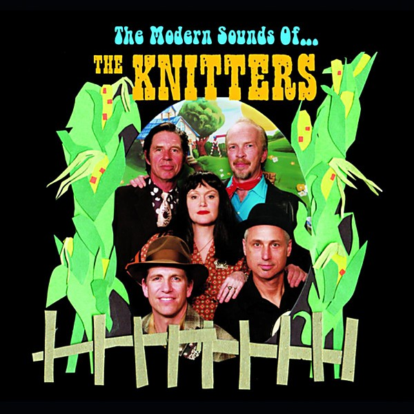

# The Modern Sounds of the Knitters

By **The Knitters**

## Album Data

- **Catalog:** Beets
- **Format:** Digital, Album
- **Album:** The Modern Sounds of the Knitters
- **Artist:** The Knitters
- **Albumartist:** The Knitters
- **Genre:** Rockabilly
- **MusicBrainz Album Artist ID:** [ef06d4b0-8f38-4059-af25-b772135455cf](https://musicbrainz.org/artist/ef06d4b0-8f38-4059-af25-b772135455cf)
- **MusicBrainz Album ID:** [1c03ead1-2af8-4199-9eb6-d46cb09c35d3](https://musicbrainz.org/release/1c03ead1-2af8-4199-9eb6-d46cb09c35d3)
- **MusicBrainz Release Group ID:** [838ba53b-dadd-3183-8384-5a59bbabf61c](https://musicbrainz.org/release-group/838ba53b-dadd-3183-8384-5a59bbabf61c)
- **Year:** 2005
- **Catalog #:** 01143-1057-2
- **Label:** Zoë Records
- **Total Tracks:** 13

## Album Tracks

### Track 01 - Easy Goin' Sunday

- **Artist:** The Knitters
- **Format:** ALAC
- **Genre:** Rockabilly
- **Length:** 0:32
- **MusicBrainz Track ID:** [0da227bd-00c5-4860-981e-8bcfcdedcce1](https://musicbrainz.org/recording/0da227bd-00c5-4860-981e-8bcfcdedcce1)
- **Title:** Easy Goin' Sunday
- **Track:** 01
- **Year:** 2005

### Track 02 - Give Me My Flowers

- **Artist:** The Knitters
- **Format:** ALAC
- **Genre:** Rockabilly
- **Length:** 2:14
- **MusicBrainz Track ID:** [78145426-f3a7-4fdd-a161-eac0054b2923](https://musicbrainz.org/recording/78145426-f3a7-4fdd-a161-eac0054b2923)
- **Title:** Give Me My Flowers
- **Track:** 02
- **Year:** 2005

### Track 03 - Try Anymore

- **Artist:** The Knitters
- **Format:** ALAC
- **Genre:** Rockabilly
- **Length:** 2:51
- **MusicBrainz Track ID:** [5387038f-159d-4457-97a2-f4afc798718a](https://musicbrainz.org/recording/5387038f-159d-4457-97a2-f4afc798718a)
- **Title:** Try Anymore
- **Track:** 03
- **Year:** 2005

### Track 04 - In This House

- **Artist:** The Knitters
- **Format:** ALAC
- **Genre:** Rockabilly
- **Length:** 2:22
- **MusicBrainz Track ID:** [23bec6fe-1d28-479c-b1a5-76fc2babd552](https://musicbrainz.org/recording/23bec6fe-1d28-479c-b1a5-76fc2babd552)
- **Title:** In This House
- **Track:** 04
- **Year:** 2005

### Track 05 - Dry River

- **Artist:** The Knitters
- **Format:** ALAC
- **Genre:** Cowpunk
- **Length:** 3:23
- **MusicBrainz Track ID:** [f8ea82e9-cca4-45d2-a6b2-e412985c2f7c](https://musicbrainz.org/recording/f8ea82e9-cca4-45d2-a6b2-e412985c2f7c)
- **Title:** Dry River
- **Track:** 05
- **Year:** 2005

### Track 06 - Skin Deep Town

- **Artist:** The Knitters
- **Format:** ALAC
- **Genre:** Rockabilly
- **Length:** 2:27
- **MusicBrainz Track ID:** [78e91c8b-a6c7-424f-80ca-72d2f76c3249](https://musicbrainz.org/recording/78e91c8b-a6c7-424f-80ca-72d2f76c3249)
- **Title:** Skin Deep Town
- **Track:** 06
- **Year:** 2005

### Track 07 - Rank Stranger

- **Artist:** The Knitters
- **Format:** ALAC
- **Genre:** Alternative Country
- **Length:** 4:12
- **MusicBrainz Track ID:** [191c2f65-dd12-4f15-977d-b3bb11a2fc97](https://musicbrainz.org/recording/191c2f65-dd12-4f15-977d-b3bb11a2fc97)
- **Title:** Rank Stranger
- **Track:** 07
- **Year:** 2005

### Track 08 - The New Call of the Wreckin' Ball

- **Artist:** The Knitters
- **Format:** ALAC
- **Genre:** Rockabilly
- **Length:** 3:40
- **MusicBrainz Track ID:** [84eba3b6-0aef-410c-80ae-7e28adc10185](https://musicbrainz.org/recording/84eba3b6-0aef-410c-80ae-7e28adc10185)
- **Title:** The New Call of the Wreckin' Ball
- **Track:** 08
- **Year:** 2005

### Track 09 - Long Chain On

- **Artist:** The Knitters
- **Format:** ALAC
- **Genre:** Rockabilly
- **Length:** 4:10
- **MusicBrainz Track ID:** [7af10611-b065-46d2-9dd6-d10a45a9d282](https://musicbrainz.org/recording/7af10611-b065-46d2-9dd6-d10a45a9d282)
- **Title:** Long Chain On
- **Track:** 09
- **Year:** 2005

### Track 10 - I'll Go Down Swingin'

- **Artist:** The Knitters
- **Format:** ALAC
- **Genre:** Rockabilly
- **Length:** 2:24
- **MusicBrainz Track ID:** [aa7e1fb6-5dd6-4875-a9ef-561cb5b0e89d](https://musicbrainz.org/recording/aa7e1fb6-5dd6-4875-a9ef-561cb5b0e89d)
- **Title:** I'll Go Down Swingin'
- **Track:** 10
- **Year:** 2005

### Track 11 - Burnin' House of Love

- **Artist:** The Knitters
- **Format:** ALAC
- **Genre:** Rockabilly
- **Length:** 3:42
- **MusicBrainz Track ID:** [2ebcb31b-19a2-4836-af33-3bce9d0407b9](https://musicbrainz.org/recording/2ebcb31b-19a2-4836-af33-3bce9d0407b9)
- **Title:** Burnin' House of Love
- **Track:** 11
- **Year:** 2005

### Track 12 - Little Margaret

- **Artist:** The Knitters
- **Format:** ALAC
- **Genre:** Rockabilly
- **Length:** 3:06
- **MusicBrainz Track ID:** [f27036e6-19b1-4aee-ac16-38e10b471e71](https://musicbrainz.org/recording/f27036e6-19b1-4aee-ac16-38e10b471e71)
- **Title:** Little Margaret
- **Track:** 12
- **Year:** 2005

### Track 13 - Born to Be Wild

- **Artist:** The Knitters
- **Format:** ALAC
- **Genre:** Rockabilly
- **Length:** 4:25
- **MusicBrainz Track ID:** [8b460ab5-2761-47ad-8788-940ed66be94f](https://musicbrainz.org/recording/8b460ab5-2761-47ad-8788-940ed66be94f)
- **Title:** Born to Be Wild
- **Track:** 13
- **Year:** 2005

## See also

- [Poor Little Critter on the Road](Poor_Little_Critter_on_the_Road.md)
