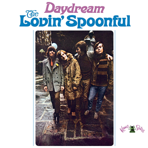

# Daydream

By **The Lovin' Spoonful**

## Album Data

- **Catalog:** Beets
- **Format:** Digital, Album
- **Album:** Daydream
- **Artist:** The Lovin' Spoonful
- **Albumartist:** The Lovin' Spoonful
- **Genre:** Rock
- **MusicBrainz Album Artist ID:** 
- **MusicBrainz Album ID:** 
- **MusicBrainz Release Group ID:** 
- **Year:** 1966
- **Catalog #:** 
- **Label:** 
- **Total Tracks:** 17

## Album Tracks

### Track 01 - Daydream

- **Artist:** The Lovin' Spoonful
- **Format:** ALAC
- **Genre:** Folk Rock
- **Length:** 2:21
- **MusicBrainz Track ID:** 
- **Title:** Daydream
- **Track:** 01
- **Year:** 1966

### Track 02 - There She Is

- **Artist:** The Lovin' Spoonful
- **Format:** ALAC
- **Genre:** Folk Rock
- **Length:** 1:58
- **MusicBrainz Track ID:** 
- **Title:** There She Is
- **Track:** 02
- **Year:** 1966

### Track 03 - It's Not Time Now

- **Artist:** The Lovin' Spoonful
- **Format:** ALAC
- **Genre:** Folk Rock
- **Length:** 2:49
- **MusicBrainz Track ID:** 
- **Title:** It's Not Time Now
- **Track:** 03
- **Year:** 1966

### Track 04 - Warm Baby

- **Artist:** The Lovin' Spoonful
- **Format:** ALAC
- **Genre:** Folk Rock
- **Length:** 2:03
- **MusicBrainz Track ID:** 
- **Title:** Warm Baby
- **Track:** 04
- **Year:** 1966

### Track 05 - Day Blues

- **Artist:** The Lovin' Spoonful
- **Format:** ALAC
- **Genre:** Blues
- **Length:** 3:15
- **MusicBrainz Track ID:** 
- **Title:** Day Blues
- **Track:** 05
- **Year:** 1966

### Track 06 - Let The Boy Rock 'N' Roll

- **Artist:** The Lovin' Spoonful
- **Format:** ALAC
- **Genre:** Rock
- **Length:** 2:34
- **MusicBrainz Track ID:** 
- **Title:** Let The Boy Rock 'N' Roll
- **Track:** 06
- **Year:** 1966

### Track 07 - Jug Band Music

- **Artist:** The Lovin' Spoonful
- **Format:** ALAC
- **Genre:** Folk Rock
- **Length:** 2:53
- **MusicBrainz Track ID:** 
- **Title:** Jug Band Music
- **Track:** 07
- **Year:** 1966

### Track 08 - Didn't Want To Have To Do It

- **Artist:** The Lovin' Spoonful
- **Format:** ALAC
- **Genre:** Psychedelic Pop
- **Length:** 2:39
- **MusicBrainz Track ID:** 
- **Title:** Didn't Want To Have To Do It
- **Track:** 08
- **Year:** 1966

### Track 09 - You Didn't Have To Be So Nice

- **Artist:** The Lovin' Spoonful
- **Format:** ALAC
- **Genre:** Folk Rock
- **Length:** 2:29
- **MusicBrainz Track ID:** 
- **Title:** You Didn't Have To Be So Nice
- **Track:** 09
- **Year:** 1966

### Track 10 - Bald Headed Lena

- **Artist:** The Lovin' Spoonful
- **Format:** ALAC
- **Genre:** Folk Rock
- **Length:** 2:25
- **MusicBrainz Track ID:** 
- **Title:** Bald Headed Lena
- **Track:** 10
- **Year:** 1966

### Track 11 - Butchie's Tune

- **Artist:** The Lovin' Spoonful
- **Format:** ALAC
- **Genre:** Folk Rock
- **Length:** 2:37
- **MusicBrainz Track ID:** 
- **Title:** Butchie's Tune
- **Track:** 11
- **Year:** 1966

### Track 12 - Big Noise From Speonk

- **Artist:** The Lovin' Spoonful
- **Format:** ALAC
- **Genre:** Folk Rock
- **Length:** 2:21
- **MusicBrainz Track ID:** 
- **Title:** Big Noise From Speonk
- **Track:** 12
- **Year:** 1966

### Track 13 - Fishin' Blues [Alternate Take/Previously Unreleased]

- **Artist:** The Lovin' Spoonful
- **Format:** ALAC
- **Genre:** Rock
- **Length:** 2:32
- **MusicBrainz Track ID:** 
- **Title:** Fishin' Blues [Alternate Take/Previously Unreleased]
- **Track:** 13
- **Year:** 1966

### Track 14 - Didn't Want To Have To Do It [Demo Version/Previously Unreleased]

- **Artist:** The Lovin' Spoonful
- **Format:** ALAC
- **Genre:** Rock
- **Length:** 2:49
- **MusicBrainz Track ID:** 
- **Title:** Didn't Want To Have To Do It [Demo Version/Previously Unreleased]
- **Track:** 14
- **Year:** 1966

### Track 15 - Jug Band Music [Alternate Instrumental Version/Previously Unreleased]

- **Artist:** The Lovin' Spoonful
- **Format:** ALAC
- **Genre:** Rock
- **Length:** 2:54
- **MusicBrainz Track ID:** 
- **Title:** Jug Band Music [Alternate Instrumental Version/Previously Unreleased]
- **Track:** 15
- **Year:** 1966

### Track 16 - Daydream [Demo Version/Previously Unreleased]

- **Artist:** The Lovin' Spoonful
- **Format:** ALAC
- **Genre:** Rock
- **Length:** 3:19
- **MusicBrainz Track ID:** 
- **Title:** Daydream [Demo Version/Previously Unreleased]
- **Track:** 16
- **Year:** 1966

### Track 17 - Night Owl Blues [Alternate Take/Previously Unreleased]

- **Artist:** The Lovin' Spoonful
- **Format:** ALAC
- **Genre:** Rock
- **Length:** 4:40
- **MusicBrainz Track ID:** 
- **Title:** Night Owl Blues [Alternate Take/Previously Unreleased]
- **Track:** 17
- **Year:** 1966

## See also

- [Vinyl: Darling Be Home Soon / Darlin' Companion](../../Vinyl/The_Lovin_Spoonful/Darling_Be_Home_Soon_-_Darlin_Companion.md)
- [Vinyl: Daydream](../../Vinyl/The_Lovin_Spoonful/Daydream.md)
- [Vinyl: Do You Believe In Magic](../../Vinyl/The_Lovin_Spoonful/Do_You_Believe_In_Magic.md)
- [Vinyl: Hums Of The Lovin' Spoonful](../../Vinyl/The_Lovin_Spoonful/Hums_Of_The_Lovin_Spoonful.md)
- [Vinyl: The Best Of The Lovin' Spoonful](../../Vinyl/The_Lovin_Spoonful/The_Best_Of_The_Lovin_Spoonful.md)
- [Vinyl: ](../../Vinyl/The_Lovin_Spoonful/The_Lovin_Spoonful.md)
