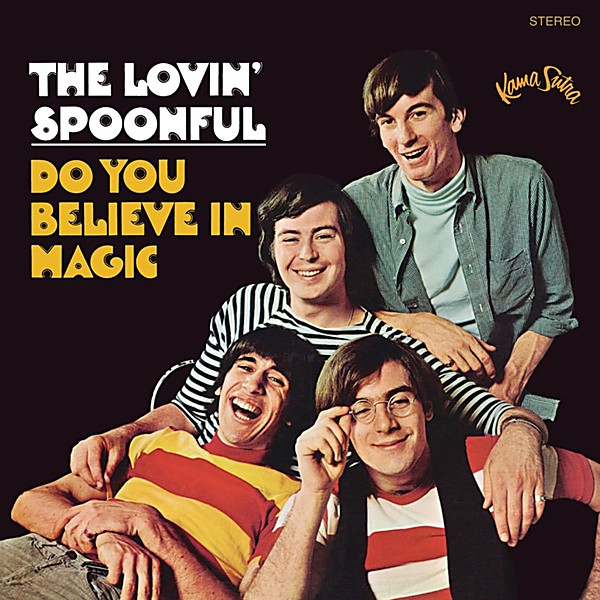

# Do you Believe In Magic

By **The Lovin’ Spoonful**

## Album Data

- **Catalog:** Beets
- **Format:** Digital, Album
- **Album:** Do you Believe In Magic
- **Artist:** The Lovin’ Spoonful
- **Albumartist:** The Lovin’ Spoonful
- **Genre:** Folk Rock
- **MusicBrainz Album Artist ID:** [abc08d4f-4e3c-4b5a-b1e8-d324cd6a2f92](https://musicbrainz.org/artist/abc08d4f-4e3c-4b5a-b1e8-d324cd6a2f92)
- **MusicBrainz Album ID:** [4e3f98cc-53e4-4489-9834-bd4323522847](https://musicbrainz.org/release/4e3f98cc-53e4-4489-9834-bd4323522847)
- **MusicBrainz Release Group ID:** [faefd9c6-93a1-3ae4-9b95-05587b7aad89](https://musicbrainz.org/release-group/faefd9c6-93a1-3ae4-9b95-05587b7aad89)
- **Year:** 2002
- **Catalog #:** 74465 99733 2
- **Label:** Buddha Records
- **Total Tracks:** 14

## Album Tracks

### Track 01 - She Is Still a Mystery

- **Artist:** The Lovin’ Spoonful
- **Format:** ALAC
- **Genre:** Folk Rock
- **Length:** 3:01
- **MusicBrainz Track ID:** [031698a7-8946-47e8-abf2-c18ec2b26b78](https://musicbrainz.org/recording/031698a7-8946-47e8-abf2-c18ec2b26b78)
- **Title:** She Is Still a Mystery
- **Track:** 01
- **Year:** 2003

### Track 02 - Priscilla Millionaire

- **Artist:** The Lovin’ Spoonful
- **Format:** ALAC
- **Genre:** Folk Rock
- **Length:** 3:13
- **MusicBrainz Track ID:** [fc33f5ee-b4e7-44a7-bed9-4e0cf1da71ae](https://musicbrainz.org/recording/fc33f5ee-b4e7-44a7-bed9-4e0cf1da71ae)
- **Title:** Priscilla Millionaire
- **Track:** 02
- **Year:** 2003

### Track 03 - Boredom

- **Artist:** The Lovin’ Spoonful
- **Format:** ALAC
- **Genre:** Folk Rock
- **Length:** 2:25
- **MusicBrainz Track ID:** [86a02059-8f82-4e9a-bf89-fad783632b5c](https://musicbrainz.org/recording/86a02059-8f82-4e9a-bf89-fad783632b5c)
- **Title:** Boredom
- **Track:** 03
- **Year:** 2003

### Track 04 - Six O’Clock

- **Artist:** The Lovin’ Spoonful
- **Format:** ALAC
- **Genre:** Folk Rock
- **Length:** 2:43
- **MusicBrainz Track ID:** [91e18f81-016d-4920-9f60-a1711f5bb009](https://musicbrainz.org/recording/91e18f81-016d-4920-9f60-a1711f5bb009)
- **Title:** Six O’Clock
- **Track:** 04
- **Year:** 2003

### Track 05 - Forever

- **Artist:** The Lovin’ Spoonful
- **Format:** ALAC
- **Genre:** Folk Rock
- **Length:** 4:23
- **MusicBrainz Track ID:** [f3088f38-4885-4c2b-bccc-76b169dff8e6](https://musicbrainz.org/recording/f3088f38-4885-4c2b-bccc-76b169dff8e6)
- **Title:** Forever
- **Track:** 05
- **Year:** 2003

### Track 06 - Younger Generation

- **Artist:** The Lovin’ Spoonful
- **Format:** ALAC
- **Genre:** Folk Rock
- **Length:** 2:42
- **MusicBrainz Track ID:** [53ca0872-87ec-4292-b4ae-b3aac5fe75ef](https://musicbrainz.org/recording/53ca0872-87ec-4292-b4ae-b3aac5fe75ef)
- **Title:** Younger Generation
- **Track:** 06
- **Year:** 2003

### Track 07 - Money

- **Artist:** The Lovin’ Spoonful
- **Format:** ALAC
- **Genre:** Folk Rock
- **Length:** 1:55
- **MusicBrainz Track ID:** [0c6de822-32e8-48e9-abae-4428f0a2b022](https://musicbrainz.org/recording/0c6de822-32e8-48e9-abae-4428f0a2b022)
- **Title:** Money
- **Track:** 07
- **Year:** 2003

### Track 08 - Old Folks

- **Artist:** The Lovin’ Spoonful
- **Format:** ALAC
- **Genre:** Folk Rock
- **Length:** 3:05
- **MusicBrainz Track ID:** [fa6f0f09-2815-47f3-9c8c-af945619d913](https://musicbrainz.org/recording/fa6f0f09-2815-47f3-9c8c-af945619d913)
- **Title:** Old Folks
- **Track:** 08
- **Year:** 2003

### Track 09 - Only Pretty, What a Pity

- **Artist:** The Lovin’ Spoonful
- **Format:** ALAC
- **Genre:** Folk Rock
- **Length:** 3:03
- **MusicBrainz Track ID:** [298cbbe8-b6ad-4716-947e-c593b82f49a6](https://musicbrainz.org/recording/298cbbe8-b6ad-4716-947e-c593b82f49a6)
- **Title:** Only Pretty, What a Pity
- **Track:** 09
- **Year:** 2003

### Track 10 - Try a Little Bit

- **Artist:** The Lovin’ Spoonful
- **Format:** ALAC
- **Genre:** Folk Rock
- **Length:** 3:06
- **MusicBrainz Track ID:** [c471d5e6-0b27-4a91-b406-3982679d2bb4](https://musicbrainz.org/recording/c471d5e6-0b27-4a91-b406-3982679d2bb4)
- **Title:** Try a Little Bit
- **Track:** 10
- **Year:** 2003

### Track 11 - Close Your Eyes

- **Artist:** The Lovin’ Spoonful
- **Format:** ALAC
- **Genre:** Folk Rock
- **Length:** 2:47
- **MusicBrainz Track ID:** [4a08c037-7070-4681-8c93-8275030363da](https://musicbrainz.org/recording/4a08c037-7070-4681-8c93-8275030363da)
- **Title:** Close Your Eyes
- **Track:** 11
- **Year:** 2003

### Track 12 - She Is Still a Mystery (alternate version)

- **Artist:** The Lovin’ Spoonful
- **Format:** ALAC
- **Genre:** Folk Rock
- **Length:** 3:11
- **MusicBrainz Track ID:** [0d2d62c3-d537-49fb-8998-1dae90546736](https://musicbrainz.org/recording/0d2d62c3-d537-49fb-8998-1dae90546736)
- **Title:** She Is Still a Mystery (alternate version)
- **Track:** 12
- **Year:** 2003

### Track 13 - Only Pretty, What a Pity (alternate version)

- **Artist:** The Lovin’ Spoonful
- **Format:** ALAC
- **Genre:** Folk Rock
- **Length:** 2:57
- **MusicBrainz Track ID:** [291f6f34-063b-4d40-9f8a-3423320f8f51](https://musicbrainz.org/recording/291f6f34-063b-4d40-9f8a-3423320f8f51)
- **Title:** Only Pretty, What a Pity (alternate version)
- **Track:** 13
- **Year:** 2003

### Track 14 - Try a Little Bit (alternate version)

- **Artist:** The Lovin’ Spoonful
- **Format:** ALAC
- **Genre:** Folk Rock
- **Length:** 3:02
- **MusicBrainz Track ID:** [363fa6be-b2db-491a-b239-e28808cf7db4](https://musicbrainz.org/recording/363fa6be-b2db-491a-b239-e28808cf7db4)
- **Title:** Try a Little Bit (alternate version)
- **Track:** 14
- **Year:** 2003

## See also

- [Everything Playing](Everything_Playing.md)
- [Greatest Hits](Greatest_Hits.md)
- [Hums of the Lovin’ Spoonful](Hums_of_the_Lovin’_Spoonful.md)
- [Playlist](Playlist.md)
- [Revelation](Revelation.md)
- [Roon: Daydream](../../Roon/The_Lovin’_Spoonful/Daydream.md)
- [Roon: Do you Believe In Magic](../../Roon/The_Lovin’_Spoonful/Do_you_Believe_In_Magic.md)
- [Roon: Everything Playing](../../Roon/The_Lovin’_Spoonful/Everything_Playing.md)
- [Roon: Hums Of The Lovin' Spoonful](../../Roon/The_Lovin’_Spoonful/Hums_Of_The_Lovin_Spoonful.md)
- [Roon: Platinum & Gold Collection](../../Roon/The_Lovin’_Spoonful/Platinum_and_Gold_Collection.md)
- [Roon: You're A Big Boy Now](../../Roon/The_Lovin’_Spoonful/Youre_A_Big_Boy_Now.md)
