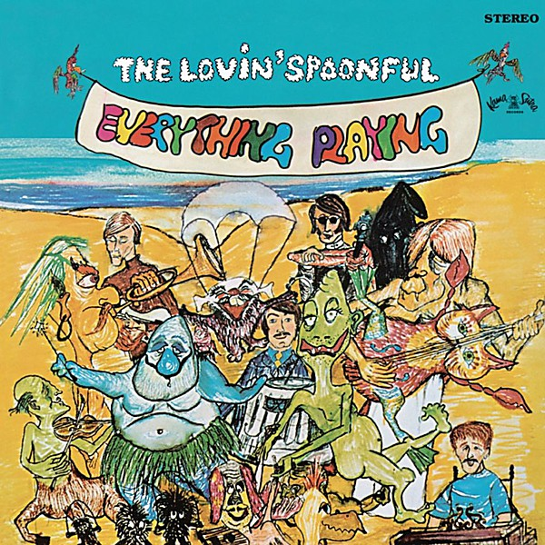

# Everything Playing

By **The Lovin’ Spoonful**

## Album Data

- **Catalog:** Beets
- **Format:** Digital, Album
- **Album:** Everything Playing
- **Artist:** The Lovin’ Spoonful
- **Albumartist:** The Lovin’ Spoonful
- **Genre:** Folk Rock
- **MusicBrainz Album Artist ID:** [abc08d4f-4e3c-4b5a-b1e8-d324cd6a2f92](https://musicbrainz.org/artist/abc08d4f-4e3c-4b5a-b1e8-d324cd6a2f92)
- **MusicBrainz Album ID:** [194afb84-0df1-49e4-9f81-1329a7297171](https://musicbrainz.org/release/194afb84-0df1-49e4-9f81-1329a7297171)
- **MusicBrainz Release Group ID:** [0a879e71-61c6-3f07-8d1d-3ef770f23133](https://musicbrainz.org/release-group/0a879e71-61c6-3f07-8d1d-3ef770f23133)
- **Year:** 2003
- **Catalog #:** 99716
- **Label:** Buddha Records
- **Total Tracks:** 26

## Album Tracks

### Track 01 - Do You Believe in Magic

- **Artist:** The Lovin’ Spoonful
- **Format:** MP3
- **Genre:** Folk Rock
- **Length:** 2:05
- **MusicBrainz Track ID:** [7df94dc8-8fac-46ca-ab0a-70de66261d30](https://musicbrainz.org/recording/7df94dc8-8fac-46ca-ab0a-70de66261d30)
- **Title:** Do You Believe in Magic
- **Track:** 01
- **Year:** 2000

### Track 02 - You Didn’t Have to Be So Nice

- **Artist:** The Lovin’ Spoonful
- **Format:** MP3
- **Genre:** Folk Rock
- **Length:** 2:29
- **MusicBrainz Track ID:** [5f94ccaf-7fde-436d-83e4-9bfbc17f2fa7](https://musicbrainz.org/recording/5f94ccaf-7fde-436d-83e4-9bfbc17f2fa7)
- **Title:** You Didn’t Have to Be So Nice
- **Track:** 02
- **Year:** 2000

### Track 03 - Daydream

- **Artist:** The Lovin’ Spoonful
- **Format:** MP3
- **Genre:** Folk Rock
- **Length:** 2:21
- **MusicBrainz Track ID:** [81dc35cc-a628-4f35-bcb7-0a2b5dba607b](https://musicbrainz.org/recording/81dc35cc-a628-4f35-bcb7-0a2b5dba607b)
- **Title:** Daydream
- **Track:** 03
- **Year:** 2000

### Track 04 - You Baby

- **Artist:** The Lovin’ Spoonful
- **Format:** MP3
- **Genre:** Folk Rock
- **Length:** 2:57
- **MusicBrainz Track ID:** [4b29a337-2e54-4822-9720-c2355cad6400](https://musicbrainz.org/recording/4b29a337-2e54-4822-9720-c2355cad6400)
- **Title:** You Baby
- **Track:** 04
- **Year:** 2000

### Track 05 - Did You Ever Have to Make Up Your Mind?

- **Artist:** The Lovin’ Spoonful
- **Format:** MP3
- **Genre:** Folk Rock
- **Length:** 2:00
- **MusicBrainz Track ID:** [90035d75-9dbe-4210-8447-1b175ec78010](https://musicbrainz.org/recording/90035d75-9dbe-4210-8447-1b175ec78010)
- **Title:** Did You Ever Have to Make Up Your Mind?
- **Track:** 05
- **Year:** 2000

### Track 06 - Wild About My Lovin’

- **Artist:** The Lovin’ Spoonful
- **Format:** MP3
- **Genre:** Folk Rock
- **Length:** 2:37
- **MusicBrainz Track ID:** [9b93c480-092b-4c11-9de0-cc22ffae745b](https://musicbrainz.org/recording/9b93c480-092b-4c11-9de0-cc22ffae745b)
- **Title:** Wild About My Lovin’
- **Track:** 06
- **Year:** 2000

### Track 07 - Younger Girl

- **Artist:** The Lovin’ Spoonful
- **Format:** MP3
- **Genre:** Folk Rock
- **Length:** 2:18
- **MusicBrainz Track ID:** [ccdf8021-c0ed-47e7-9088-88af9380e58c](https://musicbrainz.org/recording/ccdf8021-c0ed-47e7-9088-88af9380e58c)
- **Title:** Younger Girl
- **Track:** 07
- **Year:** 2000

### Track 08 - On the Road Again

- **Artist:** The Lovin’ Spoonful
- **Format:** MP3
- **Genre:** Folk Rock
- **Length:** 1:55
- **MusicBrainz Track ID:** [c2f287ca-ae9c-498a-b271-5cfb8ab385f5](https://musicbrainz.org/recording/c2f287ca-ae9c-498a-b271-5cfb8ab385f5)
- **Title:** On the Road Again
- **Track:** 08
- **Year:** 2000

### Track 09 - Didn’t Want to Have to Do It

- **Artist:** The Lovin’ Spoonful
- **Format:** MP3
- **Genre:** Folk Rock
- **Length:** 2:37
- **MusicBrainz Track ID:** [0834dc85-e417-4f5f-96f8-45fe3c78ca1f](https://musicbrainz.org/recording/0834dc85-e417-4f5f-96f8-45fe3c78ca1f)
- **Title:** Didn’t Want to Have to Do It
- **Track:** 09
- **Year:** 2000

### Track 10 - Jug Band Music

- **Artist:** The Lovin’ Spoonful
- **Format:** MP3
- **Genre:** Folk Rock
- **Length:** 2:54
- **MusicBrainz Track ID:** [47942519-b2e3-4c54-bbcc-45e49ecc4ae1](https://musicbrainz.org/recording/47942519-b2e3-4c54-bbcc-45e49ecc4ae1)
- **Title:** Jug Band Music
- **Track:** 10
- **Year:** 2000

### Track 11 - Summer in the City

- **Artist:** The Lovin’ Spoonful
- **Format:** MP3
- **Genre:** Folk Rock
- **Length:** 2:42
- **MusicBrainz Track ID:** [5005a3c4-da04-47bf-ba0c-eee1bac4f88a](https://musicbrainz.org/recording/5005a3c4-da04-47bf-ba0c-eee1bac4f88a)
- **Title:** Summer in the City
- **Track:** 11
- **Year:** 2000

### Track 12 - Rain on the Roof

- **Artist:** The Lovin’ Spoonful
- **Format:** MP3
- **Genre:** Folk Rock
- **Length:** 2:14
- **MusicBrainz Track ID:** [7b5a1dec-0028-4ef9-b467-0e611c23fef0](https://musicbrainz.org/recording/7b5a1dec-0028-4ef9-b467-0e611c23fef0)
- **Title:** Rain on the Roof
- **Track:** 12
- **Year:** 2000

### Track 13 - Pow (Theme From What’s Up Tiger Lily?)

- **Artist:** The Lovin’ Spoonful
- **Format:** MP3
- **Genre:** Folk Rock
- **Length:** 2:28
- **MusicBrainz Track ID:** [979f7e2e-34a3-46f0-afc5-dfb6e0af7934](https://musicbrainz.org/recording/979f7e2e-34a3-46f0-afc5-dfb6e0af7934)
- **Title:** Pow (Theme From What’s Up Tiger Lily?)
- **Track:** 13
- **Year:** 2000

### Track 14 - Nashville Cats

- **Artist:** The Lovin’ Spoonful
- **Format:** MP3
- **Genre:** Folk Rock
- **Length:** 2:36
- **MusicBrainz Track ID:** [b33bd9f4-9ac7-4fb6-b3d5-954648413c35](https://musicbrainz.org/recording/b33bd9f4-9ac7-4fb6-b3d5-954648413c35)
- **Title:** Nashville Cats
- **Track:** 14
- **Year:** 2000

### Track 15 - Lovin’ You

- **Artist:** The Lovin’ Spoonful
- **Format:** MP3
- **Genre:** Folk Rock
- **Length:** 2:29
- **MusicBrainz Track ID:** [1b4ed0b0-f479-4b77-b9f9-e147c0613c4d](https://musicbrainz.org/recording/1b4ed0b0-f479-4b77-b9f9-e147c0613c4d)
- **Title:** Lovin’ You
- **Track:** 15
- **Year:** 2000

### Track 16 - Darlin’ Companion

- **Artist:** The Lovin’ Spoonful
- **Format:** MP3
- **Genre:** Folk Rock
- **Length:** 2:21
- **MusicBrainz Track ID:** [320aa85d-363d-4977-af3d-05dcd4bffec3](https://musicbrainz.org/recording/320aa85d-363d-4977-af3d-05dcd4bffec3)
- **Title:** Darlin’ Companion
- **Track:** 16
- **Year:** 2000

### Track 17 - Coconut Grove

- **Artist:** The Lovin’ Spoonful
- **Format:** MP3
- **Genre:** Folk Rock
- **Length:** 2:44
- **MusicBrainz Track ID:** [f5d31a51-ca20-42bd-b59e-bbf4fdd4bef1](https://musicbrainz.org/recording/f5d31a51-ca20-42bd-b59e-bbf4fdd4bef1)
- **Title:** Coconut Grove
- **Track:** 17
- **Year:** 2000

### Track 18 - Full Measure

- **Artist:** The Lovin’ Spoonful
- **Format:** MP3
- **Genre:** Folk Rock
- **Length:** 2:41
- **MusicBrainz Track ID:** [e801b2c1-ec7d-40ce-8811-f7081e9b1eba](https://musicbrainz.org/recording/e801b2c1-ec7d-40ce-8811-f7081e9b1eba)
- **Title:** Full Measure
- **Track:** 18
- **Year:** 2000

### Track 19 - Darling Be Home Soon

- **Artist:** The Lovin’ Spoonful
- **Format:** MP3
- **Genre:** Folk Rock
- **Length:** 3:35
- **MusicBrainz Track ID:** [31532b4f-d479-4440-bab3-37baf0c2332b](https://musicbrainz.org/recording/31532b4f-d479-4440-bab3-37baf0c2332b)
- **Title:** Darling Be Home Soon
- **Track:** 19
- **Year:** 2000

### Track 20 - Lonely (Amy’s Theme)

- **Artist:** The Lovin’ Spoonful
- **Format:** MP3
- **Genre:** Folk Rock
- **Length:** 3:24
- **MusicBrainz Track ID:** [4a027803-33a9-4de4-a795-f95927aafaea](https://musicbrainz.org/recording/4a027803-33a9-4de4-a795-f95927aafaea)
- **Title:** Lonely (Amy’s Theme)
- **Track:** 20
- **Year:** 2000

### Track 21 - You’re a Big Boy Now

- **Artist:** The Lovin’ Spoonful
- **Format:** MP3
- **Genre:** Folk Rock
- **Length:** 2:31
- **MusicBrainz Track ID:** [83042461-c9e5-4e4b-91f9-d12608a5e5fa](https://musicbrainz.org/recording/83042461-c9e5-4e4b-91f9-d12608a5e5fa)
- **Title:** You’re a Big Boy Now
- **Track:** 21
- **Year:** 2000

### Track 22 - Six O’Clock

- **Artist:** The Lovin’ Spoonful
- **Format:** MP3
- **Genre:** Folk Rock
- **Length:** 2:44
- **MusicBrainz Track ID:** [91e18f81-016d-4920-9f60-a1711f5bb009](https://musicbrainz.org/recording/91e18f81-016d-4920-9f60-a1711f5bb009)
- **Title:** Six O’Clock
- **Track:** 22
- **Year:** 2000

### Track 23 - She Is Still a Mystery

- **Artist:** The Lovin’ Spoonful
- **Format:** MP3
- **Genre:** Folk Rock
- **Length:** 3:02
- **MusicBrainz Track ID:** [a1ca3e34-ea55-4cc3-ba3d-79763468f7d6](https://musicbrainz.org/recording/a1ca3e34-ea55-4cc3-ba3d-79763468f7d6)
- **Title:** She Is Still a Mystery
- **Track:** 23
- **Year:** 2000

### Track 24 - Money

- **Artist:** The Lovin’ Spoonful
- **Format:** MP3
- **Genre:** Folk Rock
- **Length:** 1:54
- **MusicBrainz Track ID:** [0c6de822-32e8-48e9-abae-4428f0a2b022](https://musicbrainz.org/recording/0c6de822-32e8-48e9-abae-4428f0a2b022)
- **Title:** Money
- **Track:** 24
- **Year:** 2000

### Track 25 - Younger Generation

- **Artist:** The Lovin’ Spoonful
- **Format:** MP3
- **Genre:** Folk Rock
- **Length:** 2:43
- **MusicBrainz Track ID:** [53ca0872-87ec-4292-b4ae-b3aac5fe75ef](https://musicbrainz.org/recording/53ca0872-87ec-4292-b4ae-b3aac5fe75ef)
- **Title:** Younger Generation
- **Track:** 25
- **Year:** 2000

### Track 26 - Never Going Back

- **Artist:** The Lovin’ Spoonful
- **Format:** MP3
- **Genre:** Folk Rock
- **Length:** 2:49
- **MusicBrainz Track ID:** [5b3f9262-528f-4b5b-ae94-b4823f8019eb](https://musicbrainz.org/recording/5b3f9262-528f-4b5b-ae94-b4823f8019eb)
- **Title:** Never Going Back
- **Track:** 26
- **Year:** 2000

## See also

- [Do you Believe In Magic](Do_you_Believe_In_Magic.md)
- [Greatest Hits](Greatest_Hits.md)
- [Hums of the Lovin’ Spoonful](Hums_of_the_Lovin’_Spoonful.md)
- [Playlist](Playlist.md)
- [Revelation](Revelation.md)
- [Roon: Daydream](../../Roon/The_Lovin’_Spoonful/Daydream.md)
- [Roon: Do you Believe In Magic](../../Roon/The_Lovin’_Spoonful/Do_you_Believe_In_Magic.md)
- [Roon: Everything Playing](../../Roon/The_Lovin’_Spoonful/Everything_Playing.md)
- [Roon: Hums Of The Lovin' Spoonful](../../Roon/The_Lovin’_Spoonful/Hums_Of_The_Lovin_Spoonful.md)
- [Roon: Platinum & Gold Collection](../../Roon/The_Lovin’_Spoonful/Platinum_and_Gold_Collection.md)
- [Roon: You're A Big Boy Now](../../Roon/The_Lovin’_Spoonful/Youre_A_Big_Boy_Now.md)
