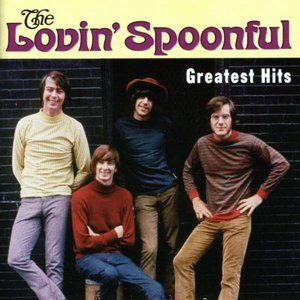

# Greatest Hits

By **The Lovin’ Spoonful**

## Album Data

- **Catalog:** Beets
- **Format:** Digital, Album
- **Album:** Greatest Hits
- **Artist:** The Lovin’ Spoonful
- **Albumartist:** The Lovin’ Spoonful
- **Genre:** Folk Rock
- **MusicBrainz Album Artist ID:** [abc08d4f-4e3c-4b5a-b1e8-d324cd6a2f92](https://musicbrainz.org/artist/abc08d4f-4e3c-4b5a-b1e8-d324cd6a2f92)
- **MusicBrainz Album ID:** [c2655af6-fc0e-4bfa-9b93-0efbb8fdfaa0](https://musicbrainz.org/release/c2655af6-fc0e-4bfa-9b93-0efbb8fdfaa0)
- **MusicBrainz Release Group ID:** [0085c4ee-1964-3c87-8790-a16d6e724777](https://musicbrainz.org/release-group/0085c4ee-1964-3c87-8790-a16d6e724777)
- **Year:** 2000
- **Catalog #:** 74465 99732 2
- **Label:** Buddha Records
- **Total Tracks:** 17

## Album Tracks

### Track 01 - Lovin’ You

- **Artist:** The Lovin’ Spoonful
- **Format:** ALAC
- **Genre:** Folk Rock
- **Length:** 2:29
- **MusicBrainz Track ID:** [1b4ed0b0-f479-4b77-b9f9-e147c0613c4d](https://musicbrainz.org/recording/1b4ed0b0-f479-4b77-b9f9-e147c0613c4d)
- **Title:** Lovin’ You
- **Track:** 01
- **Year:** 2003

### Track 02 - Bes’ Friends

- **Artist:** The Lovin’ Spoonful
- **Format:** ALAC
- **Genre:** Folk Rock
- **Length:** 1:54
- **MusicBrainz Track ID:** [ce344a17-09fb-469c-be09-56faacc93415](https://musicbrainz.org/recording/ce344a17-09fb-469c-be09-56faacc93415)
- **Title:** Bes’ Friends
- **Track:** 02
- **Year:** 2003

### Track 03 - Voodoo in My Basement

- **Artist:** The Lovin’ Spoonful
- **Format:** ALAC
- **Genre:** Folk Rock
- **Length:** 2:29
- **MusicBrainz Track ID:** [afd2386b-6014-49e0-82ea-f094dbc1c289](https://musicbrainz.org/recording/afd2386b-6014-49e0-82ea-f094dbc1c289)
- **Title:** Voodoo in My Basement
- **Track:** 03
- **Year:** 2003

### Track 04 - Darlin’ Companion

- **Artist:** The Lovin’ Spoonful
- **Format:** ALAC
- **Genre:** Folk Rock
- **Length:** 2:22
- **MusicBrainz Track ID:** [320aa85d-363d-4977-af3d-05dcd4bffec3](https://musicbrainz.org/recording/320aa85d-363d-4977-af3d-05dcd4bffec3)
- **Title:** Darlin’ Companion
- **Track:** 04
- **Year:** 2003

### Track 05 - Henry Thomas

- **Artist:** The Lovin’ Spoonful
- **Format:** ALAC
- **Genre:** Folk Rock
- **Length:** 1:43
- **MusicBrainz Track ID:** [44c562da-570f-45a2-aebb-70826039405a](https://musicbrainz.org/recording/44c562da-570f-45a2-aebb-70826039405a)
- **Title:** Henry Thomas
- **Track:** 05
- **Year:** 2003

### Track 06 - Full Measure

- **Artist:** The Lovin’ Spoonful
- **Format:** ALAC
- **Genre:** Folk Rock
- **Length:** 2:42
- **MusicBrainz Track ID:** [e801b2c1-ec7d-40ce-8811-f7081e9b1eba](https://musicbrainz.org/recording/e801b2c1-ec7d-40ce-8811-f7081e9b1eba)
- **Title:** Full Measure
- **Track:** 06
- **Year:** 2003

### Track 07 - Rain on the Roof

- **Artist:** The Lovin’ Spoonful
- **Format:** ALAC
- **Genre:** Folk Rock
- **Length:** 2:13
- **MusicBrainz Track ID:** [7b5a1dec-0028-4ef9-b467-0e611c23fef0](https://musicbrainz.org/recording/7b5a1dec-0028-4ef9-b467-0e611c23fef0)
- **Title:** Rain on the Roof
- **Track:** 07
- **Year:** 2003

### Track 08 - Coconut Grove

- **Artist:** The Lovin’ Spoonful
- **Format:** ALAC
- **Genre:** Folk Rock
- **Length:** 2:43
- **MusicBrainz Track ID:** [f5d31a51-ca20-42bd-b59e-bbf4fdd4bef1](https://musicbrainz.org/recording/f5d31a51-ca20-42bd-b59e-bbf4fdd4bef1)
- **Title:** Coconut Grove
- **Track:** 08
- **Year:** 2003

### Track 09 - Nashville Cats

- **Artist:** The Lovin’ Spoonful
- **Format:** ALAC
- **Genre:** Folk Rock
- **Length:** 2:35
- **MusicBrainz Track ID:** [b33bd9f4-9ac7-4fb6-b3d5-954648413c35](https://musicbrainz.org/recording/b33bd9f4-9ac7-4fb6-b3d5-954648413c35)
- **Title:** Nashville Cats
- **Track:** 09
- **Year:** 2003

### Track 10 - 4 Eyes

- **Artist:** The Lovin’ Spoonful
- **Format:** ALAC
- **Genre:** Folk Rock
- **Length:** 2:53
- **MusicBrainz Track ID:** [9a6be9c3-c72c-481e-8c6a-a0eb1ceafed0](https://musicbrainz.org/recording/9a6be9c3-c72c-481e-8c6a-a0eb1ceafed0)
- **Title:** 4 Eyes
- **Track:** 10
- **Year:** 2003

### Track 11 - Summer in the City

- **Artist:** The Lovin’ Spoonful
- **Format:** ALAC
- **Genre:** Folk Rock
- **Length:** 2:45
- **MusicBrainz Track ID:** [5005a3c4-da04-47bf-ba0c-eee1bac4f88a](https://musicbrainz.org/recording/5005a3c4-da04-47bf-ba0c-eee1bac4f88a)
- **Title:** Summer in the City
- **Track:** 11
- **Year:** 2003

### Track 13 - Rain on the Roof (instrumental version)

- **Artist:** The Lovin’ Spoonful
- **Format:** ALAC
- **Genre:** Folk Rock
- **Length:** 2:17
- **MusicBrainz Track ID:** [6baa2b7c-1adc-4209-82bb-ad1677622d8e](https://musicbrainz.org/recording/6baa2b7c-1adc-4209-82bb-ad1677622d8e)
- **Title:** Rain on the Roof (instrumental version)
- **Track:** 13
- **Year:** 2003

### Track 14 - 4 Eyes (alternate vocal / extended version)

- **Artist:** The Lovin’ Spoonful
- **Format:** ALAC
- **Genre:** Folk Rock
- **Length:** 3:41
- **MusicBrainz Track ID:** [72b4390f-fe9f-41ce-b84b-d0a2c98f8e44](https://musicbrainz.org/recording/72b4390f-fe9f-41ce-b84b-d0a2c98f8e44)
- **Title:** 4 Eyes (alternate vocal / extended version)
- **Track:** 14
- **Year:** 2003

### Track 15 - Full Measure (instrumental version)

- **Artist:** The Lovin’ Spoonful
- **Format:** ALAC
- **Genre:** Folk Rock
- **Length:** 2:43
- **MusicBrainz Track ID:** [c5a2be68-42e6-448e-b033-759f1aa15799](https://musicbrainz.org/recording/c5a2be68-42e6-448e-b033-759f1aa15799)
- **Title:** Full Measure (instrumental version)
- **Track:** 15
- **Year:** 2003

### Track 16 - Voodoo in My Basement (instrumental)

- **Artist:** The Lovin’ Spoonful
- **Format:** ALAC
- **Genre:** Folk Rock
- **Length:** 2:40
- **MusicBrainz Track ID:** [d74df691-bbf8-47d3-a543-d1fa266d7345](https://musicbrainz.org/recording/d74df691-bbf8-47d3-a543-d1fa266d7345)
- **Title:** Voodoo in My Basement (instrumental)
- **Track:** 16
- **Year:** 2003

### Track 17 - Darlin’ Companion (alternate vocal / alternate mix)

- **Artist:** The Lovin’ Spoonful
- **Format:** ALAC
- **Genre:** Folk Rock
- **Length:** 2:25
- **MusicBrainz Track ID:** [b1c212de-6aab-42d1-afa0-c5f1bd65656c](https://musicbrainz.org/recording/b1c212de-6aab-42d1-afa0-c5f1bd65656c)
- **Title:** Darlin’ Companion (alternate vocal / alternate mix)
- **Track:** 17
- **Year:** 2003

### Track 12 - Darlin’ Companion (demo)

- **Artist:** John Sebastian
- **Format:** ALAC
- **Genre:** Rock
- **Length:** 2:23
- **MusicBrainz Track ID:** [40ffbfdf-8eea-4bb1-9b87-82ce08754c12](https://musicbrainz.org/recording/40ffbfdf-8eea-4bb1-9b87-82ce08754c12)
- **Title:** Darlin’ Companion (demo)
- **Track:** 12
- **Year:** 2003

## See also

- [Do you Believe In Magic](Do_you_Believe_In_Magic.md)
- [Everything Playing](Everything_Playing.md)
- [Hums of the Lovin’ Spoonful](Hums_of_the_Lovin’_Spoonful.md)
- [Playlist](Playlist.md)
- [Revelation](Revelation.md)
- [Roon: Daydream](../../Roon/The_Lovin’_Spoonful/Daydream.md)
- [Roon: Do you Believe In Magic](../../Roon/The_Lovin’_Spoonful/Do_you_Believe_In_Magic.md)
- [Roon: Everything Playing](../../Roon/The_Lovin’_Spoonful/Everything_Playing.md)
- [Roon: Hums Of The Lovin' Spoonful](../../Roon/The_Lovin’_Spoonful/Hums_Of_The_Lovin_Spoonful.md)
- [Roon: Platinum & Gold Collection](../../Roon/The_Lovin’_Spoonful/Platinum_and_Gold_Collection.md)
- [Roon: You're A Big Boy Now](../../Roon/The_Lovin’_Spoonful/Youre_A_Big_Boy_Now.md)
