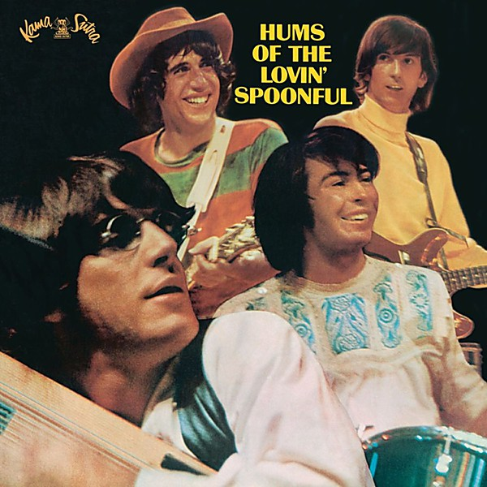

# Hums of the Lovin’ Spoonful

By **The Lovin’ Spoonful**

## Album Data

- **Catalog:** Beets
- **Format:** Digital, Album
- **Album:** Hums of the Lovin’ Spoonful
- **Artist:** The Lovin’ Spoonful
- **Albumartist:** The Lovin’ Spoonful
- **Genre:** Folk Rock
- **MusicBrainz Album Artist ID:** [abc08d4f-4e3c-4b5a-b1e8-d324cd6a2f92](https://musicbrainz.org/artist/abc08d4f-4e3c-4b5a-b1e8-d324cd6a2f92)
- **MusicBrainz Album ID:** [38358670-ffb0-4e5d-8c69-2c9fe5653d92](https://musicbrainz.org/release/38358670-ffb0-4e5d-8c69-2c9fe5653d92)
- **MusicBrainz Release Group ID:** [318d54e2-9c63-3033-a24e-f3b19d316bbd](https://musicbrainz.org/release-group/318d54e2-9c63-3033-a24e-f3b19d316bbd)
- **Year:** 2003
- **Catalog #:** 
- **Label:** Legacy
- **Total Tracks:** 14

## Album Tracks

### Track 01 - Do You Believe in Magic

- **Artist:** The Lovin’ Spoonful
- **Format:** MP3
- **Genre:** Folk Rock
- **Length:** 2:04
- **MusicBrainz Track ID:** [524efecc-dbf4-41bd-b935-85b6f30abf8e](https://musicbrainz.org/recording/524efecc-dbf4-41bd-b935-85b6f30abf8e)
- **Title:** Do You Believe in Magic
- **Track:** 01
- **Year:** 2008

### Track 02 - Did You Ever Have to Make Up Your Mind

- **Artist:** The Lovin’ Spoonful
- **Format:** MP3
- **Genre:** Folk Rock
- **Length:** 1:59
- **MusicBrainz Track ID:** [90035d75-9dbe-4210-8447-1b175ec78010](https://musicbrainz.org/recording/90035d75-9dbe-4210-8447-1b175ec78010)
- **Title:** Did You Ever Have to Make Up Your Mind
- **Track:** 02
- **Year:** 2008

### Track 03 - Blues in the Bottle

- **Artist:** The Lovin’ Spoonful
- **Format:** MP3
- **Genre:** Folk Rock
- **Length:** 2:10
- **MusicBrainz Track ID:** [6a6e50ef-ddbf-4718-974f-ce9d15ad94a2](https://musicbrainz.org/recording/6a6e50ef-ddbf-4718-974f-ce9d15ad94a2)
- **Title:** Blues in the Bottle
- **Track:** 03
- **Year:** 2008

### Track 04 - Daydream

- **Artist:** The Lovin’ Spoonful
- **Format:** MP3
- **Genre:** Folk Rock
- **Length:** 2:19
- **MusicBrainz Track ID:** [81dc35cc-a628-4f35-bcb7-0a2b5dba607b](https://musicbrainz.org/recording/81dc35cc-a628-4f35-bcb7-0a2b5dba607b)
- **Title:** Daydream
- **Track:** 04
- **Year:** 2008

### Track 05 - Warm Baby

- **Artist:** The Lovin’ Spoonful
- **Format:** MP3
- **Genre:** Folk Rock
- **Length:** 2:00
- **MusicBrainz Track ID:** [ce9f4381-4665-4907-8950-9318077dea79](https://musicbrainz.org/recording/ce9f4381-4665-4907-8950-9318077dea79)
- **Title:** Warm Baby
- **Track:** 05
- **Year:** 2008

### Track 06 - You Didn't Have to Be So Nice

- **Artist:** The Lovin’ Spoonful
- **Format:** MP3
- **Genre:** Folk Rock
- **Length:** 2:27
- **MusicBrainz Track ID:** [2fb98c32-8692-460b-a50c-184d23fe8bd7](https://musicbrainz.org/recording/2fb98c32-8692-460b-a50c-184d23fe8bd7)
- **Title:** You Didn't Have to Be So Nice
- **Track:** 06
- **Year:** 2008

### Track 07 - Let the Boy Rock and Roll

- **Artist:** The Lovin’ Spoonful
- **Format:** MP3
- **Genre:** Folk Rock
- **Length:** 2:31
- **MusicBrainz Track ID:** [4e94c19a-304b-48a4-bcab-d47da6243da0](https://musicbrainz.org/recording/4e94c19a-304b-48a4-bcab-d47da6243da0)
- **Title:** Let the Boy Rock and Roll
- **Track:** 07
- **Year:** 2008

### Track 08 - Summer in the City

- **Artist:** The Lovin’ Spoonful
- **Format:** MP3
- **Genre:** Folk Rock
- **Length:** 2:40
- **MusicBrainz Track ID:** [c48f37c0-70ee-43d7-a1ec-229f8aa18d78](https://musicbrainz.org/recording/c48f37c0-70ee-43d7-a1ec-229f8aa18d78)
- **Title:** Summer in the City
- **Track:** 08
- **Year:** 2008

### Track 09 - Rain on the Roof

- **Artist:** The Lovin’ Spoonful
- **Format:** MP3
- **Genre:** Folk Rock
- **Length:** 2:11
- **MusicBrainz Track ID:** [a2fe27df-b9e8-4512-8efb-449360f209ed](https://musicbrainz.org/recording/a2fe27df-b9e8-4512-8efb-449360f209ed)
- **Title:** Rain on the Roof
- **Track:** 09
- **Year:** 2008

### Track 10 - Coconut Grove

- **Artist:** The Lovin’ Spoonful
- **Format:** MP3
- **Genre:** Folk Rock
- **Length:** 2:41
- **MusicBrainz Track ID:** [f5d31a51-ca20-42bd-b59e-bbf4fdd4bef1](https://musicbrainz.org/recording/f5d31a51-ca20-42bd-b59e-bbf4fdd4bef1)
- **Title:** Coconut Grove
- **Track:** 10
- **Year:** 2008

### Track 11 - Nashville Cats

- **Artist:** The Lovin’ Spoonful
- **Format:** MP3
- **Genre:** Folk Rock
- **Length:** 2:34
- **MusicBrainz Track ID:** [a5078565-0442-408d-9de1-48ef42765184](https://musicbrainz.org/recording/a5078565-0442-408d-9de1-48ef42765184)
- **Title:** Nashville Cats
- **Track:** 11
- **Year:** 2008

### Track 12 - Darling Be Home Soon

- **Artist:** The Lovin’ Spoonful
- **Format:** MP3
- **Genre:** Folk Rock
- **Length:** 3:33
- **MusicBrainz Track ID:** [892b9858-fde8-4cd6-b367-8e1ea9613736](https://musicbrainz.org/recording/892b9858-fde8-4cd6-b367-8e1ea9613736)
- **Title:** Darling Be Home Soon
- **Track:** 12
- **Year:** 2008

### Track 13 - Six O'Clock

- **Artist:** The Lovin’ Spoonful
- **Format:** MP3
- **Genre:** Folk Rock
- **Length:** 2:41
- **MusicBrainz Track ID:** [fc7d0268-f57a-4431-ada7-85bd387e4bfb](https://musicbrainz.org/recording/fc7d0268-f57a-4431-ada7-85bd387e4bfb)
- **Title:** Six O'Clock
- **Track:** 13
- **Year:** 2008

### Track 14 - She Is Still a Mystery

- **Artist:** The Lovin’ Spoonful
- **Format:** MP3
- **Genre:** Folk Rock
- **Length:** 2:58
- **MusicBrainz Track ID:** [031698a7-8946-47e8-abf2-c18ec2b26b78](https://musicbrainz.org/recording/031698a7-8946-47e8-abf2-c18ec2b26b78)
- **Title:** She Is Still a Mystery
- **Track:** 14
- **Year:** 2008

## See also

- [Do you Believe In Magic](Do_you_Believe_In_Magic.md)
- [Everything Playing](Everything_Playing.md)
- [Greatest Hits](Greatest_Hits.md)
- [Playlist](Playlist.md)
- [Revelation](Revelation.md)
- [Roon: Daydream](../../Roon/The_Lovin’_Spoonful/Daydream.md)
- [Roon: Do you Believe In Magic](../../Roon/The_Lovin’_Spoonful/Do_you_Believe_In_Magic.md)
- [Roon: Everything Playing](../../Roon/The_Lovin’_Spoonful/Everything_Playing.md)
- [Roon: Hums Of The Lovin' Spoonful](../../Roon/The_Lovin’_Spoonful/Hums_Of_The_Lovin_Spoonful.md)
- [Roon: Platinum & Gold Collection](../../Roon/The_Lovin’_Spoonful/Platinum_and_Gold_Collection.md)
- [Roon: You're A Big Boy Now](../../Roon/The_Lovin’_Spoonful/Youre_A_Big_Boy_Now.md)
