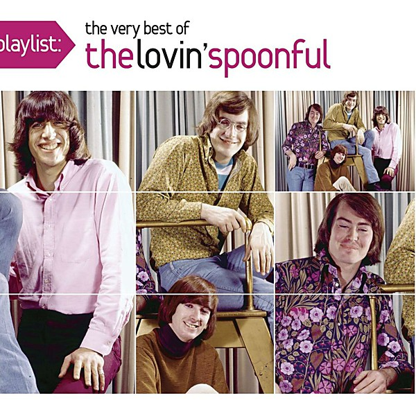

# Playlist

By **The Lovin’ Spoonful**

## Album Data

- **Catalog:** Beets
- **Format:** Digital, Album
- **Album:** Playlist
- **Artist:** The Lovin’ Spoonful
- **Albumartist:** The Lovin’ Spoonful
- **Genre:** Folk Rock
- **MusicBrainz Album Artist ID:** [abc08d4f-4e3c-4b5a-b1e8-d324cd6a2f92](https://musicbrainz.org/artist/abc08d4f-4e3c-4b5a-b1e8-d324cd6a2f92)
- **MusicBrainz Album ID:** [fee14bab-27fb-4d18-a979-8a47241b69ab](https://musicbrainz.org/release/fee14bab-27fb-4d18-a979-8a47241b69ab)
- **MusicBrainz Release Group ID:** [98f07999-4d2e-4a69-a9a6-85aff12499db](https://musicbrainz.org/release-group/98f07999-4d2e-4a69-a9a6-85aff12499db)
- **Year:** 2008
- **Catalog #:** BVCM-35456
- **Label:** 
- **Total Tracks:** 13

## Album Tracks

### Track 01 - Amazing Air

- **Artist:** The Lovin’ Spoonful
- **Format:** ALAC
- **Genre:** Folk Rock
- **Length:** 2:56
- **MusicBrainz Track ID:** [b5f3eda3-f13e-4923-a076-0db8b931c32b](https://musicbrainz.org/recording/b5f3eda3-f13e-4923-a076-0db8b931c32b)
- **Title:** Amazing Air
- **Track:** 01
- **Year:** 2008

### Track 02 - Never Going Back

- **Artist:** The Lovin’ Spoonful
- **Format:** ALAC
- **Genre:** Folk Rock
- **Length:** 2:55
- **MusicBrainz Track ID:** [53d13533-784d-4c32-afd0-8811759fd7a4](https://musicbrainz.org/recording/53d13533-784d-4c32-afd0-8811759fd7a4)
- **Title:** Never Going Back
- **Track:** 02
- **Year:** 2008

### Track 03 - The Prophet

- **Artist:** The Lovin’ Spoonful
- **Format:** ALAC
- **Genre:** Folk Rock
- **Length:** 2:51
- **MusicBrainz Track ID:** [78716e6f-0ebf-4ff6-8a46-a491f38132dd](https://musicbrainz.org/recording/78716e6f-0ebf-4ff6-8a46-a491f38132dd)
- **Title:** The Prophet
- **Track:** 03
- **Year:** 2008

### Track 04 - Only Yesterday

- **Artist:** The Lovin’ Spoonful
- **Format:** ALAC
- **Genre:** Folk Rock
- **Length:** 2:48
- **MusicBrainz Track ID:** [586b0026-1a88-4ef2-995e-f3c3a83ce898](https://musicbrainz.org/recording/586b0026-1a88-4ef2-995e-f3c3a83ce898)
- **Title:** Only Yesterday
- **Track:** 04
- **Year:** 2008

### Track 05 - War Games

- **Artist:** The Lovin’ Spoonful
- **Format:** ALAC
- **Genre:** Folk Rock
- **Length:** 7:02
- **MusicBrainz Track ID:** [d4a8f5d0-5693-48a5-a821-1b117cde8945](https://musicbrainz.org/recording/d4a8f5d0-5693-48a5-a821-1b117cde8945)
- **Title:** War Games
- **Track:** 05
- **Year:** 2008

### Track 06 - Run With You

- **Artist:** The Lovin’ Spoonful
- **Format:** ALAC
- **Genre:** Folk Rock
- **Length:** 1:58
- **MusicBrainz Track ID:** [5f4a2821-f9e3-4511-93b3-3c3aafde1091](https://musicbrainz.org/recording/5f4a2821-f9e3-4511-93b3-3c3aafde1091)
- **Title:** Run With You
- **Track:** 06
- **Year:** 2008

### Track 07 - Jug of Wine

- **Artist:** The Lovin’ Spoonful
- **Format:** ALAC
- **Genre:** Folk Rock
- **Length:** 2:49
- **MusicBrainz Track ID:** [32ea8b84-9d91-4088-a183-61d0b4f3be05](https://musicbrainz.org/recording/32ea8b84-9d91-4088-a183-61d0b4f3be05)
- **Title:** Jug of Wine
- **Track:** 07
- **Year:** 2008

### Track 08 - Revelation

- **Artist:** The Lovin’ Spoonful
- **Format:** ALAC
- **Genre:** Folk Rock
- **Length:** 2:26
- **MusicBrainz Track ID:** [236b8af3-4699-4918-866b-933678247f7b](https://musicbrainz.org/recording/236b8af3-4699-4918-866b-933678247f7b)
- **Title:** Revelation
- **Track:** 08
- **Year:** 2008

### Track 09 - Me About You

- **Artist:** The Lovin’ Spoonful
- **Format:** ALAC
- **Genre:** Folk Rock
- **Length:** 3:52
- **MusicBrainz Track ID:** [b948b4f4-f009-4343-b48b-230494dd7385](https://musicbrainz.org/recording/b948b4f4-f009-4343-b48b-230494dd7385)
- **Title:** Me About You
- **Track:** 09
- **Year:** 2008

### Track 10 - Words

- **Artist:** The Lovin’ Spoonful
- **Format:** ALAC
- **Genre:** Folk Rock
- **Length:** 2:24
- **MusicBrainz Track ID:** [d503c93e-f7ad-4317-838e-3dcc8eccfa3d](https://musicbrainz.org/recording/d503c93e-f7ad-4317-838e-3dcc8eccfa3d)
- **Title:** Words
- **Track:** 10
- **Year:** 2008

### Track 11 - Revelation

- **Artist:** The Lovin’ Spoonful
- **Format:** ALAC
- **Genre:** Folk Rock
- **Length:** 2:31
- **MusicBrainz Track ID:** [79307f9c-ba26-454d-888a-35937c912df2](https://musicbrainz.org/recording/79307f9c-ba26-454d-888a-35937c912df2)
- **Title:** Revelation
- **Track:** 11
- **Year:** 2008

### Track 12 - Revelation

- **Artist:** The Lovin’ Spoonful
- **Format:** ALAC
- **Genre:** Folk Rock
- **Length:** 2:20
- **MusicBrainz Track ID:** [95f3a67d-a0bb-4407-af4b-109a7eb12205](https://musicbrainz.org/recording/95f3a67d-a0bb-4407-af4b-109a7eb12205)
- **Title:** Revelation
- **Track:** 12
- **Year:** 2008

### Track 13 - Me About You (single version)

- **Artist:** The Lovin’ Spoonful
- **Format:** ALAC
- **Genre:** Folk Rock
- **Length:** 2:48
- **MusicBrainz Track ID:** [8781f55c-0755-4551-97eb-ba09fcd2ae76](https://musicbrainz.org/recording/8781f55c-0755-4551-97eb-ba09fcd2ae76)
- **Title:** Me About You (single version)
- **Track:** 13
- **Year:** 2008

## See also

- [Do you Believe In Magic](Do_you_Believe_In_Magic.md)
- [Everything Playing](Everything_Playing.md)
- [Greatest Hits](Greatest_Hits.md)
- [Hums of the Lovin’ Spoonful](Hums_of_the_Lovin’_Spoonful.md)
- [Revelation](Revelation.md)
- [Roon: Daydream](../../Roon/The_Lovin’_Spoonful/Daydream.md)
- [Roon: Do you Believe In Magic](../../Roon/The_Lovin’_Spoonful/Do_you_Believe_In_Magic.md)
- [Roon: Everything Playing](../../Roon/The_Lovin’_Spoonful/Everything_Playing.md)
- [Roon: Hums Of The Lovin' Spoonful](../../Roon/The_Lovin’_Spoonful/Hums_Of_The_Lovin_Spoonful.md)
- [Roon: Platinum & Gold Collection](../../Roon/The_Lovin’_Spoonful/Platinum_and_Gold_Collection.md)
- [Roon: You're A Big Boy Now](../../Roon/The_Lovin’_Spoonful/Youre_A_Big_Boy_Now.md)
