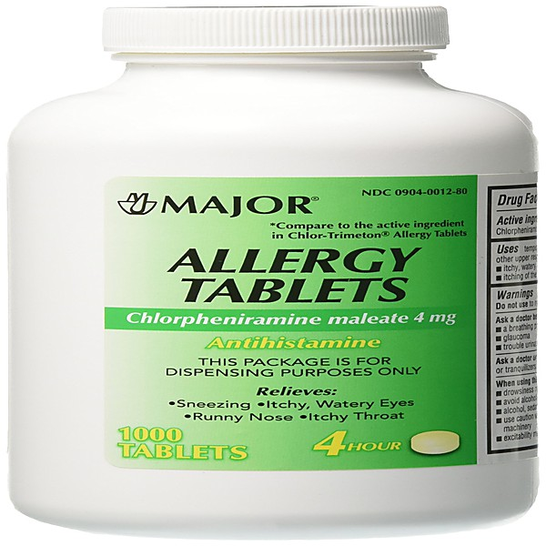

# AQUAVIA

By **The Major Labels**

## Album Data

- **Catalog:** Beets
- **Format:** Digital, Album
- **Album:** AQUAVIA
- **Artist:** The Major Labels
- **Albumartist:** The Major Labels
- **Genre:** Indie Rock
- **MusicBrainz Album Artist ID:** [https](https://musicbrainz.org/artist/https)
- **MusicBrainz Album ID:** [https](https://musicbrainz.org/release/https)
- **MusicBrainz Release Group ID:** 
- **Year:** 2008
- **Catalog #:** 
- **Label:** Bleu
- **Total Tracks:** 12

## Album Tracks

### Track 01 - The Major Labels (Got It Made)

- **Artist:** The Major Labels
- **Format:** ALAC
- **Genre:** Power Pop
- **Length:** 0:57
- **MusicBrainz Track ID:** [https](https://musicbrainz.org/recording/https)
- **Title:** The Major Labels (Got It Made)
- **Track:** 01
- **Year:** 2008

### Track 02 - Don't Hear A Single

- **Artist:** The Major Labels
- **Format:** ALAC
- **Genre:** Power Pop
- **Length:** 3:07
- **MusicBrainz Track ID:** [https](https://musicbrainz.org/recording/https)
- **Title:** Don't Hear A Single
- **Track:** 02
- **Year:** 2008

### Track 03 - Velveteen Queen

- **Artist:** The Major Labels
- **Format:** ALAC
- **Genre:** Power Pop
- **Length:** 3:30
- **MusicBrainz Track ID:** [https](https://musicbrainz.org/recording/https)
- **Title:** Velveteen Queen
- **Track:** 03
- **Year:** 2008

### Track 04 - The Bitter Pill

- **Artist:** The Major Labels
- **Format:** ALAC
- **Genre:** Indie Rock
- **Length:** 2:28
- **MusicBrainz Track ID:** [https](https://musicbrainz.org/recording/https)
- **Title:** The Bitter Pill
- **Track:** 04
- **Year:** 2008

### Track 05 - Richard Randolph

- **Artist:** The Major Labels
- **Format:** ALAC
- **Genre:** Indie Rock
- **Length:** 3:30
- **MusicBrainz Track ID:** [https](https://musicbrainz.org/recording/https)
- **Title:** Richard Randolph
- **Track:** 05
- **Year:** 2008

### Track 06 - Hummingbird

- **Artist:** The Major Labels
- **Format:** ALAC
- **Genre:** Indie Rock
- **Length:** 2:08
- **MusicBrainz Track ID:** [https](https://musicbrainz.org/recording/https)
- **Title:** Hummingbird
- **Track:** 06
- **Year:** 2008

### Track 07 - Jimmy Kenney

- **Artist:** The Major Labels
- **Format:** ALAC
- **Genre:** Indie Rock
- **Length:** 1:29
- **MusicBrainz Track ID:** [https](https://musicbrainz.org/recording/https)
- **Title:** Jimmy Kenney
- **Track:** 07
- **Year:** 2008

### Track 08 - The Sweet

- **Artist:** The Major Labels
- **Format:** ALAC
- **Genre:** Indie Rock
- **Length:** 5:53
- **MusicBrainz Track ID:** [https](https://musicbrainz.org/recording/https)
- **Title:** The Sweet
- **Track:** 08
- **Year:** 2008

### Track 09 - Ode To Somethin' To Cry About

- **Artist:** The Major Labels
- **Format:** ALAC
- **Genre:** Indie Rock
- **Length:** 1:49
- **MusicBrainz Track ID:** [https](https://musicbrainz.org/recording/https)
- **Title:** Ode To Somethin' To Cry About
- **Track:** 09
- **Year:** 2008

### Track 10 - Deja Vu (All Over Again)

- **Artist:** The Major Labels
- **Format:** ALAC
- **Genre:** Indie Rock
- **Length:** 1:42
- **MusicBrainz Track ID:** [https](https://musicbrainz.org/recording/https)
- **Title:** Deja Vu (All Over Again)
- **Track:** 10
- **Year:** 2008

### Track 11 - Aquavia

- **Artist:** The Major Labels
- **Format:** ALAC
- **Genre:** Indie Rock
- **Length:** 3:14
- **MusicBrainz Track ID:** [https](https://musicbrainz.org/recording/https)
- **Title:** Aquavia
- **Track:** 11
- **Year:** 2008

### Track 12 - TML 4EVA

- **Artist:** The Major Labels
- **Format:** ALAC
- **Genre:** Indie Rock
- **Length:** 7:13
- **MusicBrainz Track ID:** [https](https://musicbrainz.org/recording/https)
- **Title:** TML 4EVA
- **Track:** 12
- **Year:** 2008

