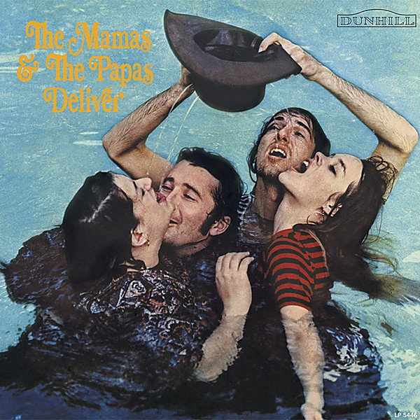

# Deliver

By **The Mamas & The Papas**

## Album Data

- **Catalog:** Beets
- **Format:** Digital, Album
- **Album:** Deliver
- **Artist:** The Mamas & The Papas
- **Albumartist:** The Mamas & The Papas
- **Genre:** Folk Rock
- **MusicBrainz Album Artist ID:** 
- **MusicBrainz Album ID:** 
- **MusicBrainz Release Group ID:** 
- **Year:** 2016
- **Catalog #:** 
- **Label:** 
- **Total Tracks:** 12

## Album Tracks

### Track 01 - Dedicated To The One I Love

- **Artist:** The Mamas & The Papas
- **Format:** MP3
- **Genre:** Rock
- **Length:** 2:58
- **MusicBrainz Track ID:** 
- **Title:** Dedicated To The One I Love
- **Track:** 01
- **Year:** 2016

### Track 02 - My Girl

- **Artist:** The Mamas & The Papas
- **Format:** MP3
- **Genre:** Rock
- **Length:** 3:33
- **MusicBrainz Track ID:** 
- **Title:** My Girl
- **Track:** 02
- **Year:** 2016

### Track 03 - Creeque Alley

- **Artist:** The Mamas & The Papas
- **Format:** MP3
- **Genre:** Folk Rock
- **Length:** 3:48
- **MusicBrainz Track ID:** 
- **Title:** Creeque Alley
- **Track:** 03
- **Year:** 2016

### Track 04 - Sing For Your Supper

- **Artist:** The Mamas & The Papas
- **Format:** MP3
- **Genre:** Rock
- **Length:** 2:48
- **MusicBrainz Track ID:** 
- **Title:** Sing For Your Supper
- **Track:** 04
- **Year:** 2016

### Track 05 - Twist And Shout

- **Artist:** The Mamas & The Papas
- **Format:** MP3
- **Genre:** Folk Rock
- **Length:** 2:53
- **MusicBrainz Track ID:** 
- **Title:** Twist And Shout
- **Track:** 05
- **Year:** 2016

### Track 06 - Free Advice

- **Artist:** The Mamas & The Papas
- **Format:** MP3
- **Genre:** Uk Garage
- **Length:** 3:20
- **MusicBrainz Track ID:** 
- **Title:** Free Advice
- **Track:** 06
- **Year:** 2016

### Track 07 - Look Through My Window

- **Artist:** The Mamas & The Papas
- **Format:** MP3
- **Genre:** Rock
- **Length:** 3:07
- **MusicBrainz Track ID:** 
- **Title:** Look Through My Window
- **Track:** 07
- **Year:** 2016

### Track 08 - Boys And Girls Together

- **Artist:** The Mamas & The Papas
- **Format:** MP3
- **Genre:** Folk Rock
- **Length:** 3:15
- **MusicBrainz Track ID:** 
- **Title:** Boys And Girls Together
- **Track:** 08
- **Year:** 2016

### Track 09 - String Man

- **Artist:** The Mamas & The Papas
- **Format:** MP3
- **Genre:** Folk Rock
- **Length:** 3:01
- **MusicBrainz Track ID:** 
- **Title:** String Man
- **Track:** 09
- **Year:** 2016

### Track 10 - Frustration

- **Artist:** The Mamas & The Papas
- **Format:** MP3
- **Genre:** Rock
- **Length:** 2:57
- **MusicBrainz Track ID:** 
- **Title:** Frustration
- **Track:** 10
- **Year:** 2016

### Track 11 - Did You Ever Want To Cry

- **Artist:** The Mamas & The Papas
- **Format:** MP3
- **Genre:** Close Harmony
- **Length:** 2:54
- **MusicBrainz Track ID:** 
- **Title:** Did You Ever Want To Cry
- **Track:** 11
- **Year:** 2016

### Track 12 - John's Music Box

- **Artist:** The Mamas & The Papas
- **Format:** MP3
- **Genre:** Folk Rock
- **Length:** 1:06
- **MusicBrainz Track ID:** 
- **Title:** John's Music Box
- **Track:** 12
- **Year:** 2016

## See also

- [Creeque Alley Disc 1](Creeque_Alley_Disc_1.md)
- [Vinyl: Deliver](../../Vinyl/The_Mamas_and_The_Papas/Deliver.md)
- [Vinyl: ](../../Vinyl/The_Mamas_and_The_Papas/The_Mamas_and_The_Papas.md)
