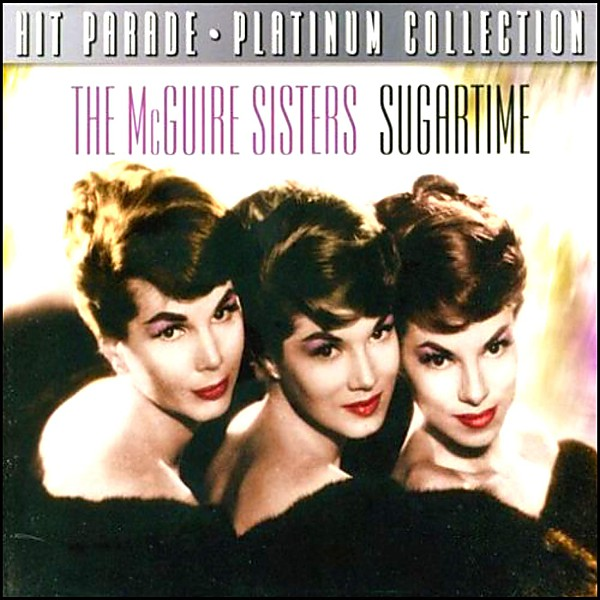

# Greatest Hits

By **The McGuire Sisters**

## Album Data

- **Catalog:** Beets
- **Format:** Digital, Album
- **Album:** Greatest Hits
- **Artist:** The Mcguire Sisters
- **Albumartist:** The McGuire Sisters
- **Genre:** Close Harmony
- **MusicBrainz Album Artist ID:** 
- **MusicBrainz Album ID:** 
- **MusicBrainz Release Group ID:** 
- **Year:** 1989
- **Catalog #:** 
- **Label:** 
- **Total Tracks:** 00

## Album Tracks

### Track 03 - Something's Gotta Give

- **Artist:** The McGuire Sisters
- **Format:** ALAC
- **Genre:** Close Harmony
- **Length:** 2:52
- **MusicBrainz Track ID:** 
- **Title:** Something's Gotta Give
- **Track:** 03
- **Year:** 1966

## See also

- [The Best of the McGuire Sisters [Coral]](The_Best_of_the_McGuire_Sisters_[Coral].md)
- [Unforgettable Fifties Disk 3](Unforgettable_Fifties_Disk_3.md)
- [Unknown Album](Unknown_Album.md)
