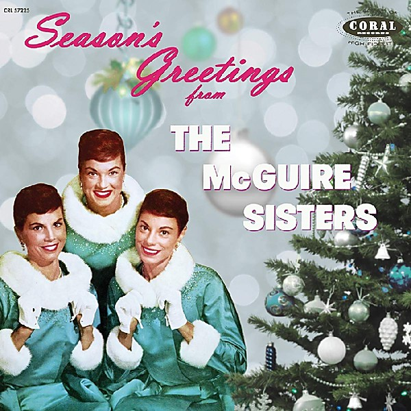

# The Best of the McGuire Sisters [Coral]

By **The McGuire Sisters**

## Album Data

- **Catalog:** Beets
- **Format:** Digital, Album
- **Album:** The Best of the McGuire Sisters [Coral]
- **Artist:** The Mcguire Sisters
- **Albumartist:** The McGuire Sisters
- **Genre:** Close Harmony
- **MusicBrainz Album Artist ID:** 
- **MusicBrainz Album ID:** 
- **MusicBrainz Release Group ID:** 
- **Year:** 1966
- **Catalog #:** 
- **Label:** 
- **Total Tracks:** 00

## Album Tracks

### Track 08 - Sincerely

- **Artist:** The McGuire Sisters
- **Format:** AAC
- **Genre:** Close Harmony
- **Length:** 2:59
- **MusicBrainz Track ID:** 
- **Title:** Sincerely
- **Track:** 08
- **Year:** 0000

## See also

- [Greatest Hits](Greatest_Hits.md)
- [Unforgettable Fifties Disk 3](Unforgettable_Fifties_Disk_3.md)
- [Unknown Album](Unknown_Album.md)
